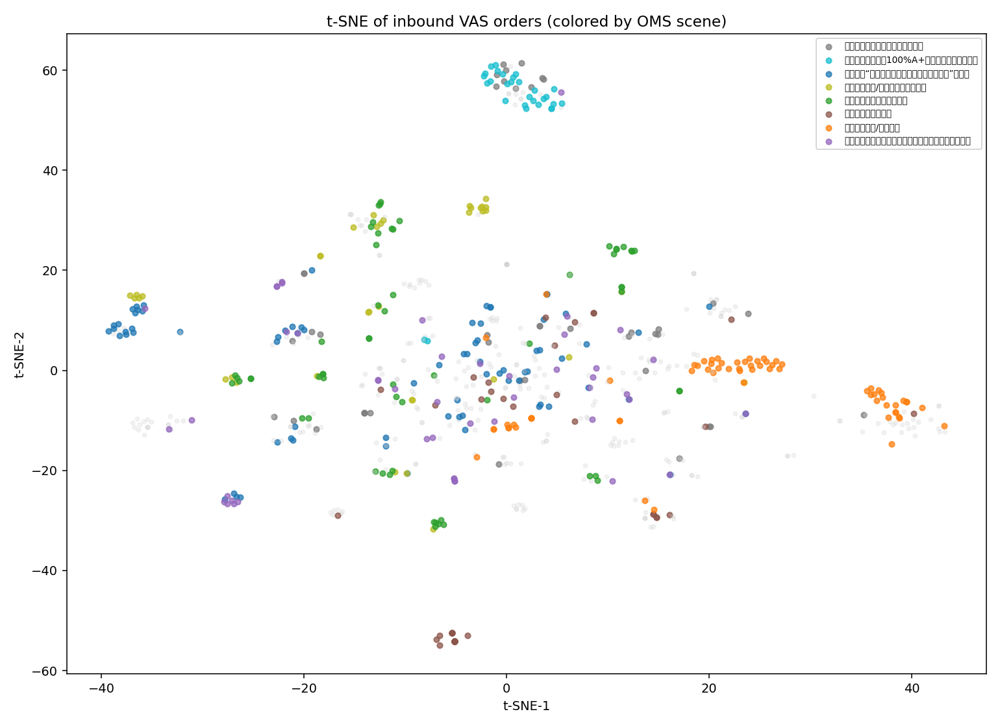

# 入库增值单无监督聚类分析

## 数据概况

- 总样本数：**722**（`_oms_cache` 中场景名含「入库」的增值单）
- 特征数：**227**
- 场景数：**43**（随机森林训练仅用样本≥3 的 37 个场景）
- 特征来源：orders/atoms 字段、attrs 是否非空、AON/AOOI 计数、eventName/eventObj（有 details 时）、需求描述 TF-IDF、仓库/客户/服务码 one-hot 等。
- 未安装 `umap-learn` / `xgboost`；降维用 **t-SNE**，重要性用 **RandomForest**。

### 使用的特征名（完整列表见 clustering-features.json）

| 特征族 | 数量 |
|--------|-----:|
| `tfidf::*` | 80 |
| `customer_*` | 56 |
| `scalar/other` | 16 |
| `warehouse_*` | 16 |
| `attr_present::*` | 13 |
| `eventName_*` | 9 |
| `eventName::*` | 8 |
| `order_*` | 7 |
| `status_*` | 6 |
| `service_*` | 4 |
| `va_*` | 4 |
| `product_*` | 3 |
| `eventObj_*` | 3 |
| `eventObj::*` | 2 |

## 特征重要性 Top 20

| 排名 | 特征名 | 重要性分数 | 含义 |
|------|--------|----------:|------|
| 1 | `order_doy` | 0.0441 | 一年中的第几天 |
| 2 | `req_len` | 0.0332 | 需求描述文本长度 |
| 3 | `tfidf::1` | 0.0307 | 需求描述 TF-IDF 词项「1」 |
| 4 | `attr_present::VAS_ATTR_REL_NWEON` | 0.0258 | 提交属性 VAS_ATTR_REL_NWEON 是否非空 |
| 5 | `tfidf::背景` | 0.0242 | 需求描述 TF-IDF 词项「背景」 |
| 6 | `tfidf::a` | 0.0229 | 需求描述 TF-IDF 词项「a」 |
| 7 | `customer_code_19606505` | 0.0212 | 客户=19606505 |
| 8 | `tfidf::需客户处理` | 0.0194 | 需求描述 TF-IDF 词项「需客户处理」 |
| 9 | `tfidf::包裹` | 0.0168 | 需求描述 TF-IDF 词项「包裹」 |
| 10 | `customer_code_16758605` | 0.0152 | 客户=16758605 |
| 11 | `tfidf::谢谢` | 0.0151 | 需求描述 TF-IDF 词项「谢谢」 |
| 12 | `va_source_INBOUND` | 0.0148 | va_source_INBOUND |
| 13 | `customer_code_19673358` | 0.0145 | 客户=19673358 |
| 14 | `va_source_UNUSUAL` | 0.0132 | va_source_UNUSUAL |
| 15 | `n_events` | 0.0125 | 关联异常事件条数 |
| 16 | `tfidf::暂无标准增值` | 0.0125 | 需求描述 TF-IDF 词项「暂无标准增值」 |
| 17 | `customer_code_17806402` | 0.0122 | 客户=17806402 |
| 18 | `tfidf::仓库操作步骤` | 0.0113 | 需求描述 TF-IDF 词项「仓库操作步骤」 |
| 19 | `warehouse_code_USWC5` | 0.0112 | 仓库=USWC5 |
| 20 | `warehouse_code_DE0001` | 0.0112 | 仓库=DE0001 |

随机森林训练集准确率（仅作拟合强度参考，非泛化）：**0.720**

## 聚类结果

### K-Means 轮廓系数

| k | silhouette |
|--:|----------:|
| 5 | 0.1006 |
| 8 | 0.1510 |
| 10 | 0.1511 ← best |
| 15 | 0.1027 |

DBSCAN：簇数=20，噪声点=385（高维稀疏下仅作对照）。

### 聚类明细（K=10，silhouette=0.1511）

| Cluster | 样本数 | 主要场景 | 纯度 | 关键区分特征 |
|---------|-------:|---------|------:|-----------|
| 0 | 26 | 【入库】指定商品拍照暂存 (38.5%) | 38.5% | req_len (Δ=-47.700); order_doy (Δ=+11.444); n_events (Δ=+2.476) |
| 1 | 49 | 【入库】覆盖/清除标签 (44.9%) | 44.9% | req_len (Δ=-53.488); order_doy (Δ=-27.935); service_code_OSF6V1603 (Δ=+1.000) |
| 2 | 7 | 【入库】上架前拆包装 (100.0%) | 100.0% | req_len (Δ=-119.115); order_doy (Δ=-57.309); customer_code_19164627 (Δ=+1.000) |
| 3 | 21 | 【入库】上架前拦截 (100.0%) | 100.0% | req_len (Δ=-78.971); order_doy (Δ=+65.435); n_traces (Δ=-1.578) |
| 4 | 49 | 【入库】海运整柜100%A+无包裹条码异常，新单无箱单或100%A+包直接上架 (53.1%) | 55.1% | req_len (Δ=+5.232); customer_code_19104098 (Δ=+0.982); n_traces (Δ=+0.480) |
| 5 | 7 | 【入库】补贴透明计划标签 (85.7%) | 85.7% | req_len (Δ=+102.750); order_doy (Δ=-3.502); customer_code_19220548 (Δ=+1.000) |
| 6 | 24 | 【入库】“包裹条码批量异常（需客户处理）”辨识后补贴包裹标签上架 (62.5%) | 62.5% | req_len (Δ=+278.801); order_doy (Δ=+31.151); customer_code_19937931 (Δ=+0.990) |
| 7 | 528 | 【入库】“包裹条码批量异常（需客户处理）”辨识后补贴包裹标签上架 (11.6%) | 11.6% | order_doy (Δ=-5.471); req_len (Δ=-3.095); tfidf::背景 (Δ=+0.290) |
| 8 | 1 | 【入库】100%A+/A包裹包裹条码批量异常（需客户处理） (100.0%) | 100.0% | req_len (Δ=-147.879); order_doy (Δ=-64.558); service_code___OTHER__ (Δ=+1.000) |
| 9 | 10 | 【入库】尺重/标签辨识后换标上架 (90.0%) | 90.0% | req_len (Δ=-76.940); order_doy (Δ=+20.415); eventName_primary_包裹条码批量异常（需客户处理） (Δ=+1.000) |

## 场景可分性（RF 训练召回，样本≥3）

| 场景码 | OMS 场景全名 | n | train_recall |
|--------|------------|--:|-------------:|
| 20250509 | 【入库】更换客制包材 | 4 | 1.00 |
| 20250530001 | 【入库】无主货找回暂存 | 9 | 1.00 |
| 202506120002 | 【入库】上架前盘点 | 4 | 1.00 |
| 202506170001 | 【入库】加固包装（含透明胶带封口、木箱加固等） | 10 | 1.00 |
| 20250619 | 【入库】	ABC类/子包裹内商品错装暂存（需客户处理），云仓不支持原单补贴包裹条码上架 | 6 | 1.00 |
| 20251103 | 【入库】补贴包裹标签上架到原入库单“已终止的”包裹中 | 7 | 1.00 |
| 20251208 | 【入库】包裹级异常更换包装 | 7 | 1.00 |
| 20260115 | 【入库】上架到不良品 | 4 | 1.00 |
| 20260128002 | 【入库】代采购包材补贴标签上架 | 3 | 1.00 |
| 2026041701 | 【入库】补贴透明计划标签 | 13 | 1.00 |
| 20260522 | 【入库】商品条码异常换包装+重新贴标后上架 | 4 | 1.00 |
| 20260622001 | 【入库】补贴包裹条码原单上架 | 4 | 1.00 |
| [Warehouse] Package-level abnormalities Unpack and take product photos | 【入库】包裹级异常开箱拍商品照片 | 3 | 1.00 |
| 20250929 | 【入库】海运整柜100%A+无包裹条码异常，新单无箱单或100%A+包直接上架 | 29 | 0.93 |
| 202507151726 | 【入库】入库少单品/少包裹视频调查 | 13 | 0.92 |
| [Warehouse]AbnormalTransferOfParcelsFromMultipleWarehouses | 【入库】包裹串仓异常调拨 | 9 | 0.89 |
| 20250407025 | 【入库】异常商品/包裹数量与实际不符，按照实际贴标上架 | 7 | 0.86 |
| 20260302 | 【入库】覆盖/清除标签 | 68 | 0.85 |
| 202507021814 | 【入库】上架前拦截 | 45 | 0.82 |
| 20250407020 | 【入库】组合后上架 | 26 | 0.81 |
| 2026042101 | 【入库】100%A+/A包裹包裹条码批量异常（需客户处理） | 25 | 0.80 |
| 20260320 | 【入库】	商品异常更换包裹标签商品标签新单上架 | 24 | 0.79 |
| 20250407008 | 【入库】包裹类异常换商品标签上架 | 15 | 0.73 |
| 20250407004 | 【入库】尺重/标签辨识后换标上架 | 37 | 0.73 |
| 20250407006 | 【入库】同异常多种处理方式（直接上架+换包装上架+换标上架+部分销毁） | 11 | 0.73 |
| 20250407003 | 【入库】上架前拆包装 | 18 | 0.72 |
| 20250529001 | 【入库】上架前采集条码（含SN码、A+包第三方包裹码等） | 7 | 0.71 |
| INBOUND_PICKUP_BF_SHELVE | 【入库】上架前自提 | 7 | 0.71 |
| 20250407075 | 【入库】指定包裹拍照 | 17 | 0.71 |
| 20250522001 | 【入库】指定商品拍照暂存 | 61 | 0.70 |
| 20251205 | 【入库】新单上架到预报单，无需更换包裹条码 | 9 | 0.67 |
| 2026051101 | 【入库】包裹/商品条码异常重新扫描包裹/商品条码上架 | 9 | 0.67 |
| 20251027 | 【入库】包裹类异常关联第三方包裹条码直接上架 | 28 | 0.61 |
| 202506120003 | 【入库】批量辨识商品后补贴商品条码及包裹条码上架 | 47 | 0.57 |
| INBOUND_DESTORY_BF_SHELVE | 【入库】上架前销毁 | 7 | 0.57 |
| 20250430 | 【入库】“包裹条码批量异常（需客户处理）”辨识后补贴包裹标签上架 | 76 | 0.38 |
| 202506120001 | 【入库】关联第三方商品条码上架 | 42 | 0.38 |

## 发现

1. **重要性第 1 名是 `order_doy`（一年中的第几天）**——这更像「场景码分批上线」的时间泄漏，**不宜**直接做成业务规则；它印证任务 1：时间窗口会干扰场景归属统计。
2. 去掉时间泄漏后，较稳的区分信号是：`req_len`、需求描述词项（如「需客户处理」「包裹」「暂无标准增值」「仓库操作步骤」）、属性 `VAS_ATTR_REL_NWEON` 是否非空、`va_source`（INBOUND/UNUSUAL）、部分客户码/仓库码、`n_events`。异常名称 one-hot 未进 Top20，主因是 **722 单里仅约 1/3 有完整 events**。
3. 高纯度簇（≥80%）**5/10**：上架前拆包装、上架前拦截、补贴透明计划标签、尺重换标小簇等能分开；**难分**：§2.33（train_recall=0.38）、关联第三方商品条码（0.38）、批量辨识补贴双码（0.57）——与「同异常多名场景」现象一致。
4. 建议纳入 pipeline 的新特征候选（排除纯时间）：需求描述长度与关键词、属性非空模式（NWEON/LF/条码）、`va_source`、仓/客弱先验；事件字段需先补齐覆盖率再加权。

## 降维可视化

若图中同色点成团、异色分离，说明现有特征有可分结构；若大量混叠，则仅靠当前结构化字段不足以稳定分场景。

