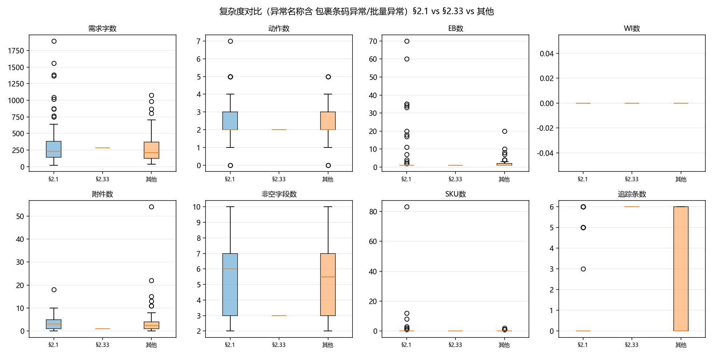
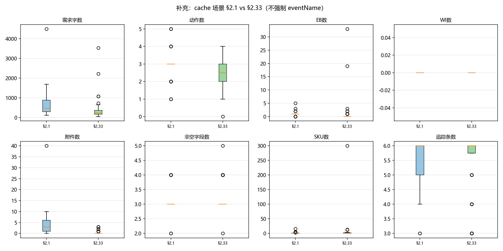

# 需求复杂度 vs 场景选择（§2.1 / §2.33 / 其他）

## 样本口径

- **主样本**：既有 `details.json` 中 `eventName` 含「包裹条码异常」或「批量异常」的入库增值单；场景优先 `_oms_cache` atoms，否则 details。
- 主样本规模：共 **120** 单 → §2.1=65，§2.33=1，其他=54。
- **严重限制**：带 eventName 的 §2.33 几乎为空（与上轮覆盖偏差一致）。因此另附 **cache 场景对照**：窗口内所有 `20250407004` vs `20250430` 单，用 attrs/details 算同一套复杂度（不要求 eventName）。
- 场景对照规模：§2.1=37，§2.33=76（其中带匹配 eventName 的 §2.33 仅 1）。
- 未改 pipeline、未新查 OMS。

### 主样本异常名称分布

| 异常名称 | 单量 |
|---------|-----:|
| 包裹条码异常(需客户处理) | 95 |
| 包裹条码批量异常（需客户处理） | 29 |

### 主样本「其他」场景分布

| 场景码 | OMS 全名 | n |
|--------|---------|--:|
| 20250407008 | 【入库】包裹类异常换商品标签上架 | 37 |
| 20250522001 | 【入库】指定商品拍照暂存 | 16 |
| 20251027 | 【入库】包裹类异常关联第三方包裹条码直接上架 | 1 |

## 主样本对比（eventName 过滤）

| 指标 | §2.1 | §2.33 | 其他 |
|------|------|------|------|
| 需求描述字数 (`req_len`) | n=65 mean=364.9 med=226.0 IQR=[139.0,382.0] range=[20,1894] | n=1 mean=283.0 med=283.0 IQR=[283.0,283.0] range=[283,283] | n=54 mean=291.1 med=214.5 IQR=[122.0,368.8] range=[36,1077] |
| 需求中动作种类数 (`n_actions`) | n=65 mean=2.7 med=2.0 IQR=[2.0,3.0] range=[0,7] | n=1 mean=2.0 med=2.0 IQR=[2.0,2.0] range=[2,2] | n=54 mean=2.5 med=2.0 IQR=[2.0,3.0] range=[0,5] |
| 关联异常单(EB)数 (`n_eb`) | n=65 mean=6.2 med=1.0 IQR=[1.0,1.0] range=[1,70] | n=1 mean=1.0 med=1.0 IQR=[1.0,1.0] range=[1,1] | n=54 mean=2.2 med=1.0 IQR=[1.0,2.0] range=[1,20] |
| 关联入库单(WI)数 (`n_wi`) | n=65 mean=0.0 med=0.0 IQR=[0.0,0.0] range=[0,0] | n=1 mean=0.0 med=0.0 IQR=[0.0,0.0] range=[0,0] | n=54 mean=0.0 med=0.0 IQR=[0.0,0.0] range=[0,0] |
| 附件数量 (`n_files`) | n=65 mean=3.5 med=3.0 IQR=[1.0,5.0] range=[0,18] | n=1 mean=1.0 med=1.0 IQR=[1.0,1.0] range=[1,1] | n=54 mean=4.6 med=2.5 IQR=[1.0,4.0] range=[0,54] |
| 附件种类数 (`n_file_types`) | n=65 mean=1.9 med=2.0 IQR=[1.0,3.0] range=[0,4] | n=1 mean=1.0 med=1.0 IQR=[1.0,1.0] range=[1,1] | n=54 mean=1.5 med=2.0 IQR=[1.0,2.0] range=[0,3] |
| 非空表单字段数 (`n_attrs`) | n=65 mean=5.6 med=6.0 IQR=[3.0,7.0] range=[2,10] | n=1 mean=3.0 med=3.0 IQR=[3.0,3.0] range=[3,3] | n=54 mean=5.1 med=5.5 IQR=[3.0,7.0] range=[2,10] |
| 描述中SKU/商品码数 (`n_sku`) | n=65 mean=1.7 med=0.0 IQR=[0.0,0.0] range=[0,83] | n=1 mean=0.0 med=0.0 IQR=[0.0,0.0] range=[0,0] | n=54 mean=0.2 med=0.0 IQR=[0.0,0.0] range=[0,2] |
| 状态追踪条数 (`n_traces`) | n=65 mean=1.3 med=0.0 IQR=[0.0,0.0] range=[0,6] | n=1 mean=6.0 med=6.0 IQR=[6.0,6.0] range=[6,6] | n=54 mean=2.3 med=0.0 IQR=[0.0,6.0] range=[0,6] |
| 需求描述行数 (`req_lines`) | n=65 mean=10.0 med=8.0 IQR=[4.0,10.0] range=[1,89] | n=1 mean=3.0 med=3.0 IQR=[3.0,3.0] range=[3,3] | n=54 mean=7.1 med=6.5 IQR=[4.0,10.0] range=[1,27] |
| 是否有LF附件字段 (`has_LF`) | n=65 mean=0.0 med=0.0 IQR=[0.0,0.0] range=[0,0] | n=1 mean=0.0 med=0.0 IQR=[0.0,0.0] range=[0,0] | n=54 mean=0.0 med=0.0 IQR=[0.0,0.0] range=[0,0] |
| EB关联多VASC (`has_resubmit_eb`) | n=65 mean=0.0 med=0.0 IQR=[0.0,0.0] range=[0,0] | n=1 mean=0.0 med=0.0 IQR=[0.0,0.0] range=[0,0] | n=54 mean=0.0 med=0.0 IQR=[0.0,0.0] range=[0,0] |
| 轨迹含退回/重提词 (`has_reject_trace`) | n=65 mean=0.0 med=0.0 IQR=[0.0,0.0] range=[0,0] | n=1 mean=1.0 med=1.0 IQR=[1.0,1.0] range=[1,1] | n=54 mean=0.0 med=0.0 IQR=[0.0,0.0] range=[0,0] |

### 二值指标占比

| 指标 | §2.1 | §2.33 | 其他 |
|------|------|------|------|
| 有 LF | 0.0% (n=65) | 0.0% (n=1) | 0.0% (n=54) |
| 有 BEOR | 24.6% (n=65) | 100.0% (n=1) | 38.9% (n=54) |
| EB↔多 VASC | 0.0% (n=65) | 0.0% (n=1) | 0.0% (n=54) |
| 轨迹退回词 | 0.0% (n=65) | 100.0% (n=1) | 0.0% (n=54) |
| 有 details | 100.0% (n=65) | 100.0% (n=1) | 100.0% (n=54) |

## 补充：cache 场景对照（§2.1 vs §2.33，不强制 eventName）

| 指标 | §2.1 | §2.33 |
|------|------|------|
| 需求描述字数 (`req_len`) | n=37 mean=711.8 med=466.0 IQR=[295.0,877.0] range=[119,4494] | n=76 mean=349.0 med=232.0 IQR=[160.5,359.5] range=[48,3534] |
| 需求中动作种类数 (`n_actions`) | n=37 mean=2.9 med=3.0 IQR=[3.0,3.0] range=[1,5] | n=76 mean=2.3 med=2.5 IQR=[2.0,3.0] range=[0,4] |
| 关联异常单(EB)数 (`n_eb`) | n=37 mean=1.1 med=1.0 IQR=[1.0,1.0] range=[0,5] | n=76 mean=0.9 med=0.0 IQR=[0.0,0.0] range=[0,33] |
| 关联入库单(WI)数 (`n_wi`) | n=37 mean=0.0 med=0.0 IQR=[0.0,0.0] range=[0,0] | n=76 mean=0.0 med=0.0 IQR=[0.0,0.0] range=[0,0] |
| 附件数量 (`n_files`) | n=37 mean=4.5 med=3.0 IQR=[1.0,6.0] range=[0,40] | n=76 mean=0.3 med=0.0 IQR=[0.0,0.0] range=[0,3] |
| 附件种类数 (`n_file_types`) | n=37 mean=1.8 med=2.0 IQR=[1.0,2.0] range=[0,4] | n=76 mean=0.3 med=0.0 IQR=[0.0,0.0] range=[0,2] |
| 非空表单字段数 (`n_attrs`) | n=37 mean=3.1 med=3.0 IQR=[3.0,3.0] range=[2,4] | n=76 mean=3.2 med=3.0 IQR=[3.0,3.0] range=[2,5] |
| 描述中SKU/商品码数 (`n_sku`) | n=37 mean=1.2 med=0.0 IQR=[0.0,1.0] range=[0,16] | n=76 mean=5.1 med=0.0 IQR=[0.0,2.0] range=[0,300] |
| 状态追踪条数 (`n_traces`) | n=37 mean=5.4 med=6.0 IQR=[5.0,6.0] range=[3,6] | n=76 mean=5.4 med=6.0 IQR=[5.8,6.0] range=[3,6] |
| 需求描述行数 (`req_lines`) | n=37 mean=12.8 med=10.0 IQR=[8.0,15.0] range=[7,37] | n=76 mean=2.9 med=3.0 IQR=[3.0,3.0] range=[2,3] |
| 是否有LF附件字段 (`has_LF`) | n=37 mean=0.0 med=0.0 IQR=[0.0,0.0] range=[0,0] | n=76 mean=0.0 med=0.0 IQR=[0.0,0.0] range=[0,0] |
| EB关联多VASC (`has_resubmit_eb`) | n=37 mean=0.0 med=0.0 IQR=[0.0,0.0] range=[0,0] | n=76 mean=0.0 med=0.0 IQR=[0.0,0.0] range=[0,0] |
| 轨迹含退回/重提词 (`has_reject_trace`) | n=37 mean=0.0 med=0.0 IQR=[0.0,0.0] range=[0,0] | n=76 mean=0.1 med=0.0 IQR=[0.0,0.0] range=[0,1] |

### 二值指标占比

| 指标 | §2.1 | §2.33 |
|------|------|------|
| 有 LF | 0.0% (n=37) | 0.0% (n=76) |
| 有 BEOR | 100.0% (n=37) | 100.0% (n=76) |
| EB↔多 VASC | 0.0% (n=37) | 0.0% (n=76) |
| 轨迹退回词 | 0.0% (n=37) | 5.3% (n=76) |
| 有 details | 100.0% (n=37) | 21.1% (n=76) |

## 箱线图

### 主样本

### 场景对照（cache）

## 假说检验：简单→§2.33，复杂→§2.1？

因主样本 §2.33≈1，**假说主要依据 cache 场景对照**（同窗口实选场景），并参考主样本 §2.1 vs 其他。

| 指标 | §2.1 中位数 | §2.33 中位数 | §2.33 是否更简单 |
|------|----------:|-----------:|----------------|
| 需求字数 | 466.0 | 232.0 | ✓ 更简单 |
| 动作数 | 3.0 | 2.5 | ✓ 更简单 |
| EB数 | 1.0 | 0.0 | ✓ 更简单 |
| WI数 | 0.0 | 0.0 | ≈ 接近 |
| 附件数 | 3.0 | 0.0 | ✓ 更简单 |
| 非空字段数 | 3.0 | 3.0 | ≈ 接近 |
| SKU数 | 0.0 | 0.0 | ≈ 接近 |
| 追踪条数 | 6.0 | 6.0 | ≈ 接近 |

### 分界线候选（cache 对照）

| 指标 | 候选阈值（≤ 视为更简单） | §2.33 落在简单侧占比 | §2.1 落在简单侧占比 | 提升（pp） |
|------|-------------------------|--------------------:|-------------------:|----------:|
| 需求字数 | ≤ 284 | 64.5% | 21.6% | 42.9 |
| 动作数 | ≤ 2 | 50.0% | 24.3% | 25.7 |
| EB数 | ≤ 0 | 78.9% | 18.9% | 60.0 |
| 非空字段数 | ≤ 3 | 81.6% | 81.1% | 0.5 |
| 附件数 | ≤ 0 | 80.3% | 5.4% | 74.9 |

### 主样本：§2.1 vs 其他（同为「条码异常」名称）

| 指标 | §2.1 中位数 | 其他 中位数 |
|------|----------:|----------:|
| 需求字数 | 226.0 | 214.5 |
| 动作数 | 2.0 | 2.0 |
| EB数 | 1.0 | 1.0 |
| WI数 | 0.0 | 0.0 |
| 附件数 | 3.0 | 2.5 |
| 非空字段 | 6.0 | 5.5 |

## 结论

1. **主样本无法单独验证假说**：eventName 过滤后 §2.33 仅 **1** 单；下表与分界线主要来自 **cache 场景对照**（§2.1=37，§2.33=76）。另：§2.33 仅 21% 有 details，附件数差异可能被「没拉到文件详情」放大，解读需谨慎。
2. **假说「简单→§2.33，复杂→§2.1」：部分成立**（4 项指标 §2.33 更简单，0 项相反，4 项接近）。最稳的是 **需求字数 / 行数、动作种类、EB 是否填写**；附件差异需补 details 后再信。
3. **相对有用的「简单」分界线候选**（cache 对照，§2.33 更常落在简单侧）：
   - 需求字数 ≤ **284**（§2.33 简单侧 64% vs §2.1 22%）
   - 动作数 ≤ **2**（§2.33 简单侧 50% vs §2.1 24%）
   - EB数 ≤ **0**（§2.33 简单侧 79% vs §2.1 19%）— 可能表示专属场景单未填 AON/取数不全，不宜单独当规则
   - 附件数 ≤ **0**（提升最大但受 details 覆盖偏差影响，**暂不建议**当硬阈值）
4. **建议**：复杂度最多作 match-template **软特征**（优先字数、动作数）；不能替代异常名称/对象/业务硬规则。要坐实假说，需给 §2.33 单补拉 `eventName`+附件详情后重跑主样本。

## 额外复杂度指标（已纳入上表）

- 需求描述行数、状态追踪条数、是否有 LF/BEOR、轨迹是否含退回/重提用词、同一 EB 是否关联多个 VASC。

