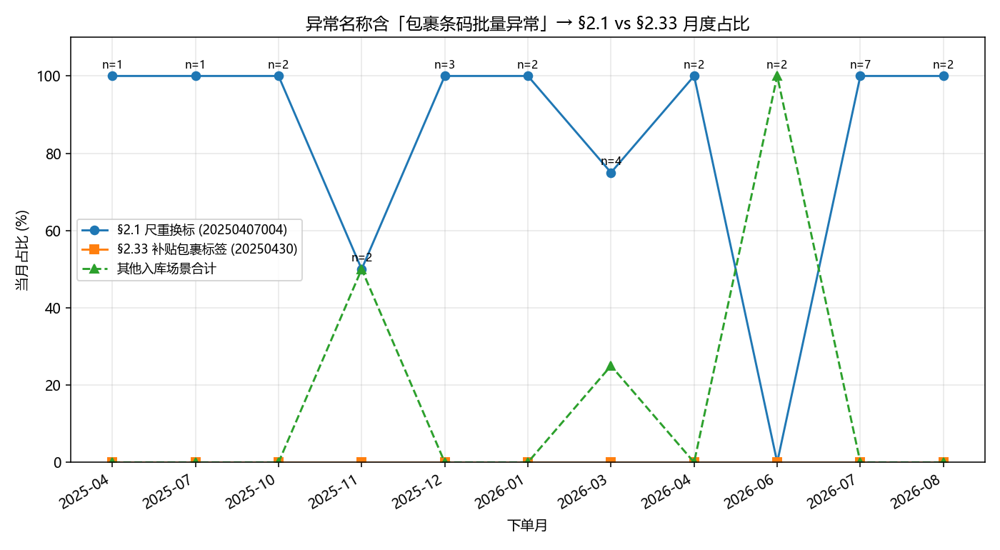
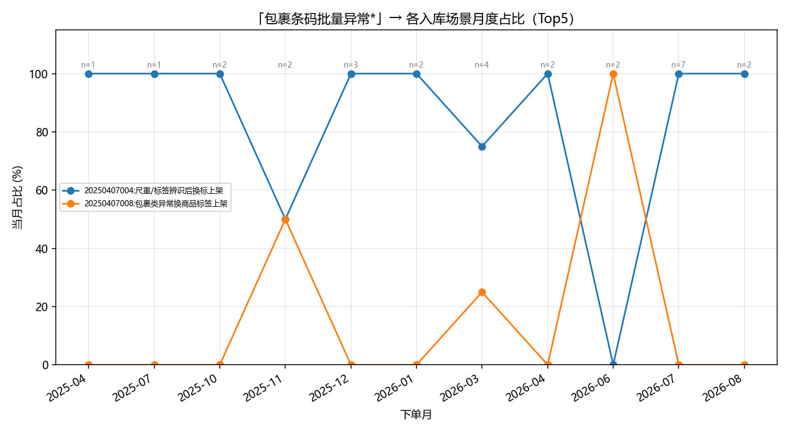
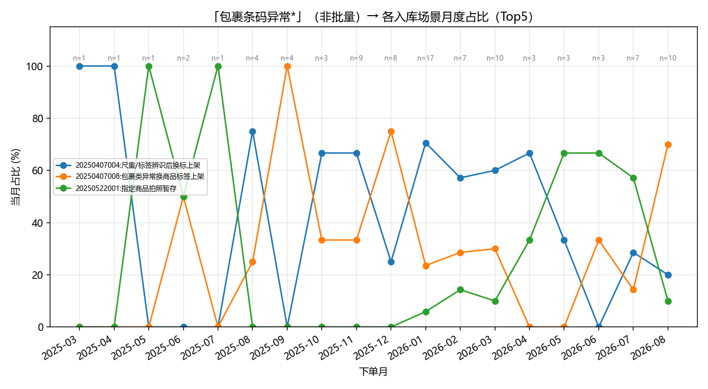
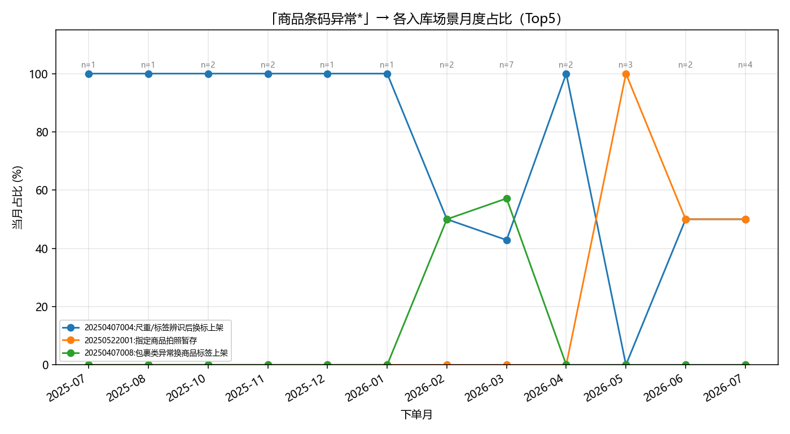
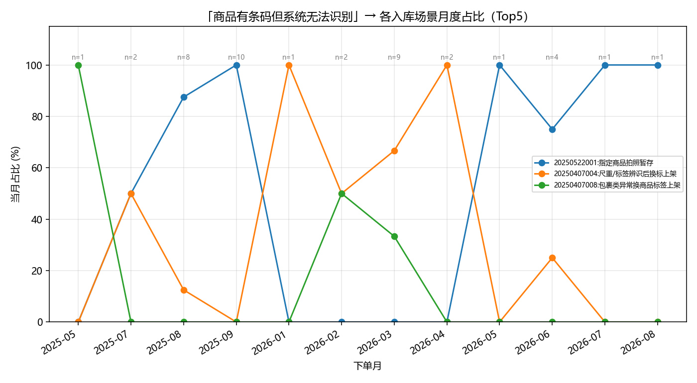
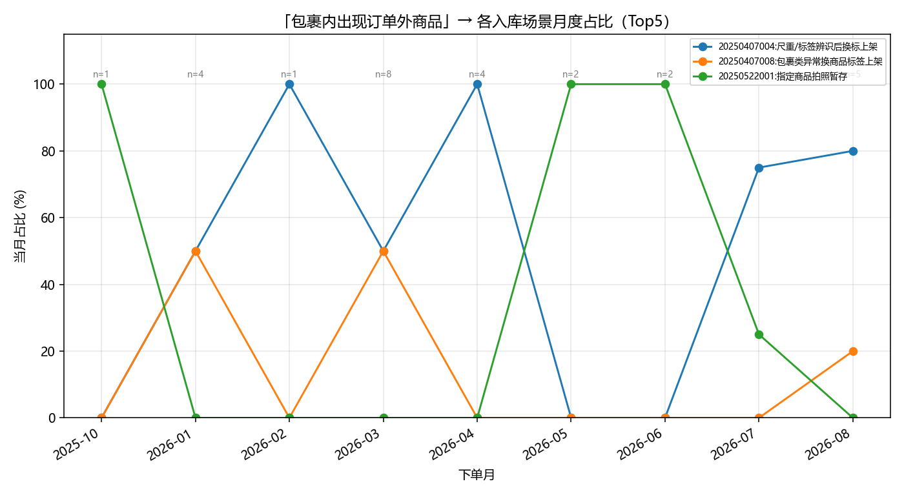
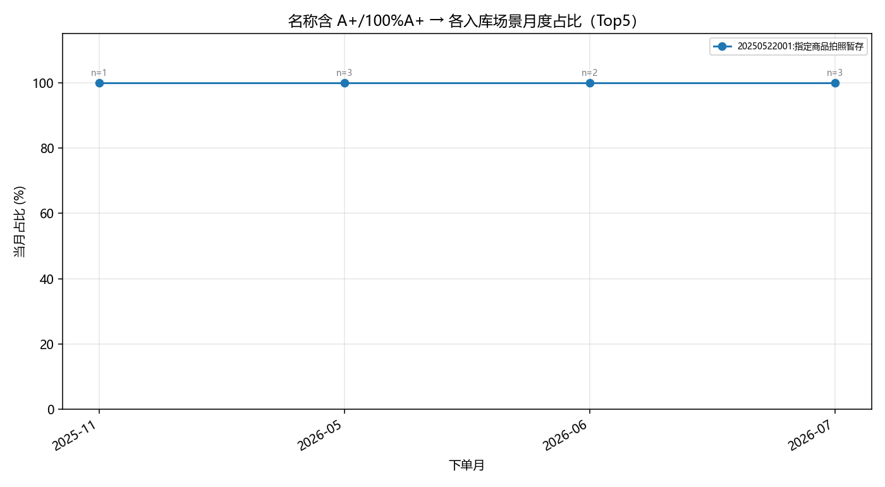
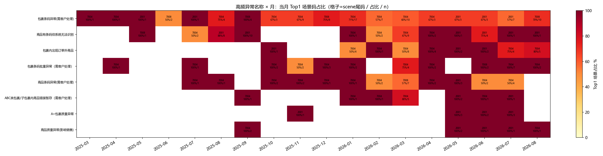

# 异常名称 × 场景选择：月度趋势

## 数据说明

- **场景 / 下单日优先**取自 `_runs/20260909_inbound_scene_probe/_oms_cache/`（`atoms` 入库场景 + `orders.order_date`）。
- **异常名称 `eventName`** 不在 `_oms_cache` CSV 中；来自既有 details 的 `events[]`（与上轮探测相同来源），**本轮未新查 OMS**。
- 可用样本：增值单 **246**（其中命中本窗口 cache **83**）；事件名关联行 **251**。
- 日期缺 cache 时回退 details.`listHeader.orderDate`；场景非入库则丢弃。

### 异常名称频次

| 异常名称 | 关联单数（按名） |
|---------|----------------:|
| 包裹条码异常(需客户处理) | 94 |
| 商品有条码但系统无法识别 | 42 |
| 包裹内出现订单外商品 | 31 |
| 包裹条码批量异常（需客户处理） | 28 |
| 商品条码异常(需客户处理) | 28 |
| ABC类包裹/子包裹内商品错装暂存（需客户处理） | 12 |
| A+包裹质量异常 | 9 |
| 商品质量异常(影响销售) | 7 |

## 重点：包裹条码批量异常 — §2.1 vs §2.33

- 匹配到的原始异常名称：['包裹条码批量异常（需客户处理）']
- 订单数：28

| 月份 | n | §2.1 占比 | §2.33 占比 | 其他占比 |
|------|--:|--------:|----------:|--------:|
| 2025-04 | 1 | 100.0% | 0.0% | 0.0% |
| 2025-07 | 1 | 100.0% | 0.0% | 0.0% |
| 2025-10 | 2 | 100.0% | 0.0% | 0.0% |
| 2025-11 | 2 | 50.0% | 0.0% | 50.0% |
| 2025-12 | 3 | 100.0% | 0.0% | 0.0% |
| 2026-01 | 2 | 100.0% | 0.0% | 0.0% |
| 2026-03 | 4 | 75.0% | 0.0% | 25.0% |
| 2026-04 | 2 | 100.0% | 0.0% | 0.0% |
| 2026-06 | 2 | 0.0% | 0.0% | 100.0% |
| 2026-07 | 7 | 100.0% | 0.0% | 0.0% |
| 2026-08 | 2 | 100.0% | 0.0% | 0.0% |

### 读图要点

- 首月 §2.1=100.0% / §2.33=0.0%；末月 §2.1=100.0% / §2.33=0.0%（按有样本月份）。
- **所有月份 §2.33 占比均为 0%**——见文末「选择偏差」：cache 里 76 单 §2.33 几乎不在带 `eventName` 的 details 池中，故本图**无法观察**向 §2.33 的迁移。
- 在偏置样本内：**未见**「后期切到 §2.33」；更多是持续落在 §2.1（或少数其他场景）。

## 其他高频异常名称（Top 场景折线）

### batch — ['包裹条码批量异常（需客户处理）']

- 订单数：28
- Top 场景：20250407004:尺重/标签辨识后换标上架 (n=24)； 20250407008:包裹类异常换商品标签上架 (n=4)

| 月份 | n |
|------|--:|
| 2025-04 | 1 |
| 2025-07 | 1 |
| 2025-10 | 2 |
| 2025-11 | 2 |
| 2025-12 | 3 |
| 2026-01 | 2 |
| 2026-03 | 4 |
| 2026-04 | 2 |
| 2026-06 | 2 |
| 2026-07 | 7 |
| 2026-08 | 2 |

### pkg_barcode — ['包裹条码异常(需客户处理)']

- 订单数：94
- Top 场景：20250407004:尺重/标签辨识后换标上架 (n=44)； 20250407008:包裹类异常换商品标签上架 (n=34)； 20250522001:指定商品拍照暂存 (n=16)

| 月份 | n |
|------|--:|
| 2025-03 | 1 |
| 2025-04 | 1 |
| 2025-05 | 1 |
| 2025-06 | 2 |
| 2025-07 | 1 |
| 2025-08 | 4 |
| 2025-09 | 4 |
| 2025-10 | 3 |
| 2025-11 | 9 |
| 2025-12 | 8 |
| 2026-01 | 17 |
| 2026-02 | 7 |
| 2026-03 | 10 |
| 2026-04 | 3 |
| 2026-05 | 3 |
| 2026-06 | 3 |
| 2026-07 | 7 |
| 2026-08 | 10 |

### merch_barcode — ['商品条码异常(需客户处理)']

- 订单数：28
- Top 场景：20250407004:尺重/标签辨识后换标上架 (n=17)； 20250522001:指定商品拍照暂存 (n=6)； 20250407008:包裹类异常换商品标签上架 (n=5)

| 月份 | n |
|------|--:|
| 2025-07 | 1 |
| 2025-08 | 1 |
| 2025-10 | 2 |
| 2025-11 | 2 |
| 2025-12 | 1 |
| 2026-01 | 1 |
| 2026-02 | 2 |
| 2026-03 | 7 |
| 2026-04 | 2 |
| 2026-05 | 3 |
| 2026-06 | 2 |
| 2026-07 | 4 |

### unrecog — ['商品有条码但系统无法识别']

- 订单数：42
- Top 场景：20250522001:指定商品拍照暂存 (n=24)； 20250407004:尺重/标签辨识后换标上架 (n=13)； 20250407008:包裹类异常换商品标签上架 (n=5)

| 月份 | n |
|------|--:|
| 2025-05 | 1 |
| 2025-07 | 2 |
| 2025-08 | 8 |
| 2025-09 | 10 |
| 2026-01 | 1 |
| 2026-02 | 2 |
| 2026-03 | 9 |
| 2026-04 | 2 |
| 2026-05 | 1 |
| 2026-06 | 4 |
| 2026-07 | 1 |
| 2026-08 | 1 |

### extra_item — ['包裹内出现订单外商品']

- 订单数：31
- Top 场景：20250407004:尺重/标签辨识后换标上架 (n=18)； 20250407008:包裹类异常换商品标签上架 (n=7)； 20250522001:指定商品拍照暂存 (n=6)

| 月份 | n |
|------|--:|
| 2025-10 | 1 |
| 2026-01 | 4 |
| 2026-02 | 1 |
| 2026-03 | 8 |
| 2026-04 | 4 |
| 2026-05 | 2 |
| 2026-06 | 2 |
| 2026-07 | 4 |
| 2026-08 | 5 |

### aplus — ['A+包裹质量异常']

- 订单数：9
- Top 场景：20250522001:指定商品拍照暂存 (n=9)

| 月份 | n |
|------|--:|
| 2025-11 | 1 |
| 2026-05 | 3 |
| 2026-06 | 2 |
| 2026-07 | 3 |

## 总览热力图

频次 ≥5 的异常名称；格子为当月 Top1 场景码（显示码尾）与占比/样本量。

## 结论（针对「前期 §2.1 → 后期专属场景」假说）

1. **选择偏差极强（先读这条）**：本窗口 cache 中场景 `20250430`（§2.33）有 **76** 单，但与「带 `eventName` 的 details」交集仅 **1** 单。因此折线图里「批量异常 → §2.33」月度占比长期为 **0%**，**不能**解读为「业务从未选 §2.33」，而是 **§2.33 单几乎没被拉过异常详情**；现有 events 池高度偏向尺重/三场景建设样本。
2. 在**已有 eventName 子集**（246 单）内：「包裹条码批量异常」28 单跨 2025-04～2026-08，**未见**向 §2.33 切换；多数月份 §2.1≈100%（月 n 很小）。这只描述该偏置样本池，不能外推全窗口。
3. 其他高频名（商品条码异常、系统无法识别、订单外商品、A+）同样受同一偏置影响；热力图/折线可用于看「偏置池内」是否换场景，**不能**单独证明全库迁移规律。
4. **要验证「前期 §2.1、后期切专属场景」**：必须对 `_oms_cache` 入库单（至少对 §2.33/§2.5/拍照暂存等专属码）补拉 `getEventOrders`，再重画本趋势图。
5. `_oms_cache` 本身仍无 `eventName` 列；本图是 cache 日期/场景 + 既有 details 事件名的 join，**未改 pipeline、未新查 OMS**。

