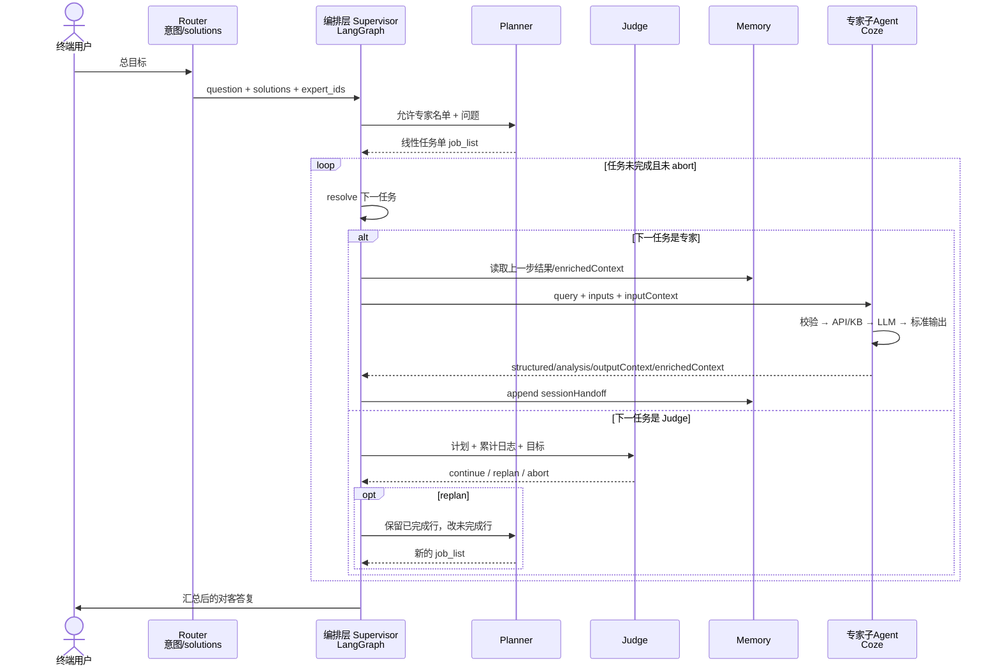
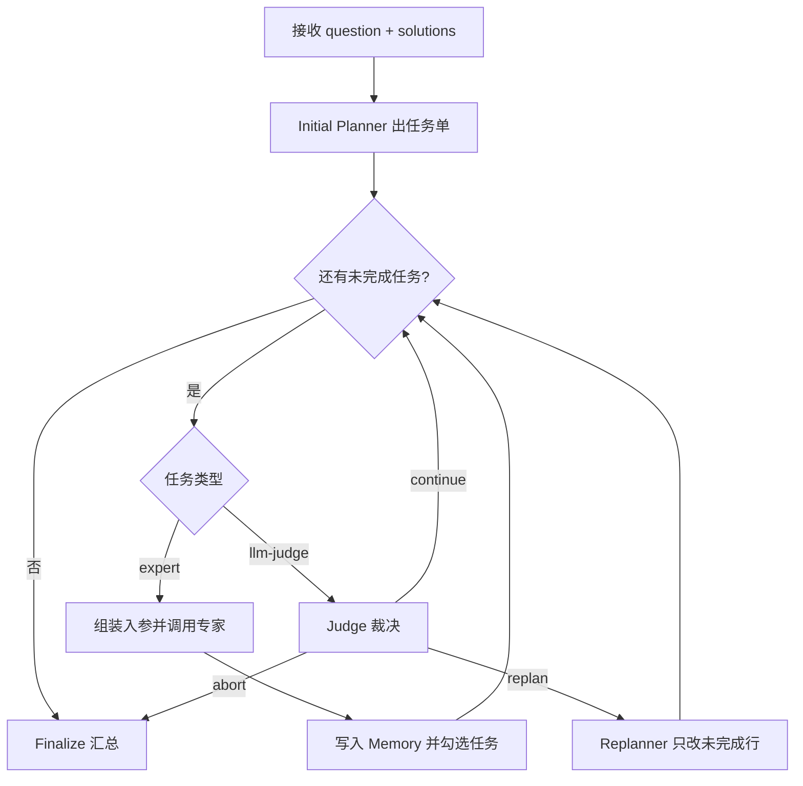
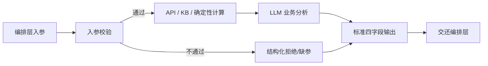

# Agent 工作流程设计

| 项 | 内容 |
| --- | --- |
| 文档性质 | PRD / 架构设计（逻辑设计为主，实现形式单独成节） |
| 系统定位 | 复合分层 Agent，不是单一 ReAct / ToT / GoT |
| 顶层组合 | Router + Supervisor + Plan-and-Execute + Multi-Agent + Tool Use + Memory + Judge Loop |
| 编排层目录 | `experts/experts_recaller/` |
| 专家层目录 | `experts/experts/{domain}/{id}/` |
| 编排层实现约定 | Python 脚本 / LangGraph 代码调度循环 |
| 专家层实现约定 | Coze 可视化工作流 |
| 读者 | 产品、架构、编排开发、专家开发、评测 |

---

## 0. 先分清两件事

本文件同时写「怎么跑」和「用什么落地」。这两件事必须分开读：

| 概念 | 回答什么 | 例子 | 能不能单独运行 |
| --- | --- | --- | --- |
| **逻辑设计** | 谁先谁后、谁决策、数据怎么传、失败怎么回退 | 用户目标 → 路由 → 规划任务单 → 循环调专家 → Judge 三分叉 → 汇总 | 否，只是流程图 / 链路 |
| **实现形式** | 把上述链路做成可运行程序 | 编排层用 LangGraph；专家层用 Coze DAG；工具用 OpenAPI | 是，部署后可执行 |

逻辑设计不变时，实现形式可以替换（例如编排从 LangGraph 换成微服务）。实现形式变了，不等于架构模式变了。

---

## 1. 架构总览

### 1.1 一句话

对外是**一套完整 Agent 系统**：先理解意图，再规划任务，再按队列调度多个领域专家，用记忆串联上下文，用 Judge 决定继续 / 重规划 / 中止，最后汇总给用户。

对内是**两层**：编排层只当项目经理；专家层只当被指派的领域执行单元。

### 1.2 分层总图（逻辑）

```text
终端用户
    │
    ▼
┌─────────────────────────────────────────────────────────┐
│ 完整 Agent 系统（对外唯一入口）                           │
│                                                         │
│  [Router] 意图 / solutions 候选专家                      │
│       │                                                 │
│       ▼                                                 │
│  [Supervisor / Recaller] 编排层                          │
│       │  Planner 产出线性任务单                          │
│       │  Loop: 取下一任务 → 调专家 → 写入 Memory          │
│       │  Judge: continue | replan | abort               │
│       │  Finalize: 汇总对客答复                          │
│       │                                                 │
│       │  只中转，不谈业务细节                             │
│       ▼                                                 │
│  ┌──────────┐ ┌──────────┐ ┌──────────┐                 │
│  │专家 A    │ │专家 B    │ │专家 C    │  专家层          │
│  │校验→工具 │ │校验→工具 │ │校验→工具 │                 │
│  │→LLM→标准 │ │→LLM→标准 │ │→LLM→标准 │                 │
│  │输出      │ │输出      │ │输出      │                 │
│  └──────────┘ └──────────┘ └──────────┘                 │
│       ▲              ▲              ▲                   │
│       └──────── 全部经编排层中转 ────────┘               │
└─────────────────────────────────────────────────────────┘
```

### 1.3 顶层组合如何叠在一起

| 组合位 | 模式 | 本系统中的位置 | 作用 |
| --- | --- | --- | --- |
| 入口 | Router | 上游意图分类 / `solutions` → `expert_ids` | 把用户问题收成「该找哪些专家」 |
| 主管 | Supervisor | `experts_recaller` | 只调度、控流程、做循环决策 |
| 规划 | Plan-and-Execute | Planner 先出线性任务单，再执行 | 先拆步，再按步跑 |
| 执行体 | Multi-Agent | 多个 `{domain}/{id}` 专家 | 领域能力拆开，顺序排队 |
| 专家内部 | Tool Use + Single Agent | 每个专家的固定 DAG | 调 API / KB，再 LLM 分析 |
| 上下文 | Memory | `sessionHandoff` / `chainContext` / `enrichedContext` | 步骤结果与事实由编排层保管 |
| 循环 | Loop Engineering + Judge | LangGraph 循环图 | 继续 / 重规划 / 中止 |

本系统**不采用**：专家层自由 ReAct（模型自己决定要不要再调工具）、Tree of Thoughts、Graph of Thoughts、专家之间点对点通信、专家直接对终端用户发言。

### 1.4 两个「Agent」必须分开说

**算。** 每个专家单元是独立 **子 Agent**。

**不算。** 单个专家不是对外服务的完整 Agent 系统。

| 对象 | 是不是 Agent | 对谁负责 | 有没有完整闭环 |
| --- | --- | --- | --- |
| 专家子 Agent | 是。有自己的目标切片、输入校验、工具、LLM、标准输出 | 只对编排层分配的子任务负责 | 有专家内部闭环，**没有**对用户闭环 |
| 完整 Agent 系统 | 是。Router + Supervisor + Planner + 多专家 + Memory + Judge | 对终端用户的总目标负责 | 有端到端闭环：接收问题 → 调度 → 汇总答复 |

判定标准：

1. **独立 Agent（子 Agent）**：具备独立工作流、独立工具/KB、独立 I/O 契约，可被单独测试、单独发布。
2. **完整 Agent 系统**：具备用户入口、任务规划、多执行体调度、记忆、终止条件、对客输出。
3. 专家**不能**独立面向终端用户：没有 Router / Planner / Judge / 最终汇总，也没有会话级记忆所有权。
4. 专家**不能**直接互调：全部交互由编排层中转，避免隐式耦合和不可追踪的旁路。

---

## 2. 两层职责

### 2.1 编排层（项目经理）

**目录：** `experts/experts_recaller/`

**角色一句话：** 接收总目标，拆成线性任务，循环指派专家，判断队列是否还能推进，最后汇总。

| 职责 | 做 | 不做 |
| --- | --- | --- |
| 接收目标 | 收用户问题、上游 `solutions` / `expert_ids`、客户上下文 | 不重写用户业务事实 |
| 规划 | Planner 产出线性 Markdown 任务单：`[ ] expert_id: 描述` | 不在规划阶段调用业务 API 下业务结论 |
| 调度 | 按任务单顺序取下一任务，组装专家入参，调用专家 | 不在编排层写领域规则、不算日期、不改专家分类 |
| 记忆 | 维护 `sessionHandoff`、`chainContext`、累计执行日志 | 不把记忆所有权下放到专家互传 |
| 评判 | Judge 只输出 `continue` / `replan` / `abort` | 不补充、不重算、不发明业务原因 |
| 收尾 | 队列结束后生成对客摘要 | 不把内部 Judge/Planner 话术直接给用户 |

编排层内部逻辑角色：

```text
Router 结果 / solutions
        │
        ▼
   Initial Planner ──► job_list（线性、最多约 10 步）
        │
        ▼
   ┌── agent_loop ─────────────────────────────┐
   │  resolve-next-job                         │
   │    ├─ 还有专家任务 → 调专家 → 写 Memory    │
   │    ├─ 轮到 llm-judge → Judge 三分叉        │
   │    └─ 任务单全 [x] → 跳出循环做汇总        │
   │                                           │
   │  Judge = continue → 继续循环               │
   │  Judge = replan   → Replanner 改未完成行   │
   │  Judge = abort    → 结束循环，带已有证据汇总 │
   └───────────────────────────────────────────┘
        │
        ▼
   Finalize → 对客答复
```

Judge 三类判断的语义：

| 判定 | 含义 | 后续 |
| --- | --- | --- |
| `continue` | 剩余 `[ ]` 任务仍可有意义地执行 | 继续取下一任务 |
| `replan` | 总目标仍成立，但当前拆步错误或不可行 | Replanner 只改未完成行，已完成 `[x]` 不得改写 |
| `abort` | 已无有意义可执行任务，或现有专家/证据无法再推进 | 结束队列；**不得**借 abort 编造失败原因 |

编排层实现约定见第 5 节：Python / LangGraph 拥有循环与状态，不把循环画进专家 Coze 包。

### 2.2 专家层（领域执行单元）

**目录：** `experts/experts/{domain}/{id}/`

**角色一句话：** 只处理被分配的子任务，按固定内部流程产出标准结果，然后把结果交还编排层。

每个专家是独立子 Agent，内部固定四段（逻辑顺序，不因 Coze 画布节点增减而改变）：

```text
入参校验 → 调用 API / 知识库 KB → LLM 业务分析 → 返回标准化输出
```

| 职责 | 做 | 不做 |
| --- | --- | --- |
| 接任务 | 消费编排层传入的 `query` / `customerIntent` / `inputs` / `inputContext` | 不自己找下一个专家 |
| 校验 | 缺参则拒绝或按 Schema 默认值降级 | 不向用户直接追问（追问话术如需产出，仍交编排层决定是否发出） |
| 取证 | 调 OpenAPI、读 KB Text、做确定性代码计算 | 不把编排循环、Judge、Planner 做进专家包 |
| 分析 | LLM 只基于已取到的证据给 `structured` + `analysis` | 不编造未取证的订单事实 |
| 交还 | 根级返回四字段，供编排层写入 Memory | 不点对点调用其他专家 |

专家标准输出（编排层唯一合法消费形状）：

```json
{
  "structured": {},
  "analysis": "对客自然语言结论",
  "outputContext": {
    "expertId": "当前专家 id",
    "resultSummary": "给下游的短摘要",
    "chainId": "与输入一致"
  },
  "enrichedContext": {}
}
```

专家之间的关系：

- **不直接通信。** A 的结果只能经编排层 Memory 转给 B。
- **顺序协作，不并行扇出。** 默认一条队列，避免多专家同时写同一事实而无合并规则。
- **可单独发布。** 每个专家有 `manifest.json`、`design.md`、`workflow.json` / Coze 包，可单测、可单独升级。

### 2.3 两层交互原则

1. 编排层只传任务与上下文，不传「请按某内部 Wiki 对客户解释」类内部依据。
2. 专家只回报证据与结论，不回报「下一步该调谁」作为强制控制指令（最多给建议字段，采信权在编排层）。
3. `chainId` 全程透传，用于日志与 Memory 对齐。
4. 业务标识（单号、运单号等）必须原文传递，编排层与专家都不得改写、补全、规范化。

---

## 3. 端到端执行时序

### 3.1 主路径（成功走完）

1. **用户提出总目标**  
   终端用户只对完整 Agent 系统说话。

2. **Router（上游，进入编排层之前）**  
   意图分类 / 方案检索，得到 `solutions` 与候选 `expert_ids`。  
   此步解决「大概该找谁」，不解决「具体先查单还是先看轨迹」。

3. **编排层接收**  
   输入至少包括：`question`、`solutions` / 候选专家列表、客户上下文（`customerCode`、`customerName`、`username`、`language`）。

4. **Initial Planner**  
   只在允许的专家名单内，产出线性任务单。  
   若上游 `solutions` 已完整回答且无需实时系统数据，可输出「无需专家」短路，直接汇总。

5. **进入循环（Loop）**  
   取任务单中第一条未完成 `[ ]`：
   - 若是普通 `expert_id`：组装入参 → 调用该专家 Coze 工作流 → 回收四字段 → 追加到 `sessionHandoff` → 该行打 `[x]`。
   - 若是 `llm-judge`：只做流程裁决，不调业务专家。

6. **专家内部一次性跑完**  
   校验 → API/KB → LLM 分析 → 标准输出。专家内部**不再**开编排级循环。

7. **Judge 抽检（规划时插入的检查点）**  
   看队列语义、是否卡死、目标是否仍可推进、现有证据是否已够。  
   - `continue`：回到步骤 5。  
   - `replan`：Replanner 保留 `[x]`，只改后续拆步，然后回到步骤 5。  
   - `abort`：跳出循环，带已有证据去汇总。

8. **Finalize**  
   编排层根据 Memory 与原始问题生成对客答复。用户只看到这一层的答复，看不到 Planner / Judge 原文。

### 3.2 时序图（逻辑）



### 3.3 Judge 循环状态（逻辑）



### 3.4 专家内部时序（被调用一次）



专家内部可以有校验分流、是否跳过 API、分类后再澄清等**固定分支**，这些属于专家 DAG，不属于编排层 Loop。

### 3.5 失败与边界路径

| 场景 | 谁处理 | 期望行为 |
| --- | --- | --- |
| 上游方案已足够、无需实时数据 | Planner | 短路，不进专家队列 |
| 专家缺必填参数 | 专家 | 拒绝执行并说清缺什么；编排层决定追问、换专家或 abort |
| 同一专家对同一子任务反复空结果 | Judge | 倾向 `replan` 或 `abort`，禁止无证据重试死循环 |
| 单号在任务行里被改写 | 编排层校验 / Judge | `replan`，强制原文保留 |
| 专家超时或工作流失败 | 编排层 | 记入执行日志；由 Judge 判断换人、跳过或中止 |
| 达到循环上限 | 编排层硬约束 | 强制结束并汇总已有证据，不得无限转圈 |

---

## 4. 各环节对应的经典 Agent 模式

| 环节 | 对应模式 | 匹配说明 | 明确不是 |
| --- | --- | --- | --- |
| 完整对外系统 | Multi-Agent 复合体 | 多子 Agent + 主管 + 规划 + 记忆 + 循环 | 不是单模型一次性问答 |
| 上游意图 / solutions | Router | 按意图收窄专家候选 | 不是 Supervisor（不管执行顺序） |
| Recaller 整体 | Supervisor | 主管调度、合并结果、对用户负责 | 不是领域专家 |
| Planner → 任务单 → 执行 | Plan-and-Execute | 先全量（或可修订）线性计划，再执行 | 不是走一步想一步的纯 ReAct |
| 多专家排队 | Multi-Agent（顺序） | 多专业单元协作 | 不是并行 fan-out 再 merge |
| 取下一任务 / Judge / 再进入 | Loop Engineering | 有明确继续条件与终止条件 | 不是无目标空转 |
| Judge 看日志做三分叉 | Loop 内的流程 Reflection | 只审队列能否推进 | 不是 Self-Refine（不改写答案正文） |
| `sessionHandoff` 等 | Memory | 会话短记忆 + 专家间事实中转 | 不是跨会话长期个人记忆（本设计不覆盖） |
| 单个专家整包 | Single Agent + Tool Use | 一人一事，工具预置在流程里 | 不是独立面向用户的完整系统 |
| 专家内 API / KB | Tool Use | 外部系统与知识注入 | 不是 ReAct 自由选工具 |
| 专家内 LLM 分析 | Single Agent 的生成步 | 基于已取证据生成结构化+自然语言 | 不是规划器 |
| ReAct | — | 本设计**故意不用**作编排主模式 | 模型不得在循环里自由决定「再调什么工具」 |
| ToT / GoT | — | 不采用 | 不做多路径搜索与思维图合并 |
| Self-Refine | — | 不采用 | 没有 Critic 多轮改同一草稿 |

阅读口诀：

- **对外讲系统**：Router + Supervisor + Plan-and-Execute + 顺序 Multi-Agent + Memory + Judge Loop。
- **对内讲专家**：Single Agent + 预编排 Tool Use。
- **不要讲成**：整仓是一个大 ReAct。

---

## 5. 逻辑设计 vs 实现形式

### 5.1 对照表

| 逻辑模块 | 逻辑职责（与实现无关） | 本 PRD 约定的实现形式 | 可替换实现（不改逻辑） |
| --- | --- | --- | --- |
| Router | 意图 → 候选专家 | 上游分类 / 方案服务；编排层只消费结果 | 规则路由、独立分类工作流 |
| Supervisor 循环 | 取任务、调专家、写记忆、收 Judge | **Python + LangGraph** 状态图 | 微服务编排器、另一套工作流引擎 |
| Planner / Replanner / Judge | 出任务单、改任务单、三分叉 | LangGraph 中的 LLM 节点 + 结构化输出解析 | 同一 Prompt 换模型托管平台 |
| Memory | 步骤日志与事实中转 | LangGraph state（`job_list`、`sessionHandoff`、`chainContext`） | Redis / DB，只要契约不变 |
| 调用专家 | 把标准入参打到专家，收回四字段 | LangGraph tool / HTTP 调用专家 Coze `workflow/run` | 本地函数、gRPC，只要 I/O 不变 |
| 专家内部流程 | 校验 → 工具/KB → LLM → 标准输出 | **Coze 可视化 DAG**（代码节点 + LLM 节点 + 插件） | 仍须保持四段逻辑与四字段输出 |
| 对客汇总 | 基于 Memory 生成用户可见答复 | LangGraph 终态 LLM 节点 | 模板拼接 + LLM |

### 5.2 实现边界（必须遵守）

1. **循环所有权在编排层。**  
   LangGraph 拥有 `agent_loop`、循环次数上限、`continue/replan/abort` 边。专家 Coze 包里不得再实现一套「调下一个专家」的循环。

2. **业务 DAG 所有权在专家层。**  
   某个专家要不要查订单、跳过 API、走 KB-only，由该专家的 Coze 画布决定。编排层不得把这些分支抄进 LangGraph。

3. **代码可以出现在两层，但角色不同。**  
   - 编排层 Python：调度、状态、拼参、解析、重试策略。  
   - 专家层 Coze 代码节点：单次取数、校验、格式化。  
   同一段业务规则只允许住在专家侧一处。

4. **源码目录与运行时的关系。**  
   - `experts/experts_recaller/`：编排逻辑与 Prompt 的源码真源，落地为 LangGraph 图。  
   - `experts/experts/{domain}/{id}/`：专家逻辑真源，导出/导入为 Coze 工作流后运行。  
   Git 提交不等于线上生效；专家仍须按 Coze 发布流程上线。

5. **不要把实现形式误判成架构模式。**  
   用了 LangGraph 不等于变成 ReAct。  
   用了 Coze 不等于整个系统是可视化编排。  
   模式看「谁决策、谁执行、如何循环」，不看「画布还是代码」。

### 5.3 推荐的 LangGraph 状态（实现示意，非必须字段名）

```text
GraphState
  question: str
  solutions: str
  allowed_experts: list
  job_list: str                 # 线性 Markdown 任务单
  chainContext: object
  sessionHandoff: object        # steps[]
  accumulated_summary: str
  last_expert_result: object
  judge_verdict: continue|replan|abort|null
  reply_to_user: str
```

边：`plan → loop → (call_expert | judge | finalize)`；`judge` 连回 `loop` 或 `replan` 或 `finalize`。

---

## 6. 关键设计约束与边界

### 6.1 硬约束

1. 编排层**不处理具体业务逻辑**，不做日期计算、责任判定、赔付金额、VASC 推荐等。
2. 专家层**不面向终端用户**，不拥有会话结束权，不决定全局任务单。
3. 专家之间**禁止直接通信**；需要下游事实时，由编排层从 Memory 预填 `inputContext` / `enrichedContext`。
4. 专家内部流程固定为四段，工具预置，**禁止**专家内自由 ReAct 选工具。
5. Judge **只准**输出流程裁决，不准改写、补充、重解释专家业务结论。
6. Replanner **必须**保留已完成 `[x]` 行，禁止改写历史。
7. 业务标识必须逐字符保持原文。
8. 循环必须有上限与 abort 条件，禁止无终止自主执行。
9. 对客 `analysis` / 最终答复不得把内部飞书、Wiki、多维表说成客户依据。
10. 逻辑设计与实现形式必须在文档和评审中分开表述，禁止用「我们是 Coze 系统 / LangGraph 系统」代替模式判断。

### 6.2 范围边界

| 在范围内 | 不在本设计范围内 |
| --- | --- |
| 客服场景下的专家队列调度 | 通用自主科研 Agent、开放互联网浏览环 |
| 顺序 Multi-Agent | 多专家并行争用同一写入口 |
| 会话内 Memory | 跨周、跨用户的长期记忆产品 |
| 专家标准 I/O 与可发现性（manifest） | 专家内部具体业务规则正文 |
| Router 结果的消费 | Router 模型与分类体系的训练细节 |
| 单次咨询的闭环 | 人工工单系统、审批流本身 |

### 6.3 质量与验收（PRD 级）

| 验收项 | 通过标准 |
| --- | --- |
| 分层不串味 | 抽一份编排代码，看不到领域赔付/推荐规则；抽一份专家包，看不到调其他专家的循环 |
| 子 Agent 独立性 | 任意专家可单独用最小入参跑通，并给出四字段 |
| 系统完整性 | 无专家目录时，用户仍只能打到编排入口，而不是某个专家 URL |
| Judge 纯洁性 | Judge 输出不含新的订单状态或责任结论 |
| 记忆中转 | 专家 B 能读到的上游事实，全部来自编排层注入，而不是 B 直接调 A |
| 终止 | 超时、空转、越权标识、超循环次数都能落到 Finalize，而不是挂死 |
| 模式表述 | 对外材料必须写「复合分层」，不得写成「ReAct 客服」 |

### 6.4 给评审的三句结论

1. **多专家单元是独立子 Agent，不是完整对外 Agent。**  
   完整 Agent 系统 = Router + 编排层 + 专家层 + 对客出口。
2. **逻辑上是 Supervisor 管的 Plan-and-Execute 队列；实现上编排用 LangGraph，专家用 Coze。**  
   两套实现叠在同一条逻辑链上，不要互相替代对方的职责。
3. **编排只调度，专家只办事，记忆只中转，Judge 只判队列。**  
   越权即架构退化：编排写业务会变成「假专家」，专家互调会变成「无主管 Multi-Agent」。

---

## 7. 接口契约（供实现对照）

### 7.1 编排层调用专家的顶层入参

```json
{
  "query": "本步要专家做的事",
  "customerIntent": "当前要为客户解决的问题摘要",
  "customerCode": "",
  "customerName": "",
  "username": "",
  "language": "",
  "inputContext": {
    "sourceExpertId": "上一专家 id 或空",
    "previousOutput": {},
    "chainId": "同一链路 id"
  },
  "inputs": {
    "仅本专家 manifest.inputSchema 中的业务字段": ""
  }
}
```

`customerCode` / `customerName` / `username` / `language` 在顶层，不进 `inputs`。  
万邑通 OpenAPI 的 `data` 由专家内部节点拼装，不由编排层顶层传入。

### 7.2 Memory 最小形状

```json
{
  "version": 1,
  "chainId": "与 chainContext 相同",
  "steps": [
    {
      "expertId": "delivery-status",
      "at": "ISO-8601",
      "result": {
        "structured": {},
        "analysis": ""
      },
      "outputContext": {
        "expertId": "delivery-status",
        "resultSummary": "",
        "chainId": ""
      },
      "enrichedContext": {}
    }
  ]
}
```

`steps` 必须有上限（建议最近 10 步），防止上下文膨胀。

### 7.3 Judge 输出

```json
{
  "verdict": "continue | replan | abort",
  "confidence": "high | medium | low",
  "rationale": "只描述队列决策与已确认的专家结果",
  "replan_reason": "",
  "planner_brief": ""
}
```

`planner_brief` 仅在 `replan` 时非空。

---

## 8. 文档使用说明

- 改**流程对错**（谁先规划、专家能不能互调、Judge 能不能写业务）：改第 1–4、6 节逻辑设计。  
- 改**用什么跑**（LangGraph 换成微服务、某专家仍用 Coze）：只改第 5 节实现形式，并回归第 6.3 验收。  
- 写专家 PRD 时，只展开该专家的校验、工具、KB、输出字段；不要复制编排循环。  
- 写编排迭代时，只改任务单规则、Judge 策略、Memory 合并；不要把领域 KB 搬进 Recaller。
