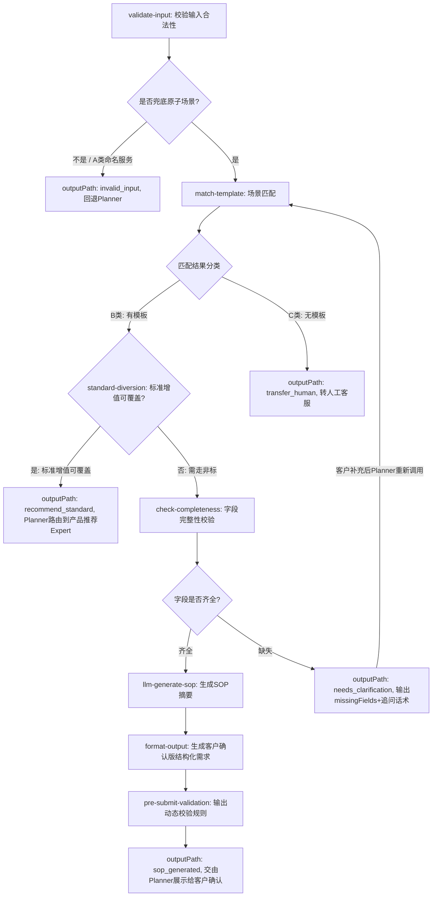

# PRD-非标增值生成Agent-V1.0

> 文档元信息

- 版本：V1.0
- 更新人：产品经理
- 更新日期：2026-08-24
- 前置依赖：BRD-非标增值生成Agent-V1.0（已评审通过）
- 配套附件：
    1. Agent评测方案-V1.0.md
    2. Agent测试集-V1.0.md
    3. Coze测试空间原型链接：【填写链接】

---

## 1 概述

### 1.1 产品简述

本Agent分为**客户侧需求采集Agent**与**审核侧Copilot Agent**双侧能力，基于Coze低代码智能体平台构建。

- 客户侧：面向外部客户，自然语言采集非标增值需求，动态追问补齐缺失字段，生成客户确认版结构化需求，**不做审核决策，不承诺仓库可执行、费用、时效**。
- 审核侧Copilot：面向内部审核人员，消费客户侧结构化输出，完成场景识别推荐、资料完整性校验、相似案例召回、生成仓库SOP初稿、标记风险疑点。

> V1.0硬性约束：Agent**禁止输出最终审核结论**；所有提交、流转必须经过人工确认；Agent输出仅作为辅助参考。

### 1.2 运行环境与产品架构

**Coze 平台环境：**

- 测试环境：Coze测试空间，用于配置变更、回归测试、业务验证。
- 生产环境：Coze生产空间，对外面向客户、对内面向审核人员。
- 不自研Agent编排运行时；业务API密钥、客户权限鉴权全部由**内部代理网关**托管，Coze平台不存储业务密钥。

**外部客户接入架构（Expert 编排器）：**

客户侧 Agent 通过已有的智能客服 Expert 编排器接入，沿用现有产品形态：

```
客户输入 → Planner(编排器) → 触发 nonstandard-sop-guide Expert → Expert 内部工作流 → 输出结构化结果 → Planner 展示/追问/确认
```

- Expert 编排器负责：意图识别、Expert 调度、上下文传递（enrichedContext）、多轮追问协调、客户确认引导。
- nonstandard-sop-guide Expert 负责：场景匹配、字段完整性校验、SOP 生成、输出路由。
- 上游依赖：`value-add-product-recommendation`（产品推荐）、`value-add-exception-diagnosis`（异常诊断）提供 enrichedContext。

**客户侧入口（4 个）：**

| 入口 | 页面 | vaSource | 说明 |
|---|---|---|---|
| 入口 1 | 新增库内增值单（菜单） | INHOUSE | 客户主动创建库内增值 |
| 入口 2 | 新增入库增值单（菜单） | INBOUND | 客户主动创建入库增值 |
| 入口 3 | 异常单处理第二步 | UNUSUAL | 库内/入库异常单处理 |
| 入口 4 | 订单列表继续下单 | 沿用原 vaSource | 未提交增值单继续编辑 |

客户进入上述入口后，AI 侧栏自动打开（灰度控制），与主体表单并排展示。

> V1.0 优先覆盖入库 + 库内场景，出库作为第二批。

**审核侧入口：**

嵌入内部OMS审核页面（TOM → 增值订单详情），审核人员在现有工作台中直接使用 Copilot 能力。审核端展示 AI 生成的场景概述 + 中英双语 SOP + 三版需求描述对照。

### 1.3 用户角色

1. 外部客户：提交非标增值需求；通过智能客服 AI 对话入口与客户侧Agent交互。
2. 内部审核/客服人员：使用审核侧Copilot，复核结构化信息、场景、SOP初稿，执行真实审核流转。

---

## 2 用户任务定义

> 重要原则：任务成功证据以业务系统真实状态、人工确认结果为准，**不以大模型输出文本作为成功依据**。

| 任务ID | 用户任务描述 | 任务成功证据 |
|---|---|---|
| T01 | 外部客户自然语言提交非标增值需求 | Agent识别抽取关键字段；动态追问补齐必填项；生成需求摘要；客户人工确认结构化需求草稿 |
| T02 | 客户确认后提交结构化非标增值需求 | 客户确认版需求写入OMS对应业务字段；保留AI草稿与客户修改前后差异快照，可追溯 |
| T03 | 审核人员查看Copilot辅助信息 | Agent输出：场景识别+置信度、相似历史案例、完整性校验结果、风险标记、SOP初稿；全部仅作展示，不自动流转单据 |
| T04 | 高风险/低置信度场景流转人工 | Agent识别低置信度、信息缺失、高风险场景，输出明确提示，强制由人工接管处理 |

---

## 3 Agent整体业务DAG流程图

### 3.1 客户侧工作流（Expert 内部 DAG）



### 3.2 全链路流程（含编排器 + 审核侧）

```mermaid
flowchart LR
    subgraph 【客户侧-Expert编排器】
        A[客户输入自然语言非标需求] --> B[Planner意图识别]
        B --> C[触发nonstandard-sop-guide Expert]
        C --> D[Expert内部工作流: 匹配+校验+生成]
        D --> E{outputPath路由}
        E -->|sop_generated| F[Planner展示SOP摘要，请客户确认]
        E -->|needs_clarification| G[Planner向客户追问missingFields]
        E -->|transfer_human| H[转人工客服]
        E -->|invalid_input| I[回退，非本Expert职责]
        E -->|recommend_standard| RS[Planner路由到product-recommendation Expert]
        RS --> RT[标准增值推荐Expert推荐产品+页面联动选中]
        G -->|客户补充| C
        F --> J[客户人工确认/编辑]
        J --> V[前端执行提交前校验：描述清晰度+附件完整性]
        V -->|校验通过| K[调用写API，写入OMS；保存三版需求+差异快照]
        V -->|校验不通过| VP[提示客户补充信息/附件]
        VP -->|客户补充后| J
    end

    subgraph 【审核侧-内部Copilot】
        K --> L[OMS生成非标增值单，触发审核侧Copilot]
        L --> M[读取结构化需求、模板库、历史案例库、场景规则库]
        M --> N[1.识别增值场景，输出置信度+相似历史案例]
        N --> O[2.按场景校验资料完整性，标记缺失项]
        O --> P[3.生成仓库SOP初稿]
        P --> Q[4.标记风险疑点：权限、可执行性、报价/仓库确认提示]
        Q --> R[全部辅助信息展示给审核人员]
        R --> S{置信度&风险判断}
        S -->|低置信度/高风险| T[标记建议人工重点复核，禁止自动流转]
        S -->|正常置信度| U[仅展示，依然需要人工操作审核]
    end
```

---

## 4 场景分类与字段规则

### 4.1 场景分类体系

非标增值场景按模板覆盖度分为三类：

| 分类 | 定义 | Agent 行为 | 示例 |
|---|---|---|---|
| A类 - 命名服务 | 有独立标准流程的增值服务 | **不进入本Agent**，validate-input 阶段直接拦截 | 货权转移(IT改数)、审计盘点、代采购、DG销毁 |
| B类 - 有模板场景 | 历史已有SOP模板，可结构化引导 | 匹配模板 → 追问缺失字段 → 生成SOP | 见下方 4.1.1 场景索引 |
| C类 - 无模板场景 | 历史无模板或极低频场景 | 直接转人工客服，不生成SOP | 全新业务类型、复杂多步骤定制需求 |

#### 4.1.1 知识库场景索引（B类）

数据来源：《非标增值单审核SOP知识库-新版》，179 个场景，1559 条历史案例。

| 环节 | 场景数 | Top 高频场景 |
|---|---:|---|
| 入库 | ~55 个 | 尺重/标签辨识后换标上架(112条)、批量辨识补贴条码(48条)、海运整柜异常(49条)、包裹串仓(32条)、上架前自提(34条)、拍照暂存(24条) |
| 库内 | ~90 个 | 货权转移-换标模式(47条)、审计盘点(57条)、良品/不良品检测(31条)、代采购包材(29条)、拆分SKU(38条)、商品组合(38条)、清除/覆盖标签(58条) |
| 出库 | ~25 个 | 补贴标签(60条)、标准出库拦截(15条)、暂存重新装箱(10条)、自提打托(8条) |
| 退货 | ~5 个 | 退货超期找回 |

#### 4.1.2 拒接场景（Agent 必须识别并拒绝）

以下场景 Agent 必须识别并告知客户"无法受理"，提供替代方案：

| 环节 | 拒接场景示例 |
|---|---|
| 入库 | 已完成上架的包裹要求更换条码；超6天无主货找回（已销毁）；批量补贴但不提供新入库单 |
| 库内 | 批次管理SKU做库存调整；已出库包裹要求拦截；要求"先操作再谈价格" |
| 出库 | 出库单已发出要求取消；无法提供SOP视频；组套增值未开通权限 |
| 其他 | 涉及法律法规；要求销毁他人商品；要求出具假证明；非万邑通仓库商品 |

### 4.2 场景-字段映射规则表（B类场景）

> 以下为 V1.0 优先覆盖的高频场景（按知识库 Top30 频次排序），完整规则表见知识库 `kb-field-requirements`

**入库场景：**

| 场景key | 场景名称（频次） | 必填字段 | 可选字段 | 校验规则 |
|---|---|---|---|---|
| inbound_label_identify | 尺重/标签辨识后换标上架(112条) | eb_order_no, sku_mapping(旧→新), wi_order_no | label_file, special_instruction | eb_order_no 必须为有效EB单号；sku_mapping 至少1组 |
| inbound_batch_identify | 批量辨识补贴条码上架(48条) | wi_order_no, parcel_nos, sku, identify_method, is_open_box | identify_sample_image | identify_method 枚举：外包装编码/条码位置/颜色尺寸/示例图片比对 |
| inbound_container_exception | 海运整柜100%A+无包裹条码(49条) | wi_order_no, qty, handling_plan | eb_order_no | handling_plan 枚举：扫商品码上架/扫外箱码上架/直接上架 |
| inbound_cross_warehouse | 包裹串仓异常调拨(32条) | eb_order_no, destination_warehouse | courier_label, wi_order_no | destination_warehouse 必须为有效仓库代码 |
| inbound_self_pickup | 上架前自提(34条) | eb_order_no, pickup_contact | pickup_time | pickup_contact 必须含联系方式 |
| inbound_photo_hold | 指定商品拍照暂存(24条) | eb_order_no, photo_requirement, numbering_rule | photo_qty_per_parcel, feedback_format | photo_requirement 必须说明拍照角度和内容 |
| inbound_quality_check | 商品质检(15条) | wi_order_no, check_items, pass_criteria, sample_ratio | reject_handling | check_items 至少1项 |

**库内场景：**

| 场景key | 场景名称（频次） | 必填字段 | 可选字段 | 校验规则 |
|---|---|---|---|---|
| stock_label_clear | 清除/覆盖标签(58条) | sku, qty, clear_method, target_label_type | photo_required | clear_method 枚举：热风机清除/白标签覆盖/黑标签覆盖/撕除 |
| stock_photo_video | 拍摄照片/视频(35条) | sku, photo_purpose, photo_requirements | video_duration, naming_rule | photo_purpose 枚举：平台申诉/库存核实/客户验货 |
| stock_combine | 商品组合(38条) | source_skus, target_sku, combine_method, qty, wi_order_no | packaging_requirement, pallet_requirement | source_skus 至少2个；需附操作说明/视频 |
| stock_split | 拆分SKU(38条) | source_sku, target_skus, split_ratio, qty, wi_order_no | label_file | target_skus 至少2个 |
| stock_quality_test | 良品/不良品检测(31条) | sku, test_criteria, good_handling, bad_handling | photo_qty_per_sku | test_criteria 必须有良品/不良品判定标准 |
| stock_procurement | 代采购包材物料(29条) | material_type, spec, qty | purchase_link, delivery_address | 仅白名单客户可执行（元鼎、Anker） |
| stock_repackage | 更换客制包装(15条) | wo_order_no, package_sku, wi_order_no, label_file | reinforcement_required | package_sku 必须为有效包材SKU |

**出库场景：**

| 场景key | 场景名称（频次） | 必填字段 | 可选字段 | 校验规则 |
|---|---|---|---|---|
| outbound_label | 出库补贴标签(60条) | wo_order_no, label_type, label_file | label_position | label_type 枚举：商品标签/包裹标签/托盘标签/快递面单 |
| outbound_intercept | 标准出库单拦截(15条) | wo_order_no, intercept_reason, after_intercept_action | wi_order_no | after_intercept_action 枚举：转新单/暂存/自提 |
| outbound_repack | 暂存单重新装箱(10条) | vasc_order_no, wo_order_no, packing_rule | new_label_file | packing_rule 必须有装箱方案 |
| outbound_pallet | 自提打托(8条) | wo_order_no, pickup_info, pallet_requirement | pallet_label | pickup_info 必须含承运商/司机信息 |

### 4.3 追问话术规则

每个缺失字段对应标准追问话术，由知识库 `kb-field-requirements` 维护。追问原则：

1. **一次性输出所有缺失字段**，不逐个追问（减少对话轮次）。
2. 追问文本用客户能理解的业务语言，不用系统字段名。
3. 对于有枚举值的字段，列出可选项供客户选择。
4. 对于附件类字段，说明格式要求和上传方式。

示例追问输出：
```
您的需求还缺少以下信息，请一次性补充：
1. 标签文件：请上传需要贴的标签文件（支持 PDF/PNG/JPG 格式）
2. 贴标位置：请说明标签贴在商品的哪个位置（如：外箱正面左上角）
3. 处理数量：本次需要贴标的商品总数量是多少？
```

---

## 5 输入输出 Schema 定义

### 5.0 全链路节点输入输出契约

研发、前端、Coze、后端、评测统一按以下 5 个节点拆分责任边界。每个节点都必须有可记录、可回放、可评测的结构化输入输出。

| 节点 | 责任方 | 输入 | 输出 | 评测口径 |
|---|---|---|---|---|
| 1. 页面状态采集 | 前端 | 当前页面入口、步骤、表单已选值、可选增值产品/服务、可编辑字段、附件上传状态 | `pageContext` JSON | 校验字段完整性、候选项是否覆盖当前页面、附件状态是否准确 |
| 2. 自然语言输入 | 客户 / AI 侧栏 | 客户当前输入、会话历史、`pageContext` | `customerIntent` 与会话消息 | 校验输入是否完整传递、历史上下文是否保留 |
| 3. 结构化建议生成 | Planner / Coze / Expert | `pageContext` + `customerIntent` + `enrichedContext` + 知识库 / 业务 Skill 返回 | `outputPath` + `structured` + `uiActionProposal` | 校验场景、字段、缺失项、推荐项、附件、SOP、动作提案 |
| 4. 页面联动执行 | 前端 | 客户确认后的 `uiActionProposal` | `uiActionExecutionResult` + `pageReadback` | 校验只执行白名单动作、执行结果与页面回读一致 |
| 5. 后端提交写入 | 后端 / OMS | 客户最终确认版表单、AI 草稿、三版需求描述、SOP、`confirmation_token`、页面执行结果 | 写入成功 / 失败、OMS 单号、错误码 | 校验确认 token、客户权限、候选范围、必填字段、附件完整性 |

边界说明：

- `pageContext` 是前端采集的当前页面状态摘要，不是 HTML / DOM。
- `enrichedContext` 是 Planner / 上游 Expert 聚合的业务上下文，现有字段继续保留；若同一事实在 `pageContext` 与 `enrichedContext` 同时存在，以后端 / 业务 Skill 校验结果为最终事实。
- `uiActionProposal` 只是 AI 建议的页面动作草案，必须在客户确认后由前端执行；Agent 不直接操作页面。
- 前端只能执行白名单动作，且必须把执行结果和页面回读状态返回，供提交前校验、Trace 与评测使用。

### 5.1 客户侧 Expert 输入 Schema

```json
{
  "type": "object",
  "required": ["customerIntent", "pageContext"],
  "properties": {
    "customerIntent": {
      "type": "string",
      "description": "客户意图描述（自然语言）"
    },
    "exceptionCode": {
      "type": "string",
      "description": "异常编码（如有）"
    },
    "exceptionName": {
      "type": "string",
      "description": "异常名称（如有）"
    },
    "recommendedVasc": {
      "type": "object",
      "description": "上游推荐的 VASC 信息",
      "properties": {
        "vascCode": { "type": "string" },
        "vascName": { "type": "string" }
      }
    },
    "serviceAtom": {
      "type": "string",
      "description": "服务项原子名称（用于判断是否兜底原子，如 OSF6V1603/OSF6V1841）"
    },
    "providedFields": {
      "type": "object",
      "description": "客户已提供的结构化字段信息（由上轮追问后提取）"
    },
    "pageContext": {
      "type": "object",
      "description": "前端采集的当前页面状态摘要，不包含 HTML/DOM",
      "required": ["entry", "currentStep", "selectedValues", "availableOptions", "editableFields", "attachmentStatus"],
      "properties": {
        "entry": {
          "type": "object",
          "description": "当前入口信息",
          "properties": {
            "entryScene": { "type": "string", "enum": ["NEW_INHOUSE", "NEW_INBOUND", "UNUSUAL_INHOUSE", "UNUSUAL_INBOUND", "CONTINUE_ORDER"] },
            "vaSource": { "type": "string", "enum": ["INBOUND", "INHOUSE", "UNUSUAL"] },
            "pageCode": { "type": "string", "description": "页面编码" }
          }
        },
        "currentStep": {
          "type": "string",
          "description": "当前表单步骤或业务阶段"
        },
        "selectedValues": {
          "type": "object",
          "description": "当前页面已选值，如增值产品、增值服务、仓库、关联单据、已填写表单字段"
        },
        "availableOptions": {
          "type": "object",
          "description": "当前页面可选项快照",
          "properties": {
            "vascProducts": { "type": "array", "description": "当前客户、仓库、入口下可选增值产品" },
            "services": { "type": "array", "description": "当前可选增值服务/服务项" }
          }
        },
        "editableFields": {
          "type": "array",
          "description": "当前页面允许 AI 建议回填的字段白名单",
          "items": {
            "type": "object",
            "properties": {
              "fieldKey": { "type": "string" },
              "fieldLabel": { "type": "string" },
              "fieldType": { "type": "string", "enum": ["select", "text", "textarea", "attachment", "checkbox"] },
              "required": { "type": "boolean" }
            }
          }
        },
        "attachmentStatus": {
          "type": "array",
          "description": "当前页面附件上传状态",
          "items": {
            "type": "object",
            "properties": {
              "attachmentKey": { "type": "string" },
              "attachmentLabel": { "type": "string" },
              "uploaded": { "type": "boolean" },
              "fileCount": { "type": "number" },
              "fileNames": { "type": "array", "items": { "type": "string" } }
            }
          }
        }
      }
    },
    "enrichedContext": {
      "type": "object",
      "description": "编排器聚合上下文（来自上游 Expert 传递）",
      "properties": {
        "customerCode": { "type": "string", "description": "当前登录客户编码" },
        "customerName": { "type": "string", "description": "当前登录客户名称" },
        "warehouseCode": { "type": "string", "description": "页面选中的仓库编码" },
        "warehouseName": { "type": "string", "description": "页面选中的仓库名称" },
        "vaSource": { "type": "string", "enum": ["INBOUND", "INHOUSE", "UNUSUAL"], "description": "增值来源类型" },
        "entryScene": { "type": "string", "enum": ["NEW_INHOUSE", "NEW_INBOUND", "UNUSUAL_INHOUSE", "UNUSUAL_INBOUND", "CONTINUE_ORDER"], "description": "入口场景" },
        "vascList": { "type": "array", "description": "当前可选增值产品列表（用于标准/非标分流硬约束）" },
        "businessOrderNo": { "type": "string", "description": "关联单据号（入库单/出库单/库内订单）" },
        "businessMerchandise": { "type": "array", "description": "关联单据里的商品信息（SKU/数量/单品编码）" },
        "eventNo": { "type": "string", "description": "异常单号（仅 UNUSUAL 入口）" }
      }
    }
  }
}
```

### 5.2 客户侧 Expert 输出 Schema

```json
{
  "type": "object",
  "required": ["outputPath"],
  "properties": {
    "outputPath": {
      "type": "string",
      "enum": ["sop_generated", "needs_clarification", "transfer_human", "invalid_input", "recommend_standard"],
      "description": "输出路由路径"
    },
    "structured": {
      "type": "object",
      "description": "结构化 SOP 引导结果",
      "properties": {
        "sceneKey": { "type": "string", "description": "匹配的场景key" },
        "sceneName": { "type": "string", "description": "匹配的场景名称" },
        "confidence": { "type": "number", "description": "匹配置信度 0-1" },
        "extractedFields": { "type": "object", "description": "从客户描述中提取的结构化字段" },
        "missingFields": {
          "type": "array",
          "items": {
            "type": "object",
            "properties": {
              "fieldKey": { "type": "string" },
              "fieldLabel": { "type": "string", "description": "对客可读字段名" },
              "clarificationText": { "type": "string", "description": "追问话术" },
              "required": { "type": "boolean" },
              "options": { "type": "array", "items": { "type": "string" }, "description": "枚举可选值（如有）" }
            }
          }
        },
        "sopDraft": { "type": "string", "description": "生成的SOP摘要文本（outputPath=sop_generated时有值）" },
        "sopStepsZh": { "type": "array", "items": { "type": "string" }, "description": "SOP中文操作步骤" },
        "sopStepsEn": { "type": "array", "items": { "type": "string" }, "description": "SOP英文操作步骤（与中文一一对应）" },
        "requirementBackground": { "type": "string", "description": "AI生成的需求背景说明（用于回填表单）" },
        "requirementDescriptionAiPolished": { "type": "string", "description": "AI润色版需求描述（用于回填表单）" },
        "customerSummary": { "type": "string", "description": "对客可读的需求摘要" },
        "recommendedProductCode": { "type": "string", "description": "推荐的增值产品编码（用于页面联动选中）" },
        "recommendedProductName": { "type": "string", "description": "推荐的增值产品名称" },
        "recommendedServiceCode": { "type": "string", "description": "推荐的增值服务编码" },
        "recommendedServiceName": { "type": "string", "description": "推荐的增值服务名称" },
        "requiredAttachments": {
          "type": "array",
          "description": "当前场景必须上传的附件清单（动态，由Agent根据场景输出）",
          "items": {
            "type": "object",
            "properties": {
              "attachmentKey": { "type": "string" },
              "attachmentLabel": { "type": "string", "description": "对客可读附件名" },
              "required": { "type": "boolean" },
              "acceptFormats": { "type": "array", "items": { "type": "string" }, "description": "支持的文件格式" },
              "templateUrl": { "type": "string", "description": "模板下载链接（如有）" }
            }
          }
        },
        "uiActionProposal": {
          "type": "object",
          "description": "客户确认后由前端执行的页面联动动作提案；未确认前不得执行",
          "properties": {
            "requiresUserConfirm": { "type": "boolean", "description": "是否必须客户确认后执行，固定为true" },
            "proposalReason": { "type": "string", "description": "生成页面动作提案的原因说明" },
            "actions": {
              "type": "array",
              "items": {
                "type": "object",
                "required": ["type", "fieldKey"],
                "properties": {
                  "type": { "type": "string", "enum": ["select", "fill", "clear", "focus", "show_attachment_requirement"] },
                  "fieldKey": { "type": "string", "description": "前端白名单字段key" },
                  "valueCode": { "type": "string", "description": "枚举/候选项编码，select类动作必填" },
                  "valueLabel": { "type": "string", "description": "枚举/候选项展示名" },
                  "value": { "type": "string", "description": "文本回填值，fill类动作必填" },
                  "reason": { "type": "string", "description": "动作依据" }
                }
              }
            },
            "validationRules": {
              "type": "array",
              "description": "前端执行前后需要校验的规则",
              "items": {
                "type": "object",
                "properties": {
                  "ruleKey": { "type": "string" },
                  "severity": { "type": "string", "enum": ["block", "warn"] },
                  "message": { "type": "string" }
                }
              }
            }
          }
        }
      }
    },
    "analysis": {
      "type": "string",
      "description": "对客可读 SOP 摘要或追问文本（Planner直接展示给客户）"
    }
  }
}
```

### 5.2.1 uiActionProposal 示例

```json
{
  "uiActionProposal": {
    "requiresUserConfirm": true,
    "proposalReason": "客户需求已匹配非标贴标场景，字段齐全，可在客户确认后回填页面",
    "actions": [
      {
        "type": "select",
        "fieldKey": "vascProductCode",
        "valueCode": "NON_STANDARD_VASC",
        "valueLabel": "非标增值",
        "reason": "当前需求不属于标准增值可直接覆盖范围"
      },
      {
        "type": "select",
        "fieldKey": "serviceCode",
        "valueCode": "OSF6V1603",
        "valueLabel": "库内其他服务需求",
        "reason": "当前服务项在 pageContext.availableOptions.services 中存在"
      },
      {
        "type": "fill",
        "fieldKey": "requirementDescription",
        "value": "请仓库对 SKU-A 共 100 件进行贴标处理，标签文件已上传，贴标位置为外箱正面左上角。",
        "reason": "由客户原始输入和必填字段抽取生成"
      }
    ],
    "validationRules": [
      {
        "ruleKey": "candidate_in_current_page_options",
        "severity": "block",
        "message": "推荐产品和服务必须存在于当前页面可选范围内"
      },
      {
        "ruleKey": "required_attachments_uploaded",
        "severity": "block",
        "message": "必传附件未上传时禁止提交"
      }
    ]
  }
}
```

### 5.3 outputPath 路由定义

| outputPath | 含义 | Planner 后续动作 |
|---|---|---|
| `sop_generated` | B类场景 + 字段齐全 + SOP已生成 | 展示给客户确认（未确认前禁止回填/提交）；确认后触发页面联动选中推荐的处理方式+增值服务，一键回填表单字段，前端执行提交前校验 |
| `needs_clarification` | B类场景 + 字段缺失 | 向客户展示 missingFields 追问，客户补充后重新调用 Expert |
| `transfer_human` | C类场景 / 无模板 / 高风险 | 引导客户联系人工客服 |
| `invalid_input` | 输入校验失败（非兜底原子 / A类命名服务等） | Planner 回退，不进入本 Expert |
| `recommend_standard` | Agent 判断标准增值可覆盖客户需求 | Planner 路由到 `product-recommendation` Expert；该 Expert 推荐标准增值产品；**前端页面联动**：自动选中对应处理方式+增值服务组合卡片 |

### 5.4 审核侧 Copilot 输出 Schema

```json
{
  "type": "object",
  "properties": {
    "sceneRecognition": {
      "type": "object",
      "properties": {
        "sceneKey": { "type": "string" },
        "sceneName": { "type": "string" },
        "confidence": { "type": "number" },
        "similarCases": {
          "type": "array",
          "items": {
            "type": "object",
            "properties": {
              "vasId": { "type": "string" },
              "similarity": { "type": "number" },
              "sopSummary": { "type": "string" }
            }
          }
        }
      }
    },
    "completenessCheck": {
      "type": "object",
      "properties": {
        "isComplete": { "type": "boolean" },
        "missingItems": { "type": "array", "items": { "type": "string" } },
        "riskFlags": { "type": "array", "items": { "type": "string" } }
      }
    },
    "sopDraft": {
      "type": "object",
      "properties": {
        "background": { "type": "string", "description": "需求背景" },
        "operationTarget": { "type": "string", "description": "操作对象（SKU/单号）" },
        "quantity": { "type": "string", "description": "处理数量" },
        "materials": { "type": "string", "description": "标签/包材/附件要求" },
        "steps": { "type": "array", "items": { "type": "string" }, "description": "操作步骤" },
        "shelfPath": { "type": "string", "description": "下架/上架路径" },
        "photoFeedback": { "type": "string", "description": "拍照反馈要求" },
        "exceptionHandling": { "type": "string", "description": "异常处理" },
        "notes": { "type": "string", "description": "注意事项" }
      }
    },
    "riskAssessment": {
      "type": "object",
      "properties": {
        "overallRisk": { "type": "string", "enum": ["low", "medium", "high"] },
        "needsPricing": { "type": "boolean", "description": "是否需要报价确认" },
        "needsWarehouseConfirm": { "type": "boolean", "description": "是否需要仓库确认" },
        "executabilityDoubt": { "type": "string", "description": "可执行性疑点描述（如有）" }
      }
    }
  }
}
```

### 5.5 前端页面联动执行结果 Schema

```json
{
  "type": "object",
  "required": ["success", "executedActions", "pageReadback"],
  "properties": {
    "success": {
      "type": "boolean",
      "description": "本次页面联动动作是否全部执行成功"
    },
    "executedActions": {
      "type": "array",
      "description": "前端实际执行的动作结果",
      "items": {
        "type": "object",
        "properties": {
          "type": { "type": "string", "enum": ["select", "fill", "clear", "focus", "show_attachment_requirement"] },
          "fieldKey": { "type": "string" },
          "requestedValue": { "type": "string" },
          "executedValue": { "type": "string" },
          "success": { "type": "boolean" },
          "failureReason": { "type": "string" }
        }
      }
    },
    "pageReadback": {
      "type": "object",
      "description": "前端执行后回读的页面状态，结构与 pageContext.selectedValues / attachmentStatus 对齐",
      "properties": {
        "selectedValues": { "type": "object" },
        "attachmentStatus": { "type": "array" },
        "validationMessages": { "type": "array", "items": { "type": "string" } }
      }
    }
  }
}
```

### 5.6 后端提交写入 Schema

#### 5.6.1 提交请求

```json
{
  "type": "object",
  "required": [
    "customer_id",
    "confirmation_token",
    "final_form_json",
    "ai_draft_json",
    "customer_confirmed_json",
    "original_requirement",
    "ai_polished_requirement",
    "customer_final_requirement"
  ],
  "properties": {
    "vas_id": { "type": "string", "description": "已有增值单ID；新建场景可为空" },
    "customer_id": { "type": "string" },
    "confirmation_token": { "type": "string", "description": "客户人工确认凭证" },
    "final_form_json": { "type": "object", "description": "前端最终提交表单" },
    "ai_draft_json": { "type": "object", "description": "Agent 原始结构化输出，至少包含 outputPath、structured、analysis" },
    "customer_confirmed_json": { "type": "object", "description": "客户确认/修改后的最终结构化需求" },
    "ui_action_execution_result": { "type": "object", "description": "前端页面联动执行结果" },
    "original_requirement": { "type": "string" },
    "ai_polished_requirement": { "type": "string" },
    "customer_final_requirement": { "type": "string" },
    "ai_sop_zh": { "type": "array", "items": { "type": "string" } },
    "ai_sop_en": { "type": "array", "items": { "type": "string" } },
    "ai_scene": { "type": "string" },
    "ai_session_id": { "type": "string" },
    "ai_source_flag": { "type": "number", "enum": [1] }
  }
}
```

#### 5.6.2 提交返回

```json
{
  "type": "object",
  "required": ["success"],
  "properties": {
    "success": { "type": "boolean" },
    "oms_order_no": { "type": "string", "description": "写入成功后返回的OMS单号" },
    "vas_id": { "type": "string", "description": "写入成功后返回的增值单ID" },
    "error_code": {
      "type": "string",
      "enum": [
        "CONFIRMATION_TOKEN_INVALID",
        "PERMISSION_DENIED",
        "CANDIDATE_OUT_OF_RANGE",
        "REQUIRED_FIELD_MISSING",
        "REQUIRED_ATTACHMENT_MISSING",
        "WRITE_FAILED"
      ]
    },
    "error_message": { "type": "string" }
  }
}
```

---

## 6 对话边界与交互规则

### 6.1 对话轮次限制

| 规则 | 值 | 说明 |
|---|---|---|
| 最大追问轮次 | 3 轮 | 超过 3 轮仍未补齐字段，提示客户转人工客服 |
| 单次会话超时 | 30 分钟 | 超时后会话冻结，客户可重新发起 |
| 每轮追问字段上限 | 一次性输出全部缺失字段 | 不逐个追问 |

### 6.2 边界场景处理

| 场景 | Agent 行为 |
|---|---|
| 客户中途放弃（不回复/主动取消） | 会话标记为"未完成"，不生成业务单据，不写入OMS |
| 客户修改AI草稿导致信息变不完整 | 重新触发 check-completeness 校验；若缺失关键字段，再次提示补充 |
| 客户一次描述多个需求（"我有3件事"） | 引导客户逐个处理，一单一会话；或拆分为多次 Expert 调用 |
| 客户描述极度模糊，无法匹配任何场景 | 置信度 < 阈值，走 transfer_human |
| 客户试图获取审核结果/费用/时效承诺 | 固定话术拒绝，提示"最终以人工审核为准" |
| 客户意图属于 A 类命名服务 | validate-input 拦截，提示走对应标准流程 |
| Agent 判断标准增值可覆盖客户需求 | 输出 `recommend_standard`，Planner 路由到 product-recommendation Expert；前端页面联动自动选中标准增值对应的处理方式+服务组合 |
| SOP 卡片未确认，客户尝试回填/提交 | 前端禁止一键回填和提交按钮；提示"请先在侧栏确认 SOP 卡片" |
| 客户确认 SOP 后手动修改回填内容 | 前端保留修改，AI 不再感知（不触发新润色）；三版均落库 |

### 6.3 置信度阈值定义

| 阈值 | 值 | 行为 |
|---|---|---|
| 高置信度 | confidence ≥ 0.8 | 直接进入字段校验和 SOP 生成 |
| 中置信度 | 0.6 ≤ confidence < 0.8 | 向客户确认场景识别是否正确后再继续 |
| 低置信度 | confidence < 0.6 | 走 transfer_human，转人工客服 |

阈值为可配置项，灰度期间由业务方根据实际匹配效果调优。

### 6.4 提交前校验规则

> 校验模式：**Agent 定义规则 + 前端执行校验**。Agent 根据场景识别结果输出动态校验规则（必填附件、关键字段），前端据此执行校验拦截。

#### 6.4.1 描述清晰度校验（Agent 判断）

Agent 在 `sop_generated` 输出时，同步评估客户描述的完整性。当客户提交表单时，前端调用 Agent 输出的清晰度判断结果：

- **通过**：描述包含场景所需关键信息（SKU/数量/单据号/具体操作要求），且长度和结构满足该场景要求
- **不通过**：Agent 标记 `descriptionClarityPass = false`，前端弹窗拦截，提示"需求描述信息不够完整"，引导客户与 AI 对话补充

说明：不同场景的清晰度标准不同（如"拍照暂存"对描述要求比"直接上架"高），由 Agent 根据 `kb-field-requirements` 中场景定义动态判断，**非前端硬编码规则**。

#### 6.4.2 附件完整性校验（Agent 输出 + 前端执行）

Agent 在 `sop_generated` 输出中包含 `requiredAttachments` 字段，列出当前场景必须上传的附件清单。前端据此校验：

- 客户提交时检查 `requiredAttachments` 中 `required=true` 的附件是否全部已上传
- 未上传的附件：前端标红 + 弹窗提示"附件完整性：未上传完整" + 定位到未上传附件区域
- 全部上传：校验通过，允许提交

示例：对于"贴标/换标"场景，Agent 输出的 requiredAttachments 可能包含：
1. 操作说明附件（PDF/DOC）
2. 商品和标签的对应关系（XLS/XLSX）
3. 标签文件（PDF/PNG/ZIP）

#### 6.4.3 标准增值可替代性（待定 — 上游 Expert 职责）

> 待定：标准/非标分流的主动校验可能由上游 `product-recommendation` Expert 负责。本 Expert 仅做反向兜底：在场景匹配阶段发现需求可走标准增值时，输出 `recommend_standard` 给 Planner。

两者协作关系：
- **上游 Expert（product-recommendation）**：客户初始输入时主动判断应走标准还是非标
- **本 Expert（nonstandard-sop-guide）**：已进入非标流程后，在 match-template 阶段发现实际可走标准，做反向兜底推荐

协作通过 Planner 路由实现，非 Agent 间直接通信。

#### 6.4.4 一期不做：硬预审

明确不做"AI 判断能否通过审核"的预审能力。一期仅做完整性校验（信息够不够），不做可行性预判（审核会不会通过）。后者作为二期评估。

### 6.5 页面联动规则

Agent 输出推荐结果后，前端不得直接按散字段执行页面操作，必须读取 `structured.uiActionProposal`，在客户确认后按白名单动作统一执行。执行完成后，前端输出 `uiActionExecutionResult`，用于提交前校验、问题追溯和离线评测。

| 触发场景 | 前端联动行为 |
|---|---|
| `recommend_standard` 输出 | 客户确认后执行 `uiActionProposal.actions` 中的标准增值选中动作；如当前已选非标，需先执行清空非标字段动作，再切换 |
| `sop_generated` + 客户确认 SOP | 客户确认后执行 `uiActionProposal.actions` 中的非标产品/服务选中动作，并回填需求背景、需求描述等白名单字段 |
| 客户手动切换处理方式 | 已选增值服务组合/入库单号/表单要求全部清空重置 |

前端执行约束：

- 仅允许执行 `pageContext.editableFields` 和前端白名单中声明的字段动作。
- `select` 类动作的 `valueCode` 必须存在于 `pageContext.availableOptions` 当前可选范围内。
- `fill` 类动作只允许写入需求背景、需求描述等明确允许 AI 辅助回填的字段。
- `show_attachment_requirement` 只能展示附件要求，不视为附件已上传。
- 任一 `block` 级校验失败时，不允许提交，并在 `uiActionExecutionResult.executedActions.failureReason` 中记录原因。

### 6.6 三版需求保存

客户提交时，系统保留三个版本的需求描述，用于后续追溯和评估 AI 润色质量：

| 版本 | 说明 | 来源 |
|---|---|---|
| 客户原始版（originalRequirement） | 客户在 AI 对话中首次描述的原始文本 | AI 对话首轮客户输入 |
| AI 润色版（aiPolishedRequirement） | Agent 生成的结构化需求描述 | Coze 输出的 `requirementDescriptionAiPolished` |
| 客户最终版（customerFinalRequirement） | 客户确认/修改后实际提交的内容 | 提交时"需求描述"字段最终值 |

规则：
- 若客户未手动修改 → 客户最终版 = AI 润色版
- 三版 + SOP 全量字段 + AI 会话 ID 一并写入 OMS
- 审核侧 TOM 页面展示三版对照（客户原始版灰底 / AI 润色版蓝底 / 客户最终版绿底）

---

## 7 Skill 工具定义

> 全部 Skill 在 Coze 画布配置；密钥统一托管内部代理网关；Coze 不持有业务密钥。

### Skill-01 增值单 & 基础业务信息查询（只读）

- 用途：读取增值单、订单、SKU、仓库、客户附件元数据、历史审核记录。
- 请求地址：内部代理网关地址【填写实际地址】
- 入参：`customer_id`、`vas_id`、`order_no`
- 返回结构：增值单基本信息、关联订单、SKU列表、附件元数据
- 业务约束：**严格客户数据隔离；只允许查询当前客户所属数据；禁止跨客户查询**。
- 错误处理：
  - 超时（>5s）：Agent 提示"系统查询超时，请稍后重试"
  - 权限拒绝：Agent 提示"无法查询该信息"，不重试，建议转人工
  - 返回空：Agent 提示"未查到相关单据，请确认单号是否正确"

### Skill-02 场景与模板库查询（只读）

- 用途：查询非标增值场景定义、各场景必填字段规则、SOP 模板库、原子服务规则。
- 入参：`scene_key`、`demand_keywords`
- 返回结构：场景定义、必填/可选字段列表、SOP 模板文本
- 业务约束：客户侧只返回"需要客户提供什么资料"；**内部审核完整规则、内部 SOP、成本信息禁止返回给外部客户**。
- 错误处理：
  - 超时（>5s）：降级为无模板场景，走 transfer_human
  - 返回空：标记为 C 类场景，走 transfer_human

### Skill-03 历史相似案例检索（只读）

- 用途：审核侧召回历史相似非标增值案例，仅用于审核人员参考。
- 入参：`demand_struct_json` 结构化需求
- 返回结构：相似案例列表（vas_id、相似度、SOP摘要）
- 业务约束：**客户侧不可调用本 Skill**；禁止向外部客户透出其他客户业务案例明细。
- 错误处理：
  - 失败/超时：审核侧提示"相似案例加载失败"，不影响其他模块展示

### Skill-04 提交结构化需求草稿（受控写 API）

- 用途：客户确认之后，将结构化需求 + 三版需求描述 + SOP + 会话 ID 写入 OMS 业务字段。
- 入参：以 5.6.1 `提交请求` Schema 为准，包含 `final_form_json`、`ai_draft_json`、`customer_confirmed_json`、`ui_action_execution_result`、三版需求描述、SOP、会话 ID 与 `confirmation_token`。
- 返回结构：以 5.6.2 `提交返回` Schema 为准，包含写入成功/失败状态、OMS 单号、增值单 ID、错误码和错误信息。
- 业务约束：**必须携带客户人工确认标识（confirmation_token）；无确认标识后端直接拒绝写入；Agent 不能直接调用此 Skill 绕过客户确认**。
- 后端校验：
  - `confirmation_token` 必须有效且未过期。
  - `customer_id` 必须与当前登录客户一致。
  - `final_form_json` 中的推荐产品/服务必须存在于当前客户、仓库、入口的可选范围内。
  - 必填字段、必传附件必须满足页面和业务规则。
  - `ai_draft_json` 仅作为审计和追溯材料，不能绕过后端业务校验。
- 错误处理：
  - 确认标识缺失/无效：拒绝写入，提示客户重新确认
  - 推荐项不在当前可选范围：拒绝写入，提示客户重新选择
  - 必填字段或必传附件缺失：拒绝写入，前端定位到对应字段或附件区域
  - 写入失败：提示客户稍后重试，不丢失已填写内容

---

## 8 Prompt & 知识库定义

### 8.1 客户侧 Agent System Prompt

```
你是非标增值需求采集助手，只负责采集和结构化客户需求。

1. 你不能替客户做审核判断，不能承诺仓库可执行、费用、处理时效。
2. 根据场景规则识别缺失字段，一次性输出补充清单，减少来回多轮追问。
3. 所有业务事实信息优先调用工具获取，禁止编造SKU、单号、数量、仓库信息。
4. 生成结构化草稿后，必须交由客户阅读、编辑、人工确认，没有确认不能提交单据。
5. 对外话术明确提示：本AI仅收集需求，最终结果以人工审核为准。
6. 遇到高风险、描述极度模糊的需求，直接提示转入人工客服处理。
7. 最多追问3轮；超过3轮仍信息不足，提示转人工客服。
8. 不回答与非标增值需求提交无关的问题。
9. 如判断客户需求可由标准增值覆盖，输出 recommend_standard 路由，由 Planner 分流到产品推荐 Expert。
10. 只能从 enrichedContext.vascList 中推荐产品，不得凭空扩推。
11. 生成 SOP 必须中英双语（sopStepsZh + sopStepsEn），步骤数一一对应。
12. 输出 requiredAttachments（当前场景必传附件清单），供前端校验。
```

### 8.2 审核侧 Copilot System Prompt

```
你是非标增值审核Copilot，仅供内部审核人员参考，输出不能直接作为审核结论。

1. 基于结构化需求、场景规则库、SOP模板生成初稿；给出场景识别置信度。
2. 标记资料缺失、可执行疑点、需要报价确认、需要仓库确认的风险点。
3. SOP仅为初稿，必须提示审核人员复核，不能代表仓库最终执行SOP。
4. 禁止自动生成审核通过/驳回结论。
5. 低置信度场景（<0.6）明确提示"建议人工重点复核，场景匹配不确定"。
6. 所有事实引用必须标注来源（OMS数据/客户提交/历史案例），禁止编造。
7. 不向外部客户暴露任何内部信息（成本、产能、审核规则、其他客户案例）。
```

### 8.3 知识库文件结构

| KB 文件 | 内容 | 用途 | 维护方 |
|---|---|---|---|
| `kb-template-index.md` | 全部场景 A/B/C 分类 + 关键词 + 场景key | match-template 节点场景匹配 | 业务团队 |
| `kb-sop-templates.md` | B类场景的 SOP 模板（每个场景一个模板） | LLM 生成 SOP 时参考 | 业务团队 |
| `kb-field-requirements.md` | 各场景必填/可选字段 + 校验规则 + 追问话术 | check-completeness 校验 | 业务团队 |
| `kb-reject-rules.md` | 拒接场景清单 + 拒接原因 + 替代方案 + 话术 | Agent 识别不可受理需求 | 业务团队 |
| `kb-review-checklist.md` | 审核检查项 + 常见问题处理 + 审核禁忌 | 审核侧 Copilot 风险标记 | 业务团队 |

**知识库来源文件（业务方已提供）：**

| 源文件 | 路径 | 内容规模 |
|---|---|---|
| 非标增值单审核SOP知识库-新版.md | `Nonsta_Valueadded_Combined/workspace/knowledge/sop/` | 179 场景、1559 条案例、Top30 频次统计、拒接清单、审核要点 |
| 非标增值服务SOP模板及填写示例.md | 同上 | SOP 标准模板结构（6 大模块）+ 3 个完整填写示例 |

**SOP 模板标准结构（来自业务方模板）：**

```
场景概述 + 客户名称 + 业务单据 + 商品SKU + 需求背景
├── 一、操作目的
├── 二、适用范围
├── 三、操作步骤（每步含：操作说明 + 注意事项 + 工具/材料）
├── 四、关键输出（质量要求 + 时效要求 + 安全要求 + 输出文档）
├── 五、异常处理
└── 六、附件要求
```

Agent 生成 SOP 初稿时，应遵循以上标准结构。审核人员确认后可微调细节。

知识库更新流程：业务团队修改 → 测试空间验证 → 同步生产空间。

---

## 9 权限、安全与风险规则

1. **数据隔离铁律**：客户侧 Agent 严格按 customer_id 做数据隔离；禁止跨客户查询订单、附件、历史案例；代理网关层再次做权限校验，不相信 Agent 层过滤。
2. **内外知识隔离**：客户侧只返回客户需要提交的资料清单；内部审核判据、仓库成本、内部完整 SOP、其他客户案例禁止透出给外部客户。
3. **提交强约束**：写入 OMS 的写接口，必须携带客户人工确认标记（confirmation_token）；没有确认标识，后端直接拒绝写入；Agent 工作流仅为前置提醒，**不能作为唯一信任依据**。
4. **输出约束**：Agent 任何回复禁止承诺费用、时效、仓库 100% 可执行；必须附带提示"AI结果仅供参考，最终以人工审核为准"。
5. **高风险兜底**：场景识别置信度低于 0.6、需求描述极度模糊、疑似越权请求，直接流转人工客服/人工审核。
6. **Skill 调用权限隔离**：Skill-03（历史案例检索）仅审核侧可调用，客户侧 Agent 不可调用。

---

## 10 埋点与 Trace 日志需求

> 通过 Webhook 回调至内部日志审计系统，用于 bad-case 排查、问题回溯、安全审计。

需要记录业务事件字段：

- 会话 ID、会话类型【客户侧 / 审核侧】、用户身份 ID（外部客户 ID / 内部审核账号）
- 用户原始输入 Query
- Expert outputPath 路由结果
- 工具调用事件：Skill 名称、入参、返回结果、耗时
- 场景匹配结果：sceneKey、confidence、是否命中模板
- 抽取的结构化 JSON 输出
- 客户操作：编辑草稿 / 确认提交 / 取消会话
- 追问轮次计数
- 审核侧输出：场景识别结果、置信度、风险标记、SOP 初稿文本
- 任务状态：采集完成 / 信息缺失中断 / 转人工 / 提交成功 / 提交被后端拒绝

> 全部会话 Trace 完整留存，满足业务审计要求。

---

## 11 分批上线策略

### 11.1 场景分批

不追求一次覆盖全部场景。按知识库完整度和模板质量分批：

| 批次 | 准入条件 | 覆盖范围 | 上线方式 |
|---|---|---|---|
| 第一批 | 模板完整 + 字段规则齐全 + 评测通过 | 高频 B 类场景（预计 8-12 个） | 直接生成 SOP |
| 第二批 | 模板核心字段有但需补全 | 中频 B 类场景 | 业务方补模板后开放 |
| 第三批 | C 类场景 + 未来新增 | 长尾场景 | 长期走 transfer_human，逐步开放 |

未覆盖的场景统一走 `transfer_human`，不会产生错误 SOP。

### 11.2 客户灰度

1. 客户侧灰度：选取小范围真实客户群体放量；控制会话占比，不全部开放。
2. 审核侧灰度：指定部分审核人员使用 Copilot 辅助能力。
3. 灰度周期：至少 2 周；持续观测：P0 风险事件、字段抽取准确率、场景识别准确率、首审退回率指标。

### 11.3 全量上线准入条件

参考附件《Agent评测方案-V1.0》上线准入基线；硬性前置：P0 风险对抗测试集错误 = 0；权限隔离校验全部通过。

### 11.4 回滚策略

1. Coze 智能体层面：直接恢复历史版本快照。
2. Expert 编排器层面：Planner 路由开关，关闭 nonstandard-sop-guide Expert 调用。
3. 前端入口：可关闭 Agent 入口，切回纯人工客服模式。

---

## 12 Coze 变更管控规则（生产强制）

1. Prompt、DAG 工作流、Skill 配置、Schema 修改，**全部先在 Coze 测试空间完成**。
2. 修改完成，必须完整运行《Agent 测试集》做回归测试；确认无能力退化，才同步至生产 Agent。
3. 生产 Agent 开启版本快照；每一次上线变更留存快照版本，支持一键回滚。
4. 禁止直接在生产 Agent 画布调试配置。

---

## 13 降级兜底策略

1. Coze 平台异常、工具大量超时失败时，客户侧兜底话术：
   > 当前 AI 助手暂时无法为您服务，请联系人工客服提交您的非标增值需求。

2. Expert 编排器异常时，Planner 兜底：跳过本 Expert，直接引导客户转人工。

3. 审核侧 Copilot 异常时，页面隐藏 AI 辅助模块，审核人员使用原有 OMS 流程不受影响。

---

## 14 附件清单

1. Agent评测方案-V1.0.md
2. Agent测试集-V1.0.md
3. Coze测试空间原型链接
4. BRD-非标增值生成Agent-V1.0.md
5. 知识库文件：kb-template-index.md、kb-sop-templates.md、kb-field-requirements.md
