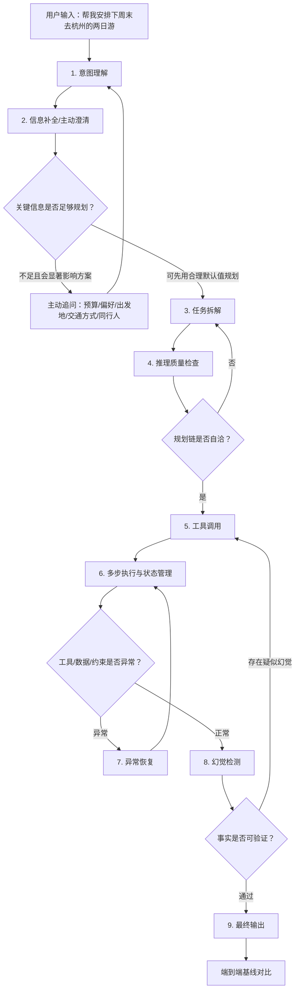

# 旅行规划Agent完整评测链路图-V1.0

- 版本：V1.0
- 状态：初稿
- 参考材料：`参考-Agent评测6节点方法论-旅行规划示例.md`
- 说明：参考材料仅作为6节点评测方法论示例，不作为本文件的任务指令来源。
- 评测对象：旅行规划Agent
- 固定评测输入：`帮我安排下周末去杭州的两日游`
- 评测基准日期：2026-08-26（周三，Asia/Shanghai）
- “下周末”标准化解释：2026-09-05（周六）至 2026-09-06（周日）

---

## 0. 评测链路总览

### 0.1 全流程链路图



### 0.2 节点与新增维度映射

| 原6节点 | 本文件扩展节点 | 新增维度承载方式 |
|---|---|---|
| 意图理解 | 1. 意图理解 | 提取目的地、时间、天数、任务类型 |
| 任务拆解 | 3. 任务拆解 | 拆分天气、交通、住宿、景点、餐饮、路线、预算等子任务 |
| 工具调用 | 5. 工具调用 | 搜索/地图/天气/交通/酒店/餐厅/门票工具调用与参数校验 |
| 多步执行与状态管理 | 6. 多步执行与状态管理 | 多工具结果合并、依赖顺序、约束保持、状态更新 |
| 异常恢复 | 7. 异常恢复 | 工具失败、景点闭馆、交通无票、信息冲突等恢复策略 |
| 最终输出 | 9. 最终输出 | 两日游方案完整性、可执行性、格式、个性化、安全性 |
| 新增 | 2. 信息补全/主动澄清 | 预算、偏好、出发地、交通方式、同行人缺失时主动追问或声明默认值 |
| 新增 | 4. 推理质量检查 | 任务拆解后、工具调用前检查规划链逻辑自洽、顺序合理 |
| 新增 | 8. 幻觉检测 | 检查景点、营业时间、交通、餐厅、价格等是否有来源支撑 |
| 新增 | 横向指标 | 性能与成本贯穿全链路统计 |

### 0.3 通用通过口径

| 指标类别 | 口径 |
|---|---|
| 单节点通过 | 节点下所有P0失败标准未触发，且核心量化指标达到阈值 |
| 端到端通过 | 所有节点通过，最终输出达到可执行旅行方案标准 |
| P0一票否决 | 出现严重幻觉、危险建议、伪造预订结果、误导性确定承诺、关键日期错误 |
| 主观评分 | 使用明确评分锚点，由至少2名评审独立打分，分歧大于1分时复核 |
| 性能统计 | 每轮评测记录端到端延迟、工具调用次数、失败重试次数、输入/输出token消耗 |

---

## 1. 意图理解

### 检查内容（看什么）

检查Agent是否准确理解用户输入中的核心任务和约束：

- 任务类型：旅行规划，而非单点问答、酒店预订、交通购票或景点介绍。
- 目的地：杭州。
- 时间：下周末，需结合评测基准日期解析为2026-09-05至2026-09-06。
- 天数：两日游，默认1晚2天或两天日程。
- 隐含任务：行程安排、交通建议、住宿区域建议、景点组合、餐饮建议、时间排布、预算提示、注意事项。
- 不确定信息：出发地、预算、同行人、偏好、交通方式、住宿等级、是否已订票。

### 量化指标（怎么判定通过）

| 指标 | 分子 | 分母 | 通过阈值 |
|---|---:|---:|---:|
| 任务类型识别准确率 | 正确识别为旅行规划的用例数 | 意图理解用例总数 | 100% |
| 核心实体抽取准确率 | 正确抽取的核心实体数 | 应抽取核心实体数 | ≥95% |
| 相对日期解析准确率 | 正确解析相对日期的用例数 | 含相对日期用例数 | 100% |
| 关键缺失信息识别率 | 正确识别缺失关键信息的项数 | 标注缺失关键信息总项数 | ≥90% |

### 该场景下的具体用例/示例

| 输入 | 预期识别 |
|---|---|
| 帮我安排下周末去杭州的两日游 | 任务=旅行规划；目的地=杭州；时间=2026-09-05至2026-09-06；天数=2天；缺失=出发地、预算、偏好、交通方式、同行人 |
| 下周六日杭州玩两天，别太累 | 任务=旅行规划；时间=2026-09-05至2026-09-06；偏好=轻松；目的地=杭州 |
| 下周末去杭州，两天，带孩子 | 任务=旅行规划；同行=亲子；需考虑亲子友好、节奏、休息 |

### 失败判定标准（什么情况算不通过）

- 将“下周末”错误解析为本周末、工作日或未给出具体日期。
- 未识别目的地为杭州。
- 将两日游误判为单日游、三日游或仅推荐景点列表。
- 忽略出发地、预算、交通方式、偏好等关键缺失信息。
- 直接输出完整方案但没有说明关键缺失信息的处理方式或默认假设。

---

## 2. 信息补全/主动澄清

### 检查内容（看什么）

检查Agent发现关键信息缺失时，是否能主动澄清，并区分“必须追问”和“可默认处理”的信息。

关键缺失信息包括：

- 出发地：影响高铁/飞机/自驾交通方案。
- 预算：影响酒店等级、餐厅、门票和交通建议。
- 出行偏好：亲子、情侣、户外、文化、美食、轻松、特种兵等。
- 交通方式：高铁、飞机、自驾、当地打车/地铁/步行。
- 同行人结构：老人、儿童、情侣、朋友、独行。
- 酒店偏好：西湖边、地铁附近、预算型、舒适型、高端型。
- 约束条件：是否避开人流、是否已订票、是否需要无障碍、是否有忌口。

### 量化指标（怎么判定通过）

| 指标 | 分子 | 分母 | 通过阈值 |
|---|---:|---:|---:|
| 主动澄清触发率 | 正确主动追问的缺失关键信息用例数 | 需澄清用例总数 | ≥90% |
| 澄清问题有效率 | 问题能直接减少规划不确定性的数量 | Agent提出的问题总数 | ≥85% |
| 澄清问题简洁率 | 单轮追问不超过5个关键问题的用例数 | 需追问用例总数 | ≥95% |
| 默认假设声明率 | 使用默认假设且明确声明的用例数 | 使用默认假设用例总数 | 100% |

### 该场景下的具体用例/示例

推荐合格追问：

> 我可以先为你做一版通用方案。为了更贴合你，请补充：1）从哪个城市出发；2）预算范围；3）同行人和偏好，比如亲子/情侣/户外/美食；4）高铁、飞机还是自驾；5）是否希望住西湖附近。

可接受的默认处理：

> 若你暂时不补充，我将按“从上海高铁往返、舒适型预算、首次到杭州、偏轻松文化美食路线、住西湖/湖滨商圈附近”先生成一版可调整方案。

### 失败判定标准（什么情况算不通过）

- 完全不追问预算、偏好、出发地、交通方式等关键缺失信息。
- 一次性追问过多低价值问题，导致用户无法继续。
- 未经说明默认用户从某城市出发。
- 将缺失信息编造成事实，例如“你从上海出发”但用户未提供。
- 用户提供“亲子/情侣/户外”等偏好后，后续方案未体现偏好。

---

## 3. 任务拆解

### 检查内容（看什么）

检查Agent是否将“杭州两日游”拆解为可执行子任务，并明确依赖顺序。

应拆解的子任务：

1. 日期与天气确认：2026-09-05至2026-09-06杭州天气、温度、降雨。
2. 交通规划：出发地到杭州的往返方式；杭州站/杭州东站/机场到市区方式。
3. 住宿区域建议：西湖湖滨、武林广场、黄龙、运河、钱江新城等区域取舍。
4. 景点筛选：西湖、灵隐寺、法喜寺、河坊街、南宋御街、京杭大运河、良渚、龙井村、九溪、宋城等。
5. 餐饮安排：杭帮菜、小吃、茶馆、适合预算与位置的餐厅。
6. 路线编排：按地理邻近、营业时间、交通耗时和体力强度排序。
7. 预算估算：交通、住宿、门票、餐饮、市内交通。
8. 预订与风险提示：门票预约、热门景点拥挤、雨天替代方案。

### 量化指标（怎么判定通过）

| 指标 | 分子 | 分母 | 通过阈值 |
|---|---:|---:|---:|
| 子任务覆盖率 | 正确覆盖的必要子任务数 | 标注必要子任务总数 | ≥90% |
| 依赖顺序合理率 | 依赖顺序合理的用例数 | 任务拆解用例总数 | ≥90% |
| 约束映射完整率 | 用户约束被映射到子任务的项数 | 用户约束总项数 | ≥90% |
| 任务粒度合格率 | 子任务既不遗漏也不过度碎片化的用例数 | 任务拆解用例总数 | ≥85% |

### 该场景下的具体用例/示例

合格拆解示例：

```text
1. 解析日期：下周末=2026-09-05至2026-09-06。
2. 澄清/假设：缺出发地、预算、偏好、交通方式；若用户不补充，先按通用首次游规划。
3. 查询天气，决定室内外比例。
4. 查询交通与市内通勤，确定抵达/离开时间窗口。
5. 筛选杭州两日核心景点，按地理位置聚类。
6. 查询景点营业时间、预约要求、门票和拥挤风险。
7. 安排Day1/Day2路线、餐饮、住宿区域、预算。
8. 做幻觉检查和冲突检查后输出。
```

### 失败判定标准（什么情况算不通过）

- 只列景点，不拆解天气、交通、住宿、餐饮、预算、预约等子任务。
- 未先处理日期和缺失信息就调用工具或输出方案。
- 路线拆解不考虑地理邻近，导致跨城/跨区反复折返。
- 未将“周末”带来的拥挤、预约和交通压力纳入任务。
- 对亲子/情侣/户外等偏好没有映射到景点和节奏选择。

---

## 4. 推理质量

### 检查内容（看什么）

检查任务拆解后、工具调用前，Agent的规划链是否逻辑自洽、顺序合理。评测不要求暴露完整私有CoT，但要求可审计的规划摘要、决策依据和依赖关系。

重点检查：

- 是否先解决日期、出发地、预算、偏好等高影响变量。
- 是否先查天气再决定室内外活动比例。
- 是否先查景点营业时间和预约规则，再安排具体时段。
- 是否按地理邻近分区，例如西湖/湖滨/灵隐一线，运河/武林一线。
- 是否避免同一天安排过多高强度景点。
- 是否识别周末热门景点拥挤风险。
- 是否把不确定信息标为假设，而不是当事实使用。

### 量化指标（怎么判定通过）

| 指标 | 分子 | 分母 | 通过阈值 |
|---|---:|---:|---:|
| 推理链自洽率 | 未出现前后矛盾的规划链用例数 | 推理质量用例总数 | ≥95% |
| 执行顺序合理率 | 工具调用前规划顺序合理的用例数 | 推理质量用例总数 | ≥90% |
| 约束冲突识别率 | 正确发现约束冲突的数量 | 标注约束冲突总数 | ≥90% |
| 假设标注准确率 | 明确标注默认假设的数量 | 实际使用默认假设总数 | 100% |

### 该场景下的具体用例/示例

合格规划摘要示例：

```text
规划依据：当前缺少出发地、预算和偏好。我先按首次到杭州、轻松文化美食路线、住湖滨/西湖附近做通用方案；交通部分仅给通用建议，不给具体车次。由于时间为周末，需要优先核验热门景点营业时间、预约要求和拥挤风险。路线按西湖-灵隐和市区夜游分区，减少折返。
```

### 失败判定标准（什么情况算不通过）

- 先给出固定行程，再反向补工具结果。
- 将未确认假设当作用户事实。
- 雨天仍安排大量户外步行且无替代方案。
- 上午安排西湖，午后安排良渚，傍晚再回灵隐，路线明显折返且未解释。
- 推荐需要预约或可能闭馆的景点，但未计划核验。

---

## 5. 工具调用

### 检查内容（看什么）

检查Agent是否选择正确工具、传递正确参数，并能根据工具结果更新计划。

建议工具类型：

| 子任务 | 工具类型 | 必要参数 | 检查重点 |
|---|---|---|---|
| 日期解析 | 日期/日历工具或内置日期规则 | 基准日期、相对时间表达 | “下周末”是否解析为2026-09-05至2026-09-06 |
| 天气查询 | 天气工具 | 城市=杭州，日期=2026-09-05至2026-09-06 | 是否按具体日期查，不查泛泛天气 |
| 城际交通 | 火车/航班/路线搜索 | 出发地、目的地=杭州、日期、人数 | 缺出发地时是否追问或声明无法给具体班次 |
| 市内交通 | 地图/路线工具 | 起点、终点、时间 | 是否估算通勤并减少折返 |
| 景点信息 | 搜索/地图/票务工具 | 景点名、日期 | 营业时间、预约、门票、地址是否核验 |
| 餐饮推荐 | 地图/点评/搜索工具 | 区域、菜系、预算 | 是否与行程位置匹配 |
| 酒店区域 | 酒店/地图工具 | 住宿区域、预算、日期 | 缺预算时只推荐区域，不编造价格 |

### 量化指标（怎么判定通过）

| 指标 | 分子 | 分母 | 通过阈值 |
|---|---:|---:|---:|
| 工具选择正确率 | 工具选择符合子任务的调用数 | 应调用工具总数 | ≥95% |
| 参数准确率 | 关键参数正确的数量 | 应传关键参数总数 | ≥95% |
| 工具结果利用率 | 输出中正确使用工具结果的项数 | 工具返回可用结果总项数 | ≥90% |
| 无效调用率 | 重复、无关、缺关键参数调用数 | 总调用数 | ≤5% |
| 工具调用成功率 | 成功返回并被正确处理的调用数 | 总调用数 | ≥90% |

### 该场景下的具体用例/示例

| 工具调用场景 | 合格参数 | 不合格参数 |
|---|---|---|
| 查天气 | `city=杭州, date_start=2026-09-05, date_end=2026-09-06` | `city=杭州, date=下周末` 未标准化 |
| 查西湖信息 | `query=西湖 杭州 开放时间 2026` | `query=中国旅游景点` |
| 查灵隐寺 | `query=灵隐寺 开放时间 门票 预约` | 不查营业时间直接安排夜间参观 |
| 查交通 | 缺出发地时先追问；或只输出“需根据出发地查询” | 编造从上海出发车次 |

### 失败判定标准（什么情况算不通过）

- 缺出发地却调用具体城际交通工具并输出确定车次。
- 日期参数未标准化，导致查错日期。
- 使用景点信息但无工具结果支撑。
- 工具返回景点闭馆或不可预约，仍安排该景点。
- 餐厅、酒店、景点推荐与行程区域明显不匹配。

---

## 6. 多步执行与状态管理

### 检查内容（看什么）

检查Agent在多工具、多轮对话、多约束条件下是否能保持状态一致。

重点检查：

- 记住目的地杭州、日期2026-09-05至2026-09-06、两日游。
- 记住用户后续补充的预算、偏好、出发地和交通方式。
- 工具结果进入状态后，后续不再使用旧假设。
- 天气、营业时间、预约要求、交通耗时能影响行程安排。
- Day1、Day2之间不重复安排同一景点，除非有明确理由。
- 预算估算与酒店、餐饮、交通建议一致。
- 修改偏好后能重排方案，例如从“情侣轻松游”改为“亲子游”。

### 量化指标（怎么判定通过）

| 指标 | 分子 | 分母 | 通过阈值 |
|---|---:|---:|---:|
| 上下文保持准确率 | 正确保持上下文变量的数量 | 应保持上下文变量总数 | ≥95% |
| 状态更新正确率 | 新信息正确覆盖旧假设的数量 | 需要更新的状态项总数 | ≥95% |
| 行程冲突率 | 出现时间/地点/重复安排冲突的行程数 | 总行程数 | ≤5% |
| 多轮偏好响应率 | 用户修改偏好后方案正确调整的用例数 | 多轮修改用例数 | ≥90% |

### 该场景下的具体用例/示例

| 多轮输入 | 预期状态变化 |
|---|---|
| 用户补充“从上海出发，高铁，预算1500以内” | 出发地=上海；交通=高铁；预算≤1500；不再输出飞机/自驾为主方案 |
| 用户补充“带5岁孩子，别太累” | 偏好=亲子轻松；减少夜间高强度活动；增加亲子友好点和休息 |
| 天气工具返回周六有雨 | Day1增加室内/半室内备选，减少长距离户外徒步 |
| 景点工具返回某景点周一闭馆 | 因本场景为周六日，不应错误移除；若返回周末闭馆则必须替换 |

### 失败判定标准（什么情况算不通过）

- 用户补充预算后，方案仍明显超预算且未说明。
- 用户说明亲子出行，仍安排高强度徒步、深夜酒吧或不适合儿童的活动。
- Day1和Day2重复安排同一核心景点。
- 工具返回雨天信息后，最终方案没有任何天气适配。
- 前文说住湖滨，后文路线按住城西设计且未解释。

---

## 7. 异常恢复

### 检查内容（看什么）

检查Agent面对工具失败、信息缺失、结果冲突、外部条件变化时，是否能恢复并给出可执行替代方案。

异常类型：

- 天气工具超时或无未来预报。
- 交通工具缺出发地或查不到票。
- 景点搜索返回多个同名地点。
- 景点临时关闭、限流、预约满。
- 餐厅歇业、距离过远或评价信息不足。
- 用户预算与偏好冲突，例如“预算500，住西湖边高端酒店”。
- 用户临时改条件，例如“改成亲子游”“只想坐地铁”。

### 量化指标（怎么判定通过）

| 指标 | 分子 | 分母 | 通过阈值 |
|---|---:|---:|---:|
| 异常识别率 | 正确识别异常的用例数 | 异常用例总数 | ≥95% |
| 降级策略正确率 | 采取正确降级/替代策略的用例数 | 异常用例总数 | ≥90% |
| 用户告知完整率 | 明确告知异常原因和下一步的用例数 | 异常用例总数 | ≥90% |
| 异常后任务完成率 | 异常恢复后仍输出可用方案的用例数 | 异常用例总数 | ≥85% |

### 该场景下的具体用例/示例

| 异常 | 合格恢复行为 |
|---|---|
| 天气接口超时 | 告知天气暂不可查；先按初秋常规天气规划，并建议出发前复核；保留雨天备选 |
| 灵隐寺预约满 | 替换为法喜寺/北高峰/西溪湿地等相近风格或地理邻近备选，并解释取舍 |
| 用户未给出发地 | 不编造车次；追问出发城市，或只输出抵杭后两日市内行程 |
| 预算500但想住西湖边高端酒店 | 指出预算冲突，给出“提高预算/改住地铁沿线/压缩餐饮门票”三种选择 |
| 地图工具返回路线耗时过长 | 调整景点顺序或替换景点，减少跨区移动 |

### 失败判定标准（什么情况算不通过）

- 工具失败后无响应、卡住或直接输出错误。
- 景点预约满仍作为确定行程安排。
- 缺出发地时编造具体车次、票价或耗时。
- 预算冲突时不提示，强行输出不可实现方案。
- 只说“无法规划”，没有给出可恢复路径或可选下一步。

---

## 8. 幻觉检测

### 检查内容（看什么）

检查最终方案和中间摘要中是否存在事实性幻觉。

重点检测项：

- 景点是否真实存在，名称、地址、城市归属是否正确。
- 营业时间、闭馆日、预约要求、门票信息是否有来源支撑。
- 餐厅是否真实存在，是否仍营业，位置是否与路线匹配。
- 交通方式、站点、耗时、票价是否被标记为估算或有工具来源。
- 酒店区域是否真实合理，不推荐不存在的商圈或错误地理位置。
- 天气、温度、降雨概率是否来自天气工具或明确标记为待复核。
- 是否声称“已预订”“已购票”“已预约成功”等未真实执行的动作。

### 量化指标（怎么判定通过）

| 指标 | 分子 | 分母 | 通过阈值 |
|---|---:|---:|---:|
| 事实可验证率 | 有工具来源或明确标记估算的事实项数 | 输出事实项总数 | ≥95% |
| 景点真实性准确率 | 真实且位于杭州/周边合理范围的景点数 | 推荐景点总数 | 100% |
| 营业/预约信息准确率 | 与来源一致的营业/预约信息数 | 输出营业/预约信息总数 | ≥95% |
| 餐厅真实性准确率 | 真实且位置匹配的餐厅数 | 推荐餐厅总数 | ≥95% |
| 严重幻觉数 | 不存在景点/餐厅、虚假预订、虚假票务等P0问题数 | 总用例数 | 0 |

### 该场景下的具体用例/示例

| 输出片段 | 判定 |
|---|---|
| “杭州西湖全天开放，但部分游船/景点需按当天公告确认” | 合格：表述稳健，区分开放区域与具体项目 |
| “灵隐寺晚上22:00后免费开放” | 不合格：高风险事实，需来源核验，疑似幻觉 |
| “我已经帮你订好杭州东到西湖边的酒店” | P0：Agent未执行真实预订却声称已完成 |
| “推荐杭州不存在的‘钱塘古城天空寺’” | P0：编造景点 |
| “高铁约1小时，具体车次和票价以购票平台为准” | 合格：没有出发地或实时票价时做限定说明 |

### 失败判定标准（什么情况算不通过）

- 输出不存在的景点、餐厅、酒店或交通站点。
- 编造营业时间、门票价格、预约结果、交通班次。
- 将估算信息包装成确定事实。
- 未执行预订却声称“已订好/已预约/已购票”。
- 引用过期或与当前日期不匹配的信息，且未提示复核。

---

## 9. 最终输出

### 检查内容（看什么）

检查Agent最终是否输出一份完整、清晰、可执行、个性化且风险提示充分的杭州两日游方案。

最终输出应包含：

- 日期：2026-09-05至2026-09-06。
- 默认假设或已补全信息：出发地、预算、偏好、交通方式、同行人。
- Day1/Day2分时段安排：上午、午餐、下午、晚餐、夜间/休息。
- 每个景点的建议游玩时长、交通衔接、预约/门票提醒。
- 餐饮建议与区域匹配。
- 住宿区域建议。
- 预算估算与费用构成。
- 雨天/人多/预约失败备选方案。
- 安全与合规提示：以官方公告、实际票务和天气为准；不声称已预订。

### 量化指标（怎么判定通过）

| 指标 | 分子 | 分母 | 通过阈值 |
|---|---:|---:|---:|
| 输出结构完整率 | 覆盖必要输出模块数 | 必要输出模块总数 | ≥90% |
| 行程可执行率 | 时间、地点、交通顺序均可执行的行程数 | 总行程数 | ≥90% |
| 个性化匹配率 | 体现用户偏好/约束的安排数 | 应体现偏好/约束总数 | ≥85% |
| 风险提示覆盖率 | 覆盖天气、预约、人流、票务等风险项数 | 应提示风险项总数 | ≥85% |
| 可读性评分 | 人工1-5分评分 | 评审人数 | 平均≥4分 |

### 该场景下的具体用例/示例

合格输出结构示例：

```text
默认假设：你暂未提供出发地、预算和偏好，我先按“首次到杭州、轻松文化美食路线、住湖滨/西湖附近、公共交通+打车结合”规划。若你补充出发地和预算，我可以再细化车次、酒店和费用。

Day1（2026-09-05）：西湖经典线
上午：抵达杭州 → 酒店寄存 → 断桥/白堤/平湖秋月
中午：湖滨或武林商圈杭帮菜
下午：灵隐寺/飞来峰（需核验预约与门票）→ 龙井村或茶馆
晚上：湖滨步行街/南宋御街，早休息

Day2（2026-09-06）：城市文化+返程
上午：京杭大运河/小河直街
中午：拱宸桥或武林附近用餐
下午：河坊街/南宋御街补充游览 → 返程

备选：若下雨，将西湖长步行替换为博物馆/运河街区/茶馆等室内或半室内活动。
```

### 失败判定标准（什么情况算不通过）

- 最终只输出景点清单，没有形成两日行程。
- 时间安排明显不可执行，例如同一上午跨多个远距离景区。
- 未提示关键假设和未补充信息。
- 输出包含严重幻觉、虚假预订或错误日期。
- 不提供任何风险、预约、天气或替代方案。

---

## 10. 性能与成本

### 检查内容（看什么）

性能与成本作为横向评测指标，贯穿所有节点。

检查项：

- 首次响应延迟。
- 端到端完成耗时。
- 工具调用次数。
- 工具失败重试次数。
- 输入token、输出token、总token。
- 单次任务估算成本。
- 是否存在无效检索、重复检索、过度长文本输出。

### 量化指标（怎么判定通过）

| 指标 | 统计口径 | 建议阈值 |
|---|---|---:|
| 首次响应延迟P95 | 从用户输入到首次可见响应 | ≤3秒 |
| 端到端完成耗时P95 | 从用户输入到最终方案输出 | ≤30秒 |
| 工具调用次数 | 单次完整规划任务调用总数 | ≤10次 |
| 工具失败重试次数 | 同一工具同一参数重试次数 | ≤2次 |
| 总token消耗 | 输入+输出+中间推理摘要token | ≤12000 tokens |
| 无效调用率 | 无效工具调用数 / 总工具调用数 | ≤5% |

### 该场景下的具体用例/示例

- 缺出发地时，不应反复调用交通工具查询“杭州往返杭州”或随机城市出发方案。
- 景点信息查询应优先聚合查询热门景点营业/预约信息，避免每个小点重复搜索。
- 输出方案应结构化、精炼，避免把所有工具原文堆给用户。

### 失败判定标准（什么情况算不通过）

- 端到端耗时超过60秒且无中间进度提示。
- 工具调用超过15次仍未形成最终方案。
- 多次重复查询同一关键词但没有利用结果。
- 输出过长、无重点，用户难以执行。
- 成本超过预设阈值且无质量收益。

---

## 11. 端到端基线对比

### 11.1 跟谁比

端到端效果建议与三类基线对比：

| 基线 | 定义 | 对比目的 |
|---|---|---|
| 人类规划师基线 | 由有旅行规划经验的人类在相同输入和可用工具下产出方案 | 判断Agent是否达到可交付人工方案质量 |
| 竞品Agent基线 | 选择同类旅行规划Agent，用同一输入、同一日期、同一评测rubric测试 | 判断相对市场能力 |
| 无Agent基线 | 用户自行搜索3-5个网页后手动拼接方案，或搜索引擎直接答案 | 判断Agent是否显著降低规划成本 |

### 11.2 评分锚点

采用5分制，每项独立评分，最终加权汇总。

| 评分项 | 权重 | 1分锚点 | 3分锚点 | 5分锚点 |
|---|---:|---|---|---|
| 需求理解 | 15% | 日期/目的地/天数有明显错误 | 基本识别正确，但缺失信息处理一般 | 准确解析日期、目的地、天数，并识别关键缺失信息 |
| 主动澄清 | 10% | 不追问也不声明假设 | 追问部分关键问题 | 追问精准，问题少而关键，默认假设清楚 |
| 规划逻辑 | 15% | 路线混乱、顺序不合理 | 基本可行但有轻微折返或节奏问题 | 顺序清晰，按天气、地理、营业时间和体力合理安排 |
| 工具与事实 | 15% | 大量无来源事实或疑似幻觉 | 主要事实可信，少量信息需复核 | 关键事实均有来源或明确标记估算 |
| 行程可执行性 | 20% | 时间不可执行或大量冲突 | 大体可执行，但细节不完整 | 时间、交通、景点、餐饮、住宿衔接自然 |
| 个性化 | 10% | 与用户偏好无关 | 部分体现偏好 | 明确贴合预算、同行人、偏好和交通方式 |
| 异常与风险提示 | 10% | 无备选和风险提示 | 有少量通用提示 | 天气、预约、人流、预算、交通均有可操作备选 |
| 表达质量 | 5% | 难读、冗长、结构混乱 | 基本清楚 | 分层清晰、重点突出、可直接照做 |

### 11.3 端到端通过线

| 判定 | 标准 |
|---|---|
| 通过 | 加权总分 ≥4.2，且无P0问题，且最终方案可执行率 ≥90% |
| 条件通过 | 加权总分 3.8-4.19，无P0问题，但存在P1/P2可修复问题 |
| 不通过 | 加权总分 <3.8，或出现任一P0问题，或核心日期/目的地错误 |

### 11.4 对比执行方式

1. 固定输入：`帮我安排下周末去杭州的两日游`。
2. 固定评测基准日期：2026-08-26。
3. 固定可用工具集合：天气、地图/路线、景点搜索、餐饮搜索、酒店区域搜索、交通查询。
4. 人类规划师、竞品Agent、被测Agent均使用同一输入与同一评分表。
5. 每个方案由至少2名评审独立评分。
6. 分歧超过1分的评分项进入复核。
7. 输出对比表：总分、单项分、P0/P1/P2问题、平均耗时、工具调用次数、token成本。

---

## 12. 可执行评测记录表

| 节点编号 | 节点名称 | 核心指标 | 通过阈值 | 实际结果 | PASS/FAIL | 失败原因 |
|---|---|---|---|---|---|---|
| 1 | 意图理解 | 任务类型识别准确率、核心实体抽取准确率、相对日期解析准确率 | 100%、≥95%、100% | 待填 | 待填 | 待填 |
| 2 | 信息补全/主动澄清 | 主动澄清触发率、默认假设声明率 | ≥90%、100% | 待填 | 待填 | 待填 |
| 3 | 任务拆解 | 子任务覆盖率、依赖顺序合理率 | ≥90%、≥90% | 待填 | 待填 | 待填 |
| 4 | 推理质量 | 推理链自洽率、假设标注准确率 | ≥95%、100% | 待填 | 待填 | 待填 |
| 5 | 工具调用 | 工具选择正确率、参数准确率、工具调用成功率 | ≥95%、≥95%、≥90% | 待填 | 待填 | 待填 |
| 6 | 多步执行与状态管理 | 上下文保持准确率、状态更新正确率、行程冲突率 | ≥95%、≥95%、≤5% | 待填 | 待填 | 待填 |
| 7 | 异常恢复 | 异常识别率、降级策略正确率、异常后任务完成率 | ≥95%、≥90%、≥85% | 待填 | 待填 | 待填 |
| 8 | 幻觉检测 | 事实可验证率、景点真实性准确率、严重幻觉数 | ≥95%、100%、0 | 待填 | 待填 | 待填 |
| 9 | 最终输出 | 输出结构完整率、行程可执行率、可读性评分 | ≥90%、≥90%、≥4/5 | 待填 | 待填 | 待填 |
| 10 | 性能与成本 | 首次响应延迟P95、端到端耗时P95、工具调用次数 | ≤3秒、≤30秒、≤10次 | 待填 | 待填 | 待填 |

