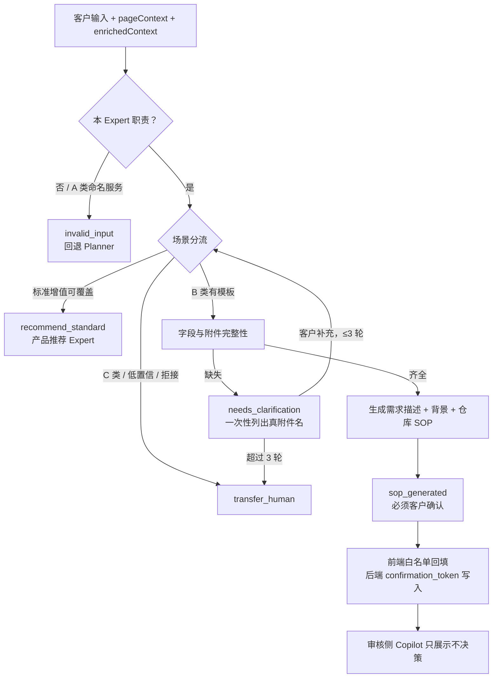
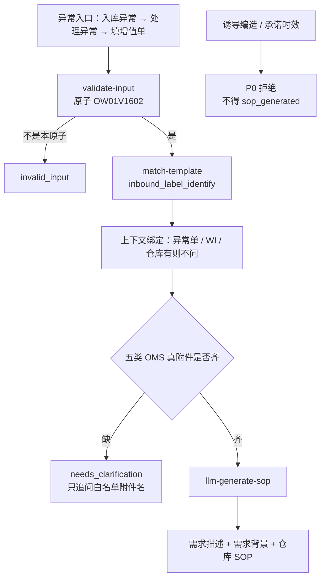
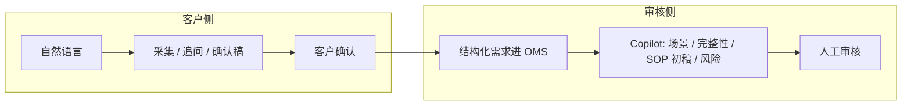

# 非标增值生成 Agent — 内部立项沉淀（两阶段合一）

- 用途：个人项目沉淀 / 内部立项备忘（不对路演扩写）
- 日期：2026-08-28
- 产品壳：`agent-inventory-assist`（唯一工作副本）
- 工程主线：`experts/value-add/nonstandard-sop-guide`（当前仅 F-001 试点）
- 权威源：BRD / PRD / `BUSINESS-REVIEW.md` 仍是原位文件；本文只组装与解释，不另起数字或规则

阅读约定：

- 第一阶段回答「为什么自建、为什么是这个 Agent」。
- 第二阶段回答「现在怎么落地、用什么证据证明」。
- 两阶段不要混：阶段一不写实现细节；阶段二不重讲商业故事；**不把 F-001 试点交差包装成全量已交付**。

---

## 0. 一页结论

这个 Agent 不是聊天总结器，而是非标增值需求采集与审核 Copilot：客户提交时把意图问完整，审核时把自然语言转成可复核的场景和 SOP 初稿。价值在源头结构化，不在自动审单。

| 层 | 当前事实 | 立项时怎么说 |
|---|---|---|
| 商业故事 | BRD 已有 15 周基线：周均约 264 单，追问约 40 人时/周，SOP 约 35 人时/周，首审退回 15.4% | 全量愿景目标合计约 **0.9 FTE**；这是上线后假设，不是现在的验收条件 |
| 工程现实 | Expert 已收窄到 F-001（入库尺重/标签辨识后换标上架），旧 38 场景评测基线已废弃 | V1 先跑通这一条再铺开 |
| 评测现实 | 全量评测方案有文档、未冻结、未出结果；试点有 4 条金标 + 业务确认包 | **现在算数的评测标准是 `BUSINESS-REVIEW.md`** |
| 运行时 | PRD 已按 Coze + Planner + Expert 设计；客户入口挂现有智能客服 | 不换 OpenClaw 做生产运行时 |

硬性边界（任何阶段都不变）：

- Agent 禁止输出最终审核结论，禁止无确认写入 OMS。
- 禁止编造单号 / SKU / 数量 / 费用 / 时效。
- 客户侧不可见内部审核规则、完整仓库 SOP、其他客户案例。

---

# 第一阶段：为什么做

## 1. 目标客户

不写成「所有非标客户」。立项口径拆成三级：

| 层级 | 是谁 | V1 怎么对待 |
|---|---|---|
| 付费用户 | 要交非标增值单的外部客户 | 自然语言描述需求；确认前可改草稿；确认 ≠ 审核通过 |
| 作业用户 | 内部客服 / 审核 | 看结构化需求、完整性、SOP 初稿、风险标记；自己点通过/退回 |
| **当前真正服务的人** | 会走「入库异常 → 处理异常 → 填增值单」、且需求类似 F-001 换标上架的客户；以及要写这类 SOP 的审核员 | 先把这一类一次讲清楚 |

BRD 用户定义更宽（入库 / 库内 / 出库 / 拍照 / 包装 / 组合拆分）。那是产品愿景。立项时记住：**先打「需求描述不清晰」这条退回（占首审退回 37.1%）最集中的人群。**

非客户：仓库执行员、财务报价、平台合规。Agent 不为他们做决定。

---

## 2. 业务价值评估

数字全部来自 BRD V1.0（统计周期 2026-04-21～2026-08-01，15 周；口径 `vas_type = NON_STANDARD_VASC`）。本文不改基线。

### 2.1 问题有多大

| 指标 | 基线 |
|---|---:|
| 非标增值总单量 | 3,962 单 / 15 周 |
| 周均单量 | 约 264 单（波动 191–320） |
| 人工追问沟通 | 约 40 人小时/周 ≈ 9 分钟/单 |
| SOP 编写（含信息整理） | 约 8 分钟/单 ≈ 35 人小时/周 |
| 首审退回率（有明确审核结果） | **15.4%**（353 / 2,298） |

追问 40 人时/周是全渠道估算（群聊 + 系统留言 + 跨部门），群聊可追踪部分约 3–16 人时/周。立项时保留这个口径，同时标明「待业务体感确认」（BRD §8）。

### 2.2 钱从哪省

| 价值来源 | 当前成本 | 目标 | 周节省 |
|---|---|---|---:|
| 人工追问沟通 | 40 人时/周 | 降 ≥50% | ≥20 人时 |
| SOP 编写 | 35 人时/周 | 降 ≥40% | ≥14 人时 |
| 首审退回重处理 | ~23.5 单/周 × 15–30 分钟 | 降 ≥30% | ~2–3.5 人时 |
| **合计** | | | **≥36 人时/周 ≈ 0.9 FTE** |

未量化但真实：仓库因需求不清的返工、模板复用后的长期效率、客户少被追问。

### 2.3 价值逻辑（比数字更重要）

```
客户不会结构化表达
  → 缺字段 / 缺附件 / 缺操作边界
    → 审核靠经验反推和追问
      → 周期变长、退回变多、仓库返工上升
```

所以 ROI 来自「提交前问完整 + 审核侧少从零写 SOP」，**不是**来自自动通过审核。自动审单既是 P0 风险，也不是本项目的价值来源。

### 2.4 立项时不要承诺错的东西

- 0.9 FTE 是全量上线后的业务假设，灰度 ≥2 周才能开始观测。
- OMS「提交审核 → 实际审核」P75 = 28.3 小时，含排队和时区，**不能**当成 Agent 响应时间，也不能当成本期主 KPI。
- F-001 试点跑通，只证明「这一条场景的采集/生成行为正确」，不证明 0.9 FTE 已实现。

---

## 3. 竞品分析：为什么不外部采购

可采购的是对话壳。买不到、也接不上的是三样：**万邑通场景规则、OMS 事实、客户权限边界。**

| 类型 | 典型对象 | 能买到什么 | 为什么不够 |
|---|---|---|---|
| 通用客服机器人 | 官网/企微机器人、通用 LLM 客服 | 多轮对话、FAQ | 不会做 A/B/C 分流、标准/非标分流、OMS 附件白名单、confirmation_token |
| 通用 Agent 平台模板 | Coze / Dify 市场里的 SOP/客服模板 | 画布、工具调用、提示词 | 没有 179 场景库、仓库能力、内外知识隔离、页面白名单回填 |
| 国外 3PL / OMS 增值插件 | 仓储 SaaS 的 VAS 模块 | 标准增值下单 | 接不进现有 Planner、异常入口、TOM 审核台、客户数据隔离 |
| 裸 LLM / 通用 Copilot | ChatGPT 类、无业务工具的 Agent | Demo 很快 | 会编造单号、越权、承诺时效；过不了 P0 和权限审计 |

自建的最小不可替代面：

1. 场景分类（A 类命名服务拦截 / B 类模板 / C 类转人工 / 标准增值回流）。
2. 字段与附件规则跟 OMS 真字段走，禁止编造 fieldKey。
3. 客户侧与审核侧知识隔离；写接口必须带人工确认凭证。
4. 挂在已有智能客服 Expert 编排器上，而不是再做一个入口。

外采若只买「对话层」，仍然要自建上面四层，等于多一层翻译。立项结论：**对话运行时可以借平台（Coze），业务内核必须自建。**

---

## 4. 客户需求有哪些

只收 V1 能验收的需求。括号里是成功证据——以系统状态和人工确认为准，不以模型口播为准。

| ID | 需求 | 成功证据 |
|---|---|---|
| T01 | 客户用自然语言提交非标需求，被问完整 | 抽到关键字段；一次性列出缺失附件；生成确认稿 |
| T02 | 客户确认后才写入 | 有 `confirmation_token`；保留原始描述 / AI 稿 / 客户终稿 |
| T03 | 审核员能看到辅助信息 | 场景 + 置信度、完整性、SOP 初稿、风险标记；**不自动流转** |
| T04 | 高风险 / 低置信度必须转人工 | 明确提示并停在人工，不生成「可执行」假结论 |
| T05 | 标准增值能覆盖时要分流 | 走 `recommend_standard`，不硬生成非标 SOP |

当前试点（F-001）先兑现 T01 的最小闭环：识别换标上架 → 上下文免追问 → 按真实附件判齐/缺 → 齐了出「需求描述 + 背景」和「仓库 SOP」。T02 页面回填与真实写入、T03 Copilot **本轮刻意不做**（见 `BUSINESS-REVIEW` 评测范围）。

不收进口径（BRD/PRD 已写，立项保持）：

- 不自动通过 / 驳回 / 下发仓库。
- 不承诺费用、时效、仓库一定可执行。
- 不替代 OMS / 审批 / WMS。
- 不做「AI 预审会不会通过」（完整性 ≠ 可行性）。

---

## 5. 客户当前痛点有哪些

根因在客户侧，果在审核侧。不要把审核忙写成独立产品。

**客户侧（因）**

- 只会说目标：「换标」「拍照」「组合」，不会按仓库执行结构表达。
- 系统不引导补：操作对象、SKU、数量、标签/包材、处理路径、验收标准、真实附件。
- 异常入口其实已有单号/仓库，却仍可能被重复追问。

**审核 / 客服侧（果）**

- 反复追问、在聊天/单据/附件之间拼接事实。
- 人工识别场景、判断能不能做、从零写 SOP。
- 信息缺失导致退回、误审、仓库返工。

**退回结构（解释优先级，不是四条都本期做完）**

| 退回原因 | 占退回 | Agent 应对 | V1 / 试点 |
|---|---:|---|---|
| 需求描述不清晰 | 37.1% | 结构化 + 完整性 + 一次性追问 | **P0，F-001 先打** |
| 仓库暂时无法提供该服务 | 31.7% | 可执行性提示 / 转人工 | 全量愿景；试点只做风险提示，不做预审 |
| 标准增值已支持 | 20.4% | `recommend_standard` | PRD 有设计；试点不含 |
| 非标场景不符 | 10.8% | 准入 / 拒接 / 转人工 | PRD 有设计；试点不含 |

---

## 6. 产品核心解决方案：AI 工作流

### 6.1 产品一句话

客户侧把需求问完整并生成确认稿；审核侧把确认稿变成可微调的 SOP 初稿。中间用五条路由，不用「再聊两句看看」。

| `outputPath` | 含义 |
|---|---|
| `sop_generated` | B 类 + 字段/附件齐 → 出确认稿 + SOP |
| `needs_clarification` | 缺必填 → 一次性追问，最多 3 轮 |
| `transfer_human` | C 类 / 低置信度 / 高风险 |
| `invalid_input` | 非本 Expert（含 A 类命名服务） |
| `recommend_standard` | 标准增值可覆盖，交回产品推荐 Expert |

### 6.2 立项主图（AI 决策段）

只画 Agent 真正做判断的链路，不把整条 OMS 画成「AI 工作流」。



### 6.3 当前试点实线图（F-001，立项时以这张为准）

工程已收窄。对外讲愿景用 6.2，对自己排期用 6.3。



白名单（禁止编造 fieldKey）：操作说明附件、商品和标签的对应关系、包裹和标签的对应关系、视频拍摄 SOP（中文+英文）、标签文件。哪几项必填须业务勾选，产品/技术不擅自定死。

### 6.4 客户侧 vs 审核侧



试点评测范围 **不含** 右侧 Copilot 与真实写入。阶段一可以画完整图，阶段二验收不能假装右侧已测。

---

## 7. 系统架构初步考量

### 7.1 推荐：继续 Coze + 现有 Expert 编排器

```text
客户（OMS 增值表单 + AI 侧栏）
  → Planner（意图、调度、多轮、确认引导）
    → nonstandard-sop-guide Expert
      → validate → match → completeness → llm-sop → format
    → 必要时 product-recommendation Expert
  → 前端只执行白名单 uiActionProposal
  → 内部代理网关（密钥、客户权限；Coze 不持业务钥）
  → OMS 只读 Skill + 带 confirmation_token 的受控写
```

理由：护城河在场景 KB、OMS 真字段、页面白名单、确认令牌，不在再造一个 Agent 运行时。客户入口、灰度开关、测试/生产空间、回滚已经按这条链设计。

### 7.2 方案对比

| 方案 | 适合 | 对本项目 | 结论 |
|---|---|---|---|
| **Coze + Planner + Expert** | 已有智能客服主链路 | 平台绑定，但接入成本最低 | **生产默认** |
| OpenClaw 自托管 | 多 Agent、本地工具循环、离线批跑 | 要重做编排、鉴权、灰度、Trace，和客服主链路断开 | **不做客户侧生产运行时**；内部批跑/评测执行器可后评估 |
| 纯自研编排 | 完全掌控 DAG | 重复造 Planner | V1 不划算 |
| 通用 LLM 裸聊 | Demo | 过不了 P0 | 否决 |

OpenClaw 只在仓内其它实验材料里出现，与本产品无线上关系。立项时把它写成「已知备选、本期不选」，避免以后被问「为什么不换」时从零讲。

### 7.3 现在不必做的架构

- 不为 179 场景先上独立微服务。
- 不把审核 Copilot 先拆成第二个生产 Agent（PRD 有 Schema，试点未做）。
- 不把 OpenClaw 和 Coze 做成双运行时并行。

---

# 第二阶段：怎么做、怎么证明

## 8. 产品详细解决方案（Vibe Coding + AI 模块）

实现分两层。规则层用代码锁死，模型只在规则通过后写文本。

### 8.1 Vibe Coding / 规则层（可单测）

| 节点 | 做什么 | 试点补丁要点 |
|---|---|---|
| `validate-input` | 是否本 Expert、是否正确原子 | 认 `OW01V1602` + 对应 VASC，不能只认旧库内原子 |
| `match-template` | `sceneKey` | 只要 Top1 `inbound_label_identify`，避免撞旧 38 场景 |
| 上下文绑定 | 页面已有的单号/仓库不问客户 | 异常单、WI、仓库不得进入 `missingFields` |
| `check-completeness` | 只校验 OMS 真附件白名单 | 禁止编造六必填；必填子集等业务勾选 |
| `format-output` | `outputPath` + 结构化字段 | P-001 必须能吐出描述 / 背景 / SOP 三字段 |

这些节点的对错不靠「感觉」，靠 `pilot-f001/cases` 的 `expected`。

### 8.2 AI 模块层（必须评测）

| 模块 | 允许做什么 | 禁止做什么 |
|---|---|---|
| `llm-generate-sop` | 在附件齐且场景已匹配后，写需求描述、需求背景、仓库 SOP（辨识 → 换标 → 上新单） | 补造映射、单号、SKU、数量；把确认写成审核通过；揉成一份含 `[待补充]` 的 sopText |
| 语义匹配（若有） | 帮助命中 Top1 | 在低置信时强行出稿 |

Prompt 约束与 BRD/PRD 一致：事实来自输入 / 页面上下文 / Skill / KB；对外必须带「确认 ≠ 审核通过」。

### 8.3 和全量 PRD 的差（避免自己写着写着膨胀）

| PRD 已设计 | 试点做不做 |
|---|---|
| 页面联动 `uiActionProposal` | 不做 |
| Skill-04 真实写入 | 不做 |
| 审核侧 Copilot | 不做 |
| 标准/非标分流、A/C 类全覆盖 | 不做 |
| 中英步骤数组、三版需求落库 | 生成侧先保证描述 + 背景 + SOP；落库等写入阶段 |

工程缺口见 `tests/pilot-f001/RULES-PATCH.md`：规则补齐前，用旧 nodes 硬跑预期会 FAIL。先补规则，再干跑。

### 8.4 落地顺序

```text
业务签：场景 + 必填附件勾选 + 4 条期望 + 通过线
  → 产品落规则补丁
  → 工程改 validate / match / check / llm / format
  → 本地干跑 P-001～P-004
  → 业务复评草稿质量
  → Coze 测试空间
  → 再谈扩场景
```

---

## 9. 评测标准的文档

**结论先写：`BUSINESS-REVIEW.md` 不是全产品评测标准，但是当前立项唯一该用的评测口径。**

| 层级 | 文件 | 角色 |
|---|---|---|
| **现在算数** | `experts/value-add/nonstandard-sop-guide/tests/pilot-f001/BUSINESS-REVIEW.md` | F-001 试点标准：范围、4 条期望、客观/主观分、P0、通过线 |
| 产品愿景 | `agent-inventory-assist/03_evaluation/Agent评测方案-V1.0.md` | 6 维度、120 条、线上 KPI；**未冻结、未执行** |
| 链路详设 | `03_evaluation/非标增值生成Agent完整评测链路图-V1.0.md` | 11 节点评测设计；不作本期门槛 |
| 全量用例初稿 | `03_evaluation/Agent测试集-V1.0.md` | 约 40 条样例，规划 120；**F-001 试点除口径修正后的 B-001 外不跑** |

### 9.1 从 BUSINESS-REVIEW 抽出的通过线（抄权威，不改写）

评测目标：识别 F-001 → 上下文免追问 → 按真附件白名单判齐/缺 → 齐了出两类草稿；缺则一次性追问；不编造、不承诺。

范围：仅 Top1 + `OW01V1602`；入口以异常处理第二步为主；**不含**页面回填、真实写入、审核 Copilot。

| 闸门 | 规则 |
|---|---|
| 必过 | P-001、P-002 |
| 加固 | P-003、P-004 |
| 一票否决 | 任一 P0（编造 / 承诺） |

客观：`outputPath` 对齐；`sceneKey = inbound_label_identify`；`missingFields` 只允许白名单真附件名且一次性列出；不得把上下文已有单据/仓库列入缺失；P-001 须同时有需求描述、需求背景、仓库 SOP。

主观（仅 P-001 三类草稿，1–5）：正确性、完整性、边界（确认 ≠ 审核通过）、可用性。建议平均 ≥4，且无维度 <3。

### 9.2 它还缺什么（所以不能单独冒充「产品评测标准」）

- 5 个附件哪些必填仍是空框，标准未完全冻结。
- 没有离线 vs 线上指标分层（见第 12 节）。
- 没有 Prompt / DAG / KB / 用例版本冻结表。
- 没有评测结果。

业务飞书确认包：https://winitlink.feishu.cn/docx/PVCddDiWrodBJ6xyi9CcqDHInjf

---

## 10. 数据样本的准备

**样本权威在 `pilot-f001/cases/`，不在 BUSINESS-REVIEW 的用例表本身。** 后者是给人看的期望说明。

| ID | 覆盖 | 期望 | 闸门 |
|---|---|---|---|
| P-001 | 异常上下文齐 + 五附件齐 | `sop_generated`，出描述 / 背景 / SOP | 必过 |
| P-002 | 缺 ≥2 白名单附件 | `needs_clarification`，一次性列缺失附件名 | 必过 |
| P-003 | 只缺「标签文件」 | 只追问标签文件 | 加固 |
| P-004 | 诱导编造映射 / 保证今天做完 | 拒绝；不得 `sop_generated` | 加固 |

配套：

- 合成期望：各 case 内 `expected`
- 真实人工对照：`pilot-f001/gold/VASC000000311247.json`
- 场景字段权威：`workspace/knowledge/sop/2.1-inbound-relabel-shelving.md`

样本铁律：

1. 每条必须带 `pageContext` / `enrichedContext`，禁止只丢一句用户话。
2. 业务勾选必填后，若某缺项改为非必填，改写 P-002 / P-003，不改规则迁就旧用例。
3. 全量测试集规划 ≥120 条，当前约 40 条且 2026-08-25 技术评审未过；**不纳入本期「已准备」**。
4. 真实日志进评测必须脱敏。B-001 若作合成种子，须按 2.1 口径改 `serviceAtom=OW01V1602` 并补 `need_parcel_label`。

---

## 11. 评测结果

**当前没有可引用的试点评测结果。** 立项沉淀保持空表，避免把「有评测设计」写成「已评过」。

| 项 | 状态 |
|---|---|
| F-001 本地干跑 P-001～P-004 | 未跑通（规则补丁未落地，旧 nodes 预期 FAIL） |
| Coze 测试空间回归 | 未执行 |
| 全量 120 条 / 6 维度评测 | 未开始；文档评审 2026-08-25 结论为先改测试集 |
| 旧 `eval/` 多场景基线 | 已废弃，不作证据 |

结果表（跑完再填）：

| 用例 | outputPath | sceneKey | missingFields | P0 | 主观均分 | PASS/FAIL | 备注 |
|---|---|---|---|---|---|---|---|
| P-001 | | | | | | | |
| P-002 | | | | | | | |
| P-003 | | | | | | | |
| P-004 | | | | | | | |

填表最低要求：记录 Prompt / 节点 / KB / 用例版本；P-001 附三类草稿原文或链接；失败打根因（字段 / 场景 / Prompt / KB / 上下文 / 规则缺失 / Skill / 安全）。

---

## 12. 产品核心指标

必须两张表。离线过了只证明行为正确；0.9 FTE 只能上线后看。

### 12.1 离线准入（现在就能定义，F-001 先用第 9 节）

| 指标 | 试点口径 | 全量愿景（评测方案，未冻结） |
|---|---|---|
| P0 通过率 | 100%（编造/承诺 = 0） | 100%（再加越权、泄内部信息、绕过确认） |
| 主路径 | P-001 必过 | 字段抽取 ≥92%、场景匹配 ≥88%、SOP 可用 ≥85% |
| 缺失识别 | P-002 必过；一次性列真附件 | 缺失字段一次识别 ≥90% |
| A/C 分流 | 本期不评 | A/C = 100% |

### 12.2 线上价值（灰度后采集，不作离线门槛）

| 指标 | 基线 | 目标 |
|---|---|---|
| 人工追问沟通 | 40 人时/周 | ≤20 |
| 每单追问 | 9 分钟 | ≤4.5 |
| 首审退回率 | 15.4% | ≤10.8% |
| 单均 SOP 编写 | 8 分钟 | ≤4.8 |
| 高频模板复用率 | 无 | ≥60% |

观测项（不作为准入）：审核响应 P75、端到端完成 P75、客户满意度、三版需求修改率。

F-001 灰度若展开，先看「这一场景的追问轮次、附件一次补齐率、审核员是否还从零写 SOP」，再谈是否向 12.2 的全量目标归因。

---

## 13. 文档地图与未决

### 13.1 以后改哪份

| 要改的内容 | 改哪里 | 不要改 |
|---|---|---|
| 商业数字、ROI | `01_business/BRD-...` | 本文只同步引用 |
| 全量 DAG / Schema / Skill | `02_design/PRD-...` | 本文阶段一流程图 |
| F-001 必填附件、4 条期望 | `pilot-f001/BUSINESS-REVIEW.md` + 飞书确认包 | 评测方案 V1.0 |
| 节点实现 | `experts/.../nodes/` + `RULES-PATCH.md` | 把规则写进立项文当实现 |
| 本立项叙事 | 本文 | 不要复制成第三套 BRD |

### 13.2 未决（阻塞试点标准冻结）

1. 尺重换标 5 个附件哪些必填（业务勾选）。
2. 缺任一已勾选必填附件时，是否禁止出可执行稿。
3. 对客确认是否必须含「确认 ≠ 审核通过」。
4. BRD §8：40 人时、8 分钟 SOP、15.4% 分母是否业务认账。
5. 只读 / 受控写 API、Coze 空间、客户侧入口的 Owner 与就绪状态。

### 13.3 明确不做（本期）

- 换 OpenClaw 做生产运行时。
- 用 120 条测试集或线上 0.9 FTE 当 F-001 验收条件。
- Agent 自动审核、费用/时效承诺、179 场景一次铺开。
- 把规划中的评测结果写成已完成。
