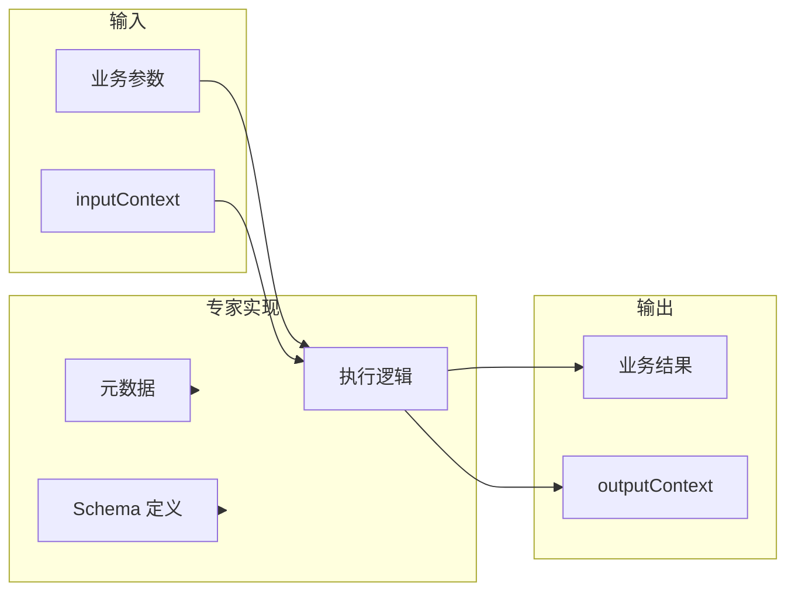

# Agent 专家系统设计规格

## 1. 概述与目标

### 项目范围

本项目**专注于专家本身的实现**，不包含上游调度层。上游调度由外部系统负责，本规范定义专家需暴露的接口与结构，供任意上游发现、调用与编排。

### 专家实现要点

- **可发现**：通过元数据（description、capabilities）让上游判断是否适用当前场景
- **可校验**：通过输入 Schema 让上游在调用前完成参数校验
- **可链式**：通过统一的上下文结构承接上文、为下游提供下文

---

## 2. 专家架构

### 专家作为独立单元



### 专家需实现的内容

| 内容 | 说明 |
|------|------|
| **元数据** | id、description、capabilities，供上游发现与选择 |
| **输入 Schema** | 业务参数定义，供上游校验与填充 |
| **输出 Schema** | 业务结果结构，供上游解析 |
| **上下文处理** | 接收 inputContext、产出 outputContext |
| **执行逻辑** | 根据参数与上下文执行业务，返回结果 |

---

## 3. 专家元数据规范

每个专家需实现并暴露以下元数据，供上游发现与判断是否适用：

| 字段 | 类型 | 必填 | 说明 |
|------|------|------|------|
| `id` | string | 是 | 专家唯一标识，用于路由与日志追踪 |
| `domain` | string | 建议必填（编排闭环） | 业务域段，与 `id` 组成 enrichedContext 域索引键 `{domain}/{id}`（如 `last-mile`、`outbound`、`_template`）。供 **post-expert-output** / **build-expert-invoke-baseline** 写入与聚合会话手交。 |
| `description` | string | 是 | 自然语言描述，说明专家的作用、适用场景、使用方法 |
| `capabilities` | string[] | 否 | 能力标签，便于粗粒度筛选（如 `["代码生成", "代码审查"]`） |
| `version` | string | 否 | 专家版本，用于兼容与演进 |

### 3.1 编排器扩展（manifest 根级，可选）

供 **experts_recaller** 等队列编排读取；与业务 `inputSchema` 并列，**不替代** JSON Schema 校验。

| 字段 | 类型 | 说明 |
|------|------|------|
| `x_recaller_propagate_previous_enriched_context` | boolean | 为 `true` 时，编排器由 **build-expert-invoke-baseline** 根据 `sessionHandoff.steps` **聚合域索引**并预填 `inputs.enrichedContext`（见 **§8**）；与 LLM 输出在 **merge-queue-input-params** 合并时 **baseline 优先**。 |
| `x_recaller_enriched_context_preferred_source_experts` | string[] | **仅作文档提示**：建议下游专家消费时优先阅读哪些 `{domain}/{expertId}` 路径的事实；**编排器不再据此筛选**，选取逻辑由消费侧代码（如 `validate-input` 内 `extractDomainEntry`）自行决定。 |

---

## 4. 输入 Schema 规范

### 格式

采用 **JSON Schema** 作为输入 Schema 的基础格式，技术栈无关、工具链成熟、便于校验与文档生成。

### 参数要求

每个参数需包含以下信息：

| 属性 | 说明 |
|------|------|
| `description` | 参数含义与使用说明，供上游理解与填充 |
| `required` | 是否必填（在 schema 顶层 `required` 数组中声明） |
| `type` | 类型：`string` / `number` / `boolean` / `object` / `array` |
| `default` | 默认值（可选），当上游未提供时使用 |
| `enum` | 枚举取值范围（可选） |
| `minimum` / `maximum` | 数值范围（可选） |
| `minLength` / `maxLength` | 字符串长度限制（可选） |

### 示例 Schema 片段

```json
{
  "type": "object",
  "required": ["query"],
  "properties": {
    "query": {
      "type": "string",
      "description": "用户输入的搜索关键词或问题",
      "minLength": 1,
      "maxLength": 500
    },
    "maxResults": {
      "type": "integer",
      "description": "返回结果的最大数量",
      "default": 10,
      "minimum": 1,
      "maximum": 100
    },
    "language": {
      "type": "string",
      "description": "期望的返回语言",
      "enum": ["zh", "en"],
      "default": "zh"
    }
  }
}
```

### 输出 Schema 设计原则：结构化与非结构化

输出不宜全部强制结构化，否则会限制 Agent 表达灵活性。建议按用途区分：

| 类型 | 适用内容 | 说明 |
|------|----------|------|
| **结构化** | 订单号、单据 ID、运单号等标识符 | 供下游解析、链接、查询，需严格 Schema |
| **非结构化** | 分析结论、异常描述、建议、逻辑呈现 | 自然语言自由呈现，保留 Agent 灵活性 |

**示例**：物流轨迹专家输出中，`orderIds`、`trackingIds` 为结构化；状态分析、异常说明、建议为 `analysis` 非结构化文本。

**对客可读输出**：`analysis` 及对外话术**不得**提及飞书、内部多维表、内部 Wiki 或员工专用链接作为「规则以何为准」的依据；应使用合同、价卡、订单约定、本专家内置条款摘要等表述。内部文档同步关系写在 `design.md` 或维护者说明即可，勿在注入 LLM 的正文中指令模型「提醒客户以飞书为准」。仓库级说明见 [REQUIREMENTS.md](../REQUIREMENTS.md) §4「对客可读输出」。

---

## 5. 上下文承载结构

每个专家的输入输出均包含统一的上下文结构，用于在专家间传递信息。

### 输入上下文 (inputContext)

| 字段 | 类型 | 说明 |
|------|------|------|
| `sourceExpertId` | string | 上一环节专家 ID，若为首次调用可为空 |
| `previousOutput` | string / object | 上一专家输出摘要或引用，供当前专家理解上文 |
| `chainId` | string | 调用链 ID，便于追踪与日志关联 |

### 输出上下文 (outputContext)

| 字段 | 类型 | 说明 |
|------|------|------|
| `expertId` | string | 当前专家 ID |
| `resultSummary` | string | 供下游使用的摘要，避免传递过大的完整结果 |
| `chainId` | string | 与输入保持一致，便于链式追踪 |

### 专家对上下文的处理

- **接收**：专家从输入中读取 `inputContext`，用于理解上文（若有）
- **产出**：专家在输出中填充 `outputContext`，包含 `expertId`、`resultSummary`、`chainId`
- **信息精简**：`resultSummary` 应控制在合理长度，完整结果可存外部引用
- **chainId 透传**：将输入的 `chainId` 原样写入输出，便于调用链追踪

---

## 6. 专家实现要点

### 调用约定

专家被调用时，上游传入的 JSON 为**固定顶层结构**（含 Coze `start` 节点变量）：

1. **`query`**（`string`）：上游委托本专家的任务说明，可为空字符串。  
2. **`customerIntent`**（`string`）：当前为客户解决的业务问题摘要，可为空字符串。  
3. **`inputContext`**（`object`，可选）：链式上下文，语义见 §5（`sourceExpertId` / `previousOutput` / `chainId` 等）；单专家可不传。  
4. **`inputs`**（`object`）：**仅**含本专家业务参数，键与 **`manifest.json` 的 `inputSchema.properties`** 一致（如 `trackingIds`、`expression`）。上游若用 LLM 拼装参数，通常**只需生成 `inputs`**，以降低拼装复杂度。

5. **客户与账号上下文（顶层，不经 `inputs`，所有专家默认具备）**：调用 JSON **顶层**（与 `query` 同级）须保留 **`customerCode`**、**`customerName`**、**`username`**、**`language`**（均为 `string`，可为空字符串）。用于多租户路由、审计、日志及**可选**的万邑通 OpenAPI 调用；**不论本专家是否直接调用万邑通，均应占位传入**。上述四字段**不得**写入 `manifest.json` 的 `inputSchema.properties`。

6. **万邑通 OpenAPI 请求体 `data`（专家主工作流）**：**不由上游在调用 JSON 顶层传入**。经插件或 `workflow/run` 调用时，**`data` 由专家内前置代码节点**（如算术模板的 `build-winit-inventory-data`）按 `inputs` 拼装为 JSON 字符串，再供插件入参或 `parameters.data` 使用。**独立代理工作流**（`export:coze:winit-openapi-proxy`）仍为通用透传，调用方可在开始节点传 `data`。**`action`** 不作为专家调用边界顶层字段：由代码节点默认值或 Coze 插件字面量固定（如 `queryProductInventoryList4Page`）。**`data`** 不得写入 `manifest.json` 的 `inputSchema.properties`。

`manifest.json` 中的 **`inputSchema` 只描述 `inputs` 内的业务字段**，不得再声明 `query` / `customerIntent` / `inputContext` / `inputs` / `customerCode` / `customerName` / `username` / `language` / `data` 为 properties（框架保留，导出时会校验）。

Coze 会把 Schema `properties` 展开为节点变量，因此所有层级的属性名必须匹配 `^[A-Za-z_][A-Za-z0-9_]*$`。域索引可能使用 `last-mile/delivery-status` 一类带斜杠的运行时键；承载此类数据的 `enrichedContext` 应声明为不展开 `properties` 的 opaque object，并通过 `additionalProperties: true` 原样透传，禁止把域索引键直接写入 Schema 子属性。

#### 万邑通 OpenAPI（Coze 插件 + workflow/run）

- **独立代理工作流**（`npm run export:coze:winit-openapi-proxy`）：**开始节点**可含 **`action`** 及 `customerCode`、`customerName`、`data`、`username`、`language`，插件 `node_inputs` 可从开始节点拉线；**结束节点**从插件拉 `code`、`data`、`msg`。对照 [`docs/coze-reference/winit_openapi_call-draft.yaml`](coze-reference/winit_openapi_call-draft.yaml)。

- **专家主工作流内嵌插件**（`coze.config.yml` 的 **`winitOpenapiPlugin`**）：开始节点仅含**框架顶层**（含 `customerCode` 等），**不含**请求体 `data`。插件入参 **`data`** 从 **`insertBefore` 前一档代码节点**（默认产出 `winitRequestData`，可由 `requestDataFrom` 覆盖）拉线；**`action`** 可为插件入参**字面量**（`openapiAction`），也可由上游代码节点拉线（**`requestActionFrom`**，默认路径 `winitOpenapiAction`），二者择一。画布 **`nodes` 顺序**见 [`COZE-WORKFLOW.md`](../COZE-WORKFLOW.md) 第 6 节。

仓库提供可导入包生成命令 **`npm run export:coze:winit-openapi-proxy`**（可选 `--workflow-id` / `--out` / `--no-zip`），实现见 [`scripts/coze-export/winit-openapi-proxy-emit.ts`](../scripts/coze-export/winit-openapi-proxy-emit.ts)；与线上一致时以 **`--workflow-id`** 对齐 MANIFEST 与 draft 根级 `id`。**专家主工作流**内嵌同一插件时，在 `coze.config.yml` 配置 **`winitOpenapiPlugin`**（见 [`COZE-WORKFLOW.md`](../COZE-WORKFLOW.md) §7）。插件 **`apiParam` 常量**见 [`scripts/coze-export/winit-openapi-plugin-shared.ts`](../scripts/coze-export/winit-openapi-plugin-shared.ts)。环境变量与本地调试说明见 [`scripts/README.md`](../scripts/README.md)。**草稿 YAML 对照**（勿放入各专家 `workflow/` 以免破坏 Coze 包目录）：[`docs/coze-reference/winit_openapi_call-draft.yaml`](coze-reference/winit_openapi_call-draft.yaml)。

专家需返回：

- **业务结果**：符合 `outputSchema` 的结构
- **outputContext**：供下游使用的上下文（含 `expertId`、`resultSummary`、`chainId`）

### 调用说明（规范要求：每个专家都要写）

为便于任意上游（含人类维护者、调度器、脚本）**快速正确调用**，每个专家目录内的 `design.md` 必须包含独立章节 **「调用说明」**，且至少包含：

| 项 | 必须包含的内容 |
|----|----------------|
| **适用场景** | 1-3 条自然语言要点（什么时候该调用 / 不该调用） |
| **最小入参** | 给出“能跑起来”的最小参数组合（例如：`trackingIds` 或 `trajectoryText` 二选一） |
| **参数提示** | 对最容易误用的 2-5 个参数做提醒（例如覆盖层 `enrichedContext` 的合并/跳过逻辑） |
| **示例调用** | 至少**1-2 个**示例，且示例里必须出现**真实参数字段名**与**典型值**（JSON） |

示例调用建议使用如下格式（放在 `design.md` 中，供复制粘贴）：

```json
{
  "query": "……",
  "customerIntent": "……",
  "customerCode": "",
  "customerName": "",
  "username": "",
  "language": "",
  "inputContext": { "chainId": "……", "sourceExpertId": "……", "previousOutput": {} },
  "inputs": {
    "trackingIds": ["……"],
    "trajectoryText": "……",
    "enrichedContext": {}
  }
}
```

专家主工作流内嵌万邑通插件时**不要**在调用 JSON 顶层传请求体 `"data"`（由内部代码节点拼装）。仅使用**独立万邑通代理包**作通用透传时，开始节点仍可传 `data`。**不要**把 `action` 放在专家调用边界顶层。

### LLM 节点在仓库中的落盘

工作流中 **`type: "llm"`** 的节点须在对应专家的 **`nodes/`** 目录下提供**同名声明文件**（如 `llm-analyze.ts`、`llm-comment.ts`）：用顶部注释写明与 `workflow.json` 中该 LLM 节点 **inputs / outputs** 一致的字段与类型，并标明 **Prompt 文件路径**（一般为 `prompts/main.md`）。声明文件**不是**可执行代码节点，不得配置为 `workflow.json` 的 `file` 字段。

节点在 Coze 画布上的**入出参类型**可在 **`workflow.json`** 可选字段 **`cozeIo`**（`inputs` / `outputs` 的 JSON Schema 子集）中声明，供 `npm run export:coze` 生成精准的 `node_inputs` / `node_outputs`；详见仓库根目录 **[`COZE-WORKFLOW.md`](../COZE-WORKFLOW.md)**。

### LLM 输出 JSON 契约（Prompt 与 Coze 对齐）

工作流中 **`type: "llm"`** 节点的 **`outputs[0]`**（通常为 `analysisResult`）既是 **Coze 画布出参变量名**，也是 **Prompt 要求模型输出的顶层键名**。

**模型必须输出的形状**（以 `analysisResult` 为例）：

```json
{
  "analysisResult": {
    "structured": { },
    "analysis": "对客自然语言结论"
  }
}
```

多阶段 LLM（如 `classificationResult`、`clarificationResult`）按 `workflow.json` 中该节点的 `outputs[0]` 类推，外层键名与 `outputs` 一致。

**工作流连线层**：`format-output` 的入参 `params.analysisResult`（或 `classificationResult` / `clarificationResult`）为**已解开外层**的 `{ structured, analysis }`。本地由 **Runner**（[`scripts/llm-openai.ts`](../scripts/llm-openai.ts) 解析 + [`scripts/run-expert.ts`](../scripts/run-expert.ts) 写入 context 前）通过 [`shared/unwrap-llm-envelope.ts`](../shared/unwrap-llm-envelope.ts) 归一化；Coze 由 LLM 节点 `node_outputs` 与 Prompt 对齐后填参。**代码节点 `format-output.ts` 不得 `import shared/`**，只读取已解开的 `structured` / `analysis`。

**禁止**：Prompt 示例仅写扁平 `{ structured, analysis }` 而与 `node_outputs.analysisResult` 不一致；**禁止**在 `analysis` 字符串内再嵌套整份 JSON。

### Coze 插件节点占位声明

工作流中由 **`coze.config.yml` 导出为 `type: plugin`** 的节点（如 **`cobra_winit_openapi_request`**）须在对应专家的 **`nodes/`** 下提供**占位 `.ts` 文件**（与 LLM 声明类似）：用顶部注释说明**默认 OpenAPI `action`**、与哪些代码节点一致、以及**调用边界顶层约定**（不经 `inputs` 的字段）。该文件**不是**可执行代码节点，不得配置为 `workflow.json` 的 `file` 字段。

### 本地 LLM Prompt 占位符（`scripts/llm-openai.ts`）

除 `{{query}}`、`{{customerIntent}}`、`{{enrichedContext}}` 等与各专家常用字段外，Runner 还支持 **`{{expression}}`**（字符串）、**`{{computationResult}}`**（将 `params.result` 序列化为 JSON，供「代码节点先执行、LLM 再点评」类工作流使用，见 `experts/_template/arithmetic-formula`）。

### 参数缺失时的专家行为

当必填参数缺失时，专家应：

- **拒绝执行**：返回明确错误，说明缺失参数
- **使用默认值**：若 Schema 中定义了 `default` 且业务允许，可自动填充

### 版本兼容与 Schema 演进

- 新增可选参数时保持向后兼容
- 废弃参数时保留一段时间并标注 `deprecated`
- 使用 `version` 字段标识专家与 Schema 版本

### 错误处理

- 定义统一的错误码与错误信息结构
- 执行失败时返回结构化错误，便于上游重试或降级

### 可观测性建议

- **日志**：记录 `chainId`、`expertId`、参数摘要、耗时，便于排查与监控

---

## 7. 三层输出统一约定

专家的输出经过三个层次从内到外传递：**`format-output` 代码节点 → Coze 结束节点 → `call-expert.ts` 调用方**。三者必须遵循统一的合约，否则调用方无法稳定解析专家返回值。

### 7.1 层次关系

三层使用**同一套四字段根级形状**（与 [`call-expert.ts`](../experts_recaller/nodes/call-expert.ts) 一致）：

```
format-output（代码节点 return）     Coze 结束节点（900001）          call-expert.ts（消费 data 根级）
────────────────────────────       ────────────────────────         ────────────────────────────────
{                                  workflow/run data: {             payload.structured        ✓
  structured: <object>,    ───►      structured: <object>,          payload.analysis          ✓
  analysis: <string>,                 analysis: <string>,            payload.outputContext     ✓
  outputContext: { … },               outputContext: { … },          payload.enrichedContext   可选
  enrichedContext?: { … },             enrichedContext: { … },
}
```

**结束节点固定四个变量名**（`enrichedContext` 无会话事实时可为 `{}`）：

| 字段 | 类型 | 必填 |
|------|------|------|
| `structured` | object | 是 |
| `analysis` | string | 是 |
| `outputContext` | object | 是 |
| `enrichedContext` | object | 否（建议始终返回，无内容时用 `{}`） |

### 7.2 `format-output` 代码节点（Layer 1）

**必须**在 `return` **根级**返回上述四字段（禁止 `result` 包装、禁止根级重复字段）：

```typescript
return {
  structured: { /* 与 manifest.outputSchema.properties.structured 对齐 */ },
  analysis: "对客自然语言结论",
  outputContext: {
    expertId: "当前专家 id（字面量硬编码）",
    resultSummary: analysis.slice(0, 200) || "默认摘要",
    chainId: inputContext?.chainId ?? "",  // 空串允许，不得为 undefined/null
  },
  enrichedContext: {
    /* 供编排 sessionHandoff 的扁平事实；无则 {} */
  },
};
```

`outputContext` **仅含** `expertId`、`resultSummary`、`chainId` 三个键；**不得**嵌套 `enrichedContext`。

**禁止的形态**：

| 形态 | 问题 |
|------|------|
| `return { result: { structured, analysis }, outputContext }` | 使用已废弃的 `result` 包装；结束节点 path 无法统一 |
| `return { result: analysisResult, outputContext }` | LLM 原始对象须先 coerce 为 `structured` + `analysis` |
| `outputContext.enrichedContext` | enriched 须在根级 `enrichedContext`，与 call-expert 不一致 |
| `outputContext.chainId` 为 `undefined` / `null` | 须为 `""` |
| 结束节点从 merge 等非 format 节点拉 `structured` / `analysis` | 四字段均应 `ref: format-output` |

### 7.3 Coze 结束节点（Layer 2）

每个专家的结束节点（`id: "900001"`）**固定拉取四个字段**，均来自 **`format-output`**：

```yaml
node_inputs:
  - name: structured
    input:
      type: object
      value:
        path: structured
        ref_node: "<format-output 节点 id>"
  - name: analysis
    input:
      type: string
      value:
        path: analysis
        ref_node: "<format-output 节点 id>"
  - name: outputContext
    input:
      type: object
      value:
        path: outputContext
        ref_node: "<format-output 节点 id>"
  - name: enrichedContext
    input:
      type: object
      value:
        path: enrichedContext
        ref_node: "<format-output 节点 id>"
```

对应 `coze.config.yml` 的 `endOutputs`（`npm run export:coze` 生成；缺省时导出器亦按此四字段填充）：

```yaml
endOutputs:
  structured:
    ref: format-output
    path: structured
  analysis:
    ref: format-output
    path: analysis
  outputContext:
    ref: format-output
    path: outputContext
  enrichedContext:
    ref: format-output
    path: enrichedContext
```

经此配置，`POST /v1/workflow/run` 返回的 `data` 根级为：

```json
{
  "structured": { },
  "analysis": "…",
  "outputContext": {
    "expertId": "…",
    "resultSummary": "…",
    "chainId": "…"
  },
  "enrichedContext": { }
}
```

### 7.4 `call-expert.ts` 解析（Layer 3）

调用方从 `data` 根级读取字段，校验规则：

| 字段 | 位置 | 校验 |
|------|------|------|
| `structured` | 根级 | 必须是 object，缺失则抛错 |
| `analysis` | 根级 | string，允许空串 |
| `outputContext.expertId` | 根级 object | 必须非空 string |
| `outputContext.resultSummary` | 根级 object | 必须非空 string |
| `outputContext.chainId` | 根级 object | **允许空串** |
| `enrichedContext` | 根级 | 可选 object；缺失或非 object 时忽略 |

### 7.5 `manifest.outputSchema` 的边界

`outputContext` 是**框架字段**，**不得**写入 `manifest.outputSchema.properties`（与 `query`、`inputContext` 等框架顶层字段一致）。`outputSchema` 只描述 `structured` 的业务子字段和 `analysis`。

```json
// ✅ 正确
"outputSchema": {
  "type": "object",
  "properties": {
    "structured": { "type": "object", "description": "…" },
    "analysis":   { "type": "string",  "description": "…" }
  }
}

// ❌ 错误——outputContext 是框架字段，不属于业务输出 schema
"outputSchema": {
  "properties": {
    "structured": { … },
    "analysis":   { … },
    "outputContext": { … }   ← 禁止
  }
}
```

### 7.6 Coze 节点端口拉线（显式 outputs ↔ inputs）

Coze 平台要求：**每个 `node_inputs` 引用必须指向上游节点 `node_outputs` 中已显式声明的键**（整键拉线，不能「凭空引用子字段名」）。

| 规则 | 说明 |
|------|------|
| **outputs 显式声明** | `workflow.json` 的 `outputs[]` 与 `cozeIo.outputs` 键一一对应；`format-output` 必须声明 `structured`、`analysis`、`outputContext`、`enrichedContext` |
| **inputs 整对象拉线** | 导出器 `node_inputs` **只写 `type` + `value.ref_node/path`**，**禁止**在入参上展开 `properties`（否则 Coze 会为 `structured`/`analysis` 等子键生成独立入参并要求上游也有同名 output） |
| **禁止子字段冒充 input 名** | 若代码读 `params.result.structured`，入参键仍应为 `result`，上游 `evaluate-expression.outputs` 须含 `result`；**不要**新增名为 `structured` 的 input 除非上游也有 `structured` output |
| **分支汇合** | 多分支汇入同一 input 时，增加汇合代码节点（如 `resolve-analysis-result`），或在 `coze.config.yml` 的 `branching.joins` 中补分支专用边；见模板 `arithmetic-formula` |
| **branch-only 节点** | 仅由 `branching.routes` 触达、不参与 `after` 之后线性 tail 的节点（如 `stub-llm-placeholder`）须写在 `workflow.json`，并在 `branching.joins.from` 声明；导出器会自动将其从 tail 边排除，也可在 `branchOnlyNodeIds` 显式列出 |
| **outputs 类型精准** | `cozeIo.outputs[key].type` 须与节点源码 `main()` 实际返回值类型一致：字符串→`string`，布尔→`boolean`，数字→`integer`，数组→`array`，才用 `object`；**不得统一填 `object` 兜底** |
| **校验** | `npm run check:coze-port-wiring`、`npm run check:coze-io`、`npm run check:format-output-contract`、`npm run check:coze-node-output-types` |

```yaml
# ✅ format-output 结束节点：四字段均从 format-output 根级拉线
endOutputs:
  structured: { ref: format-output, path: structured }

# ❌ 勿在 cozeIo.inputs 中为 object 入参写 properties 并期望导出展开（已禁止）
# ❌ 勿从 merge 节点拉 structured 到结束节点而绕过 format-output
```

---

## 8. `enrichedContext` 域索引与会话手交（编排侧）

### 8.1 职责划分

| 层级 | 形状 | 说明 |
|------|------|------|
| **专家工作流对外**（可选） | 扁平 object | 结束节点可透出 `enrichedContext`（与 `structured`/`analysis`/`outputContext` 并列），由 **`call-expert.ts`** 解析；仅描述**本专家本轮**产出的事实。 |
| **`sessionHandoff.steps[]` 存储** | 每步：`expertDomain`、`expertId`、`enrichedContext`（扁平）、`at` 等 | **`post-expert-output`** 写入：`enrichedContext` 来自 `call-expert.enrichedContext`，`expertDomain` 来自当前步 manifest（与 **build-expert-invoke-baseline.expertDomain** 对齐）。 |
| **下一跳 `inputs.enrichedContext`** | **域索引** | **`build-expert-invoke-baseline`** 扫描全部 steps，按 **`{domain}/{expertId}`** 分组，每组为**按时间顺序追加的快照数组**（见下）。仅当 `x_recaller_propagate_previous_enriched_context === true` 时注入。 |

### 8.2 域键与 manifest

- **键格式**：`` `{manifest.domain}/{manifest.id}` ``，例如 `last-mile/delivery-status`、`outbound/outbound-order-status`。
- **`manifest.domain`**：目录级业务域（如 `last-mile`、`outbound`），用于缩小检索范围、避免跨域同名专家冲突。
- 若历史步骤缺少 `expertDomain`，聚合时使用占位段 **`unknown`**（即键形如 `unknown/delivery-status`）。

### 8.3 域索引 JSON 形状

```json
{
  "last-mile/delivery-status": [
    {
      "_meta": { "stepIndex": 0, "at": "2026-05-08T10:00:00.000Z" },
      "computedScanFacts": [],
      "recognizedException": true
    },
    {
      "_meta": { "stepIndex": 3, "at": "2026-05-08T14:00:00.000Z" },
      "computedScanFacts": [],
      "recognizedException": false
    }
  ],
  "outbound/outbound-order-status": [
    {
      "_meta": { "stepIndex": 1, "at": "2026-05-08T10:05:00.000Z" },
      "outboundFacts": {}
    }
  ]
}
```

- **`_meta`**：编排器注入；**stepIndex** 为 `sessionHandoff.steps` 中的下标，**at** 为该步写入时间（ISO8601）。同一域多次调用**不覆盖**，全部保留为数组元素，由**消费方**决定取最新、最早或合并策略。
- 快照对象除 `_meta` 外的字段来自该步存储的**扁平** `enrichedContext`（专家产出须避免使用 `_meta` 作为业务键名）。

### 8.4 聚合规则（build-expert-invoke-baseline）

1. 顺序遍历 `steps`（从旧到新）。
2. 若某步无 `enrichedContext` 或非 object，跳过。
3. 计算域键 `` `${expertDomain || "unknown"}/${expertId}` ``。
4. 向该键对应数组 **push** `{ _meta: { stepIndex, at }, ...enrichedContext }`（若扁平对象含 `_meta` 键则先删除以免冲突）。
5. 若没有任何一步含有可聚合的 enrichedContext，则不设置 `baseline.inputs.enrichedContext`。

### 8.5 消费侧建议

- **入口**：下游专家在 **`validate-input`**（或等价首节点）将域索引「展开」为仍在本专家 workflow 内流转的**扁平** `enrichedContext`。
- **默认策略**：取某一域键下**数组最后一个元素**作为「最新快照」（与常见「最近一次查询」语义一致）；需要对比历史时在业务代码中显式读取多条。
- **兼容**：若入参仍是旧版**顶层扁平** object（无 `/` 域键），应继续按扁平处理（详见各专家 `resolveFlatEnrichedContext` 实现）。

### 8.6 `call-expert` 与 `post-expert-output` 接线

- **`call-expert`**：除 `structured` / `analysis` / `outputContext` 外，可选返回 **`enrichedContext`**（来自专家工作流 `data.enrichedContext`）。
- **`post-expert-output`**：将 **`enrichedContextFromExpert`**（绑定自 `call-expert.enrichedContext`）写入当前 step；将 **`expertDomain`**（绑定自 **`build-expert-invoke-baseline.expertDomain`**，与本步 manifest 一致）写入当前 step，供下一轮聚合。

---

## 附录：完整专家定义示例

参考 `experts/last-mile/delivery-status/manifest.json`（`inputSchema` 仅含业务字段；`query` / `customerIntent` / `inputContext` / `customerCode` / `customerName` / `username` / `language` 由框架约定在调用顶层，不在 manifest 中重复）：

```json
{
  "id": "delivery-status",
  "domain": "last-mile",
  "description": "获取并分析物流轨迹，提炼状态、异常、关联单据及供应链关联。Use when 用户查询物流状态、轨迹跟踪、配送异常、出库单、运单号、最后一公里、供应链追溯。",
  "capabilities": ["物流追踪", "轨迹分析", "异常识别", "供应链关联"],
  "version": "1.0.0",
  "inputSchema": {
    "type": "object",
    "required": [],
    "properties": {
      "trackingIds": { "type": "array", "items": { "type": "string" } },
      "outboundOrderNos": { "type": "array", "items": { "type": "string" } },
      "trajectoryText": { "type": "string" }
    }
  },
  "outputSchema": {
    "type": "object",
    "properties": {
      "structured": { "type": "object", "description": "可解析的标识符" },
      "analysis": { "type": "string", "description": "非结构化分析内容" }
    }
  }
}
```

**运行时完整入参示例**（调用工作流或 Runner 时）：

```json
{
  "query": "……",
  "customerIntent": "……",
  "customerCode": "",
  "customerName": "",
  "username": "",
  "language": "",
  "inputContext": {},
  "inputs": {
    "trackingIds": ["……"],
    "outboundOrderNos": ["……"],
    "trajectoryText": "……"
  }
}
```
