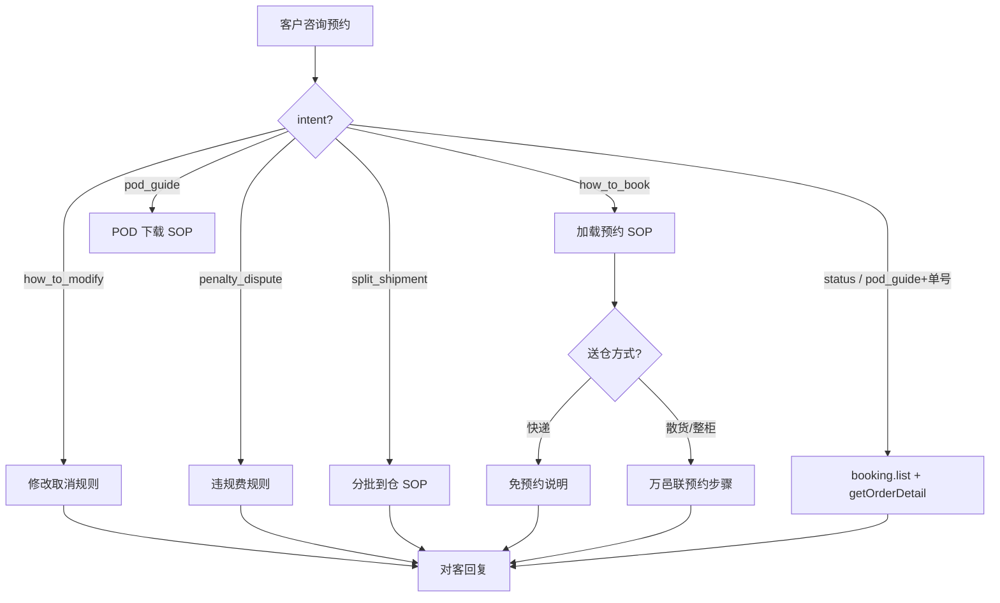

# 入库专家 — inbound-appointment-manage 业务参考

> 域：`inbound` · Expert ID：`inbound/inbound-appointment-manage` · 优先级：P1  
> 实现规格：[`experts/inbound/inbound-appointment-manage/design.md`](../../../experts/inbound/inbound-appointment-manage/design.md)

## 业务场景

直发散货/整柜**预约送仓**操作指引：创建/修改/取消预约、违规费说明、分批到仓拆单、**预约 POD 下载**。快递面单逐件派送**免预约**。

## 典型客户问法

- 「怎么预约送仓？预约码在哪？」
- 「能改预约时间吗？取消要扣费吗？」
- 「没预约被收了违规费怎么办？」
- 「分批到仓的包裹怎么处理？」
- 「增值预约和普通过预约有什么区别？」
- 「预约送仓的 POD / 签收证明怎么下载？」

## 边界分工

| 问 | 不问 |
|----|------|
| 预约操作 SOP、修改/取消规则、违规费 | 剩余库容/能否约（→ `inbound-capacity-availability`） |
| 预约单状态解读、预约 POD 下载 SOP | 入库单总状态（→ `inbound-order-status`） |
| 分批到仓拆单规则 | 代客创建/修改预约（**不代操作**） |
| 预约 POD PDF 下载步骤 | 签收时间/轨迹/快递 POD（→ `inbound-arrival-status`） |
| 增值预约送仓规则与费用边界 | VASC 推荐、服务项配置、已提交增值单状态（→ `value-add/value-add-product-recommendation` / `value-add/value-add-service-config` / `value-add/value-add-order-status`） |

**依赖**：`warehouse/capacity-signal`（Slot 可用性，Gap 时降级 SOP）。

---

## 客服处理流程

---

## 预约规则摘要 `[KB]`

| 规则 | 说明 |
|------|------|
| 谁要预约 | 散货(LCL)、整柜(FCL)必须预约；快递（一包裹一面单）**免预约** |
| 提前预约 | 最早提前 12 天；整柜 ≥2 自然日；散货 ≥1 自然日 |
| 免费取消 | 预约日 DAY2，须在 DAY0 中午 12 点前（当地时间工作日）取消 |
| 卸货方式 | AU/US/CA 多为 Drop；UK/DE/BE 多为 Live |
| 仓内上架单 PSC | 无需预约，不收违规费 |
| 送仓方式与下单 PSC 一致 | 下单散货实际快递 → 未预约违规费不退；下单快递实际散货 → 散装卸货费不退 |

### 违规费摘要 `[KB]`

| 类型 | 示例（美国） |
|------|-------------|
| 未预约/提前到仓 | 10 USD/CBM，最低 10，最高 650 |
| 已预约未到仓（散货） | 100 USD/预约单 |
| 已预约未到仓（整柜） | 200 USD/预约单 |

各国费率详见 `直发预约违规费常见问题.md`（AU/UK/DE/BE/CA 各异）。

### 分批到仓 `[KB]`

- 系统自动拆分新单，原单号 + 后缀 A/B/C
- 客户须在 **3 个自然日内**确认
- 来源：`一、背景说明.md`

### 增值预约 `[KB]`

- 审核约 1 工作日；审批前改时间不收费
- 审批后取消仍收增值服务费
- 详见 `增值预约送仓常见问题.md`
- 这里的“增值预约”是预约送仓的付费预约能力，不等同于 value-add 域的 VASC 推荐、服务项/原子配置或已提交增值单状态查询。

---

## 系统查询路径

| 场景 | 路径 |
|------|------|
| 预约单查询 | 万邑联 → 海外仓 → 入库 → 预约单管理；API：`booking.list` |
| 关联入库单 | `getOrderDetail` → `bookingNo`, `bookingStatus` |
| 在线预约 | booking.winit.com.cn |
| 预约 POD 下载 | 万邑联 → 预约单管理 → 已到仓（RBO）→ 客户**自行下载**；`exportPodPdf` 仅 ERP 对接（base64），**Agent 不调、不转发文件** |

---

## 转人工 / 升级条件

- 已预约但系统无记录
- 违规费金额争议较大
- 分批到仓需特殊拆单
- Slot 实时查询 API Gap 时客户坚持指定时段

---

## structured 输出草案

| 字段 | 说明 |
|------|------|
| bookingStatus | 预约状态 |
| appointmentCode | 预约码 |
| operationSteps | 操作步骤 |
| penaltySummary | 违规费说明 |
| splitShipmentGuide | 分批指引 |

---

## Playbook 交叉引用

- [flows/06-appointment-and-delivery.md](../../inbound/flows/06-appointment-and-delivery.md)

---

## KB 溯源表

| 优先级 | 文档 |
|--------|------|
| 1 | `直发预约送仓（常见问题）.md` |
| 1 | `直发散货预约常见问题.md` |
| 1 | `直发预约违规费常见问题.md` |
| 1 | `一、背景说明.md`（分批到仓） |
| 1 | `增值预约送仓常见问题.md` |
| 2 | `直发快递入仓常见问题.md` |
| 2 | `直发整柜Drop卸货异常退费流程.md` |
| 2 | `直发整柜DROP通知提空柜后跑空.md` |

### 待产品确认 `[推断]`

- `queryAvailableWarehouseinPlan` 是否对客户开放
- 一个预约单关联多个 WI 号的业务规则
