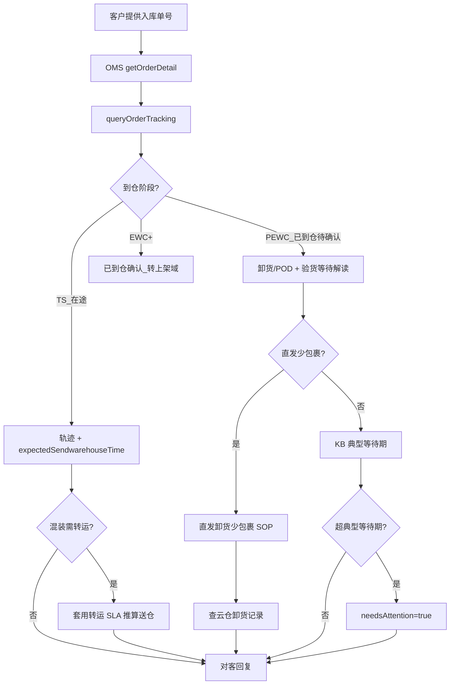

# 入库专家 — inbound-arrival-status 业务参考

> 域：`inbound` · Expert ID：`inbound/inbound-arrival-status` · 优先级：P0  
> 实现规格：[`experts/inbound/inbound-arrival-status/design.md`](../../../experts/inbound/inbound-arrival-status/design.md)

## 业务场景

客户询问货物**何时到仓、运输轨迹、仓库是否签收、直发少包裹**。咨询量约 691 条：预计到仓(390)、轨迹查询(176)、已签收待确认(125)。

## 典型客户问法

- 「货什么时候能到仓？」
- 「系统显示 TS，是不是还没到？」
- 「快递显示妥投了，为什么还是 PEWC？」
- 「预约了 10 个包裹只到了 8 个」
- 「能不能提供签收证明（POD）？」

## 边界分工

| 问 | 不问 |
|----|------|
| 到仓阶段、预计到仓、POD/卸货、直发少包裹 | 上架进度（→ `inbound-putaway-status`） |
| PEWC 停留解读 | 催上架（→ `inbound-putaway-expedite`） |
| 头程离港/到港细粒度（TS 前） | → `inbound-transit-tracking` |
| 清关合规节点 | → `inbound-customs-clearance` |

**衔接**：输出 `arrivalPhase`、`podSummary`、`packageQtyComparison` 供 `inbound-exception-check`、`inbound-putaway-status` 复用。

---

## 客服处理流程

---

## 到仓时间定义 `[KB]`

| 送仓方式 | 到仓时间取值 |
|----------|--------------|
| 快递 | 快递单号妥投时间；无单号则实际卸货时间 |
| 散货 | 预约单实际到仓时间 |
| 整柜 LIVE | 预约单实际到仓时间 |
| 整柜 DROP | 预约单预约卸货时间 |

查询路径：TOM → 综合查询 → 入库单查询 → 轨迹。

---

## 分支决策表

### 标准头程（Winit 承运）

| 条件 | 对客要点 |
|------|----------|
| 未到仓 | 告知预计送仓时间（`expectedSendwarehouseTime`），收到后按 SLA 上架 |
| 已到仓未上架 | 说明 PEWC 含义，仓库按 SLA 安排（→ putaway 域） |
| 混装转运 | USWC↔USWC2 +2工作日；USWC→USTX +11自然日；AU↔AUME +5自然日等 `[KB]` |

### 直发入库单

| 条件 | 对客要点 |
|------|----------|
| 系统未到仓 | 请与货代核实；若已送仓请提供 POD 或妥投截图 |
| 客户不愿提供 POD | 解释需 POD 定位签收人/地址；签收非万邑通则联系货代 |
| 直发少包裹 | 先确认签收地址是否为直发地址；收集 WI 号、快递单号、POD、承运商 |

### POD / 卸货查询 `[KB]`

| 区域 | 云仓查询内容 |
|------|--------------|
| 美国 | POD 卸货记录（整柜）/ 卸货包裹记录（非整柜+退货） |
| 欧洲 | 同上 |
| 澳洲 | 同上 |

注意：UPS 官网「妥投」多为站点装柜时间，非实际派送日。

---

## 系统查询路径

| 场景 | 路径 |
|------|------|
| 预计到仓/实际到仓 | TOM → 综合查询 → 入库单查询；或 TOM → 智运 → 跨国运输 |
| 预约关联 | TOM → 入库预约单管理 |
| 卸货/POD | 区域云仓 → POD 卸货记录 / 卸货包裹记录 |
| API | `getOrderDetail`（默认 **N** 表头；`checkPackageQty` 时 **Y** + `package_summary` 聚合，**无包裹分页 API**）+ `queryOrderTracking` + `queryUnloadRecords*` |

> 大柜包裹明细须客户提供箱号/条码，否则 `requiresNarrowing=true`。详见 [`inbound-getOrderDetail-detail-strategy.md`](../../plan/inbound-getOrderDetail-detail-strategy.md)

---

## 转人工 / 升级条件

- `needsAttention=true`：PEWC 超 KB 典型等待期（验货类型相关，**不设固定 48h**）
- 直发少包裹：云仓无卸货记录且客户无法提供 POD，需救火联系海外仓负责人
- POD 附件 URL 需单独接口（当前 design Gap）

---

## structured 输出草案

| 字段 | 说明 |
|------|------|
| arrivalPhase | `in_transit` / `arrived_pending` / `confirmed` / `unknown` |
| awhDate | 实际到仓时间 |
| estimatedArrival | 预计到仓 |
| needsAttention | 是否超典型等待期 |
| packageQtyComparison | 预约 vs 实收包裹数 |
| requiresNarrowing | 大柜未提供箱号时为 true |
| podSummary | `{ podTime, podQty, podAvailable }` |
| bookingStatus | 预约单状态 |

---

## Playbook 交叉引用

- [flows/05-customs-and-international.md](../../inbound/flows/05-customs-and-international.md)
- [flows/06-appointment-and-delivery.md](../../inbound/flows/06-appointment-and-delivery.md)

---

## KB 溯源表

| 优先级 | 文档 | 用途 | 标注 |
|--------|------|------|------|
| 1 | `_kb/service-team/.../查询头程送仓时间的处理流程.md` | 送仓/转运 SLA | `[KB]` |
| 1 | `_kb/service-team/.../如何查看入库单包裹的海外仓卸货时间.md` | POD 查询 | `[KB]` |
| 1 | `_kb/service-team/.../确认直发包裹是否到仓的处理流程（直发卸货少包裹）.md` | 少包裹 SOP | `[KB]` |
| 2 | `_kb/service-team/.../海外仓头程快递入库服务常见问题.md` | 头程快递段 | `[KB]` |
| 2 | `_kb/service-team/.../咨询入库单上架时间及催上架处理流程.md` | 到仓时间定义 | `[KB]` |
| 3 | `_kb/service-team/.../查询头程到港时间的处理流程.md` | 到仓前里程碑 | `[KB]` |

### 待产品确认 `[推断]`

- `pickupDate` vs `awhDate` 字段语义是否重复
- POD 扫描件是否在 `getOrderDetail` 返回
