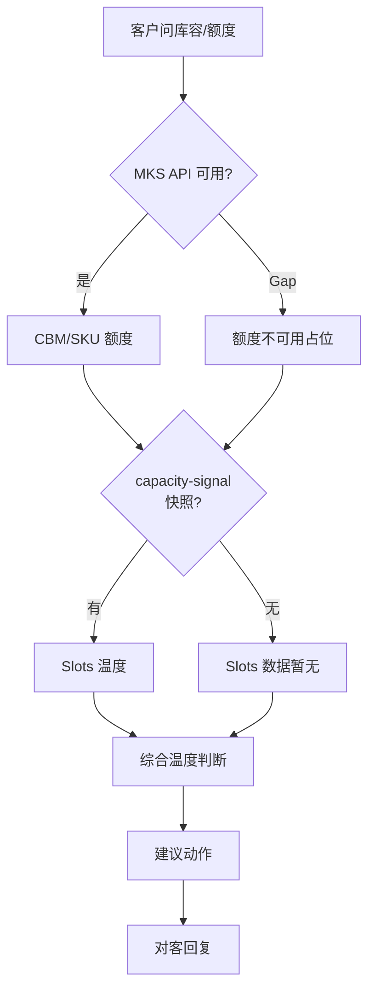

# 入库专家 — inbound-capacity-availability 业务参考

> 域：`inbound` · Expert ID：`inbound/inbound-capacity-availability` · 优先级：P1  
> 实现规格：[`experts/inbound/inbound-capacity-availability/design.md`](../../../experts/inbound/inbound-capacity-availability/design.md)

## 业务场景

客户询问**剩余 CBM/SKU 额度、Slots 能否预约、仓库能否收这批货**。输出库容温度与建议动作。MKS 额度 + WMS Slots 均有 Gap，本期 Mock 降级。

## 典型客户问法

- 「还剩多少 CBM 额度？」
- 「这个仓还能预约吗？」
- 「这批货能不能送进去？」
- 「要不要换仓或拆批？」

## 边界分工

| 问 | 不问 |
|----|------|
| 额度占用、库容温度、承接建议 | 怎么申请额度（→ `inbound-permission-apply`） |
| Slots 可约情况（依赖 capacity-signal） | 有哪些 PSC（→ `inbound-psc-eligibility`） |
| 综合温度判断 | 入库单状态（→ `inbound-order-status`） |

**依赖**：MKS `queryInboundQuota*` + `warehouse/capacity-signal`。

---

## 客服处理流程

---

## 温度档位 `[KB]` + design

| 档位 | 含义 | 建议动作 |
|------|------|----------|
| green | 可承接，充足 | 正常预约/入库 |
| yellow | 紧张，可能延长时效 | 尽早预约 |
| orange | 部分货型/时段受限 | 拆批/换时段 |
| red | 暂不可承接 | 换仓/联系客服 |
| grey | 数据缺失 | 联系客服确认 |

### 额度字段（MKS）`[推断]`

| 字段 | 含义 |
|------|------|
| totalCbm / usedCbm / remainingCbm | 客户 CBM 额度 |
| totalSkuSlots / usedSkuSlots | SKU 额度 |

### 阈值参考 `[推断]`

剩余占比 >50% green；20–50% yellow；5–20% orange；<5% red（待产品确认正式标准）。

---

## 分支决策表

| 条件 | 对客要点 |
|------|----------|
| MKS Gap | 「额度数据暂时无法实时获取，建议联系客服或查看万邑联账户中心」 |
| Slots Gap | 「Slots 实时可用性暂无，建议提前 1–2 工作日预约并联系仓库确认」 |
| 额度不足 | 建议扩容申请（→ `inbound-permission-apply`）或拆批/换仓 |
| 大件/特殊货型 | 结合件型与仓型规则（未来 `sku/profile`） |

---

## 系统查询路径

| 场景 | 路径 |
|------|------|
| 客户额度 | 万邑联 → 账户中心 → 库容额度；MKS API |
| Slots/仓温 | `warehouse/capacity-signal`；WMS（Gap） |
| 规则背景 | flows/06 库容与 Slots；`inbound-quota-knowledge.md` |

---

## 转人工 / 升级条件

- API 全部 Gap 且客户需精确数字
- red 档位硬限制需运营确认例外
- 温度阈值争议

---

## structured 输出草案

| 字段 | 说明 |
|------|------|
| capacityTemperature | 库容温度 |
| slotsTemperature | Slots 温度 |
| remainingCbm | 剩余 CBM |
| remainingSkuSlots | 剩余 SKU 额度 |
| suggestedActions | 建议动作列表 |
| apiAvailable | MKS 是否可用 |

---

## Playbook 交叉引用

- [flows/06-appointment-and-delivery.md](../../inbound/flows/06-appointment-and-delivery.md)

---

## KB 溯源表

| 优先级 | 文档 |
|--------|------|
| 1 | `_kb/product-team/winit/overseas/inbound-quota-knowledge.md` |
| 2 | `直发预约送仓（常见问题）.md`（库容隐含咨询） |
| 2 | `docs/inbound/flows/06` 库容与 Slots 节 |

### 待产品确认 `[推断]`

- MKS action 名 `winit.mks.customer.quota.query`
- 温度阈值正式标准
- `warehouse/capacity-signal` 专家未完成
