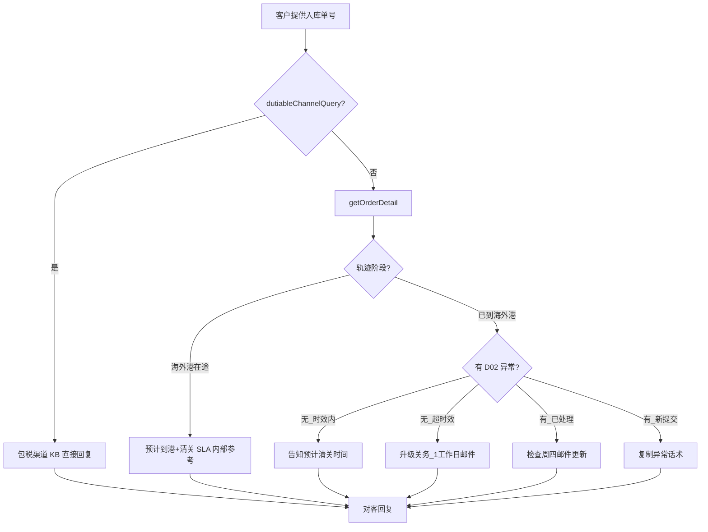

# 入库专家 — inbound-customs-clearance 业务参考

> 域：`inbound` · Expert ID：`inbound/inbound-customs-clearance` · 优先级：P2  
> 实现规格：[`experts/inbound/inbound-customs-clearance/design.md`](../../../experts/inbound/inbound-customs-clearance/design.md)

## 业务场景

**清关进度**查询与延误催促。TMS 清关节点全 Gap，OMS 轨迹 + KB 决策树兜底。包税渠道无独立清关轨迹。

## 典型客户问法

- 「清关进行到哪里了？」
- 「为什么清关这么久？」
- 「包税渠道有没有清关轨迹？」
- 「为什么清关时间比到港还早？」

## 边界分工

| 问 | 不问 |
|----|------|
| 清关节点状态、延误说明、包税特性 | 物流 ETA（→ `inbound-arrival-status` / `inbound-transit-tracking`） |
| 查验异常 D02 话术 | 清关资料上传（→ `inbound-customs-doc-manage`） |
| 升级关务路径 | 上架催促（→ `inbound-putaway-expedite`） |

---

## 客服处理流程

---

## 清关查询决策树 `[KB]`

来源：`查询头程进口清关_查验进度的处理流程.md`

| 分支 | 条件 | 对客要点 |
|------|------|----------|
| 未到港 | 轨迹「海外港在途」 | 预计到港日；到港后 X 工作日内清关（内部 SLA 不直发客户） |
| 已到港无异常_时效内 | 当前 < 到港日+清关SLA | 正常清关中，请耐心等待 |
| 已到港无异常_超时效 | 超 SLA 且无 D02 | 1 工作日内邮件回复，留邮箱；内部 @关务救火群 |
| D02 已处理 | 异常状态已关闭 | 查是否收到周四进度邮件（部分查验类型） |
| D02 新提交_未超影响天数 | — | 复制异常话术，不预测放行时间 |
| D02 新提交_已超影响天数 | — | 升级关务 |

### 周四更新机制 `[KB]`

适用于：①进口海关实物查验；②进口海关核价；③UK TS查验。话术含「每周四更新」才适用。

### 包税渠道 `[KB]`

- 美森散货、普船散货：无系统报关服务单，轨迹不显示清关完成
- USWC 到港后约 6 工作日内清关+送仓；不额外收进口关税
- 对客说明属产品特性，非异常

### 清关早于到港 `[KB]`

- 美国/澳洲/加拿大存在「清关时间早于到港」系统显示逻辑
- 见 `为什么进口清关时间比到港时间早？...md`

---

## 系统查询路径

| 场景 | 路径 |
|------|------|
| 入库单轨迹 | TOM → 入库单查询 → 轨迹 |
| 异常事件 | TOM → 智运 → 异常管理；或轨迹页异常 |
| API 兜底 | `getOrderDetail`（`status`, `trajectoryList`） |
| TMS 清关节点 | Gap |

---

## 转人工 / 升级条件

- 超清关 SLA 无 D02 登记
- 实物查验/核价等不可预估延误
- 客户追问具体放行日期（AI 只描述已知状态）

---

## structured 输出草案

| 字段 | 说明 |
|------|------|
| customsPhase | 清关阶段摘要 |
| isDutiableChannel | 是否包税渠道 |
| hasCustomsException | 是否有 D02 类异常 |
| delayEscalationNeeded | 是否需升级关务 |
| tmsDataAvailable | TMS 是否可用（false） |

---

## Playbook 交叉引用

- [flows/05-customs-and-international.md](../../inbound/flows/05-customs-and-international.md)
- [inbound-transit-tracking.md](inbound-transit-tracking.md)

---

## KB 溯源表

| 优先级 | 文档 |
|--------|------|
| 1 | `查询头程进口清关_查验进度的处理流程.md` |
| 1 | `为什么进口清关时间比到港时间早？...md` |
| 2 | `英国PVA递延清关常见问题以及申请流程.md`（交叉） |
| 2 | `关于比利时清关递延常见问题.md`（交叉） |

### 待产品确认 `[推断]`

- TMS 清关节点 API 全 Gap
- OMS `trajectoryList` 是否含清关子节点
