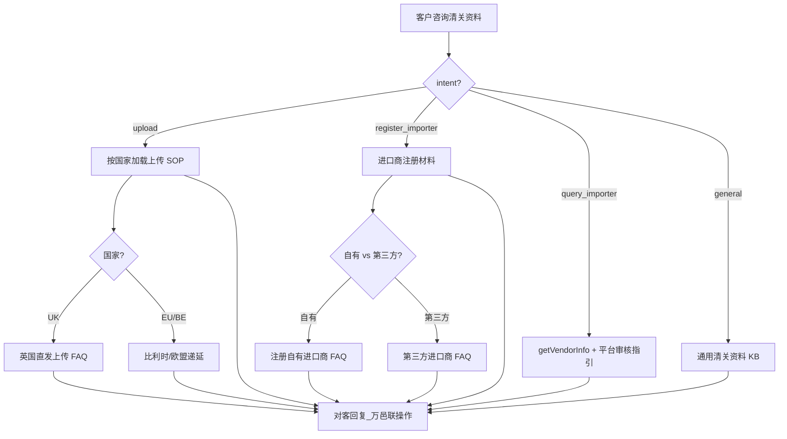

# 入库专家 — inbound-customs-doc-manage 业务参考

> 域：`inbound` · Expert ID：`inbound/inbound-customs-doc-manage` · 优先级：P2  
> 实现规格：[`experts/inbound/inbound-customs-doc-manage/design.md`](../../../experts/inbound/inbound-customs-doc-manage/design.md)

## 业务场景

清关**准备阶段**：资料上传、自有/第三方进口商注册与查询、英国/欧盟递延清关开通。先于 `inbound-customs-clearance`（追踪阶段）。**不代客写接口**。

## 典型客户问法

- 「英国直发要上传什么清关资料？」
- 「怎么注册自有进口商？」
- 「PVA 递延清关怎么申请？」
- 「第三方进口商和自有进口商有什么区别？」
- 「进口商审核到哪了？」

## 边界分工

| 问 | 不问 |
|----|------|
| 文件清单、上传步骤、进口商注册材料 | 清关进度/延误（→ `inbound-customs-clearance`） |
| 递延清关申请流程 | 权限开通（部分重叠 → `inbound-permission-apply`） |
| UMS Gap 时平台操作指引（注册写操作） | 包税渠道轨迹（→ `inbound-customs-clearance`） |

---

## 客服处理流程

---

## 分支决策表 `[KB]`

### 清关资料上传（upload）

| 国家/场景 | 要点 |
|-----------|------|
| 英国直发 | `英国直发订单上传清关资料的常见问题.md`：资料类型、上传入口、审核周期 |
| 一般 | 万邑联 → 个人中心 → 清关资料上传 |
| API | `uploadCustomsDeclareDocs`（不代调用） |

### 进口商注册（register_importer）

| 类型 | 主 KB |
|------|-------|
| 自有进口商 | `注册自有进口商的常见问题.md`：VAT、EORI 等材料 |
| 第三方 | `第三方进口商的常见问答.md` |
| 加急审核 | `客户要求加急审核英国进口商的处理流程.md` |

### 递延清关

| 国家 | 文档 |
|------|------|
| 英国 PVA | `英国PVA递延清关常见问题以及申请流程.md` |
| 比利时 | `关于比利时清关递延常见问题.md` |

### 查询进度（query_importer）

- API：`winit.ums.getVendorInfo`（按 countryCode + IOR 返回 vendor 列表）
- **不含**审核状态；审核进度指引：万邑联 → 个人中心 → 进口商列表

---

## 系统查询路径

| 场景 | 路径 |
|------|------|
| 上传清关资料 | 万邑联 → 个人中心 → 清关资料上传 |
| 进口商管理 | 万邑联 → 个人中心 → 进口商注册/列表 |
| API | 读：`winit.ums.getVendorInfo`；写：万邑联平台 |

---

## 转人工 / 升级条件

- 递延清关资质争议
- 进口商审核加急需关务/商务
- 资料审核驳回需个案解读

---

## structured 输出草案

| 字段 | 说明 |
|------|------|
| intent | upload / register_importer / query_importer / general |
| country | 目的国 |
| documentChecklist | 所需文件清单 |
| operationSteps | 操作步骤 |
| umsDataAvailable | UMS getVendorInfo 是否返回有效数据 |
| vendorList | 进口商编码与名称列表 |

---

## Playbook 交叉引用

- [flows/05-customs-and-international.md](../../inbound/flows/05-customs-and-international.md)
- [inbound-customs-clearance.md](inbound-customs-clearance.md)

---

## KB 溯源表

| 优先级 | 文档 |
|--------|------|
| 1 | `英国直发订单上传清关资料的常见问题.md` |
| 1 | `注册自有进口商的常见问题.md` |
| 1 | `第三方进口商的常见问答.md` |
| 1 | `英国PVA递延清关常见问题以及申请流程.md` |
| 1 | `关于比利时清关递延常见问题.md` |
| 2 | `客户要求加急审核英国进口商的处理流程.md` |

### 待产品确认 `[推断]`

- UMS 进口商注册写 API（查询已确认 `winit.ums.getVendorInfo`）
- 递延清关触发条件与客户资质要求
