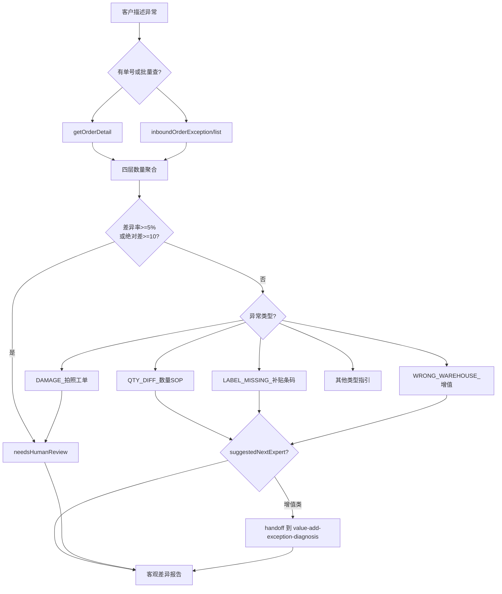

# 入库专家 — inbound-exception-check 业务参考

> 域：`inbound` · Expert ID：`inbound/inbound-exception-check` · 优先级：P1  
> 实现规格：[`experts/inbound/inbound-exception-check/design.md`](../../../experts/inbound/inbound-exception-check/design.md)

## 业务场景

聚合预报/签收/验收/上架四层数量差异，查询异常单，生成差异报告。咨询量约 2,099 条（入库异常核实，占比最高）。**不判责、不承诺赔付**。

## 典型客户问法

- 「上架少了 5 件，怎么回事？」
- 「有没有登记异常单？」
- 「包裹破损了怎么处理？」
- 「条码贴错了能上架吗？」
- 「货送错仓了怎么办？」

## 边界分工

| 问 | 不问 |
|----|------|
| 数量差异核实、异常单查询、破损/签收争议 | 纯上架进度（→ `inbound-putaway-status`） |
| 差异报告与升级建议 | 入库规则解释（→ `inbound-process-guide`） |
| 抽验超出容差需核实 | 抽验规则/费用细则（发货前 → `inbound-self-inspection` 部分场景） |

**衔接**：`inbound-self-inspection` 发现抽验差异超容差时，可将数据写入 `previousOutput` 由本专家聚合。

---

## 客服处理流程

---

## 异常类型与处理路径 `[KB]`

| 类型 | 场景 | 客服动作 / 对客要点 |
|------|------|---------------------|
| QTY_DIFF | 上架少包裹/少单品 | 分标准入库单 vs 直发海外验/自验两套 SOP；陈述差异数量，不判责 |
| DAMAGE | 运输破损 | 要求拍照证明 + 提交核实工单；升级人工 |
| LABEL_MISSING | 包裹条码异常 | 进入 value-add 推荐链判断补贴包裹条码路径 |
| WRONG_WAREHOUSE | 直发串仓 | 进入 value-add 推荐链判断串仓调拨或非标路径 |
| EXTRA_ITEM | 订单外商品 | 下换新单上架 |
| OWNERLESS_GOODS | 入库无主货 | 进入 value-add 推荐链判断无主货找回路径 |
| PRE_SHELVE_ACTION | 上架前自提/销毁/拦截/拍照 | 进入 value-add 推荐链判断自提、销毁、拦截或拍照路径 |

### 数量差异分链 `[KB]`

| 链路 | 主 KB |
|------|-------|
| 标准海外仓入库单 | `上架少包裹_上架少单品的处理流程（标准海外仓入库单）.md` |
| 直发海外验/自验 | `上架少单品（直发海外验_自验）的处理流程.md` |
| 综合数量异常 | `客户反馈上架数量异常处理流程（标准海外仓入库单+直发海外验）.md` |
| 预分拣救火输入 | `上架少包裹_少单品（查询预分拣记录及救火标准输入）.md` |

---

## 分支决策表

| 条件 | 对客原则 |
|------|----------|
| 差异率 < 5% 且绝对差 < 10 件 | 客观报告数字，说明仓库核实中 |
| 超阈值 | `needsHumanReview=true`，说明已转核实 |
| 客户追问谁的责任 | 不做责任判定，说明需仓库确认 |
| 需增值处理 | `suggestedNextExpert=value-add/value-add-exception-diagnosis`，输出 `valueAddHandoff`，说明进入 value-add 推荐链判断 |
| 批量查异常 | 限制 `dateRange`，标注 `hasMoreExceptions` |

---

## 系统查询路径

| 场景 | 路径 |
|------|------|
| 异常单列表 | 云仓 → 订单管理 → 入库异常记录；API：`inboundOrderException/list` |
| 按快递单号查 | 云仓异常记录 → 输入快递单号 |
| 入库单数量 | TOM → 综合查询 → 入库单查询；API：`getOrderDetail`（**`isIncludePackage=Y`** + 根级 **`merchandiseList`**；包裹下钻无分页 API） |

> 详情分层：[`inbound-getOrderDetail-detail-strategy.md`](../../plan/inbound-getOrderDetail-detail-strategy.md)
| 异常事件日期 | 异常记录详情页查看登记时间 |

---

## 转人工 / 升级条件

- `needsHumanReview=true`（超 5%/10 件阈值）
- DAMAGE 包裹破损
- 差异与系统数据严重矛盾
- 客户要求赔付（不承诺结果）

---

## structured 输出草案

| 字段 | 说明 |
|------|------|
| discrepancyReport | 预报/签收/上架四层数量与差异率 |
| exceptionRecords | 异常单摘要列表 |
| exceptionTypes | QTY_DIFF / DAMAGE / … |
| needsHumanReview | 是否需人工 |
| requiresNarrowing | 大柜未提供箱号/条码，无法展开包裹 |
| suggestedNextExpert | 增值类异常为 value-add/value-add-exception-diagnosis |
| valueAddHandoff | 给 value-add 推荐链的异常事实摘要 |
| humanReviewReason | 升级原因 |

---

## Playbook 交叉引用

- [flows/07-receiving-putaway-exceptions.md](../../inbound/flows/07-receiving-putaway-exceptions.md)
- [inbound-putaway-status.md](inbound-putaway-status.md) — 数量陈述不分责

---

## KB 溯源表

| 优先级 | 文档 | 用途 |
|--------|------|------|
| 1 | `如何查询异常单.md` | 查询路径 |
| 1 | `上架少包裹_上架少单品的处理流程（标准海外仓入库单）.md` | 标准单少货 |
| 1 | `上架少单品（直发海外验_自验）的处理流程.md` | 直发少单品 |
| 1 | `客户反馈上架数量异常处理流程（...）.md` | 综合异常 |
| 1 | `包裹条码异常...md` / `商品有条码但系统无法识别...md` | 条码类 |
| 1 | `直发串仓...md` / `直发非WINIT仓包裹送错...md` | 串仓类 |
| 1 | `包裹内出现订单外商品-换新单上架.md` | 多货 |
| 1 | `入库无主货找回增值提交.md` | 无主货 |
| 2 | `_kb/product-team/.../inbound-exception-handling.md` | 产品规则 |
| 2 | value-add 相关 KB | 上架前处理 |

### 待产品确认 `[推断]`

- `merchandiseList[].actualQuantity` EWC 前后语义
- 5%/10 件阈值正式标准
- `inboundOrderException/list` Coze action 注册
