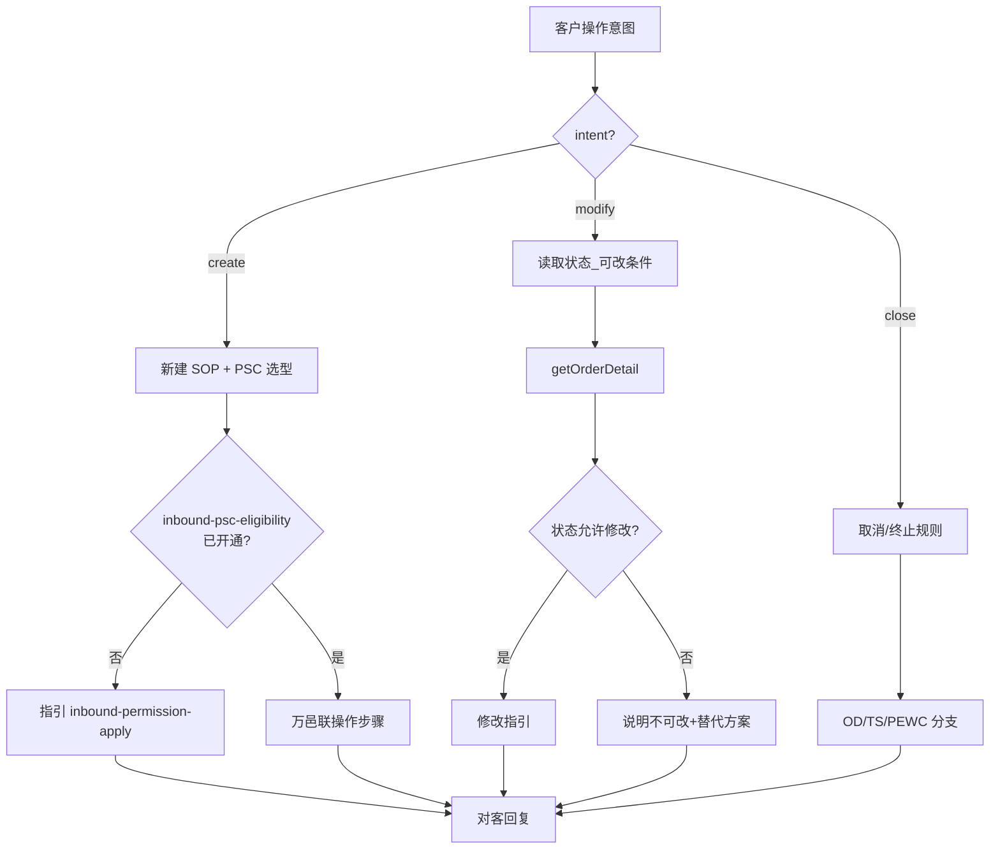

# 入库专家 — inbound-order-manage 业务参考

> 域：`inbound` · Expert ID：`inbound/inbound-order-manage` · 优先级：P1  
> 实现规格：[`experts/inbound/inbound-order-manage/design.md`](../../../experts/inbound/inbound-order-manage/design.md)

## 业务场景

入库单**操作指导**：新建、PSC 选型、修改目的仓/SKU、回退草稿、关闭/终止。纯 SOP 为主，**不代客调用写接口**。

## 典型客户问法

- 「怎么新建入库单？该选哪个产品？」
- 「能改目的仓吗？」
- 「怎么退回草稿修改箱单？」
- 「部分包裹到了，能关闭这个单吗？」
- 「箱号重复报错怎么办？」

## 边界分工

| 问 | 不问 |
|----|------|
| 操作步骤、PSC 选型建议、可修改条件 | 当前状态解读（→ `inbound-order-status`） |
| 取消/关闭规则 | 规则/费用解释（→ `inbound-process-guide`） |
| 写操作 SOP | 实时 PSC 开通列表（→ `inbound-psc-eligibility`） |

**衔接**：下单前建议 planner 先调 `inbound-psc-eligibility` 校验开通态。

---

## 客服处理流程

---

## 操作分支表 `[KB]`

### 新建入库单（create）

| 步骤 | 对客要点 |
|------|----------|
| PSC 选型 | 标准头程 OW01011* / 自验 OW01021-22 / 海外验 OW01031-32；见决策树 |
| 送仓方式 | 与 PSC 一致：快递 vs 散货 vs 整柜 |
| 自验直发 | 须先完成验货再预约 |
| 美森渠道 | 已于 2025-12 下线，推荐以星渠道 `[推断]` |
| 常见报错 | 见 `inbound-order-status` / `inbound-process-guide`（本专家给操作步骤） |

### 修改（modify）`[KB]`

| 修改项 | 可修改条件 |
|--------|------------|
| 箱单/SKU | Winit揽收→安排提货前；自发物流→安排收货前；直发海外验→已下单可改；自验直发→验货开始前可改，验货中可减少商品 |
| 目的仓 | 需运营介入；参考 `修改入库单目的仓操作流程.md` |
| PSC/发货方式 | 状态为已下单/验货完成/运输中时可退回草稿自行修改 |

### 关闭/取消（close）`[KB]`

| 状态 | 操作 |
|------|------|
| OD | 客户可在平台自行取消 |
| TS | 视物流安排，联系客服 |
| PEWC/EWC | 联系仓库运营人工处理 |
| 直发部分到仓 | 客户可自行关闭，见 `客户如何自行关闭部分到仓的直发类入库单.md` |

---

## 系统查询路径

| 场景 | 路径 |
|------|------|
| 当前状态判断 | `getOrderDetail` |
| 下单操作 | 万邑联 → 入库 → 新建/管理入库单 |
| 写 API（不代调用） | `order.create` / `cancel` / `updateCrossDockingWaveInfo` |

---

## 转人工 / 升级条件

- 修改目的仓/SKU 超出 API 覆盖字段
- PEWC 后终止需仓库运营
- QSI 创建字段与研发确认不一致

---

## structured 输出草案

| 字段 | 说明 |
|------|------|
| intent | create / modify / close |
| operationSteps | 操作步骤 |
| pscRecommendation | PSC 建议 |
| modifiableFields | 可修改项 |
| risks | 风险提示 |

---

## Playbook 交叉引用

- [playbook.md §四 产品选择决策树](../../inbound/playbook.md)
- [inbound-process-guide.md](inbound-process-guide.md) — 规则 vs 操作

---

## KB 溯源表

| 优先级 | 文档 |
|--------|------|
| 1 | `新增海外仓入库单的常见问题.md` |
| 1 | `修改入库单目的仓操作流程.md` |
| 1 | `客户如何自行关闭部分到仓的直发类入库单.md` |
| 2 | `自验-WINIT承运-海运整柜下单常见问题.md` |
| 2 | `_kb/product-team/.../inbound-product-details.md` |

### 待产品确认 `[推断]`

- `updateCrossDockingWaveInfo` 支持修改的字段范围
- QSI 创建 `orderMode` / `inspectionWay` 必填项
