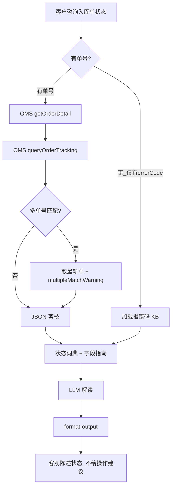

# 入库专家 — inbound-order-status 业务参考

> 域：`inbound` · Expert ID：`inbound/inbound-order-status` · 优先级：P0  
> 实现规格：[`experts/inbound/inbound-order-status/design.md`](../../../experts/inbound/inbound-order-status/design.md)

## 业务场景

客户持有入库单号，查询**当前状态、字段含义、系统报错原因**。咨询量约 382 条（入库单问题）。本专家只解读「是什么状态」，不解释「该怎么做」（→ `inbound-process-guide` / `inbound-order-manage`）。

## 典型客户问法

- 「我的入库单现在什么状态？PEWC 是什么意思？」
- 「为什么显示 TS 很久了？」
- 「下单报错：商品信息不存在，怎么回事？」
- 「这个字段 inspectionType 代表什么？」

## 边界分工

| 问 | 不问 |
|----|------|
| 入库单/预报单状态、字段解读、报错码 | 业务规则解释（→ `inbound-process-guide`） |
| 轨迹到仓细节 | 到仓阶段判断（→ `inbound-arrival-status`） |
| 上架进度/催促 | → `inbound-putaway-status` / `inbound-putaway-expedite` |
| 权限/额度 | → `inbound-permission-apply` / `inbound-capacity-availability` |
| 入库单状态事实输出 | VASC 推荐、服务项配置、已提交增值单状态（→ `value-add/value-add-product-recommendation` / `value-add/value-add-service-config` / `value-add/value-add-order-status`） |

**衔接**：向下游写入 `enrichedContext`（`orderNo`, `status`, `winitProductCode`, `trajectorySummary`），供链式编排复用；其中 `status` 可作为 `value-add/value-add-product-recommendation` 的 `orderStatusHint`，但本专家不根据状态反推 VASC 或服务项。

---

## 客服处理流程

---

## 状态机解读表 `[KB]`

来源：`docs/inbound/playbook.md` §五

| 状态码 | 中文含义 | 实物流位置 | 常见客户困惑 |
|--------|----------|------------|--------------|
| DR | 草稿/已创建 | — | 与 OD 区别 |
| OD | 已确认/待发货 | 国内待交付 | 何时可发货 |
| RE | 国内仓已收货 | 国内仓 | 国内验货进度 |
| TS | 已发运/在途 | 国际运输 | 与到港/送仓关系 |
| PEWC | 预计在仓期 | 海外已到仓/验货中 | 为何未上架 |
| EWC | 已完全上架 | 海外仓 | 与 SHD 区别 |
| SHD | 已入库存 | 库存可用 | — |
| STOP/Void | 已终止/作废 | — | 能否恢复 |

---

## 分支决策表

| 条件 | 客服动作 | 对客话术原则 |
|------|----------|--------------|
| 有 `errorCode` 无单号 | 纯 KB 路径，不调 API | 说明报错含义与常见触发原因，不承诺处理时效 |
| 逾期账单报错 | 引用 inbound-process-guide 规则 | 还清欠款后恢复，不展开还款操作 |
| 商品不存在报错 | 引导自查注册发布状态 | 本专家只解释报错，具体操作步骤 → `inbound-order-manage` |
| 多单号歧义 | 取最新创建单 | 注明可能存在多条匹配，建议客户提供 WI 单号 |
| 客户追问「怎么办」 | 路由提示 | 说明需流程/操作专家，本专家仅解读当前状态 |

### 主要字段解读 `[KB]`

| 字段 | 含义 |
|------|------|
| winitProductCode | PSC 产品编码 |
| inspectionType | 验货类型（自验/海外验等） |
| entryWhType | 入库方式（DI/DW/SD 等） |
| trackingList | 轨迹里程碑（来自 queryOrderTracking；详情接口不含轨迹） |

---

## 系统查询路径

| 场景 | 路径 |
|------|------|
| 入库单详情 | TOM → 综合查询 → 入库单查询 → 详情 |
| 入库单轨迹 | TOM → 轨迹页签；API：`wh.tracking.queryOrderTracking` |
| API（专家实现） | `getOrderDetail`（**默认 `isIncludePackage=N`**，仅表头）+ `queryOrderTracking`（[`inbound-tracking-api.md`](../../plan/inbound-tracking-api.md)） |

> **`isIncludePackage=N` 不返回 `merchandiseList` / `packageList`**；SKU/包裹明细见 `inbound-putaway-status` / `inbound-exception-check`。详情策略：[`inbound-getOrderDetail-detail-strategy.md`](../../plan/inbound-getOrderDetail-detail-strategy.md)
| 报错码（无单号） | KB：`新增海外仓入库单的常见问题.md` |

---

## 转人工 / 升级条件

- `customerOrderNo` 命中多条且客户不认可「取最新」逻辑
- 状态与轨迹严重矛盾（系统异常）
- 报错码 KB 无覆盖

---

## structured 输出草案

| 字段 | 说明 |
|------|------|
| orderNo | 入库单号 |
| status / statusLabel | 状态码与中文名 |
| winitProductCode / winitProductName | PSC |
| destWhCode | 目的仓 |
| trajectorySummary | 轨迹里程碑摘要 |
| errorCodeExplanation | 报错解读 |
| isTruncated | 轨迹是否剪枝截断 |

---

## Playbook 交叉引用

- [playbook.md §五 状态机](../../inbound/playbook.md)
- [flows/01-03](../../inbound/flows/) — 各链路状态差异

---

## KB 溯源表

| 优先级 | 文档 | 用途 | 标注 |
|--------|------|------|------|
| 1 | `_kb/service-team/.../新增海外仓入库单的常见问题.md` | 报错码段 | `[KB]` |
| 2 | `_kb/product-team/winit/in-warehouse/inbound-faq.md` | 状态 FAQ | `[KB]` |
| 2 | `_kb/product-team/winit/in-warehouse/inbound-system-operations.md` | 系统操作 | `[KB]` |
| 3 | `docs/inbound/playbook.md` §五 | 状态机 | `[KB]` |

### 待产品确认 `[推断]`

- `getOrderDetail` / `getOrderList` Coze action 注册名
- 多单歧义默认取「最新创建单」是否产品认可
