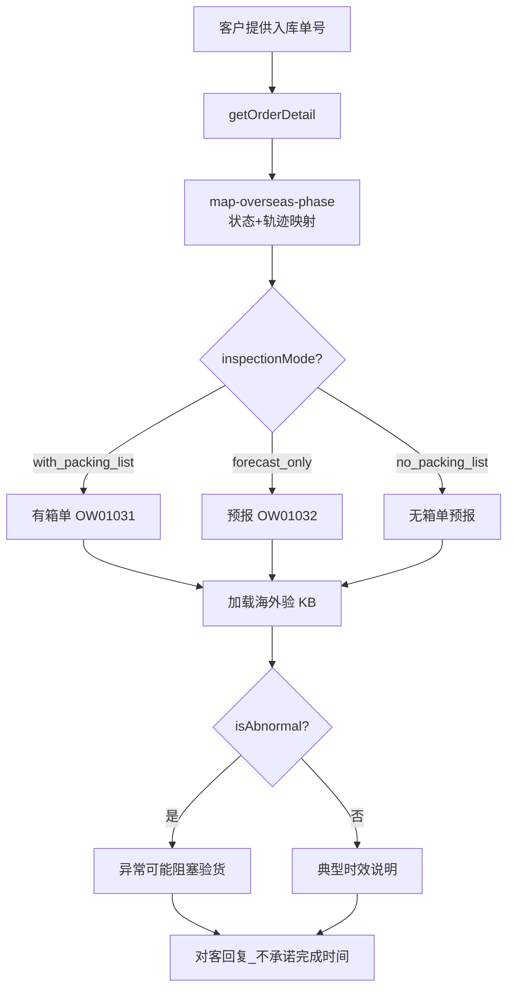

# 入库专家 — inbound-overseas-inspection 业务参考

> 域：`inbound` · Expert ID：`inbound/inbound-overseas-inspection` · 优先级：P2  
> 实现规格：[`experts/inbound/inbound-overseas-inspection/design.md`](../../../experts/inbound/inbound-overseas-inspection/design.md)

## 业务场景

OW01031/OW01032 **海外验**进度解读：PEWC→EWC 阶段，客户被动等待 Winit 验货。以 OMS 入库单状态与轨迹为主路径，WMS 细粒度为 Gap 增强。

## 典型客户问法

- 「海外验进行到哪一步了？」
- 「有箱单和无箱单进度有什么区别？」
- 「无箱单预报怎么查状态？」
- 「什么时候能验完？」

## 边界分工

| 问 | 不问 |
|----|------|
| 海外验阶段、预计节点、三种模式差异 | 自验/抽验（→ `inbound-self-inspection`） |
| 数量结果摘要 | 到仓确认（→ `inbound-arrival-status`） |
| 基于 OMS 的进度解读 | 上架催促（→ `inbound-putaway-expedite`） |

---

## 客服处理流程

---

## 三种模式差异 `[KB]`

来源：`无箱单有预报常见问答.md` + product-team

| 模式 | PSC 特征 | 客户操作差异 |
|------|----------|--------------|
| 有箱单 | OW01031 标准海外验 | 须提供装箱明细 |
| 直发海外验（预报） | OW01032 | 仅 SKU+件数，贴订单码/识别码 |
| 无箱单有预报 | 特殊权限开通 | 识别码规则严格；仅直发海外验 |

### 无箱单预报要点 `[KB]`

- 权限：商务在客户下单权限表申请；开通 OW01031/32 预报系列 PSC
- 适用：亚马逊退仓、2B 退货、第三方转仓
- 识别码：推荐入库单号；不可与别单重复；快递单号作识别码须选物流公司
- 直发地址在提交后才产生，含入库单号
- 不支持箱产品/套装产品

### 阶段映射（OMS 主路径）`[KB]`

| 阶段 | 说明 |
|------|------|
| awaiting_inspection | PEWC 到仓，排队验货 |
| in_progress | 验货进行中（WMS 细节 Gap） |
| completed | 转 EWC |
| blocked | 有异常单可能阻塞 |

**对客**：WMS Gap 时标注「开箱/点数等细粒度进度暂无，以下为入库单系统可见状态」；**不承诺**验货完成时间。

---

## 分支决策表

| 条件 | 对客要点 |
|------|----------|
| 正常排队 | 说明当前阶段与到仓天数 |
| 无箱单客户 | 强调识别码粘贴与订单码要求 |
| isAbnormal | 说明存在异常可能延缓验货 |
| daysSinceArrival 超 KB 时效 2 倍 | 升级人工 |
| 少货争议 | 数量异常 → `inbound-exception-check` |

---

## 系统查询路径

| 场景 | 路径 |
|------|------|
| 入库单状态/轨迹 | TOM → 入库单查询；`getOrderDetail` |
| WMS 验货细粒度 | Gap |
| 权限申请 | 商务权限表（见无箱单 FAQ） |

---

## 转人工 / 升级条件

- `daysSinceArrival` 超参考时效 2 倍且仍 `in_progress`
- `isAbnormal=true` 且客户追问具体开箱进度
- OW01031 vs OW01032 映射歧义

---

## structured 输出草案

| 字段 | 说明 |
|------|------|
| overseasInspectionPhase | 海外验阶段 |
| inspectionMode | with_packing_list / forecast_only / no_packing_list |
| daysSinceArrival | 到仓天数 |
| isAbnormal | 是否阻塞性异常 |
| wmsDetailAvailable | WMS 是否可用（false） |

---

## Playbook 交叉引用

- [flows/03-direct-overseas-inspection.md](../../inbound/flows/03-direct-overseas-inspection.md)
- [inbound-self-inspection.md](inbound-self-inspection.md) — 分工对比

---

## KB 溯源表

| 优先级 | 文档 |
|--------|------|
| 1 | `无箱单有预报常见问答.md` |
| 2 | `客户反馈上架数量异常处理流程（...）.md`（海外验段） |
| 2 | `_kb/product-team/.../inbound-faq.md` |
| 2 | `_kb/product-team/.../inbound-product-details.md` |

### 待产品确认 `[推断]`

- WMS 验货模块 API 全 Gap
- `inspectionStatus` 在海外验链路枚举稳定性
- OW01031/OW01032 字段映射是否足够
