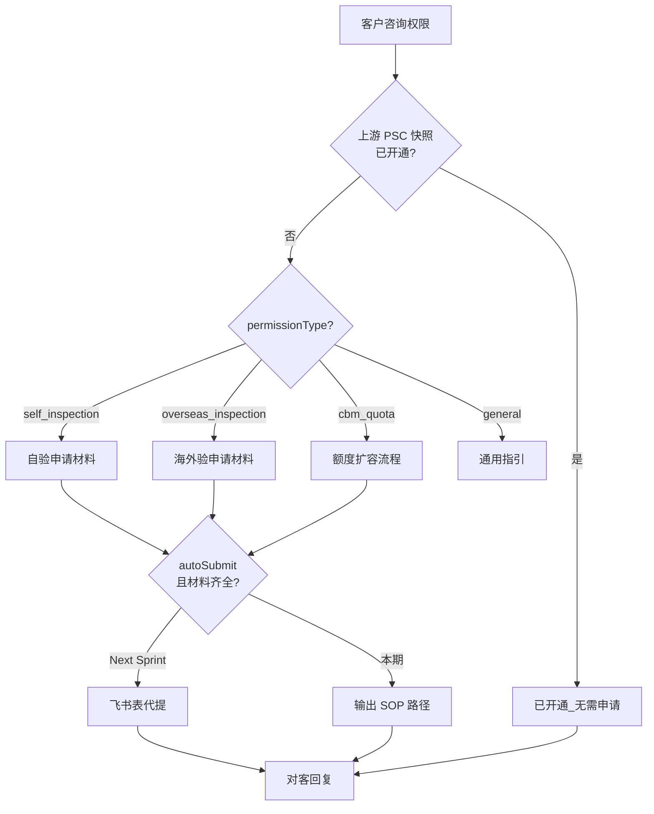

# 入库专家 — inbound-permission-apply 业务参考

> 域：`inbound` · Expert ID：`inbound/inbound-permission-apply` · 优先级：P1  
> 实现规格：[`experts/inbound/inbound-permission-apply/design.md`](../../../experts/inbound/inbound-permission-apply/design.md)

## 业务场景

自验/海外验/CBM 额度等**权限申请**材料清单、提交路径与审批进度指引。当前 Sprint：**KB + 只读判断**；飞书 Bitable API 代提为下期。

## 典型客户问法

- 「怎么申请自验权限？」
- 「OW01031 海外验怎么开通？」
- 「CBM 额度不够怎么扩容？」
- 「我提交的申请审核到哪了？」
- 「英国进口商能加急审核吗？」

## 边界分工

| 问 | 不问 |
|----|------|
| 申请材料、提交路径、审批进度指引 | 已开通 PSC 列表（→ `inbound-psc-eligibility`） |
| 是否需申请（对比当前快照） | 剩余 CBM/SKU 额度（→ `inbound-capacity-availability`） |
| 权限类 SOP | SKU 注册（商品域，非本专家） |

**衔接**：planner 应先调 `inbound-psc-eligibility`，将 `enabledProducts` 写入 `previousOutput`。

---

## 客服处理流程

---

## 权限类型指引 `[KB]` + product-team

| permissionType | 申请路径摘要 | 材料要点 |
|----------------|--------------|----------|
| self_inspection | 飞书多维表格 / 商务申请流程 | OW01021/22 前提条件；偏好设置 |
| overseas_inspection | 同上 + 无箱单预报单独申请 | OW01031/32；亚马逊退仓需单独申请 |
| cbm_quota | 扩容申请表 | 与 PSC 权限是否同一表单待产品确认 |
| general | 万邑联 → 个人中心 → 服务设置 → 偏好设置 | 无直发入口时先开通偏好 |

### 已开通判断

- 读取 `inbound-psc-eligibility` 输出：`hasSelfInspection`, `hasOverseasInspection`
- 已开通 → 直接回复「已开通，无需重复申请」

### 审批进度（本期）`[KB]`

- 无 Bitable OpenAPI：指引客户通过原提交渠道查询或联系客服
- 英国进口商加急：`客户要求加急审核英国进口商的处理流程.md`

---

## 系统查询路径

| 场景 | 路径 |
|------|------|
| 当前 PSC 可下单态 | `inbound-psc-eligibility` / `winit.wh.pms.getWinitProducts` |
| 申请提交 | 飞书多维表格（流程表，无 OpenAPI） |
| 偏好设置开通 | 万邑联 → 个人中心 → 服务设置 → 偏好设置 |

---

## 转人工 / 升级条件

- `canAutoSubmit=false`（API 未就绪）且客户要求代提
- 审批争议、加急审核需商务介入
- `sku_registration` 咨询 → 路由商品域或人工

---

## structured 输出草案

| 字段 | 说明 |
|------|------|
| permissionType | 申请类型 |
| alreadyEnabled | 是否已开通 |
| materialChecklist | 材料清单 |
| submitPath | 提交路径说明 |
| canAutoSubmit | 是否可代提（下期） |
| estimatedReviewTime | 预计审核时长（KB 参考） |

---

## Playbook 交叉引用

- [playbook.md §前置条件](../../inbound/playbook.md)
- [inbound-psc-eligibility.md](inbound-psc-eligibility.md)

---

## KB 溯源表

| 优先级 | 文档 |
|--------|------|
| 1 | `新增海外仓入库单的常见问题.md`（偏好设置/无直发入口） |
| 1 | `无箱单有预报常见问答.md`（权限申请段） |
| 1 | `注册自有进口商的常见问题.md` |
| 1 | `客户要求加急审核英国进口商的处理流程.md` |
| 2 | `_kb/product-team/.../process-application.md` |
| 2 | `_kb/product-team/.../process-application-approval-configuration.md` |

### 待产品确认 `[推断]`

- 飞书 Bitable/审批 API 接入规格（下期）
- `cbm_quota` 是否与 PSC 同一申请表单
