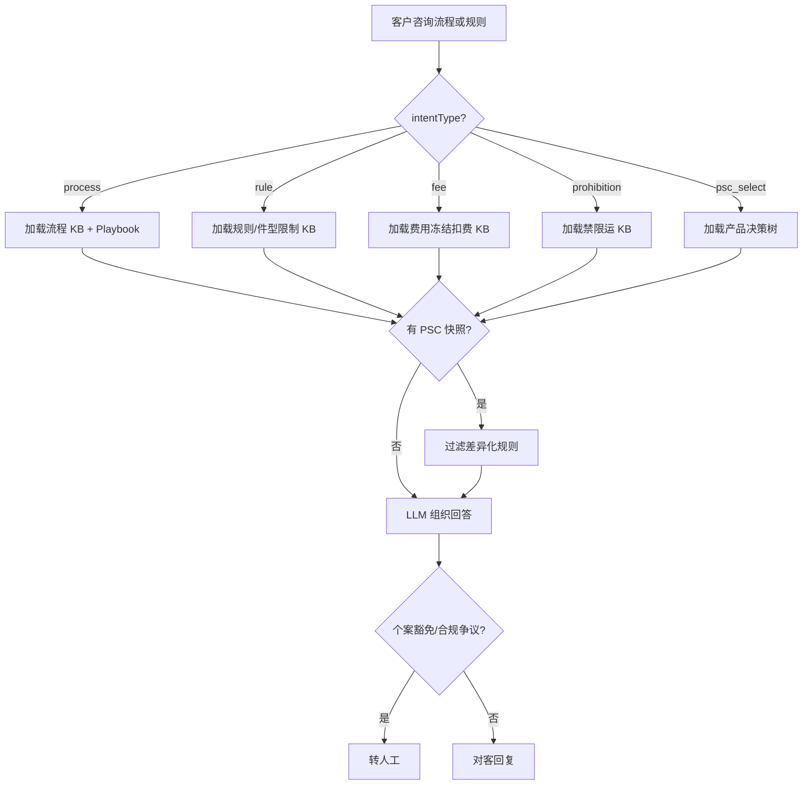

# 入库专家 — inbound-process-guide 业务参考

> 域：`inbound` · Expert ID：`inbound/inbound-process-guide` · 优先级：P0  
> 实现规格：[`experts/inbound/inbound-process-guide/design.md`](../../../experts/inbound/inbound-process-guide/design.md)

## 业务场景

解答入库**流程怎么走、规则/条件是什么、费用如何计算、有哪些禁限运品**。咨询量约 236+ 条（入库流程咨询），常与 `inbound-order-status` 分流（状态查询 vs 规则解释）。

## 典型客户问法

- 「标准头程和直发自验有什么区别？」
- 「CBM 额度是什么意思？满了怎么办？」
- 「带电商品入库有什么要求？」
- 「头程运费什么时候扣？」
- 「为什么没有直发下单入口？」

## 边界分工

| 问 | 不问 |
|----|------|
| 入库流程、规则、费用口径、禁限运、PSC 选型原则 | 具体单据当前状态（→ `inbound-order-status`） |
| CBM/容量限制**说明** | 剩余 CBM/SKU 额度查询（→ `inbound-capacity-availability`） |
| 产品选型决策树 | 具体仓库地址（→ `inbound-warehouse-info`） |
| 已开通哪些 PSC 列表 | 实时 PSC 开通态（→ `inbound-psc-eligibility`） |

**衔接**：可选读取上游 `inbound-psc-eligibility` 的 `enabledProducts` 做差异化规则匹配。

---

## 客服处理流程

---

## 分支决策表

### 流程类（process）

| 条件 | 对客要点 |
|------|----------|
| 问三种链路区别 | 标准头程（OW01011*）/ 直发自验（OW01021/22，含旧自验/新自验）/ 直发海外验（OW01031/32，含有箱单/绿色通道/预报） |
| 问怎么新建入库单 | 前置条件 → 万邑联新建 → PSC/箱单/送仓方式；具体操作 → `inbound-order-manage` |
| 问状态码含义 | 可解释 DR→OD→…→SHD 状态机；**不查具体单据** → `inbound-order-status` |
| 问上架 SLA | 按产品线+运输方式给到仓后 SLA；空卡须 POD 注明航单号 |
| 问送仓方式 | 快递免预约；散货/整柜必须预约；整柜 DROP/LIVE 区别 |
| 混装转运 | USWC→USTX +11 自然日等规则；具体进度 → `inbound-arrival-status` |
| 无直发入口 | 万邑联 → 个人中心 → 服务设置 → 偏好设置开通 |

### 规则类（rule）— 来自新增入库单 FAQ `[KB]`

| 报错/场景 | 规则解释要点 |
|-----------|--------------|
| 逾期账单 | 还清欠款后额度自动恢复；延期联系商务 |
| 商品不存在 | 检查 SKU 注册发布状态、规格一致性 |
| 体积超限 | 取注册尺寸或验货尺寸；验货后体积错误需申请复核 |
| B/C 包裹含大件 | 大件/超大件仅 A/A+；USTX/USGA/USNJ2 小件仅 A |
| 批次/非批次混单 | 需拆分下单 |
| 箱号已存在 | 须终止原入库单才能重用箱号 |
| 不支持 Winit 头程 | SKU 被限制直发，提供 SKU 核实原因 |

### 费用类（fee）`[KB]`

| 费用项 | 冻结节点 | 扣费节点（摘要） |
|--------|----------|------------------|
| 运费 | 验货完成 | 海外港在途 |
| 入库处理费 | 验货完成 | 海外仓上架完成 |
| 关税增值税（自有IOR） | 验货完成 | 清关完成后 14 天内实报实销 |
| 关税增值税（第三方IOR） | 验货完成 | 清关完成按系统计算扣费 |

话术：费用为参考口径，以实际账单为准。

### 禁限运类（prohibition）

- 危险品/带电/液体/易碎等按 product-team 规则与仓库配置说明
- 涉及目的国合规争议 → 转人工

---

## 系统查询路径

本专家以 KB 为主，无必须 API。客服人工核实时可参考：

| 场景 | TOM/万邑联路径 |
|------|----------------|
| 账单是否逾期 | TOM → 综合查询 → 结算查询 → 对账单 |
| SKU 注册状态 | 万邑联 → 商品 → 商品维护信息 |
| 件型/包裹类型限制 | TOM → 管理商品管理 → 商品 |

---

## 转人工 / 升级条件

- 个案豁免、合规争议、KB 未覆盖的特殊货型
- 客户要求费用减免或账单争议（→ `billing-*` 或人工）
- WF 群体差异化规则需 `customer/profile` 且上游未提供快照

---

## structured 输出草案

| 字段 | 说明 |
|------|------|
| topicMatched | 匹配主题 |
| sopSteps | 流程步骤列表 |
| matchedRules | 规则条目 `{ rule, condition, notes }` |
| feeNotes | 费用说明摘要 |
| prohibitedItems | 禁限运类别 |
| pscContext | PSC 差异化说明 |
| prerequisites | 前置条件（流程/选型类） |
| expertRouting | 超出本专家范围时的路由提示 |

---

## Playbook 交叉引用

- [playbook.md §三 产品分层](../../inbound/playbook.md)
- [playbook.md §四 产品选择决策树](../../inbound/playbook.md)
- [flows/01-standard-first-leg.md](../../inbound/flows/01-standard-first-leg.md)
- [flows/02-direct-self-inspection.md](../../inbound/flows/02-direct-self-inspection.md)
- [flows/03-direct-overseas-inspection.md](../../inbound/flows/03-direct-overseas-inspection.md)

---

## KB 溯源表

| 优先级 | 文档 | 用途 | 标注 |
|--------|------|------|------|
| 1 | `_kb/service-team/.../新增海外仓入库单的常见问题.md` | 下单报错、件型、SKU、权限入口 | `[KB]` |
| 1 | `_kb/service-team/.../流程起始话术.md` | 混装转运、送仓时效话术 | `[KB]` |
| 1 | `_kb/service-team/.../各收费项的冻结_解冻_结算扣费节点.md` | 费用节点 | `[KB]` |
| 2 | `_kb/product-team/winit/in-warehouse/inbound-faq.md` | 状态机、FAQ | `[KB]` |
| 2 | `_kb/product-team/winit/in-warehouse/inbound-rules.md` | 规则细则 | `[KB]` |
| 2 | `_kb/product-team/winit/in-warehouse/inbound-product-details.md` | PSC 产品详情 | `[KB]` |
| 3 | `_kb/service-team/.../FBA退货入库解决方案.md` | 特殊场景 | `[KB]` |

### 待产品确认 `[推断]`

- 费用规则因仓库/时间段差异的时效性维护机制
- WF 群体差异化规则是否纳入本期
