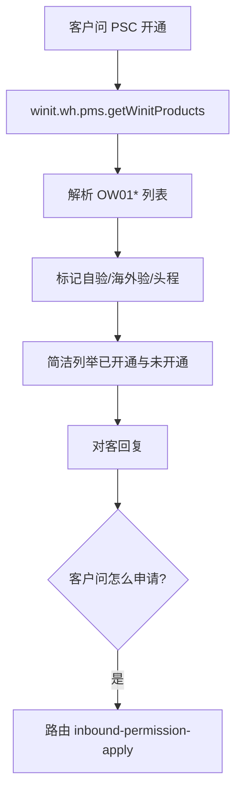

# 入库专家 — inbound-psc-eligibility 业务参考

> 域：`inbound` · Expert ID：`inbound/inbound-psc-eligibility` · 优先级：P1  
> 实现规格：[`experts/inbound/inbound-psc-eligibility/design.md`](../../../experts/inbound/inbound-psc-eligibility/design.md)

## 业务场景

**只读**查询客户当前可用的入库产品线（OW01* 系列）、自验/海外验/头程权限标记。供 `inbound-order-manage`、`inbound-process-guide`、`inbound-permission-apply` 上游调用。

## 典型客户问法

- 「我能用哪些入库产品？」
- 「OW01021 开通了吗？」
- 「有没有自验权限？」
- 「能不能用海外验？」

## 边界分工

| 问 | 不问 |
|----|------|
| 当前开通的 PSC 列表与标记 | 如何申请新权限（→ `inbound-permission-apply`） |
| 只读快照 | CBM/SKU 额度（→ `inbound-capacity-availability`） |

**输出 enrichedContext**：`{ enabledProducts, hasSelfInspection, hasOverseasInspection, hasStandardFirstLeg }`。

---

## 客服处理流程

---

## PSC 解读摘要 `[KB]`

来源：`_kb/product-team/.../inbound-product-details.md` + `_kb/system-team/inbound-psc-codes.md`

| 系列 | 含义 | 验货 |
|------|------|------|
| OW01011* | 标准海外仓入库（Winit 头程） | Winit 国内仓 |
| OW01021* | Winit 承运自验 | 客户发货前自验 |
| OW01022* | 卖家直发自验 | 客户发货前自验 |
| OW01031* | Winit 承运海外验 | Winit 海外仓 |
| OW01032* | 直发海外验 | Winit 海外仓 |
| 预报系列 | 无箱单有预报 | 仅直发海外验特殊场景 |

### 对客原则

- 简洁列举 API 返回的可下单产品及名称
- 未开通时说明「如需申请请参考权限申请流程」，**不含内部链接**
- 不输出额度数字

---

## 系统查询路径

| 场景 | 路径 |
|------|------|
| 客户视角对照 | 万邑联 → 个人中心 → 产品权限 |
| API | `winit.wh.pms.getWinitProducts`（productType: OW0101/OW0102/OW0103） |
| PSC 全量表 | `_kb/system-team/inbound-psc-codes.md`（维护用） |

---

## 转人工 / 升级条件

- API 返回与客户提供截图明显不一致

---

## structured 输出草案

| 字段 | 说明 |
|------|------|
| enabledProducts | `{ productCode, productName, description }[]`（可下单） |
| hasSelfInspection | 是否有自验权限 |
| hasOverseasInspection | 是否有海外验权限 |
| hasStandardFirstLeg | 是否有标准头程 |

---

## Playbook 交叉引用

- [appendix-psc-dimensions.md](../../inbound/appendix-psc-dimensions.md)
- [playbook.md §三 产品分层](../../inbound/playbook.md)

---

## KB 溯源表

| 优先级 | 文档 | 标注 |
|--------|------|------|
| 1 | `_kb/product-team/.../inbound-product-details.md` | `[KB]` |
| 1 | `_kb/system-team/inbound-psc-codes.md` | `[KB]` |
| 2 | `新增海外仓入库单的常见问题.md`（权限片段） | `[KB]` |
| 2 | `无箱单有预报常见问答.md`（OW01031/32 预报） | `[KB]` |
| 1 | `_kb/system-team/public-api/OSWH/入库/17-查询头程服务.md` | `[KB]` |
