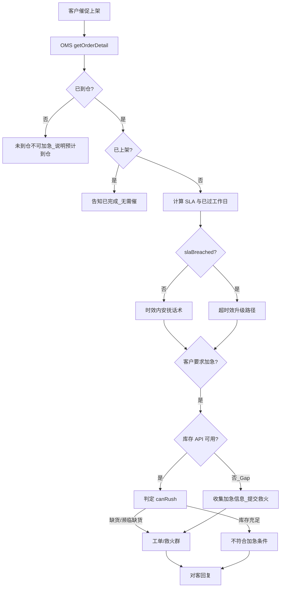

# 入库专家 — inbound-putaway-expedite 业务参考

> 域：`inbound` · Expert ID：`inbound/inbound-putaway-expedite` · 优先级：P0  
> 实现规格：[`experts/inbound/inbound-putaway-expedite/design.md`](../../../experts/inbound/inbound-putaway-expedite/design.md)

## 业务场景

客户**催促上架、反馈超时效未上架、促销/活动急需**。咨询量约 813 条：普通催促(605)、超 24h(177)、活动急需(30)。本专家判断 SLA、给出升级路径；**不做责任判定**。

## 典型客户问法

- 「都到仓三天了怎么还没上架？」
- 「明天活动开始，能帮我加急吗？」
- 「超 24 小时了，帮我催一下」
- 「能不能走加急通道？」

## 边界分工

| 问 | 不问 |
|----|------|
| 催上架、超 SLA、加急条件、工单路径 | 纯进度查询（→ `inbound-putaway-status`） |
| 升级动作建议 | 数量差异判责（→ `inbound-exception-check`） |

**衔接**：共享 `inbound-putaway-status` 的 SLA 矩阵与到仓时间取值规则。

---

## 客服处理流程

---

## 上架 SLA 矩阵 `[KB]`

来源：`_kb/service-team/.../咨询入库单上架时间及催上架处理流程.md`（详见 [playbook.md §六](../../inbound/playbook.md)）

### 美国 — 标准海外仓入库（到仓后工作日）

| 头程产品 | SLA |
|----------|:---:|
| 空运 / FedEx 快递 | 1 |
| 海运散货（美森/以星） | 2 |
| 海运散货（其他）/ 海运整柜 | 3 |
| UPS 快递 / 单号为空 | 4 |

### 美国 — 直发国内验

| 头程产品 | SLA | 备注 |
|----------|:---:|------|
| 空卡 | 1 | POD 须注明空卡+11位航单号，否则按海卡 4 日 |
| DHL 快递 | 1 | — |
| 其他快递/空 | 4 | — |
| 空派/海派 | 4 | — |
| 海运整柜/海卡 | 4 | — |

### 美国 — 直发海外验

| 头程产品 | SLA |
|----------|:---:|
| 空卡 | 2（无航单号按海卡 5 日） |
| DHL | 2 |
| 其他快递/空派/海派 | 5 |
| 海运整柜/海卡 | 5 |

### 非美国（英/德/澳/加）— 摘要

| 产品线 | 空运/快递 | 海运/铁路 |
|--------|:---------:|:---------:|
| 标准 | 1 | 3 |
| 直发国内验 | 1–4（视头程） | 3–4 |
| 直发海外验 | 2–5（视头程） | 4–5 |

**重要**：对客不说「24 小时」，统一用「X 个工作日」；节假日不计入。

---

## 分支决策表

| 条件 | 客服动作 | 对客话术要点 |
|------|----------|--------------|
| 未到仓 | 不可加急 | 待仓库收到后按 SLA 安排 |
| 时效内催促 | 安抚 | 仓库按收货情况排期，会在 SLA 内完成 |
| 超 SLA | 升级 | 提交工单/救火，说明已过标准 X 工作日 |
| 客户要求加急 | 收集信息 | 加急原因、包裹号/箱号、SKU 明细与数量 |
| 加急前提 `[KB]` | 内部 | 须已到仓；非特殊情况尽量不加急 |
| 促销加急 `[推断]` | 库存判定 | 目的仓 SKU 缺货或濒临缺货才可加急；库存充足则婉拒 |
| 已完成上架 | 终止 | 直接告知已上架，不做无效催促 |

### 超时效升级话术 `[KB]`

触发：系统显示已到仓且超过 SLA 截止日。

1. 致歉并说明已超标准时效
2. 提交仓库加急/核实工单
3. 安排专人跟进并同步结果

---

## 系统查询路径

| 场景 | 路径 |
|------|------|
| 到仓/上架状态 | TOM → 综合查询 → 入库单查询 |
| 加急救火（内部） | 发货仓入库&增值运营救火群 IB&VAS |
| API | `getOrderDetail`（SLA 用 **N** 表头；加急 SKU 用 **Y** + 根级 **`merchandiseList`**，extract 删 `packageList`）+（下期）`queryProductInventoryList4Page` |

> id/39：**N 不返回 `merchandiseList`**。详见 [`inbound-getOrderDetail-detail-strategy.md`](../../plan/inbound-getOrderDetail-detail-strategy.md)

---

## 转人工 / 升级条件

- `slaBreached=true` 且客户不接受安抚
- 加急信息已收集需人工提交救火群
- `canRush=null`（库存 API Gap）但客户坚持活动加急

---

## structured 输出草案

| 字段 | 说明 |
|------|------|
| slaBreached | 是否超 SLA |
| slaWorkingDays / workingDaysElapsed | 标准天数 / 已过天数 |
| escalationPath | 工单/救火/联系客服 |
| canRush | 是否符合加急（库存 API Gap 时为 null） |
| canRushReason | `low_stock` / `out_of_stock` / `stock_sufficient` / `inventory_check_not_available` |
| alreadyPutaway | 是否已完成 |

---

## Playbook 交叉引用

- [inbound-putaway-status.md](inbound-putaway-status.md) — 进度查询分工
- [flows/07-receiving-putaway-exceptions.md](../../inbound/flows/07-receiving-putaway-exceptions.md)

---

## KB 溯源表

| 优先级 | 文档 | 用途 | 标注 |
|--------|------|------|------|
| 1 | `_kb/service-team/.../咨询入库单上架时间及催上架处理流程.md` | 全流程决策树、SLA、加急 | `[KB]` |
| 2 | `docs/inbound/playbook.md` §六 | SLA 速查 | `[KB]` |
| 3 | `_kb/product-team/.../overseas-warehouse-arrival-shelving-sla.md` | 产品 SLA | `[KB]` |

### 待产品确认 `[推断]`

- SLA 计时起点：`dicDate` vs `awhDate`
- `safetyThreshold`（濒临缺货阈值）定标
- **`isIncludePackage=Y` 大柜** 加急路径的插件超时风险（无包裹分页 API）
