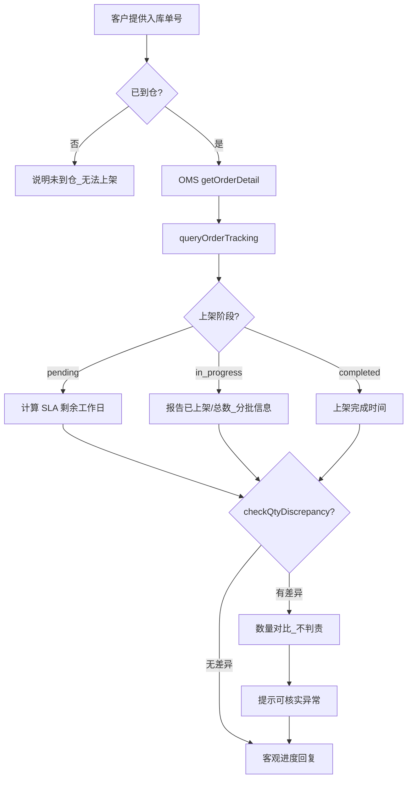

# 入库专家 — inbound-putaway-status 业务参考

> 域：`inbound` · Expert ID：`inbound/inbound-putaway-status` · 优先级：P0  
> 实现规格：[`experts/inbound/inbound-putaway-status/design.md`](../../../experts/inbound/inbound-putaway-status/design.md)

## 业务场景

客户询问**上架了没有、预计何时完成、是否分批上架、实际上架数量**。咨询量约 804 条（上架进度 557 + 数量核实 247）。本专家只客观报告进度与数量对比，**不催促、不判责**。

## 典型客户问法

- 「上架了吗？还要多久？」
- 「为什么只上了一部分？」
- 「上架数量和预报对不上」
- 「SHD 和 EWC 有什么区别？」

## 边界分工

| 问 | 不问 |
|----|------|
| 上架进度、预计完成、数量对比摘要 | 催促/加急（→ `inbound-putaway-expedite`） |
| 数量差异事实陈述 | 差异判责/异常核实（→ `inbound-exception-check`） |
| 是否到仓 | → `inbound-arrival-status` |

**衔接**：`slaBreached` 仅标注超时，不主动催架；`qtyComparison` 有差异时提示可转 `inbound-exception-check`。

---

## 客服处理流程

---

## 上架完成判定 `[KB]`

查询路径：TOM → 综合查询 → 入库单查询 → 查看状态与上架时间字段。

| 状态 | 含义 |
|------|------|
| PEWC | 到仓/验货中，尚未完成上架 |
| EWC | 上架完成（可能分批） |
| SHD | 全部 SKU 已入库存可用 |

---

## 数量字段对照 `[KB]`

| 字段 | 含义 | 注意 |
|------|------|------|
| `merchandiseList[].quantity` | 预报 SKU 数量 | 须 `isIncludePackage=Y` |
| **`merchandiseList[].actualQuantity`** | SKU 实际上架数量 | 上架进度主数据源 |
| `merchandiseList[].inspectionQty` | 验收数量 | SKU 级 |
| `totalMerchandiseQty` / `totalPackageQty` | 表头汇总 | `isIncludePackage=N` 时仅有表头 |
| orderPackageQty / actualOrderPackageQty | 包裹数对比 | 直发场景常用 |

有差异时话术：「实际上架 N 件，预报 M 件，差异 X 件」——**不做责任判定**。

---

## SLA 参考（进度预估）

完整矩阵见 [inbound-putaway-expedite.md](inbound-putaway-expedite.md) 与 [playbook.md §六](../../inbound/playbook.md)。

本专家用途：
- 未到 SLA 截止：告知预计在 X 日前完成（工作日，不含节假日）
- 已过 SLA：`slaBreached=true`，注明已超标准时效，**建议客户如需催架联系 `inbound-putaway-expedite`**

### 到仓时间取值（与 inbound-arrival-status 一致）`[KB]`

- 快递：妥投时间或卸货时间
- 散货：预约实际到仓
- 整柜 LIVE：实际到仓；DROP：预约卸货时间

---

## 分支决策表

| 条件 | 对客要点 |
|------|----------|
| 时效内未上架 | 仓库按 SLA 排期，请耐心等待（本专家语气，非催架） |
| 分批上架 | 说明已完成部分，剩余按排期继续 |
| 数量少/多 | 陈述对比数字，差异核实 → `inbound-exception-check` |
| 已完成上架 | 给出 `shelveCompletedDate`，无需等待 |

---

## 系统查询路径

| 场景 | 路径 |
|------|------|
| 上架状态 | TOM → 综合查询 → 入库单查询 → 轨迹 |
| API | `getOrderDetail`（**`isIncludePackage=Y`** 取根级 **`merchandiseList[].actualQuantity`**；无包裹分页 API，代码内丢弃 `packageList`）+ **`queryOrderTracking`** |

> 详情分层策略：[`inbound-getOrderDetail-detail-strategy.md`](../../plan/inbound-getOrderDetail-detail-strategy.md)

---

## 转人工 / 升级条件

- 系统状态与客户提供现场信息严重矛盾
- 数量差异极大且客户要求判责（→ `inbound-exception-check` 或人工）

---

## structured 输出草案

| 字段 | 说明 |
|------|------|
| putawayStage | `pending` / `in_progress` / `completed` |
| shelveCompletedDate | 完成时间 |
| estimatedComplete | 预计完成（推断） |
| qtyComparison | `{ expected, putaway, discrepancy, anomalySkuCount? }`（来自 `aggregate-sku-putaway`） |
| skuPutawaySummary | SKU 上架聚合摘要 |
| requiresNarrowing | 大柜未提供箱号时 true |
| workingDaysElapsed | 到仓后已过工作日 |
| slaBreached | 是否超 SLA（仅标注） |

---

## Playbook 交叉引用

- [flows/07-receiving-putaway-exceptions.md](../../inbound/flows/07-receiving-putaway-exceptions.md)
- [inbound-putaway-expedite.md](inbound-putaway-expedite.md) — SLA 矩阵权威出处

---

## KB 溯源表

| 优先级 | 文档 | 用途 | 标注 |
|--------|------|------|------|
| 1 | `_kb/service-team/.../咨询入库单上架时间及催上架处理流程.md` | SLA、到仓定义 | `[KB]` |
| 1 | `_kb/service-team/.../如何查询入库单是否上架完成.md` | 查询步骤 | `[KB]` |
| 2 | `_kb/product-team/.../overseas-warehouse-arrival-shelving-sla.md` | SLA 产品规则 | `[KB]` |
| 3 | `docs/inbound/playbook.md` §六 | SLA 速查表 | `[KB]` |

### 待产品确认 `[推断]`

- `dioDate` vs `shelveCompletedDate` 先后关系
- 分批上架时 `actualQuantity` 是否实时更新
- **`isIncludePackage=Y` 大柜全量响应** 的 Coze 插件超时上限（无包裹分页 API）
