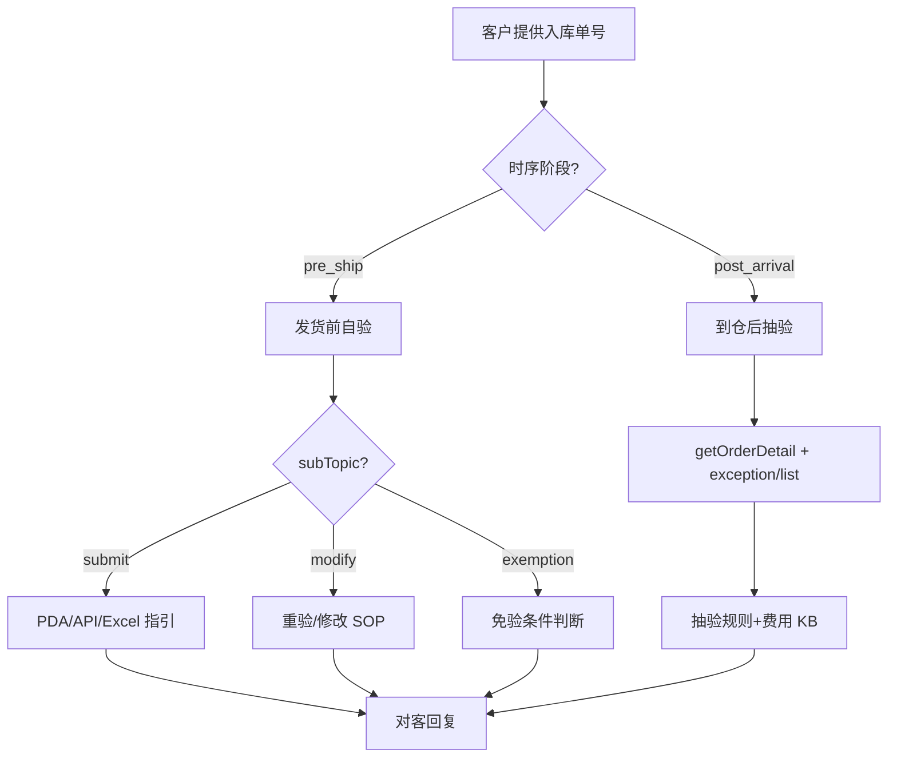

# 入库专家 — inbound-self-inspection 业务参考

> 域：`inbound` · Expert ID：`inbound/inbound-self-inspection` · 优先级：P1  
> 实现规格：[`experts/inbound/inbound-self-inspection/design.md`](../../../experts/inbound/inbound-self-inspection/design.md)

## 业务场景

OW01021/OW01022 链路**自验**闭环：发货前（OD→TS）验货操作与到仓后（PEWC）抽验结果。与 `inbound-overseas-inspection`（Winit 全程海外验）严格区分。

## 典型客户问法

- 「自验数据提交了吗？PDA 怎么扫？」
- 「验货填错了怎么重验？」
- 「抽验结果是什么？收了多少费？」
- 「我能用免验吗？」
- 「新自验和旧自验有什么区别？」

## 边界分工

| 问 | 不问 |
|----|------|
| 自验状态、提交/重验指引、抽验结果与费用、免验条件 | 验货规则/PSC 选型（→ `inbound-process-guide`） |
| PDA/API/Excel 路径 | 海外验进度（→ `inbound-overseas-inspection`） |
| 抽验费用说明 | 上架后数量差异判责（→ `inbound-exception-check`） |

**时序**：`pre_ship` 分支处理发货前；`post_arrival` 处理抽验。

---

## 客服处理流程

---

## 自验方式摘要 `[KB]`

| 方式 | 适用 | 要点 |
|------|------|------|
| 旧自验 | OW01021 经典流程 | 须先上传箱单，验货与箱单一一匹配 |
| 新自验（QSI） | 下单仅 SKU+数量 | 支持重验；无需预先完整箱单 |
| 快速自验 | OW01022 | SelfInspectionPlanSKU 模式 |
| PDA App | 现场扫描 | 扫描枪 App 需更新至最新版 |
| API / Excel | 批量 | 见各自 FAQ |
| 第三方条码 | 特殊场景 | `自验货第三方包裹条码验货.md` |

### 发货前常见分支

| 问题 | 对客要点 |
|------|----------|
| 填错需修改 | 新自验可点「重验」更新；旧自验按 KB 修改流程 |
| 扫描查不到单 | 更新 PDA App 后重试 |
| 免验条件 | `isAutoInspection=Y` 等规则见 `免自验常见问题.md` |
| 验货未完成不能预约 | 自验直发须完成验货才能创建预约单 |

### 到仓后抽验 `[KB]`

| 项目 | 说明 |
|------|------|
| 数据源 | `getOrderDetail.inspectionStatus` + `inboundOrderException/list` |
| 抽验类型 | OW01V1266-68 系列，规则见 `inbound-rules.md` |
| 费用 | 从异常单推断或 `exceptionReason` 文本；独立字段待确认 |
| 超容差差异 | 转 `inbound-exception-check` 聚合报告 |

---

## 系统查询路径

| 场景 | 路径 |
|------|------|
| 验货状态 | 万邑联 → 自验进度；API：`getOrderDetail` |
| 抽验异常 | 云仓入库异常记录；API：`inboundOrderException/list` |
| 写操作 | `selfinspection.submit`（**本专家不调用**，仅 SOP 指引） |

---

## 转人工 / 升级条件

- 抽验费用争议且异常单无明确字段
- 权限回收预警需人工确认
- 验货系统细粒度 PDA 记录 Gap

---

## structured 输出草案

| 字段 | 说明 |
|------|------|
| inspectionPhase | `pre_ship` / `post_arrival` |
| inspectionStatus | 验货状态 |
| submitGuide | 提交方式指引 |
| samplingResult | 抽验结果摘要 |
| samplingFee | 抽验费用（如有） |
| exemptionEligible | 是否满足免验 |

---

## Playbook 交叉引用

- [flows/02-direct-self-inspection.md](../../inbound/flows/02-direct-self-inspection.md)

---

## KB 溯源表

| 优先级 | 文档 |
|--------|------|
| 1 | `自验货方式常见问题.md` |
| 1 | `自验货的常见问题（旧自验）.md` |
| 1 | `（新版）客户自验常见问题（...）.md` |
| 1 | `快速自验常见问题.md` |
| 1 | `免自验常见问题.md` |
| 1 | `自验货第三方包裹条码验货.md` |
| 1 | `自验-WINIT承运-海运整柜下单常见问题.md` |
| 2 | `_kb/product-team/.../inbound-rules.md`（抽验/收费） |

### 待产品确认 `[推断]`

- 验货状态独立查询接口 vs `getOrderDetail` 字段
- 抽验费独立字段是否存在
