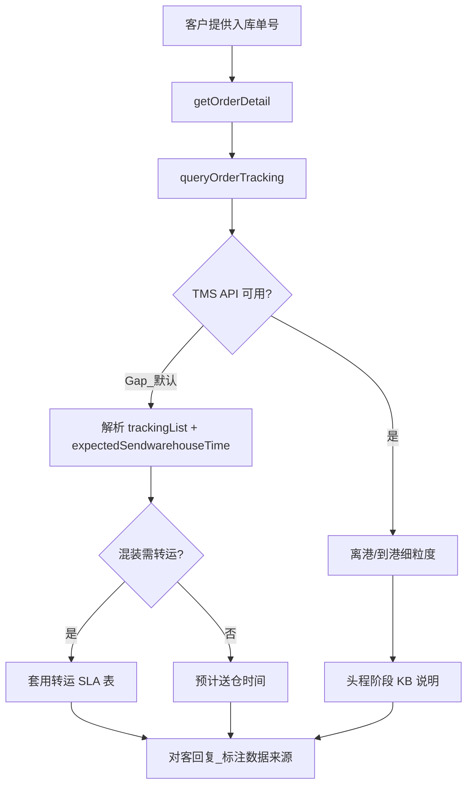

# 入库专家 — inbound-transit-tracking 业务参考

> 域：`inbound` · Expert ID：`inbound/inbound-transit-tracking` · 优先级：P1  
> 实现规格：[`experts/inbound/inbound-transit-tracking/design.md`](../../../experts/inbound/inbound-transit-tracking/design.md)

## 业务场景

TS 阶段**头程在途追踪**：离港、到港、预计送仓时间。与 `inbound-arrival-status`（已到仓）和 `inbound-customs-clearance`（清关合规）分工明确。TMS 细粒度里程碑当前为 **Gap**，OMS 轨迹兜底。

## 典型客户问法

- 「货离港了吗？什么时候到的港？」
- 「现在在海上还是已经到港了？」
- 「预计什么时候送到仓库？」
- 「混装柜转运要多久？」

## 边界分工

| 问 | 不问 |
|----|------|
| TS 阶段运输里程碑、ETA 送仓 | 清关文件/合规（→ `inbound-customs-clearance`） |
| 离港/到港/送仓时间 | 已到仓后上架（→ `inbound-putaway-status`） |
| 混装转运 SLA 推算 | 快递妥投/POD（→ `inbound-arrival-status`） |

---

## 客服处理流程

---

## 头程查询 SOP 分支 `[KB]`

### 起始话术

「您好，请提供入库单，这边为您查询。」

### 离港 / 到港

| 查询项 | 客服路径 |
|--------|----------|
| 离港时间 | TOM → 智运 → 跨国运输 → 空运/海运物流单 |
| 到港时间 | 同上；参考 `查询头程到港时间的处理流程.md` |
| OMS 兜底 | TOM → 综合查询 → 入库单查询 → 轨迹页签 |

### 预计送仓

来源：`查询头程送仓时间的处理流程.md`

| 混装转运场景 | 推算规则（摘要） |
|--------------|------------------|
| USWC ↔ USWC2 | 送仓完成/预计 +2 工作日 |
| USWC(2) → USTX | +11 自然日 |
| USWC(2) → USKY3 | +12 自然日 |
| AU ↔ AUME | +5 自然日 |
| DEBR2 ↔ DE | 中转 5+1 工作日 |

### 清关送仓 SLA 参考（内部）`[KB]`

| 产品 | 国家 | 清关 SLA | 送仓 SLA |
|------|------|:--------:|:--------:|
| 空运 | US | 1 工作日 | 2 工作日 |
| 海运 | US | 1 工作日 | 5 工作日 |
| 空运 | UK | 2 | 5 |
| 海运散货 | UK | 6 | 5 |

**对客**：TMS Gap 时明确说明「细粒度离港/到港节点暂无法实时查询，以下为系统可见的运输状态摘要」。

---

## 分支决策表

| 条件 | 对客要点 |
|------|----------|
| 状态 TS，未到港 | 说明在途，给出预计到港/送仓（如有） |
| 已到海外港 | 提示清关进行中，清关节点 → `inbound-customs-clearance` |
| 无轨迹更新 | 不猜测里程碑，建议联系客服核实 |
| 标准头程 Winit 承运 | 以 OMS 轨迹 + 智运查询互补 |

---

## 系统查询路径

| 场景 | 路径 |
|------|------|
| 入库单轨迹 | TOM → 综合查询 → 入库单查询 |
| 智运物流单 | TOM → 智运 → 跨国运输 |
| 预约关联送仓 | TOM → 入库预约单管理 |
| API | `getOrderDetail`（`expectedSendwarehouseTime`）+ **`queryOrderTracking`**（`trackingList`） |

---

## 转人工 / 升级条件

- TMS 全 Gap 且 OMS 无有效 ETA，客户追问具体船名/航班
- 轨迹长期停滞（与 `inbound-arrival-status` 协同）
- 混装转运超 SLA 无更新

---

## structured 输出草案

| 字段 | 说明 |
|------|------|
| currentMilestone | 当前运输里程碑 |
| departureTime | 离港（TMS Gap 时为 null） |
| arrivalPortTime | 到港（TMS Gap 时为 null） |
| etaWarehouse | 预计送仓 |
| tmsDataAvailable | TMS 是否可用 |
| transferNote | 混装转运说明 |

---

## Playbook 交叉引用

- [flows/05-customs-and-international.md](../../inbound/flows/05-customs-and-international.md)
- [inbound-arrival-status.md](inbound-arrival-status.md) — 到仓后分工

---

## KB 溯源表

| 优先级 | 文档 |
|--------|------|
| 1 | `查询头程离港时间的处理流程.md` |
| 1 | `查询头程到港时间的处理流程.md` |
| 1 | `查询头程送仓时间的处理流程.md` |
| 2 | `流程起始话术.md`（混装话术） |
| 2 | `为什么进口清关时间比到港时间早？...md` |

### 待产品确认 `[推断]`

- TMS 智运 API 全 Gap，需研发提供接口规格
- OMS `trajectoryList` TS 子节点粒度
