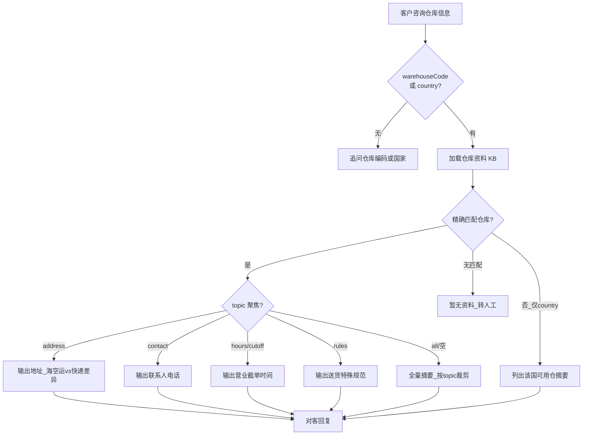

# 入库专家 — inbound-warehouse-info 业务参考

> 域：`inbound` · Expert ID：`inbound/inbound-warehouse-info` · 优先级：P0  
> 实现规格：[`experts/inbound/inbound-warehouse-info/design.md`](../../../experts/inbound/inbound-warehouse-info/design.md)

## 业务场景

客户询问海外仓地址、送货路线、联系人、营业时间、仓型与截单规则等**静态仓库资料**。咨询量约 1,045 条/季，以「仓库地址/路线」(493) 为主。

## 典型客户问法

- 「USWC 仓地址是什么？快递面单怎么填？」
- 「英国仓几点截单？周末收货吗？」
- 「直发地址为什么要写 C/O？」
- 「澳洲仓联系电话打不通怎么办？」
- 「这个仓是商业地址还是住宅地址？」

## 边界分工

| 问 | 不问 |
|----|------|
| 仓库地址、路线、联系人、营业时间、仓型、截单、送货填写规范 | 某单是否到仓/上架（→ `inbound-arrival-status` / `inbound-putaway-status`） |
| 直发面单收件人格式、C/O 填写要求 | 库容/Slots 剩余（→ `inbound-capacity-availability`） |
| 预约送仓操作步骤 | 预约违规费（→ `inbound-appointment-manage`） |

**衔接**：可为 `inbound-appointment-manage`、`inbound-arrival-status` 补充仓库基础资料上下文。

---

## 客服处理流程

---

## 分支决策表

| 条件 | 客服动作 | 对客话术要点 |
|------|----------|--------------|
| 客户问直发地址 | 区分海空运 vs 快递面单格式 | 海空运：CNEE 填进口商/Buyer；快递：收件人 `Online Seller C/O 3rd Pty Warehouse`（澳洲填客户简称+编码） |
| 客户问 C/O 能否不填 | 明确不可省略 | C/O 表示 in care of（转交），标示货权非万邑通；字符限制可写 `in care of` 或 `C.O.` |
| 货代不能填 Online Seller | 提供替代格式 | ①客户 ID；②店铺名称+eBay+客户 ID |
| 联系电话打不通 | 说明预约线上化 | 预约通过 booking.winit.com.cn；电话非送仓必须条件，按预约时间送货即可 |
| 地址是否住宅 | 确认商业地址 | 海外仓为商业地址，不产生住宅派送费 |
| 德国 Straße 打不出 | 字符替换 | 可改为 `strasse` 重打面单 |
| 发票能否填海外仓地址 | 区分运输方式 | 空运海运发票不能显示万邑通地址；快递可与面单一致但须标明 IOR |
| KB 无该仓编码 | 转人工 | 「暂无该仓库资料，建议联系客服确认」 |

---

## 仓库资料摘要（主数据表头）`[KB]`

来源：`_kb/service-team/inbound-services-doc/海外仓的头程直发收货地址.md`

| 仓库编码 | 国家 | 备注 |
|----------|------|------|
| AU / AUME | 澳洲 | 快递收件人须客户简称+编码，不可填 Online Seller |
| USTX | 美南 | 2022.7.15 起新地址 Beltline Road, Houston |
| USWC / USWC2 / USWC5 | 美西 | USWC 2024.4.15 搬仓；多仓互转见 arrival SOP |
| USKY3 / USKY5 / USNJ / USNJ2 / USGA | 美国其他 | USNJ2 含专用邮箱联系人 |
| UK / UKGF / UKTW | 英国 | UK 仓建议面单备注 NOT FOR AMAZON |
| DE / DEBR2 | 德国 | — |
| BE | 比利时 | — |
| CATO | 加拿大 | 2023.8.14 搬仓至 Brampton |

实现期应将上表展开为 `prompts/warehouse-profiles.md` 结构化映射（含完整地址、电话、海空运/快递差异）。

---

## 系统查询路径

本专家**无实时 API**，纯 KB/RAG。客服人工核实仓库运营公告时可选：

| 场景 | 路径 |
|------|------|
| 确认仓是否搬址/停收 | 查 KB 主文档更新说明；运营公告（未来 `warehouse/operations-status`） |

---

## 转人工 / 升级条件

- KB 无该 `warehouseCode` 或 `country` 无匹配仓
- VIP 仓特殊安排、临时爆仓/停收（超出静态资料）
- 客户问题涉及单票到仓/上架状态

---

## structured 输出草案

| 字段 | 说明 |
|------|------|
| warehouseCode | 仓库编码 |
| warehouseName | 仓库名称 |
| country | 国家 |
| address | 完整地址（按海空运/快递区分时放 specialNotes） |
| contactPhone | 联系电话 |
| businessHours / cutoffTime | 营业时间/截单 |
| warehouseType | 仓型 |
| specialNotes | C/O 要求、NOT FOR AMAZON、搬仓提示等 |

---

## Playbook 交叉引用

- [playbook.md §术语表](../../inbound/playbook.md) — DROP/LIVE、LCL/FCL
- [flows/06-appointment-and-delivery.md](../../inbound/flows/06-appointment-and-delivery.md) — 送仓方式与预约关系

---

## KB 溯源表

| 优先级 | 文档 | 用途 | 标注 |
|--------|------|------|------|
| 1 | `_kb/service-team/.../海外仓的头程直发收货地址.md` | 地址表 + 直发 FAQ 2.1–2.10 | `[KB]` |
| 2 | `_kb/service-team/.../海外仓头程快递入库服务常见问题.md` | 仓型/截单片段 | `[KB]` |
| 3 | `docs/inbound/playbook.md` §六 SLA 速查 | 截单/时效上下文 | `[KB]` |

### 待产品确认 `[推断]`

- 仓库编码规范化：`USLAX01` vs `US_LAX_01` 别名映射
- KB 更新频率与维护责任人
