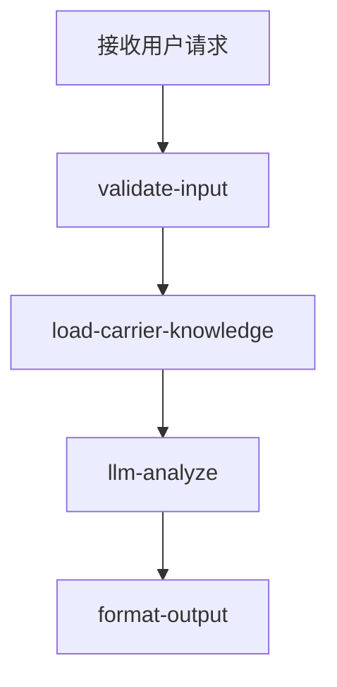

# 尾程专家系统 - carrier-contact 设计文档

## 业务场景

提供承运商服务商、自提点等客服联系方式，用户需要联系快递服务商时提供正确的联系电话和地址信息。

## 专家ID

`carrier-contact`

## 专家名称

服务商自提点联系方式

---

## 一、业务处理流程

---

## 二、SOP 与 KB

| 项目 | 说明 |
|------|------|
| 飞书 SOP | [（海外仓）各供应商的客服电话](https://winitlink.feishu.cn/wiki/Ndqvw5WnSip7Juk9JavcVrapnPf) |
| AI 流程 | [咨询运输商联系方式](https://winitlink.feishu.cn/wiki/VJ6MwL0EeiZqhekaMBccEewjnse) |
| 本地 KB | [experts/last-mile/carrier-contact/prompts/kb.md](../../experts/last-mile/carrier-contact/prompts/kb.md)（与 `load-carrier-knowledge.ts` 内嵌正文同步） |

---

## 三、输入输出 Schema

与 [experts/last-mile/carrier-contact/manifest.json](../../experts/last-mile/carrier-contact/manifest.json)、[design.md](../../experts/last-mile/carrier-contact/design.md) 一致；可选 **`enrichedContext`**，编排器建议传播 **`delivery-status`** 产出。

---

## 四、代码实现状态

- [x] `manifest.json`（含 `x_recaller_*`）
- [x] `workflow.json` + `coze.config.yml`
- [x] `nodes/validate-input.ts`、`load-carrier-knowledge.ts`、`format-output.ts`、`llm-analyze.ts`
- [x] `prompts/main.md`、`prompts/kb.md`
- [ ] 万邑通主数据 API（待契约后接入）

---

**文档生成时间**：2026年5月4日
