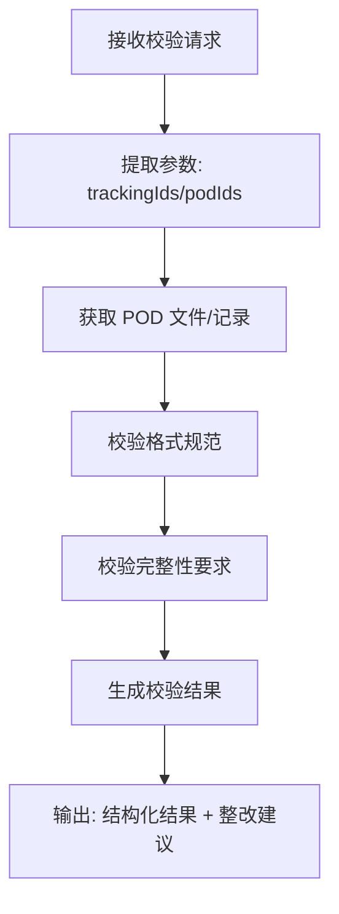

# 尾程专家系统 - pod-validation 设计文档

## 业务场景
对客户或仓库上传的电子妥投证明（vPOD/ePOD）进行实时校验，判断是否符合格式和业务规范，并给出整改建议。

## 专家ID
`pod-validation`

## 专家名称
vPOD/ePOD 校验

---

## 一、业务处理流程



---

## 二、SOP 关键信息整理

| 项目 | 说明 |
|------|------|
| **适用场景** | 需要判断上传或提供的 POD 是否符合 vPOD/ePOD 规范 |
| **关联场景** | `pod-request`（申请获取 POD）是前置场景，本专家做后续合规校验 |
| **不适用场景** | 尚未取得任何 POD 标识、无法关联运单时 |

---

## 三、输入输出 Schema

### 输入设计

#### 框架顶层（调用边界，不在 manifest.inputSchema 内）

| 字段 | 类型 | 说明 |
|------|------|------|
| `query` | string | 委托任务说明，可为空 |
| `customerIntent` | string | 业务摘要，可为空 |
| `inputContext` | object | 可选；链式上下文 |
| `customerCode` | string | 租户代码（框架约定，顶层保留） |
| `customerName` | string | 客户名称（框架约定，顶层保留） |
| `username` | string | 用户名（框架约定，顶层保留） |
| `language` | string | 语言（框架约定，顶层保留） |

#### `inputs` 内业务字段（与 manifest.json 一致）

| 字段 | 类型 | 必填 | 说明 |
|------|------|------|------|
| `trackingIds` | string[] | 否 | 轨迹单号，关联订单信息 |
| `podIds` | string[] | 否 | POD ID列表，与平台侧POD记录ID对齐 |

> 最小入参要求：建议同时提供 `trackingIds` 与 `podIds` 中至少一类非空；仅有一类时依赖具体实现能力。

### 输出设计

| 字段 | 类型 | 说明 |
|------|------|------|
| `structured` | object | 结构化数据：POD ID列表、校验结果（通过/不通过） |
| `analysis` | string | 校验结果说明、是否符合规范、整改建议 |

---

## 四、调用说明

### 最小入参
`trackingIds` 与 `podIds` 中至少一类非空。

### 参数提示
- `podIds` 与平台侧 POD 记录 ID 对齐；请勿与文件名混淆
- 多专家编排时透传 `inputContext.chainId`

### 示例调用

```json
{
  "query": "这份 POD 截图能通过校验吗？",
  "customerIntent": "客户担心格式不合规",
  "customerCode": "",
  "customerName": "",
  "username": "",
  "language": "",
  "inputContext": {
    "chainId": "podv-001",
    "sourceExpertId": "",
    "previousOutput": ""
  },
  "inputs": {
    "trackingIds": ["1Z999AA10123456784"],
    "podIds": ["POD-20250401-001"]
  }
}
```

```json
{
  "query": "",
  "customerIntent": "",
  "customerCode": "",
  "customerName": "",
  "username": "",
  "language": "",
  "inputContext": {},
  "inputs": {
    "trackingIds": [],
    "podIds": ["POD-ABC"]
  }
}
```

---

## 五、代码实现状态

- ✅ 框架结构已创建 (`manifest.json`)
- ✅ 设计文档已完成 (`design.md`)
- ⚠️ `nodes/` 目录已创建，节点待实现
- ⚠️ `prompts/` 目录已创建，提示词待完善
- ⚠️ 工作流 `workflow/` 未创建，需要后续编排

---

## ⚠️ 外部系统依赖

本专家流程需要调用以下外部系统/服务才能完成自动处理：

- **TOM系统**（获取POD记录和文件数据）
- **可选：图像识别服务**（OCR识别POD内容校验）

---

**文档生成时间**：2026年04月27日
**数据源**：代码仓库 `design.md` + `manifest.json` 分析整理
