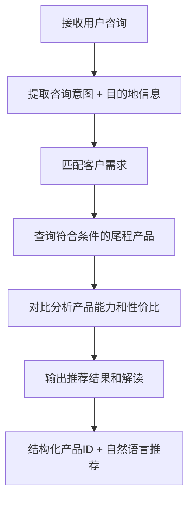

# 尾程专家系统 - product-consult 设计文档

## 业务场景
客户咨询尾程产品服务，提供尾程产品推荐、线路能力解读、适配目的地分析，解答客户关于选品的疑问。

## 专家ID
`product-consult`

## 专家名称
尾程产品服务咨询

---

## 一、业务处理流程



---

## 二、SOP 关键信息整理

| 项目 | 说明 |
|------|------|
| **适用场景** | 客户咨询尾程产品、线路能力、适配目的地，需要产品推荐和能力解读 |
| **不适用场景** | 已锁定具体产品仅查询价格/下单参数时 → 优先使用 `product-info` |
| **与 `product-info` 的关系** | `product-consult` 做推荐咨询 → `product-info` 查具体信息，可形成链式调用 |

---

## 三、输入输出 Schema

### 输入设计

#### 框架顶层（调用边界，不在 manifest.inputSchema 内）

| 字段 | 类型 | 说明 |
|------|------|------|
| `query` | string | 用户咨询内容，可为空 |
| `customerIntent` | string | 业务摘要，可为空 |
| `inputContext` | object | 可选；链式上下文 |
| `customerCode` | string | 租户代码（框架约定，顶层保留） |
| `customerName` | string | 客户名称（框架约定，顶层保留） |
| `username` | string | 用户名（框架约定，顶层保留） |
| `language` | string | 语言（框架约定，顶层保留） |

#### `inputs` 内业务字段（与 manifest.json 一致）

| 字段 | 类型 | 必填 | 说明 |
|------|------|------|------|
| `destination` | string | 否 | 目的地（国家/地区或仓配目的地） |

> 最小入参要求：可无业务字段（`inputs` 为空对象）；提供 `destination` 时推荐更精准。

### 输出设计

| 字段 | 类型 | 说明 |
|------|------|------|
| `structured` | object | 结构化标识符：产品ID、方案ID |
| `analysis` | string | 产品推荐结果、服务能力解读、搭配建议 |

---

## 四、调用说明

### 最小入参
可无业务字段（空 `inputs`）；提供 `destination` 推荐更精准。

### 参数提示
- `destination`：支持国家/地区的自然语言或标准写法，建议与上游地址库对齐
- 用户原话请放在顶层 `query`，不要塞进 `inputs` 业务字段

### 示例调用

```json
{
  "query": "发美国 FBA 有什么尾程产品可选？",
  "customerIntent": "需要性价比和时效对比",
  "customerCode": "",
  "customerName": "",
  "username": "",
  "language": "",
  "inputContext": {
    "chainId": "pc-001",
    "sourceExpertId": "",
    "previousOutput": ""
  },
  "inputs": {
    "destination": "US"
  }
}
```

```json
{
  "query": "介绍一下你们的尾程服务有哪些选择",
  "customerIntent": "",
  "customerCode": "",
  "customerName": "",
  "username": "",
  "language": "",
  "inputContext": {},
  "inputs": {}
}
```

---

## 五、代码实现状态

- ✅ 框架结构已创建 (`manifest.json`)
- ✅ 设计文档已完成 (`design.md`)
- ⚠️ `nodes/` 目录已创建，节点待实现
- ⚠️ `prompts/` 目录已创建，提示词待完善
- ⚠️ 工作流 `workflow/` 未创建，需要后续编排

---

## ⚠️ 外部系统依赖

本专家流程需要调用以下外部系统/服务才能完成自动处理：

- **万邑通价卡系统**（尾程产品信息和价格数据）
- **产品主数据**（产品能力描述）

---

**文档生成时间**：2026年04月27日
**数据源**：代码仓库 `design.md` + `manifest.json` 分析整理
