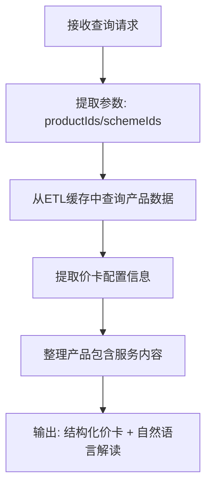

# 尾程专家系统 - product-info 设计文档

## 业务场景
已知产品ID或方案ID，从价卡和综合方案配置中获取尾程产品详细信息，提供价卡解读、配置项说明和产品介绍。

## 专家ID
`product-info`

## 专家名称
尾程产品信息获取

---

## 一、业务处理流程



---

## 二、SOP 关键信息整理

| 项目 | 说明 |
|------|------|
| **适用场景** | 已知产品ID或方案ID，需要查询价卡、配置项等结构化介绍与解读 |
| **不适用场景** | 仅有模糊目的地、需要推荐线路 → 优先使用 `product-consult` |
| **与 `product-consult` 的关系** | `product-consult` 推荐 → `product-info` 查询详情，典型链式调用组合 |
| **数据来源** | 从价卡和综合方案配置ETL获取，数据预同步到数据仓库 |

---

## 三、输入输出 Schema

### 输入设计

#### 框架顶层（调用边界，不在 manifest.inputSchema 内）

| 字段 | 类型 | 说明 |
|------|------|------|
| `query` | string | 委托任务说明，可为空 |
| `customerIntent` | string | 业务摘要，可为空 |
| `inputContext` | object | 可选；链式上下文 |
| `customerCode` | string | 租户代码（框架约定，顶层保留） |
| `customerName` | string | 客户名称（框架约定，顶层保留） |
| `username` | string | 用户名（框架约定，顶层保留） |
| `language` | string | 语言（框架约定，顶层保留） |

#### `inputs` 内业务字段（与 manifest.json 一致）

| 字段 | 类型 | 必填 | 说明 |
|------|------|------|------|
| `productIds` | string[] | 否 | 产品ID列表 |
| `schemeIds` | string[] | 否 | 综合方案ID列表 |

> 最小入参要求：`productIds` 与 `schemeIds` 可均为空但信息不足；至少其一非空结果更准确。

### 输出设计

| 字段 | 类型 | 说明 |
|------|------|------|
| `structured` | object | 结构化数据：产品ID、价卡、方案配置 |
| `analysis` | string | 产品介绍、价卡解读、包含服务说明 |

---

## 四、调用说明

### 最小入参
`productIds` 与 `schemeIds` 至少其一非空。

### 参数提示
- ID 必须与 ETL/主数据一致；大小写与前缀规则按上游约定
- 透传 `inputContext.chainId` 保持追踪链路一致

### 示例调用

```json
{
  "query": "解释这个产品包含哪些服务内容",
  "customerIntent": "销售需要给客户说明",
  "customerCode": "",
  "customerName": "",
  "username": "",
  "language": "",
  "inputContext": {
    "chainId": "pi-001",
    "sourceExpertId": "",
    "previousOutput": ""
  },
  "inputs": {
    "productIds": ["PRD-US-EXP-001"],
    "schemeIds": []
  }
}
```

```json
{
  "query": "",
  "customerIntent": "",
  "customerCode": "",
  "customerName": "",
  "username": "",
  "language": "",
  "inputContext": {},
  "inputs": {
    "productIds": [],
    "schemeIds": ["SCH-COMBO-2025Q2"]
  }
}
```

---

## 五、代码实现状态

- ✅ 框架结构已创建 (`manifest.json`)
- ✅ 设计文档已完成 (`design.md`)
- ⚠️ `nodes/` 目录已创建，节点待实现
- ⚠️ `prompts/` 目录已创建，提示词待完善
- ⚠️ 工作流 `workflow/` 未创建，需要后续编排

---

## ⚠️ 外部系统依赖

本专家流程需要调用以下外部系统/服务才能完成自动处理：

- **数据仓库**（ETL同步的价卡和产品配置数据）
- **万邑通价卡系统**（实时产品数据查询）

---

**文档生成时间**：2026年04月27日
**数据源**：代码仓库 `design.md` + `manifest.json` 分析整理
