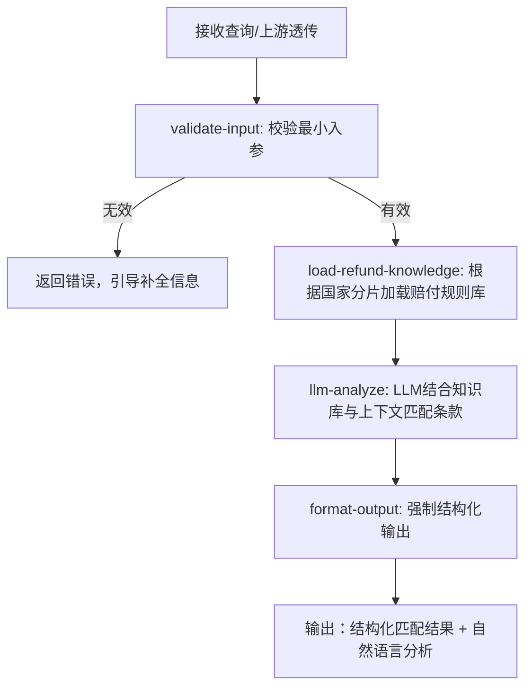

# 尾程专家系统 - refund-standard 设计文档

## 业务场景
根据多维度场景（目的国、产品、事件类型等）从规则库匹配赔付条款，解读赔偿规则、赔付上限、理算逻辑与免责范围。权威来源是飞书表格《WINIT 赔付标准》，数据同步到专家知识库。不负责索赔单进度查询/申请流程，该项由 `substitute-claim`（代客索赔）专家承接。

## 专家ID
`refund-standard`

## 专家名称
赔付标准理解

---

## 一、业务处理流程



---

## 二、SOP 关键信息整理

| 项目 | 说明 |
|------|------|
| **适用场景** | 回答"赔付标准是什么"、"这个情况是否可赔"、"适用哪条条款"、"赔偿上限/赔付窗口/免责范围" |
| **不适用场景** | 代客索赔入口、材料提交、进度查询 → 转 `substitute-claim` 专家 |
| **输出规范** | 对客输出 `analysis` **不得引用飞书链接**或表述"以飞书为准"，须用条款摘要表述；**不替代法务结论** |
| **数据维护** | 运营通过飞书表格维护赔付标准，开发者同步到 `prompts/expert.md` 和 `nodes/load-refund-knowledge.ts` |
| **政策分支** | `winit_ops_sla`（WINIT综合SLA）、`carrier_designated`（标准尾程指定产品）、`carrier_winit_combo`（组合产品尾程） |

### 支持的事件类型（场景码）
- `delivered_not_received` (DNR)：妥投未收到
- `damaged`：破损
- `lost`：丢件
- `delay`：延误
- `warehouse_loss`：仓内丢失

---

## 三、输入输出 Schema

### 输入设计

#### 框架顶层（调用边界，不在 manifest.inputSchema 内）

| 字段 | 类型 | 说明 |
|------|------|------|
| `query` | string | 委托任务说明 |
| `customerIntent` | string | 客户意图或原始问句（可与 `scenario` 二选一或并用） |
| `inputContext` | object | 可选；链式上下文（`chainId`、`sourceExpertId`、`previousOutput`） |
| `customerCode` | string | 租户代码（框架约定，顶层保留） |
| `customerName` | string | 客户名称（框架约定，顶层保留） |
| `username` | string | 用户名（框架约定，顶层保留） |
| `language` | string | 语言（框架约定，顶层保留） |

#### `inputs` 内业务字段（与 manifest.json 一致）

| 字段 | 类型 | 必填 | 说明 |
|------|------|------|------|
| `scenario` | string | 否 | 场景类型或内部场景码 |
| `trackingIds` | string[] | 否 | 轨迹单号/运单号 |
| `outboundOrderNos` | string[] | 否 | 出库单号，用于与 `delivery-status` 衔接 |
| `enrichedContext` | object | 否 | 上游合并上下文，见下表建议字段 |
| `country` / `destinationCountry` / `destinationRegion` | string | 否 | 目的国 ISO2，三者择一即可（用于国家分片） |

> **最小入参要求**：至少提供 `scenario`、`customerIntent`、`enrichedContext`（非空）、`trackingIds` 或 `outboundOrderNos` 之一。

**`enrichedContext` 建议字段（上游合并提供）：**

| 字段 | 说明 |
|------|------|
| `productFamily` | 产品线识别 |
| `destinationCountry` | 目的国 |
| `serviceLevel` | 服务级别 |
| `declaredValue` | 货值/申报线索 |
| `trajectorySummary` | 轨迹事件摘要 |
| `incidentType` | 事件类型（DNR/damaged/lost/delay）|
| `orderDetails` | 出库单精简信息 |

### 输出设计

| 字段 | 类型 | 说明 |
|------|------|------|
| `structured.policyBranch` | enum | 政策分支：`winit_ops_sla`/`carrier_designated`/`carrier_winit_combo`/`unknown` |
| `structured.matchedRuleIds` | string[] | 匹配的规则/条款ID列表 |
| `structured.scenarioSummary` | string | 标准化场景一句话概括 |
| `structured.dimensionsConsidered` | object | `{ considered: [...], missing: [...] }` 已用维度与缺失项 |
| `structured.confidence` | enum | `high`/`medium`/`low` 匹配置信度 |
| `structured.suggestedNextStep` | string | 建议下游：`route_to_substitute_claim`/`need_order_details`/`escalate_human` |
| `analysis` | string | 条款摘要、理算说明、免责声明（六段式输出降低漏项） |

---

## 四、调用说明

### 最小入参
二选一即可跑通：`customerIntent` 或 `scenario`；建议同时提供 `enrichedContext`（至少含目的国/产品/事件类型线索之一）以提高匹配准确度。

### 参数提示
- 国家分片：支持 DC、BE、DE、UK、US、CA；未支持国家返回 `countryShardMode: unsupported`，建议人工核对
- `enrichedContext` 越完整，置信度越高；缺失关键维度体现在 `dimensionsConsidered.missing`

### 示例调用

**示例 1：仅意图 + 目的国（快速匹配条款分支）**
```json
{
  "query": "匹配适用赔付条款并说明理算要点与免责",
  "scenario": "delivered_not_received",
  "customerIntent": "客户说妥投未收到，想确认是否可赔、怎么赔",
  "country": "US",
  "enrichedContext": {
    "destinationCountry": "US",
    "trajectorySummary": "显示已妥投 Delivered，但客户反馈未收到",
    "incidentType": "DNR"
  },
  "inputContext": {
    "chainId": "case-20260402-201"
  }
}
```

**示例 2：链式编排（从 delivery-status 透传事实）**
```json
{
  "query": "基于上游轨迹与订单摘要，匹配适用赔付条款并列出缺失维度",
  "customerIntent": "",
  "outboundOrderNos": ["OB202603280001"],
  "enrichedContext": {
    "destinationCountry": "DE",
    "serviceLevel": "standard",
    "orderDetails": [{
      "orderNo": "OB202603280001",
      "destinationCountry": "DE"
    }],
    "trajectorySummary": "疑似延误/滞留，未妥投"
  },
  "inputContext": {
    "chainId": "case-20260402-202",
    "sourceExpertId": "delivery-status",
    "previousOutput": {
      "note": "facts merged upstream"
    }
  }
}
```

---

## 五、与其他专家分工

| 专家 | 职责分工 |
|------|----------|
| **refund-standard** | 匹配适用条款、解读理算逻辑与免责范围（仅规则说明） |
| **substitute-claim** | 代客索赔申请入口、材料提交指引、代客索赔单进度查询 |
| **product-info** | 价卡与产品信息查询；可用于对照条款中的产品维度 |

---

## 六、代码实现状态

- ✅ 框架结构已创建 (`manifest.json`)
- ✅ 设计文档已完成 (`design.md`)
- ✅ `nodes/` 节点已实现（`validate-input`、`load-refund-knowledge`）
- ✅ `prompts/` 提示词已编写（含专业术语表、六段式输出要求）
- ✅ 工作流已编排 (`workflow.json`)
- ✅ Coze 配置已完成 (`coze.config.yml`)

---

## ⚠️ 外部系统依赖

本专家为**规则匹配型专家**，依赖内置知识库（从飞书表格同步），无需调用外部系统实时接口。

---

**文档生成时间**：2026年04月27日
**数据源**：代码仓库 `design.md` + `manifest.json` 分析整理
