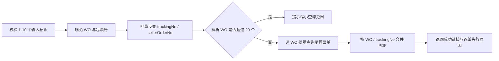

# 尾程专家系统 - shipping-label

## 业务场景

客户提供出库相关标识后，自助查询并下载系统生成的尾程面单 PDF，用于订单核对、留档或平台申诉。

## Expert ID

`shipping-label`

## 能力边界

**处理：**

- WO 主出库单号、`WO...A` 包裹号、trackingNo、卖家订单号定位。
- 最多 10 个输入标识的批量查询。
- 返回每个 WO 下全部 trackingNo 与 PDF 链接。
- 部分成功时保留已取得链接，并逐项说明失败原因。

**不处理：**

- 可打印发货标签申请或面单制作。
- 出库状态解释、尾程轨迹解读、POD 查询。
- OCR、域名替换、文件转存或二次水印。

## 数据依赖

| 用途 | OpenAPI action | 说明 |
|------|----------------|------|
| 模糊标识定位 | `queryOutboundOrderList` | trackingNo 优先，sellerOrderNo 兜底 |
| 尾程面单获取 | `wh.outbound.getMaskedLabelUrl` | 业务 `data` 包含 `orderNo` 与 `customerCode` |

客户与账号上下文由工作流顶层 `customerCode`、`customerName`、`username`、`language` 提供，不属于 Expert 业务输入。

## 处理流程

## 关键规则

1. 一个模糊标识匹配多个 WO 时，同一查询类型下的匹配订单全部查询。
2. trackingNo 查询有结果时忽略 sellerOrderNo 结果；trackingNo 无结果时才采用 sellerOrderNo。
3. Expert 不设订单状态白名单，也不执行旧流程中的申请理由、三方面单或 6 个月判断。
4. 接口成功但列表为空时返回“暂无可下载的尾程面单”，不得伪造链接。
5. PDF 已由接口添加 `DO NOT PRINT - SAMPLE ONLY` 水印并处理条码，直接返回，不做二次加工。
6. 对客必须提示链接通常约 60 分钟有效，且不可用于实际发货打印。
7. `02020249909` 表示“已超过可查询时限（出库后30天内可查）”，归为 `not_supported`；对客明确说明尾程面单已支持自助查询，但本单超过 30 天。不得再使用“仅支持人工客服提供”或据此自动转人工的旧规则。其他未识别业务码保留为 `service_error`，对客仅说明“当前未能获取尾程面单”。
8. `02020249908` 表示订单尚未完成出库，归为 `not_supported`；对客明确说明“尚未出库”是无法获取面单的原因，并提示完成出库后再自助查询，不转人工。
9. 其余异常只说明已确认原因：订单未找到、账号权限/订单归属校验失败、成功但未返回面单文件；未知业务码或无有效响应明确说明原因尚未确认，不猜测、不自动转人工。

## 输出摘要

- `structured.status`：整批状态。
- `structured.orders[]`：逐 WO 结果、业务码、trackingNo 和全部 PDF 链接。
- `structured.unresolvedIdentifiers[]`：未定位到 WO 的原始标识。
- `analysis`：可直接对客展示的链接与失败说明。

运行时权威设计见 [`experts/last-mile/shipping-label/design.md`](../../../experts/last-mile/shipping-label/design.md) 。
