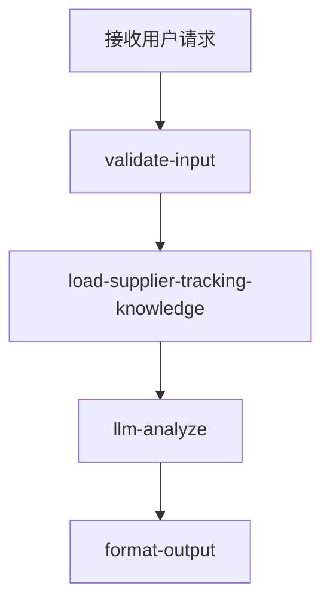

# 尾程专家系统 - supplier-tracking 设计文档

## 业务场景

按国家 / 尾程产品给出**承运商官网物流查询网址**（SOP/KB 链接与自助步骤）；**不在专家内抓取官网**，不处理尾程查件申请（→ `tracking-inquiry`）。轨迹正文以 **`delivery-status`** 与**系统侧轨迹能力**为准；`structured.fetchStatus` 为 **`fallback_links`**。

## 专家 ID

`supplier-tracking`

## 专家名称

承运商官网轨迹查询入口

---

## 一、业务处理流程（四节点）

---

## 二、SOP 与 KB

| 项目 | 说明 |
|------|------|
| 飞书 SOP | [（海外仓）尾程各供应商的物流查询网址](https://winitlink.feishu.cn/wiki/wikcnlRkIVeYTuFSCxLFfP1EJ6d) |
| 仓库 Markdown 副本（含配图） | [supplier-tracking/carrier-portals.md](./supplier-tracking/carrier-portals.md) |
| 本地 KB（LLM 注入） | [experts/last-mile/supplier-tracking/prompts/kb.md](../../experts/last-mile/supplier-tracking/prompts/kb.md)（与 `load-supplier-tracking-knowledge.ts` 内嵌正文同步） |

---

## 三、输入输出 Schema

与 [experts/last-mile/supplier-tracking/manifest.json](../../experts/last-mile/supplier-tracking/manifest.json)、[design.md](../../experts/last-mile/supplier-tracking/design.md) 一致；可选 **`enrichedContext`**，编排器建议传播 **`delivery-status`** 产出。

---

## 四、实现与导出

- 设计详述：[experts/last-mile/supplier-tracking/design.md](../../experts/last-mile/supplier-tracking/design.md)
- 更新 KB 后：`node experts/last-mile/supplier-tracking/scripts/embed-kb-into-load.mjs`，再执行 `npm run export:coze -- experts/last-mile/supplier-tracking`
