> 由飞书知识库导出并整理为 Markdown，作为 **supplier-tracking** 专家的知识来源之一；技术设计与工作流见 [experts/last-mile/supplier-tracking/design.md](../../../../experts/last-mile/supplier-tracking/design.md)。  
> 文内截图位于同级目录 [carrier-portals/](carrier-portals/)（相对路径引用）。

# （海外仓）尾程各供应商的物流查询网址

**尾程各供应商/承运商的物流查询网址**（飞书原标题副线）。

## 国家 / 承运商 / 物流网址

| 国家 | 供应商/承运商 | 物流网址 |
| --- | --- | --- |
| 澳洲 | AU TOLL - IPEC Freight | [https://www.myteamge.com/](https://www.myteamge.com/) |
|  | AU TOLL - Priority Parcel | [https://www.myteamge.com/](https://www.myteamge.com/) |
|  | MCS | 转fastway网址 [https://www.aramex.com.au/tools/track/](https://www.aramex.com.au/tools/track/) |
|  |  | 转PFL网址：[http://www.pflogistics.com.au/tracking](http://www.pflogistics.com.au/tracking) |
|  | AU Post | [https://auspost.com.au/mypost/track/#/search](https://auspost.com.au/mypost/track/#/search) |
|  | Direct Freight | [https://www.directfreight.com.au/](https://www.directfreight.com.au/) |
|  | TNT | [https://www.tnt.com/express/en_au/site/home.html](https://www.tnt.com/express/en_au/site/home.html) |
|  | AU Mix Shipping Economy（组合渠道） | AU CP：[https://www.couriersplease.com.au/](https://www.couriersplease.com.au/) |
|  |  | 转fastway网址 [https://www.aramex.com.au/tools/track/](https://www.aramex.com.au/tools/track/) |
|  | Allied Express | [https://www.alliedexpress.com.au/](https://www.alliedexpress.com.au/) |
| 比利时 | BEMO B2C Europe | [https://www.trackyourparcel.eu/](https://www.trackyourparcel.eu/) |
|  | BEMO DE Post | [https://www.deutschepost.de/sendung/simpleQuery.html?locale=en_GB](https://www.deutschepost.de/sendung/simpleQuery.html?locale=en_GB) |
|  | DPD-France Delivery | [https://trace.dpd.fr/trace](https://trace.dpd.fr/trace) |
|  | DPD - Domestic | [https://tracking.dpd.de/status/en_US/404](https://tracking.dpd.de/status/en_US/404) |
|  | Colissimo FR Delivery | [https://wndirect.com/tracking.php?type=TR&ref=9L25782669757&submit=#](https://wndirect.com/tracking.php?type=TR&ref=9L25782669757&submit=#) |
|  | BEMO UPS | [https://www.ups.com/track?loc=en_BE&requester=ST/](https://www.ups.com/track?loc=en_BE&requester=ST/) |
| 德国 | DE DHL Freight | [https://activetracing.dhl.com/DatPublic/datSelection.do](https://activetracing.dhl.com/DatPublic/datSelection.do) |
|  | DE DHL | [https://www.dhl.com/global-en/home.html](https://www.dhl.com/global-en/home.html) |
|  | DE DE Post | [https://www.postdirekt.de/plzserver/PlzSearchServlet](https://www.postdirekt.de/plzserver/PlzSearchServlet) |
|  | GLS | [https://gls-group.com/GROUP/en/parcel-tracking](https://gls-group.com/GROUP/en/parcel-tracking) |
|  | DE DB Schenker | [https://www.dbschenker.com/app/tracking-public/schenker-search?language_region=de-DE_DE](https://www.dbschenker.com/app/tracking-public/schenker-search?language_region=de-DE_DE) |
|  | KUEHNE NAGEL - Road Delivery | [https://mykn.kuehne-nagel.com/public-tracking/](https://mykn.kuehne-nagel.com/public-tracking/) |
|  | DE DPD | [https://tracking.dpd.de/status/en_US/404](https://tracking.dpd.de/status/en_US/404) |
| 英国 | UK XDP | [https://www.xdp.co.uk/track.php?c=&code=](https://www.xdp.co.uk/track.php?c=&code=) |
|  | UK Yodel | [https://www.yodel.co.uk/](https://www.yodel.co.uk/) |
|  | Hermes ​ | [https://www.evri.com/track-a-parcel](https://www.evri.com/track-a-parcel) |
|  | UK P2P | 无 |
|  | UK Royal Mail | [https://www.royalmail.com/](https://www.royalmail.com/) |
|  | UK DPD | [https://www.dpd.co.uk/](https://www.dpd.co.uk/) |
|  | UK UPS | [https://www.ups.com/us/en/Home.page](https://www.ups.com/us/en/Home.page) |
|  | UK DHL | [https://track.dhlparcel.co.uk/?con=](https://track.dhlparcel.co.uk/?con=) |
|  | P4D（线下发货物流） | [https://app.p4d.co.uk/tracking](https://app.p4d.co.uk/tracking) |
| 美国 | US DHL - Express Worldwide | [https://www.dhl.com/cn-zh/home.html?locale=true](https://www.dhl.com/cn-zh/home.html?locale=true) |
|  | US DHL - Global Forwarding | [https://www.dhl.com/cn-zh/home.html?locale=true](https://www.dhl.com/cn-zh/home.html?locale=true) |
|  | US DGM | [https://www.dhl.com/cn-zh/home.html?locale=true](https://www.dhl.com/cn-zh/home.html?locale=true)   、 [https://www.usps.com/](https://www.usps.com/) |
|  | US UPS - Mail Innovations | [https://www.ups.com/us/en/Home.page](https://www.ups.com/us/en/Home.page)  、[https://www.usps.com/](https://www.usps.com/) |
|  | US UPS | [https://www.ups.com/us/en/Home.page](https://www.ups.com/us/en/Home.page) |
|  | US USPS | [https://www.usps.com/](https://www.usps.com/) |
|  | US FEDEX | [https://www.fedex.com/en-us/home.html](https://www.fedex.com/en-us/home.html) |
|  | Amazon Logistics - Shipping with Amazon | [https://track.amazon.com/](https://track.amazon.com/) |
|  | SpeedX | [https://speedx.io/](https://speedx.io/) |
|  | OnTrac - Ground | [https://www.ontrac.com/tracking/](https://www.ontrac.com/tracking/) |
|  | US Western Post | [http://tracking.westernpost.group/](http://tracking.westernpost.group/) |
|  | YANWEN | [https://www.yanwenexpress.com/](https://www.yanwenexpress.com/) |
|  | DHLe | [https://webtrack.dhlglobalmail.com/home](https://webtrack.dhlglobalmail.com/home) |
|  | GOFO | [https://gofoexpress.com/](https://gofoexpress.com/) |
| 加拿大 | Uni- Domestic Delivery | [https://www.uniuni.com/tracking/](https://www.uniuni.com/tracking/) |
|  | Canada Post - Expedited Parcels | [https://www.canadapost-postescanada.ca/track-reperage/en#/home](https://www.canadapost-postescanada.ca/track-reperage/en#/home) |
|  | CA UPS | [https://www.ups.com/ca/en/Home.page](https://www.ups.com/ca/en/Home.page) |
|  | GLS | [https://gls-group.com/IT/en/online-services/track-trace?match=E7220236150&type=NAT](https://gls-group.com/IT/en/online-services/track-trace?match=E7220236150&type=NAT) |
|  | IT POST | [https://www.poste.it/chiamaci.html](https://www.poste.it/chiamaci.html) |
|  | Purolator  Ground | [https://www.purolator.com/en#](https://www.purolator.com/en#) |
|  | PDN - Express | [https://pdn.express/en/](https://pdn.express/en/) |

> **维护提示**：Colissimo（wndirect）、部分 GLS 等单元格若仍带**示例单号或示例 query**（与飞书原表一致），对客或配置 adapter 时请替换为实际跟踪号；UK P2P 为「无」独立查询网址。

## 德国 DHL - International Paket如何查当地物流网址

1.DHL - International Paket可以支持查询到当地的物流网址， 点击DHL网址显示的shipment tracking in foreign  countries 会跳转到当地网址进行查询当地的物流信息

操作截图如下：

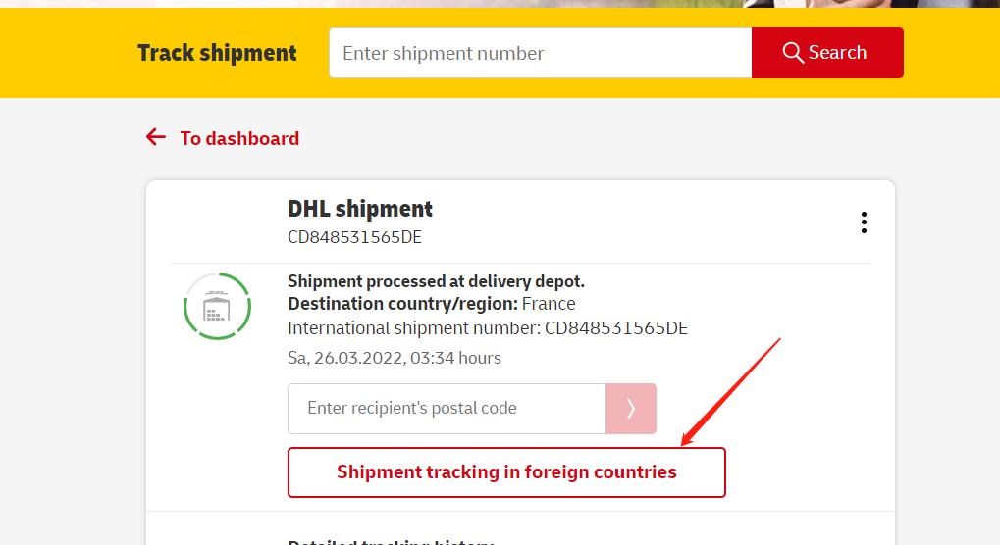

### dhl对应的轨迹信息是有转目的国家的查询网址（圈红色部分）

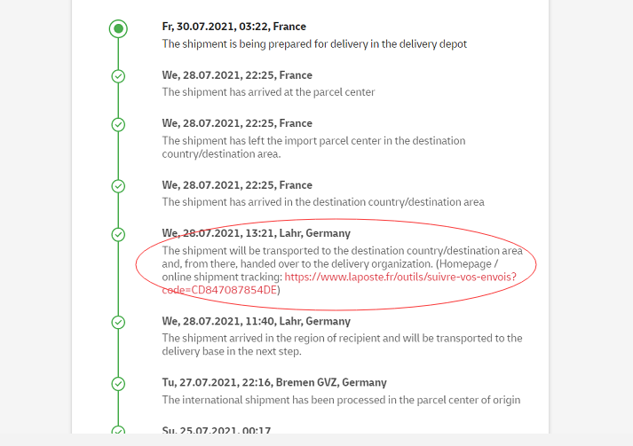

### 输入目的地国家查询网址（示例）

`https://www.laposte.fr/outils/suivre-vos-envois?code=CD847087854DE`（请将 `code=` 后替换为实际单号）

#### 箭头部分输入跟踪单号：CD847087854DE

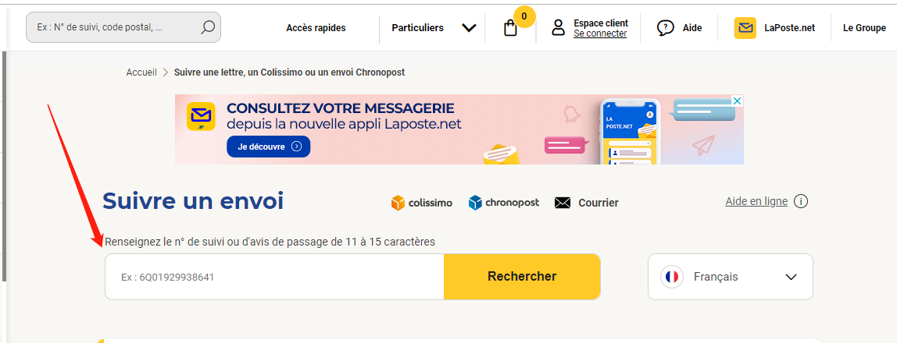

#### 红色箭头是对应目的地国家的跟踪单号：N°8K02255206374，再更新目的地单号和对应的网址给客户即可。

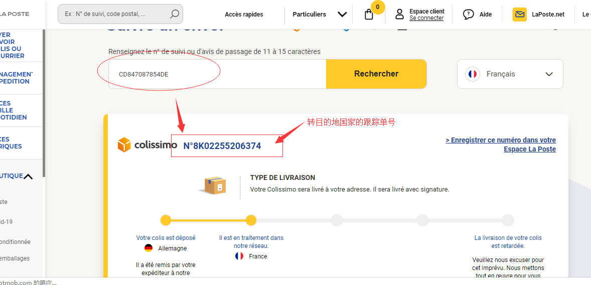

## 德国 DHL - International如何查看当地热线电话

例如订单：CD848739605DE 目的地:  西班牙

1) 点击红色框框进入国际件的查询网址

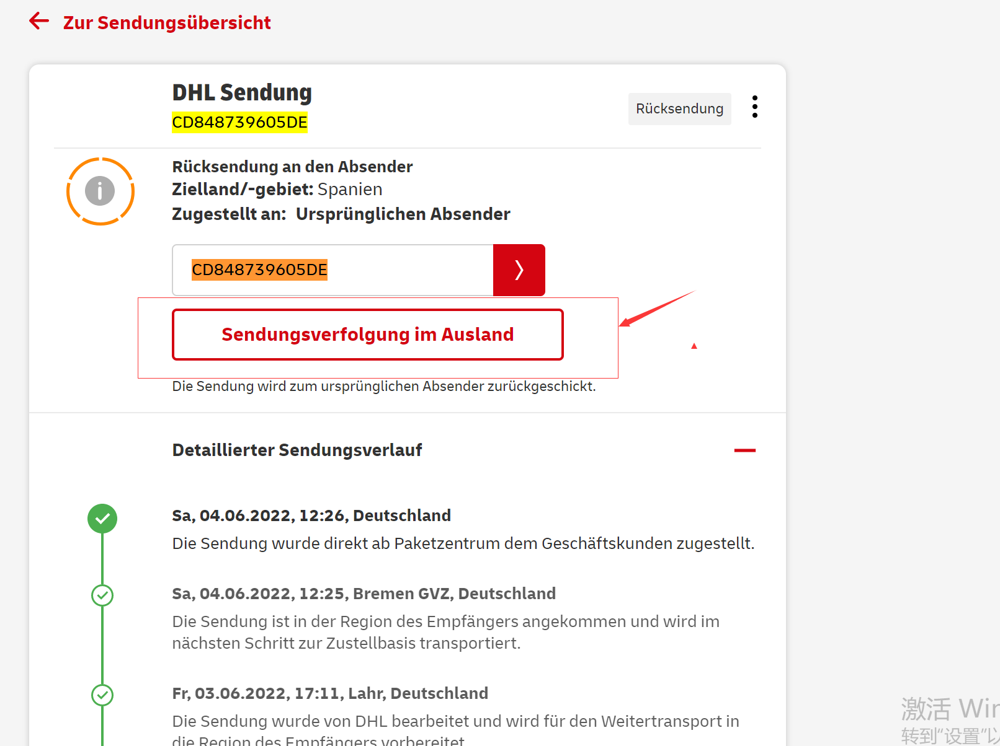

### 2）对应订单的查询网址（示例）

`https://clientesparcel.dhl.es/LiveTracking/ModifyMyShipment/DE08053020`（路径中的单号/片段为示例）。首先点击右上角的 [Customer Service 再点击 Help Center 对应的 Customer Service](https://www.dhlparcel.es/en/private-customers/customer-service.html) 进入查看（需要往下拉查看下图二），对应的热线电话如图三部分。

图一：

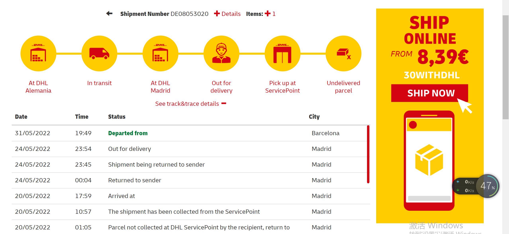

图二：

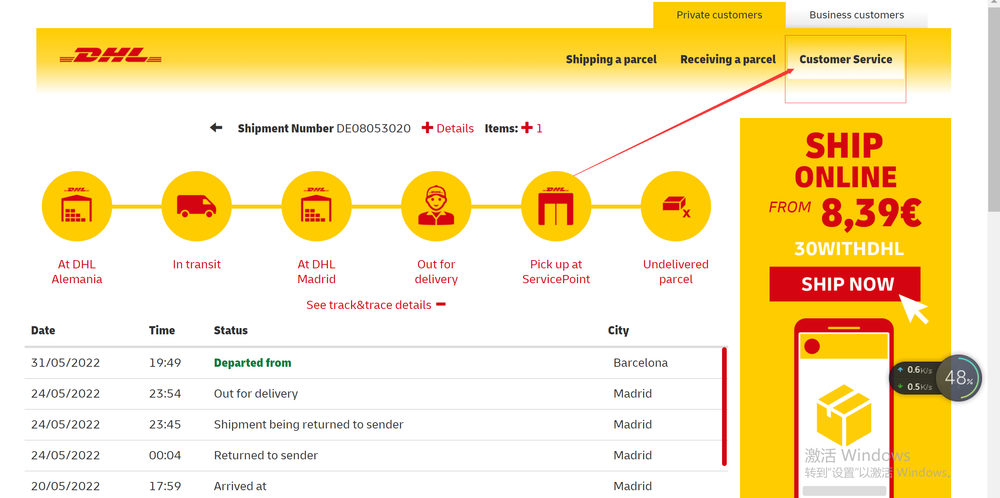

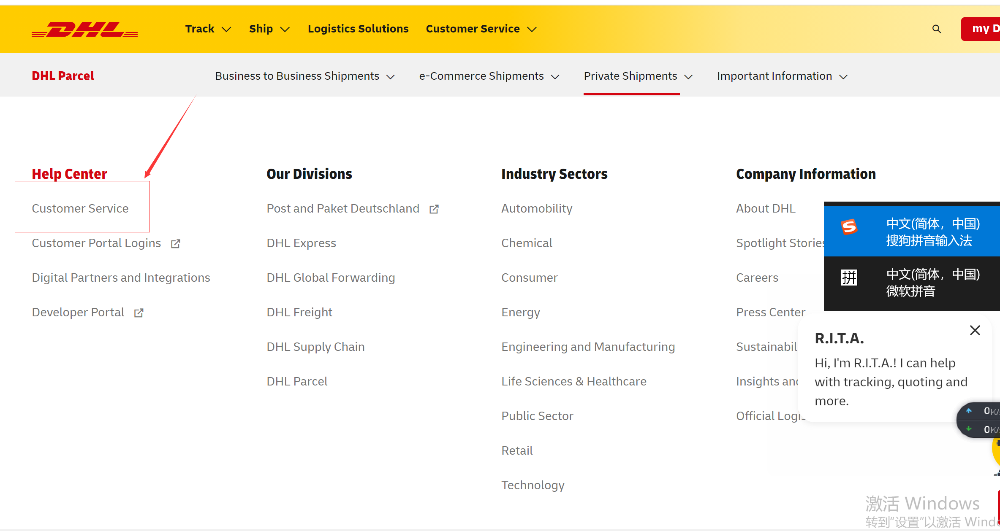

图三

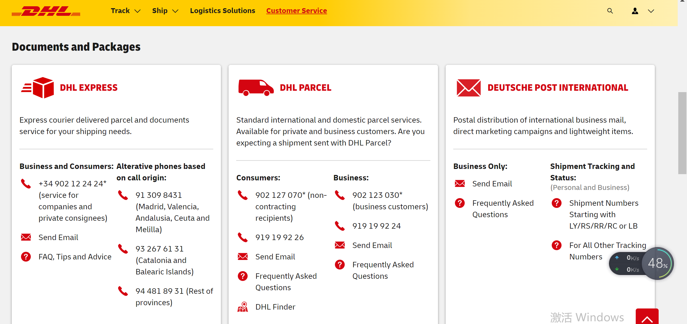

## 美国 DHL - Express Worldwide 国际件热线电话查询

1  打开DHL查询网址： https://www.dhl.com/cn-zh/home.html?locale=true

往下拉对应的帮助中心-客户服务查看对应的电话，如下图部分

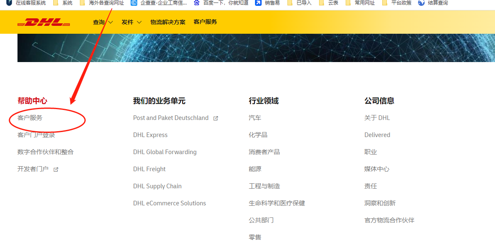

2  对应的电话如下

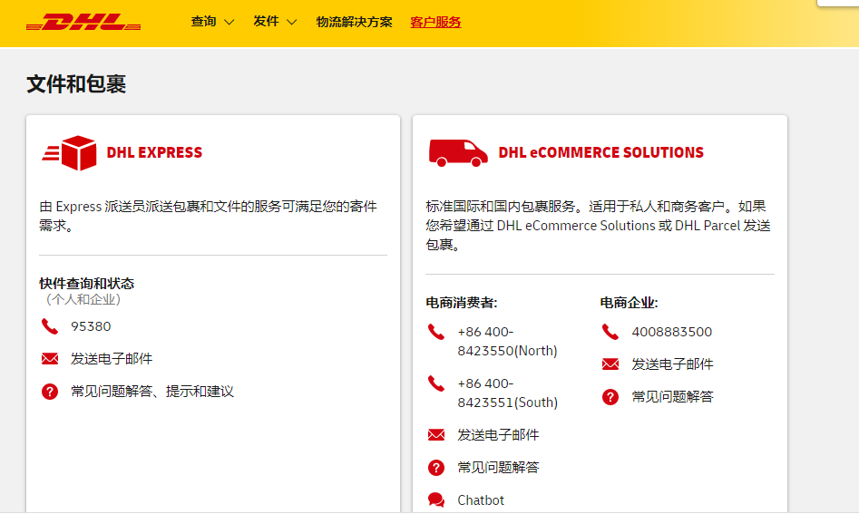

## Shipping with Amazon 轨迹可以在哪里查询？

- **官网（实时轨迹）**：https://track.amazon.com/
- **WINIT 轨迹平台**（异步，一天抓 4 次，会有显示延迟）：https://track.winit.com.cn/tracking/index.php?s=/Index/result
- **17TRACK**：https://www.17track.net/zh-cn（选择「Amazon Shipping + Amazon MCF」运输商）