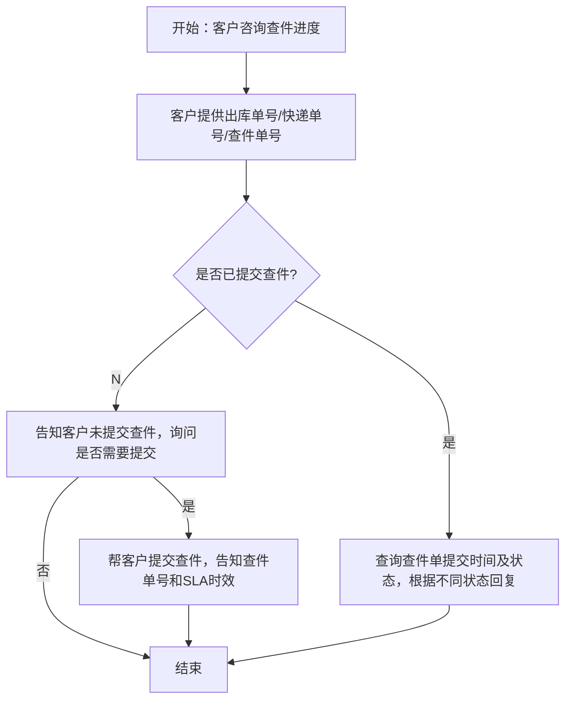
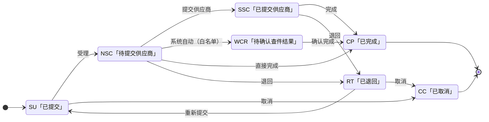

# 尾程专家系统 - tracking-inquiry 设计文档

## 业务场景
**查件申请进度查询**

客户已提交标准出库单尾程查件，主动咨询查件当前处理进度。

## 专家ID
`tracking-inquiry`

## 文档链接
- 客服SOP文档：[标准出库单查件进度查询](https://winitlink.feishu.cn/wiki/HOEwwoCRXikIYzkQ2fQcaIBAnPb)
- AI处理流程文档：[查件申请进度查询](https://winitlink.feishu.cn/wiki/SOzTwOjV6iuVzZktf3jcEwKpnif)

---

## 一、业务处理流程



---

## 二、适用场景定义

**查件**定义：标准出库单出库后，出现以下情况时，向物流商发起的包裹调查流程：

| 查件场景 | 说明 |
|---------|------|
| 超时未妥投 | 尾程超派送时效未派送、轨迹断更，需调查运输情况 |
| 部分妥投 | 一单多面单渠道，部分妥投、部分未收到 |
| 申请签收证明 (POD) | 买家反馈未收到，需申请签收/妥投证明 |
| 查退回原因 | 派送失败，需核实退回/派送失败原因 |
| 妥投未收到 | 官网显示妥投，买家反馈未收到，需调查妥投情况 |

## 三、系统操作路径

### 查件申请路径
> 万邑联 → 售后管理 → 海外仓尾程查件 → 新增海外仓尾程查件

- **卖家自助发起（网页）**：[新建尾程查件](https://seller.winit.com.cn/Tracking/create)（卖家账户登录后使用）。

### 查件进度查询路径
- **万邑联**：万邑联 → 售后管理 → 海外仓尾程查件 → 全部海外仓尾程查件
- **TOM**：TOM → 综合查询 → 尾程查件 → 输入单号查询

## 四、标准查件时效

| 阶段 | 时效标准 |
|------|---------|
| **受理时效** | 提交后 **1个工作日内** 完成受理 |
| **整体时效** | 预计 **10个工作日内** 完成调查 |

---

## 五、基于状态的标准回复话术

### 情况1：出库单暂未提交查件

> 你好，出库单未查询提交查件申请，可在万邑联 → 售后管理 → 海外仓尾程查件 → 新增海外仓尾程查件进行查件申请

---

### 情况2：查件状态 = 待受理（已提交未受理）

| 提交时间 | 话术 |
|----------|------|
| **≤ 1 个工作日** | 您好，此单查件刚提交，请耐心等待受理，我们会持续跟进。 |
| **> 1 个工作日（超期未受理）** | 您好，此单查件受理已超期，我们已为您申请加急处理，会尽快同步受理进度。 |

---

### 情况3：查件状态 = 已提交供应商查件（已受理）

| 提交时间 | 话术 |
|----------|------|
| **≤ 3 个工作日（调查初期）** | 您好，您的包裹已提交至物流商进行调查，目前尚在调查初期（提交第 X 天）。正常查件回复时效为 10 个工作日内，我们会持续跟进，一旦有结果将立即通知您，请您耐心等待。 |
| **3 ～ 10 个工作日（调查中）** | 您好，包裹目前正在物流商调查中（提交第 X 天），暂未收到最终反馈。我们已为您备注催促，正常调查时效内请您稍候，有进展我们会第一时间同步。 |
| **> 10 个工作日（超期未出结果）** | 非常抱歉，查件已超过标准时效仍未返回结果。我们已升级给查件专员加急跟进，要求物流商优先处理，有结果会第一时间邮件反馈给您，请您稍等。 |

---

### 情况4：查件状态 = 已完成

> 您好，您的出库单查件已完成，结果为：XXX。您可在万邑联 - 售后管理 - 海外仓尾程查件 - 全部海外仓尾程查件中查询详细结果。

---

### 五·补充 · `checkingStatus` / `checkingType` → 话术路由（实现用）

以下用于 **`TailTrace.getList`** 返回字段与第五节、第六节规则的**衔接**。计时字段以接口为准：**提交时间**默认取 `applicationTime`（毫秒时间戳）；**受理完成**以 `acceptTime` 是否有值为准（见下表）。**工作日**口径以实现阶段与业务日历配置为准（需与客服系统一致）。

#### 1. 无查件单记录（`content` 为空或未命中）

| 条件 | 路由 | 说明 |
|------|------|------|
| 按出库单/轨迹号/查件流水号查询后 **无任何记录** | **第五节 · 情况1** | 使用情况1话术，引导至「新增海外仓尾程查件」。若同时存在 **出库单在仓配侧不存在** 等数据异常，应 `need_human` 或降级说明「未查到关联查件记录」，**勿**编造单号。 |

#### 2. `checkingStatus` → 第五节分支（主映射）

| `checkingStatus` | 接口含义 | 路由到第五节 | 时间与分支要点 |
|------------------|----------|--------------|----------------|
| **SU** | 已提交 | **情况2 · 待受理**（已提交、等候受理） | **`acceptTime` 为空**：按 **情况2** 表，用 `applicationTime` 起算工作日，区分 ≤1 / >1 个工作日。<br>**`acceptTime` 已有值**：视为已受理，**改用情况3**，以 `applicationTime` 为提交起点计算 ≤3 / 3～10 / >10（接口仍返回 SU 时按此例外处理，避免死锁话术）。 |
| **NSC** | 待提交供应商 | **第五节未单列** → **采用情况3 的调查初期话术变体**（见下「补充话术」） | 说明：查件单已在内部完成受理，**待提交至物流商**；进度解释可比照情况3「≤3 个工作日」语气，避免承诺供应商已收到。 |
| **SSC** | 已提交供应商查件 | **情况3** | 严格按情况3 三档时间，起点 `applicationTime`。 |
| **WCR** | 待确认查件结果 | **第五节未单列** → **情况3 与情况4 之间**（见下「补充话术」） | 已有调查反馈，**待客服确认**；可引用 `feedbackMsg` / `aiResultInfo`（若有）辅助说明「待确认」，**不**提前等同于已完成。 |
| **CP** | 已完成 | **情况4** | **「结果为 XXX」** 须结合 **`checkingResults`（ID）+ `checkingType`** 解析为自然语言（见下 §3）。 |
| **RT** | 已退回 | **第五节未单列** → **补充话术 · 已退回** | 结合 `returnReasons`、`returnOptions`（若有）说明退回原因与下一步（修改后重新提交等），**不**照抄内部码表。 |
| **CC** | 已取消 | **第五节未单列** → **补充话术 · 已取消** | 确认查件单已取消；若客户不知情，引导核对账户操作记录或升级人工。 |

#### 3. `checkingType` / `checkingResults`（主要在 **CP** 使用）

| 字段 | 何时参与路由 |
|------|----------------|
| **`checkingType`**（OT/PT/NR/FR/NT） | **不单独切换**第五节 2～4 的主分支；用于 **理解查件诉求类型**、与 **`checkingResults` ID 联合解释**「结果为 XXX」。 |
| **`checkingResults`（ID）** | **仅在 `checkingStatus === 'CP'`** 时，将 ID 映射为 **对外可读的结果表述**（附录「字段枚举」中按类型分组的名称表）；填入情况4 中 **XXX**。若 ID 为区间或库表未同步，用 `feedbackMsg` 或对客安全的摘要，缺失则明确「详细结果请登录万邑联查件列表查看」。 |

#### 4. 与第六节「加急」的叠加规则

- 先按上表确定 **第五节主话术**，再根据 **`applicationTime`** 与客户是否明确要求加急，调用 **第六节** 场景1～3。
- **第六节场景3**（>10 个工作日）与 **情况3 第三行**（>10 个工作日超期）语义重叠时：**以客户可见安抚 + 内部升级说明已登记**为一条主线，**禁止**重复堆砌三段冗长话术；内部救火群模板仅对员工渠道输出（见 `REQUIREMENTS.md` 对客约束）。

#### 5. 补充话术（第五节原文未覆盖的枚举状态）

以下为仓库实现用 **标准表述**，若与飞书 SOP 后续修订冲突，**以飞书最新版为准**并同步改本节。

**NSC · 待提交供应商**

> 您好，您的查件申请已受理，我们正在向物流商提交调查请求，请稍候。您可在万邑联 → 售后管理 → 海外仓尾程查件中关注进度，我们会持续跟进。

**WCR · 待确认查件结果**

> 您好，目前物流商侧已有初步反馈，我们正在核实确认查件结果，确认后会第一时间同步您；请您耐心等待。您也可在万邑联 → 售后管理 → 海外仓尾程查件中查看更新。

**RT · 已退回**

> 您好，该查件申请当前为已退回状态。退回说明：{reasonSummary}。请您按退回说明修改或补充后重新提交查件申请；如需协助，可联系在线客服。

（`{reasonSummary}` 来自 `returnReasons` 等的自然语言摘要，勿输出内部码。）

**CC · 已取消**

> 您好，该查件单当前状态为已取消。若您仍需调查包裹问题，可在万邑联 → 售后管理 → 海外仓尾程查件中重新发起申请。

---

#### 6. SLA 口径说明（文档内多处并存时）

- **第四节**：受理 **1 个工作日**、整体调查 **10 个工作日** —— 用作对客 **进度与预期** 的主叙述。
- **第九章状态流转规则表**：查件单关闭 **6 个工作日** —— 偏 **内部关单/时效监控**；与「10 个工作日调查」并存时，**对客话术优先采用第四节**；若产品统一为单一数字，以业务书面裁定为准并替换本节引用。

---

## 六、查件申请加急处理规则

### 场景1：查件提交时间 ≤ 1 个工作日 → **无法加急**

> 您好，核实到您的查件申请提交尚未满 1 个工作日。目前工单正在正常受理流程中，物流商系统同步及受理需要一定时间。建议您先耐心等待，我们会按标准时效持续跟进，一旦有受理进度会立即更新，感谢您的理解。

---

### 场景2：查件提交时间 ＞ 3 个工作日 → **可申请加急，需询问原因**

**第一步（询问原因）：**
> 您好，理解您对包裹进度的焦急。目前该单查件已提交超过 3 个工作日，我们可以为您尝试申请加急催促。 为了更有效地向物流商施压，**麻烦您提供一下具体的加急原因**（例如：买家投诉严重、平台考核临近、高价值商品等），我们备注后可优先升级处理。

**客户提供原因后（第二步）：**
> 已经为您登记加急需求并备注具体原因，现已升级给查件专员优先催促物流商。 温馨提示： 虽然已申请加急，但最终回复时效仍取决于物流商的调查进度（标准时效为 10 个工作日内）。我们会密切监控，一有最新进展会第一时间邮件/消息反馈给您，请您稍候。

---

### 场景3：查件提交时间 ＞ 10 个工作日 → **超期加急，必须升级**

> 非常抱歉，该单查件已超过标准调查时效。我们非常重视您的体验，已将此单标记为"严重超期"，并升级给查件专员进行专项跟进。我们会要求物流商优先处理此单，有结果会第一时间通知您，感谢您的耐心等待。

**内部操作**：按模板填写信息发送至【尾程救火群】，@查件负责人
```
查件升级类型：超标准查件时效・异常超期/客户原因加急等
查件流水号：[填写]
快递单号：[填写]
查件申请时间：[填写]
救火原因：已超过标准查件时效，异常超期，需加急专项跟进 @查件负责人 请优先处理，谢谢。
```

---

## 七、AI 处理要点

### 关键参数提取
1. **查询单号** → 出库单号 / 快递单号 / 查件单号（任意一种）
2. **客户是否申请加急** → 判断客户是否明确要求加急
3. **加急原因** → 如果客户要求加急且满足条件，必须追问加急原因

### 需要对接的系统数据
- TOM / 万邑联系统 → 查询查件单状态、提交时间
- 查件状态机 → 根据状态选择对应话术回复
- **接口字段**：`TailTrace.getList` 返回的 `checkingStatus`、`checkingType`、`checkingResults`、`applicationTime`、`acceptTime`、`returnReasons` 等 —— 路由规则见 **上文「五·补充 · checkingStatus / checkingType → 话术路由」**

### 特殊规则
- **话术标准化**：必须严格使用SOP规定的标准话术，保证回复一致性
- **超期必须升级**：超过10个工作日必须内部升级到尾程救火群
- **主动告知时效**：任何状态都需要告知客户当前时效情况和预期完成时间

---

## 八、代码实现状态

- 专家目录骨架已建：`manifest.json`、`design.md`、`prompts/main.md`
- **话术路由与接口映射**：已写入本文 **「五·补充」**；实现 fetch + policy 节点时可据此编码
- **待实现**：`workflow.json` / Coze 工作流、`nodes/*.ts`、`prompts/kb.md`（建议从第五节与「五·补充」抽取脱敏话术）
- **接口**：`TailTrace.getList`（见本文「⚠️ 外部系统依赖」）

---

**文档生成时间**：2026年4月25日
**数据源**：飞书文档 AI处理流程图提取 + 客服SOP文档完整内容获取（完整获取）


---

## ⚠️ 外部系统依赖

本专家自动化依赖 **万邑通 OpenAPI 网关** 提供的尾程查件列表能力（`TailTrace.getList`）。

### 服务标识

| 项 | 说明 |
|----|------|
| 网关 `action` | `tail/claim/ai/v1/gateway` |
| 业务 `service` | `TailTrace.getList` |
| 用途 | 分页查询查件单列表，支撑状态、时间与话术分支 |

### 请求体示例（`data` → JSON 字符串或网关约定结构）

以下为网关 `data` 内业务载荷的常见形态（筛选条件多为可选字符串；空串表示不按该维度过滤）。

```json
{
  "service": "TailTrace.getList",
  "data": {
    "pageVo": { "page": 1, "pageSize": 20 },
    "order": [{ "name": "applicationTime", "dir": "desc" }],
    "serialNumber": "",
    "orderNo": "",
    "trackingNo": "",
    "shippingNo": "",
    "checkingStatus": "",
    "applicationTimeStart": "",
    "applicationTimeEnd": "",
    "endTimeStart": "",
    "endTimeEnd": "",
    "outWhTimeStart": "",
    "outWhTimeEnd": ""
  }
}
```

### 响应体结构（分页 + 列表）

- 顶层为 **分页对象**（如 `firstPage`、`lastPage`、`totalElements`、`totalPages`、`number`、`size`、`pageable` 等）。
- **`content`**：查件单数组；每条记录对应一条尾程查件申请。
- 以下为 **`content[]` 单条示例**（字段名以线上接口为准；时间为毫秒时间戳的情形见示例数值）。

```json
{
  "content": [
    {
      "id": 123,
      "serialNumber": "TA240710381",
      "orderNo": "SO123456",
      "trackingNo": "YT123456",
      "warehouseCode": "CNHW",
      "warehouseName": "华南仓",
      "dispatchType": "标准快递",
      "outWhTime": 1720000000000,
      "checkingType": "OT",
      "checkingStatus": "SU",
      "applicationTime": 1720000000000,
      "endTime": 1720000000000,
      "returnOptions": 1,
      "returnReasons": "说明文字",
      "checkingResults": 3,
      "feedbackMsg": "反馈内容",
      "distributor": "XDP",
      "accepterName": "张三",
      "submitterAcc": "user@email.com",
      "submitterName": "李四",
      "submitterCode": "18170180",
      "acceptTime": 1720000000000,
      "orderStatus": "DLC",
      "noteMsg": "备注",
      "isTom": "Y",
      "orderType": "OW",
      "consigneeName": "John",
      "consigneeEmail": "john@xx.com",
      "consigneePhone": "123456",
      "consigneeHouseNum": "12",
      "consigneeCountry": "US",
      "consigneeState": "CA",
      "consigneeCity": "LA",
      "consigneeZipCode": "90001",
      "consigneeStreeOne": "Street 1",
      "consigneeStreeTwo": "Street 2",
      "takeTime": 5,
      "goodsCode": "G001",
      "merchandiseCode": "M001",
      "singleName": "单品名",
      "goodsName": "商品名",
      "updated": 1720000000000,
      "updatedBy": "admin",
      "emails": "a@xx.com,b@xx.com",
      "shippingNo": "SH123456",
      "businessOrderType": "OW",
      "dispatchServiceName": "快递服务名",
      "dispatchServiceCode": "SVC001",
      "acceptResult": 2,
      "enclosure": "url",
      "updatedStatus": "timedOutNotClose",
      "canAutoReplyMark": "Y",
      "trackingNoTimes": 2,
      "relTrackingNo": "REL123",
      "isSignAddService": "Y",
      "aiResultInfo": {
        "emailTopic": "主题",
        "resultGetDate": "2024-07-10",
        "supplierClaimResult": "结果",
        "judgeBasisList": "依据",
        "resultCredibilityPercent": "85%",
        "isResultCorrect": "Y",
        "checkingResults": "已投递"
      }
    }
  ],
  "firstPage": true,
  "lastPage": false,
  "number": 1,
  "numberOfElements": 20,
  "pageable": {
    "page": 1,
    "size": 20,
    "sort": null,
    "pageNumber": 1,
    "pageSize": 20,
    "offset": 0
  },
  "size": 20,
  "sort": null,
  "total": 100,
  "totalElements": 100,
  "totalPages": 5
}
```

### 附录：字段枚举

#### 1. `checkingStatus`（查件状态）

| 枚举值 | 含义 |
|--------|------|
| SU | 已提交 |
| NSC | 待提交供应商 |
| SSC | 已提交供应商查件 |
| WCR | 待确认查件结果 |
| RT | 已退回 |
| CP | 已完成 |
| CC | 已取消 |

#### 2. `checkingType`（查件类型）

| 枚举值 | 含义 |
|--------|------|
| OT | 超时未妥投 |
| PT | 部分妥投 |
| NR | 申请妥投证明（POD） |
| FR | 查派送失败原因 |
| NT | 妥投未收到 |

#### 3. `orderType` / `businessOrderType`（订单类型）

| 枚举值 | 含义 |
|--------|------|
| OW | 出库单 |
| LMA | LMA 订单 |

#### 4. `isTom`（是否 TOM 提交）

| 枚举值 | 含义 |
|--------|------|
| Y | TOM 客服提交 |
| N | 卖家自助提交 |

#### 5. `acceptResult`（系统受理结果）

| 值 | 含义 |
|----|------|
| 0 | 未处理 |
| 1 | 系统未校验到规则 |
| 2 | 系统校验规则通过（自动回复） |
| 3 | 系统校验规则不通过 |
| 4 | 命中自动回复黑名单 |
| 5 | 快递单号进线超过 1 次 |

#### 6. `updatedStatus`（时效状态，计算字段）

| 枚举值 | 含义 | 计算规则（摘要） |
|--------|------|------------------|
| `ClosedWithinTheTimeLimit` | 时效内关闭 | 状态为 RT/CC/CP 且目标关闭日期 **>** 结束时间 |
| `timedOutClose` | 超时关闭 | 状态为 RT/CC/CP 且结束时间 **≥** 目标关闭日期 |
| `timedOutNotClose` | 超时未关闭 | 状态为 NSC/SSC/SU 且当前时间 **≥** 目标关闭日期 |
| `NotClosedWithinTheTimeLimit` | 时效内未关闭 | 状态为 NSC/SSC/SU 且目标关闭日期 **>** 当前时间 |

#### 7. `canAutoReplyMark`（可自动回复标记）

| 枚举值 | 含义 |
|--------|------|
| Y | 可以自动回复 |
| N | 不可自动回复 |

#### 8. `isSignAddService`（签名增值服务）

| 枚举值 | 含义 |
|--------|------|
| Y | 有签名增值服务 |
| N | 无签名增值服务 |
| （空） | 增值服务接口异常 |

#### 9. `checkingResults`（查件结果）

动态枚举，按 `checkingType` 分组，存储在数据库表中。以下为 **OT** 类型常用取值示例（完整列表以库表为准）。

| checkingType | ID | 名称 |
|----------------|-----|------|
| OT | 3 | 丢失（代客索赔时效内） |
| OT | 4 | 丢失（代客索赔已超时） |
| OT | 5 | 丢失（没有代客索赔） |
| OT | 6 | 恢复派送（无索赔服务） |
| OT | 7 | 恢复派送（有索赔服务） |
| OT | 8 | 已投递 |
| OT | 9 | 退回发件人（含退回丢失/破损的索赔服务） |
| OT | 10 | 等待收件人自提 |
| OT | 11 | 无上网信息（出库 3 个工作日内） |
| OT | 40 | 无上网信息（已超时效） |
| OT | 41 | 无上网信息（3 工作日～11 自然日内） |
| OT | 42 | 无上网信息（超出 11 个自然日） |
| OT | 45 | 退回发件人（不含索赔服务） |
| OT | 50 | 丢失（AU 没有代客索赔） |
| OT | 53 | MCS 超过可派送邮编范围 |
| OT | 54 | 无上网信息（一票多面单超 11 日） |
| OT | 56 | 受理话术 |

其它类型（节选，ID 区间见库表）：

| checkingType | ID（区间或列举） | 说明 |
|----------------|------------------|------|
| PT | 12～20，43～49，51，55 | 共 16 项（与 OT 类似） |
| NR | 21～25 | 共 5 项 |
| FR | 26～34，52，57～60 | 共 14 项 |
| NT | 35～39，61 | 共 6 项 |

#### 10. `returnOptions`（退回选项）

动态枚举，按 `checkingType` 分组。示例：

| checkingType | ID | 名称 |
|----------------|-----|------|
| OT | 1 | 派送完成 |
| OT | 2 | 时效内 |
| OT | 11 | Fedex 不支持查件 |
| OT | 15 | 平邮无查件 |
| OT | 16 | 退回原因 |
| PT | 3 | 非 XDP 和 TOLL 服务 |
| PT | 4 | 时效内 |
| PT | 12 | 不支持查件 |
| NR | 5 | 无法提供 POD 的服务 |
| NR | 6 | 派送中 |
| NR | 13 | 不支持查件 |
| NR | 18 | 其他 |
| FR | 7 | 无派送失败-派送中 |
| FR | 8 | 无派送失败-派送完成 |
| NT | 9 | 无法提供 POD 的服务 |
| NT | 10 | 派送中 |
| NT | 14 | 不支持查件 |
| NT | 17 | 退回原因 |

---

## 九、状态流转与 SLA

### 状态流转图

以下使用 **Mermaid** 描述（GitHub / VS Code / 多数文档站可直接渲染）。迁移规则以本节下文「状态流转规则明细」为准。



### 状态流转规则明细

| 源状态 | 目标状态 | 触发动作 | 说明 |
|--------|----------|----------|------|
| SU | NSC | 受理 | 客服受理查件单，设置受理人 |
| SU | CC | 取消 | 卖家取消查件单 |
| （路径）SU → … → RT → CC | — | 退回后取消 | 退回状态也可取消 |
| NSC | SSC | 提交供应商 | 批量操作 |
| NSC | WCR | 系统自动 | 属于自动获取查件结果白名单的供应商 |
| NSC | CP | 直接完成 | 客服直接给出查件结果 |
| NSC | RT | 退回 | 客服退回给卖家 |
| SSC | CP | 完成 | 供应商反馈后完成 |
| SSC | RT | 退回 | 客服退回 |
| WCR | CP | 确认完成 | 确认 AI/供应商查件结果 |
| RT | 新 SU | 重新提交 | 编辑后重新提交（旧单取消 + 新建） |
| RT | CC | 取消 | 退回后取消 |

**终态**：`CP`（已完成）、`CC`（已取消）。  
**SLA（规则表）**：查件单关闭时效为 **6 个工作日**（与上文 SOP 中「10 个工作日调查」等表述并存时，以产品/业务最终认定为准）。