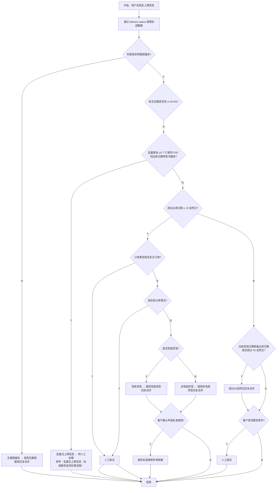

# 尾程专家系统 - tracking-no-scan 设计文档

> 2026-07-31 实现边界：优先复用 `delivery-status` 的逐票扫描事实。无 Ascan 且约 11–45 天只转 `refund-standard` 核验完整条件，不在本专家承诺可赔；已有 Ascan 后停滞转 `tracking-stale`。

## 业务场景
**轨迹长时间未上网及索赔咨询**

客户反馈包裹出库后一直没有上网信息（即没有第一条轨迹扫描记录），咨询情况并可能提出索赔。

## 专家ID
`tracking-no-scan`

## 文档链接
- 客服SOP文档：[无上网信息](https://winitlink.feishu.cn/wiki/wikcnYUi0OjmnCpYseCEprBcOig) *(注：文档读取失败，以下流程基于AI处理流程图整理)*
- AI处理流程文档：[无上网信息处理流程](https://winitlink.feishu.cn/wiki/Wm5YwCzBxiRBamklvvEcvBpAnff)

---

## 一、业务处理流程

---

## 二、判定节点说明

| 判定节点 | 判定条件 | 分支逻辑 |
|---------|---------|---------|
| **是否带跟踪服务** | 渠道配置信息 | 无 → 直接回复话术结束；有 → 继续判断 |
| **是否有 A-SCAN** | 包裹是否已有首条扫描记录 | 无 → 继续判断批量；有 → SOP文档未成功读取，需补充 |
| **批量订单检测** | 同一客户同一PSC同一出库日期带挂号服务且超过5个订单都无上网 | 是 → 转人工；否 → 继续判断 |
| **出库日期 ≤ 10 自然日** | 当前日期 - 出库日期 ≤ 10天 | 是 → 判断是否复合订单；否 → 判断是否超过45天 |
| **订单类型是否复合订单** | 是否多个包裹合成一票 | 是 → 转人工；否 → 判断分单 |
| **是否有分单情况** | 原始单是否被分成多个派送单 | 有 → 转人工；无 → 判断免赔 |
| **是否免赔货型** | 货物类型是否在免赔范围内 | 是 → 免赔话术；否 → 非免赔话术；都到索赔确认 |
| **客户确认申请标准索赔** | 用户是否同意走索赔流程 | 是 → 提供链接；否 → 结束 |
| **是否超过 45 自然日** | 出库超过45天但不超过？ 11-45天走对应话术 | 超过 → 超45天话术，再问是否坚持查件；不超过 → 11-45天话术，再问是否坚持查件 |
| **客户坚持要求查件** | 用户是否坚持一定要查件 | 是 → 转人工；否 → 结束 |

---

## 三、话术节点整理

根据流程图提取的各分支话术节点：

| 分支场景 | 处理方式 |
|---------|---------|
| **不带跟踪服务** → 输出「无跟踪服务回复话术」 | 模板化回复，结束 |
| **批量 ≥5 单** → 转人工处理 | 引导到人工，参考链接：https://winitlink.feishu.cn/wiki/wikcnpsRdDITILD1sLCU1IsdIve |
| **复合订单 / 有分单情况** → 人工核实 | AI无法处理，转人工 |
| **免赔货型** →「免赔货型回复话术」 | 模板化回复后，确认是否索赔 |
| **非免赔货型** →「非免赔货型回复话术」 | 模板化回复后，确认是否索赔 |
| **客户确认申请索赔** → 提供标准索赔申请链接 | 给出链接，结束 |
| **出库日期 11-45 自然日** →「45个自然日≥ 当前咨询日期距离出库日期 ≥ 11个自然日回复话术」 | 模板化回复 |
| **出库日期 > 45 自然日** →「超过45个自然日回复话术」 | 模板化回复 |
| **客户坚持要求查件** (无论是否超45天) → 转人工核实 | 转人工，结束 |

---

## 四、AI 处理要点

### 关键参数提取
AI 需要从订单数据中获取：
1. **渠道是否带跟踪服务** → 渠道配置表
2. **是否已有 A-SCAN** → 轨迹数据
3. **出库日期** → 计算天数差（≤10 / 11-45 / >45）
4. **当前咨询日期** → 计算天数差
5. **是否复合订单** → 订单类型判断
6. **是否分单情况** → 订单数据判断
7. **货型是否免赔** → 产品类型配置表
8. **批量判断**：同一客户 + 同一PSC + 同一出库日期 + ≥5 单 + 都无上网 → 触发转人工

### 特殊规则
- **批量5单以上特殊处理**：同一PSC、同一出库日期、带挂号服务、超过5个订单都无上网 → **必须转人工**，这是特殊规定
- **复合订单 / 分单** 都需要人工核实 → AI不处理
- **免赔判断**是索赔前置，免赔货型也可以申请索赔但需要明确告知免赔政策
- **时间分段**按 10天 / 45天 分成三个区间，话术不同

### 需要对接的系统数据
- **delivery-status** → 获取已解析的轨迹数据（是否已 A-SCAN 等）
- 渠道配置表（是否带跟踪服务）
- 轨迹数据库（是否有A-SCAN）
- 订单基础信息（出库日期、是否复合订单、是否分单）
- 产品货型配置表（是否免赔）
- 批量查询：同一客户同一PSC同一出库日期的订单计数

---

## 五、缺失信息说明

> [!WARNING]
> 客服SOP文档 `https://winitlink.feishu.cn/wiki/wikcnYUi0OjmnCpYseCEprBcOig` 读取失败，未能获取具体话术内容。只有流程图结构已整理，具体标准话术需要人工补充。

---

**文档生成时间**：2026年4月25日
**数据源**：飞书文档 AI处理流程图提取
