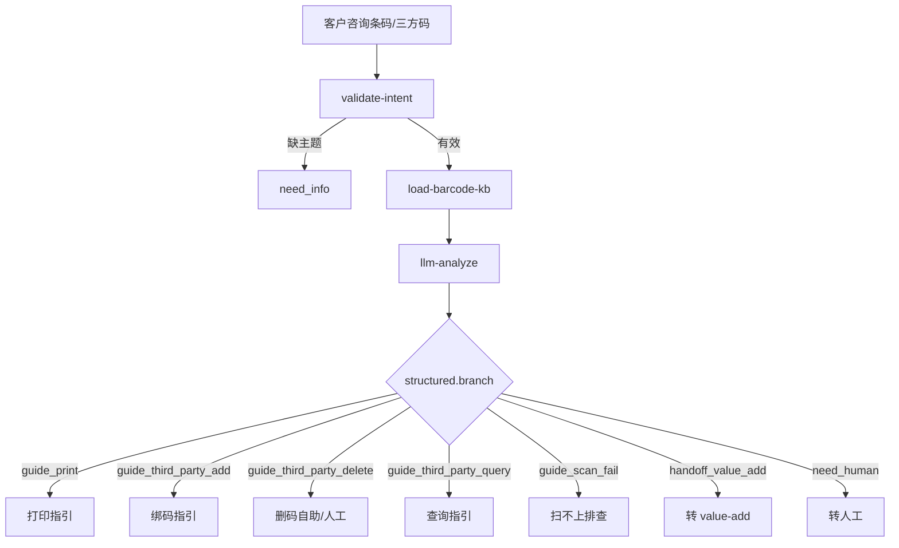

# SKU 专家 — barcode-guide 业务参考

> 域：`sku` · Expert ID：`sku/barcode-guide` · 优先级：P2（条码对客引导）  
> 实现规格：[`experts/sku/barcode-guide/design.md`](../../../experts/sku/barcode-guide/design.md)

## 业务场景

解答**打印商品条码标签**、**第三方商品/单品条码增删查**（含 FNSKU）、**仓内扫不上**排查，以及待办「缺第三方商品条码」如何补。KB+LLM 为主；首期不代客写绑码/删码/打标接口。删除 OpenAPI 文档 Gap → 自助 + 人工。

## 典型客户问法

- 「怎么打印商品条码 / 标签？」
- 「FNSKU 怎么绑？缺第三方商品条码怎么办？」
- 「怎么删除错误的三方编码？」
- 「怎么查这个 SKU 有没有绑三方码 / 单品状态？」
- 「仓库扫不上这个码」
- 「包裹贴标作业异常」（→ `handoff_value_add`）

## 边界分工

| 问 | 不问 |
|----|------|
| 打印标签步骤（SI/SKU 差异） | 注册加急入口「急需打印条码」（→ `registration-guide`） |
| 三方码增/删/查自助指引 | 包裹条码增值作业返工（→ `value-add`） |
| 扫不上根因排查（未绑码等） | SKU 属性事实只读（→ `profile`） |
| 待办缺第三方条码补绑 | 代客调用打标/绑码/删码写 API |

**衔接**：`inbound-exception-check` / value-add 条码类异常中「客户不知如何绑码」可路由本专家。

---

## 客服处理流程

## 意图与 branch

| intentType | branch |
|------------|--------|
| print | guide_print |
| third_party_add | guide_third_party_add |
| third_party_delete | guide_third_party_delete |
| third_party_query | guide_third_party_query |
| scan_fail | guide_scan_fail |

## KB / API 参考

- OSWH：`05`/`06` 打印；`08`/`09` 新增三方；`10`/`11` 查询
- 删除 action：**Gap**（见 [sku-api-matrix.md](../../plan/sku-api-matrix.md) §四）
- 域边界卡：[sku-plan.md](../../plan/sku-plan.md) `sku/barcode-guide`
