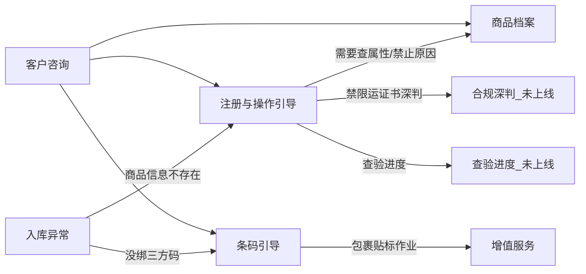

# 海外仓商品（SKU）专家说明

> 给谁看：产品、客服运营、业务对接同学  
> 讲什么：海外仓「商品」相关几个专家各自管什么、怎么配合、客户问什么该找谁  
> 日期：2026-07-17  
> 说明：本文用业务语言写总览；**会上短版**见 [huddle-brief.md](huddle-brief.md)；具体系统字段与开发细节见各专家目录下的设计文档。

---

## 1. 这块业务管什么

海外仓商品专家负责：**商品怎么注册、审核到哪了、能不能入库出库、属性对不对、条码怎么打/怎么绑**。  
入库、出库、增值等其他环节会来「问」商品这边的事实，或把客户转来问操作指引。

| 管 | 不管 |
|----|------|
| 按商品编码查档案（是否带电、单品化/商品化、能不能入/出库等） | 仓库里还有多少库存 |
| 注册加急、审核退回怎么改、浅层怎么解禁 | 账户还剩多少 CBM / SKU 额度 |
| 打印万邑通商品条码、绑/查/删第三方条码、仓内扫不上怎么排查 | 包裹贴标类增值作业（那是增值服务） |
| | 出库打包方式怎么改（属出入库旅程，商品这边不接） |

**几条对业务很重要的约定：**

1. 客户说的「商品编码」，系统里统一叫商品编码；打印标签时有时也叫商品编码（两边是同一个东西）。
2. **「为什么被禁止」是事实；「怎么解禁」是操作指引**——先查清楚标记和原因，再告诉客户怎么走。
3. **专家不会替客户在系统里点操作**：不加急代点、不代提交注册、不代绑码/删码、不代做解禁写入。只教客户在万邑联自己操作，或转人工。
4. 不以内部知识图谱当实时查数来源；对客以万邑联界面路径和已确认规则为准。

---

## 2. 现在有哪些专家

| 专家 | 干什么 | 现状 |
|------|--------|------|
| 商品档案（`sku/profile`） | 查商品事实，给别的专家用 | **待配置**（代码可导出，待 Coze/登记/冒烟） |
| 注册与操作引导（`sku/registration-guide`） | 教客户注册、加急、退回、限直发、解禁等 | **待配置** |
| 条码引导（`sku/barcode-guide`） | 打印标签、三方码、扫不上 | **待配置** |
| 合规深判（`sku/compliance-check`） | 禁限运/证书/申报等深判 | **待配置** |
| 查验进度（`sku/inspection-status`） | 验货单进度和结论 | **待规划**（触发后再做） |

以前设想的「库存状态」专家已取消，库存数量统一走在库查询。

---

## 3. 专家之间怎么配合

用白话说：

- **商品档案**：像「商品户口本」，只提供事实，一般不直接跟客户讲长篇步骤。
- **注册引导**：客户问「怎么弄 / 催一下 / 退回怎么办」时找它；需要户口本信息时，会先（或一并）用商品档案。
- **条码引导**：客户问打标、绑 FNSKU/三方码、仓库扫不上时找它。
- 「急需打印条码」若本质是**催审核**，加急入口仍在注册引导；具体怎么打印/绑码才走条码引导。
- 入库报「商品信息不存在」→ 注册引导；根因是没绑第三方码 → 条码引导。
- 以前误分到「权限申请」的商品注册类问题，应改走注册引导。

合规深判已实现（待配置）；查验进度上线前：查验类问题先转人工；注册引导的 `handoff_compliance` 应路由到 `sku/compliance-check`。

---

## 4. 各专家业务说明

### 4.1 商品档案 —— 查事实

**客户/上游真正需要的：**  
这个商品编码对应的商品：是不是单品化管理、有没有箱/套、入库包装类型、件型、是否带电/液体等、粗略发布情况、是否禁止入库或出库、限直发相关事实等。

**典型用法：**  
其他专家或客服需要「先确认事实再回复」时调用；不对客户输出长操作手册。

**查不到或系统缺字段时：**  
会标明「缺哪些信息」，**不会编造**禁止原因。

**客户编码（账号）** 由通话/会话上下文带，不要求业务在「商品入参」里再填一遍账号字段。

---

### 4.2 注册与操作引导 —— 教客户怎么做

**覆盖的高频场景（按咨询量大致顺序）：**

1. **注册加急 / 审核要多久**（最多）
2. **新品链接能不能发某国仓**（浅层：先让客户自助查禁限清单、引导注册等）
3. 限直发：为什么、怎么解
4. 审核退回：怎么改、怎么再提交
5. 取消带电/液体等特殊属性勾选
6. 禁止入库/出库：浅层怎么解；若是人工下的禁，优先转人工
7. 怎么注册/批量注册、修改、失效；下入库单提示「商品信息不存在 / 未发布」

**分支结果（对内叫法，业务可理解为「走哪条回复」）：**

| 结果类型 | 业务含义 |
|----------|----------|
| 加急指引 | 看维护任务时效 + 客户自助点加急 |
| 承运浅层指引 | 新品能否发/入的浅层步骤 |
| 注册指引 | 注册/修改/失效 |
| 退回重提 | 按退回原因改完再提 |
| 限直发解法 | 引用档案事实 + 两种常见解法 |
| 属性解除 | 实物确认后取消勾选 |
| 解禁浅层 | 有明确禁止标记时的补资料/改属性路径 |
| 未发布拦单 | 解释为何下不了入库单 |
| 转合规 / 转查验 | 深判或验货进度（未上线时=转人工） |
| 需补充信息 / 转人工 | 缺关键信息或个案争议 |

#### 客户催注册 / 加急 —— 业务上怎么走

1. 识别为「加急 / 审核多久」类问题。
2. 引导客户打开 **万邑联 → 商品维护任务**，查看 **应维护完成时间**（系统对客承诺的审核完成时点）。
3. 若仍着急：请客户**自己在平台点「加急」**，并选择原因之一：  
   - 急需下入库单  
   - 急需打印条码标签  
   - 急需关联退货商品  
4. **客服机器人 / 专家不会替客户点加急**，也不会随口编一个「几点审完」。  
5. 有商品编码时，注册引导会尽量读出 **应维护完成时间 / 是否已加急**；读不到再教客户打开维护任务页面自行查看。

---

### 4.3 条码引导 —— 打标与三方码

**覆盖：**

- 入库前怎么打印万邑通商品条码标签（单品化通常要带单品信息；商品化多数打商品码即可）
- 实物已贴平台码/供应商码时，怎么在系统里**绑定第三方商品条码或单品条码**（含 FNSKU）
- 待办「缺第三方商品条码」怎么补
- 怎么查看已绑的码、仓里扫不上怎么一步步查
- 删错绑的三方码：目前公开接口说明不齐，优先教万邑联自助删；删不了再转人工

**不管：** 包裹上的增值贴标返工（转增值）；纯注册加急（转注册引导）。

**同样不代客：** 不代打印、不代绑定、不代删除。

---

## 5. 客户问法 → 找谁（速查）

| 客户怎么问 | 找谁 | 备注 |
|------------|------|------|
| SKU 加急、审核要多久、催一下注册 | 注册引导 | **不代点加急** |
| 这个链接能不能发美国/德国仓 | 注册引导 | 深判未上线前，复杂个案转人工 |
| 怎么注册、批量导入、退回怎么改 | 注册引导 | |
| 为什么限直发、不能下头程 | 先档案事实 + 注册引导解法 | |
| 取消带电/液体等属性 | 注册引导 | |
| 件型、单品化还是商品化、带不带电（问事实） | 商品档案 | |
| 为什么禁止入库/出库；怎么解禁（浅层） | 档案 + 注册引导 | 人工下的禁 → 转人工 |
| 打印条码、绑 FNSKU、增删查三方码、仓库扫不上 | 条码引导 | |
| 验货到哪一步、查验结论 | 查验进度（未上线） | 现阶段转人工 |
| WEEE / GPSR / 申报要素 / 禁限运细则深判 | 合规深判 | 待配置；复杂仍可转人工 |
| 库存还有多少 | 在库查询 | 不是商品域 |
| SKU 额度 / 仓容还剩多少 | 入库额度类专家 | 不是商品域 |

---

## 6. 业务上常听到的词（对照）

| 业务说法 | 含义（白话） |
|----------|----------------|
| 商品编码 | 客户在系统里识别这件货的编码 |
| 商品条码 / M 码 | 万邑通侧商品条码 |
| 单品化（SI）/ 商品化（SKU） | 管到每一件单品，还是只管到商品层 |
| 箱 / 套 | 箱装、套装类商品结构 |
| 入库包装 | 物流包装 / 销售包装 / 裸货等（入库侧） |
| 第三方商品条码 | 实物上非万邑通打的码（如平台 FNSKU），需事先绑到商品编码 |
| 商品维护任务 | 注册/审核相关任务列表（编号常以 MT 开头） |
| 应维护完成时间 | 系统给出的预计审核完成时点 |
| 加急 | 客户在维护任务上申请加快审核 |
| 限直发 | 头程只能走直发、不能走某些头程方式 |
| 禁止入库 / 禁止出库 | 系统拦住入或出；要先看原因和是规则拦还是人工拦 |
| 发布 / 未发布 | 商品是否达到可下入库单的状态 |

---

## 7. 当前能力缺口（业务视角）

| 期望 | 现在怎么办 |
|------|------------|
| 对话里直接读出「应维护完成时间」 | **有商品编码时已支持尝试读取**；读不到再教客户在万邑联维护任务里看 |
| 机器人替客户点加急 / 代注册 / 代绑删码 | **不做**；只指引或转人工 |
| 一键删除三方码（系统接口） | 接口说明不全；先自助，不行转人工 |
| 自动查验货单进度 | 专家未上线；转人工 |
| 禁限运/证书深判自动结论 | 专家未上线；浅层指引 + 复杂转人工 |
| 部分禁止原因、直发原因读不全 | 有则说清，没有就标明「系统暂无」，不编造 |
| 条码侧是否已绑三方码 | **有编码时已支持只读摘要**；仍不代绑/代删 |

---

## 8. 和业务相关的后续事项

1. 三个已做好的专家导入试用环境，用真实客服问法冒烟（加急、承运、打标、扫不上各至少一条）。  
2. 确认调度/路由：催注册、商品不存在、缺三方码等到正确专家，不再误进权限申请。  
3. 可选增强（不挡上线）：合规/查验专家立项；路由与 recaller 关键词表与业务共审。  
4. 合规深判、查验进度：等咨询量或系统能力到位再立项。

---

## 9. 还想深入时看哪些材料

| 材料 | 适合谁 |
|------|--------|
| [huddle-brief.md](huddle-brief.md) | 对齐会 / 发给业务的短介绍 |
| 本文 | 业务、运营、产品快速对齐（完整版） |
| [sku-plan.md](../../plan/sku-plan.md) | 边界与场景规划（含更多细节） |
| [registration-guide.md](registration-guide.md) 等单专家业务参考 | 客服话术与场景拆解 |
| 各专家 `design.md` | 开发与联调同学 |

路径入口：[sku 域索引](README.md)
