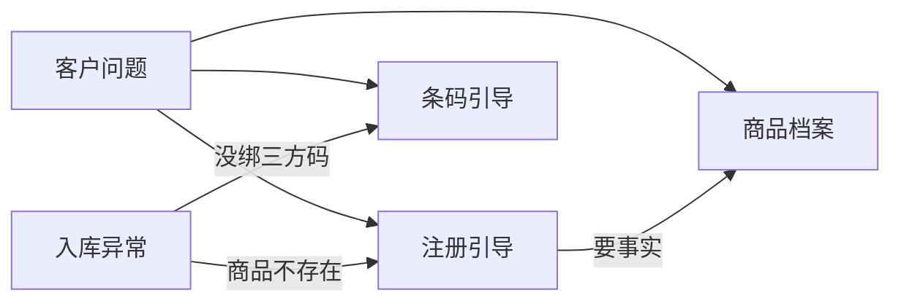

# 海外仓商品（SKU）专家能力介绍

> **用途**：Huddle / 业务对齐会（约 10～15 分钟）  
> **受众**：产品、客服运营、业务对接  
> **日期**：2026-07-17  
> **完整说明**：[expert-manual.md](expert-manual.md)

---

## 1. 一句话

SKU 域已做好 **4 个专家**：能查商品事实、能教客户注册/加急/退回/解禁浅层、能教打标与绑三方码、能做合规深判——**都不代客在系统里点按钮**，只指引自助或转人工。

---

## 2. 已实现能力一览

| 专家 | 客户 / 上游会得到什么 | 能自动读系统的部分 |
|------|------------------------|-------------------|
| **商品档案** | 商品编码对应的「户口本」：单品化/商品化、尺重件型、带电液体等、发布态、是否禁入、是否限直发 | 按商品编码批量查档案；按进口国解析申报/属性 |
| **注册与操作引导** | 怎么注册、催审核/加急、退回怎么改、限直发/属性解除、禁止入库浅层解禁、新品能否发（浅层） | 有商品编码时可读 **应维护完成时间、是否已加急、退回原因/话术**（规则允许时才展示退回） |
| **条码引导** | 怎么打印标签、绑/查三方码（含 FNSKU）、缺三方码待办怎么补、仓内扫不上怎么查 | 有商品编码时可只读 **已绑三方码、管理模式**；可摘要「缺三方码」清单 |
| **合规深判** | 禁限运细则、证书/GPSR/WEEE、电清关链接、承运深判、解禁条件是否满足 | 有编码时可只读合规档案摘要；清单比对仍靠公告 KB，无法判定转人工 |

四个专家中前三 + 合规深判均已：**设计 + 节点实现 + 单测**（待 Coze 配置）。

---

## 3. 典型问法 → 找谁（会上可对照）

| 客户怎么问 | 找谁 |
|------------|------|
| 加急、审核要多久、催注册 | 注册引导（教客户自己点加急，**不代点**） |
| 这个链接能不能发某国仓 | 注册引导（浅层；复杂个案转人工） |
| 退回了怎么改、怎么注册/批量导入 | 注册引导 |
| 为什么限直发 / 禁止入库，怎么解（浅层） | 档案事实 + 注册引导 |
| 这个 SKU 带不带电、单品化还是商品化 | 商品档案（事实） |
| 打印条码、绑 FNSKU、扫不上、缺三方码待办 | 条码引导 |
| 禁限运深判、缺什么证、WEEE/GPSR、链接是否合规 | 合规深判 |

---

## 4. 业务必须对齐的边界

**会做**

- 用万邑联路径教客户自助（维护任务、商品管理、绑码等）
- 有编码时尽量读系统事实，减少「空口指引」
- 缺信息、人工下的禁、深判个案 → 标明转人工

**不会做**

- 不代点加急、不代提交注册、不代绑/删码、不代解禁写入
- 不回答库存数量、CBM/SKU 额度、出库打包怎么改
- 不接验货单进度、禁限运/证书**深判**（这两块专家**尚未做**，现阶段转人工）

---

## 5. 和「以前口头能力」的差别（可强调）

| 以前容易误会 | 现在实际 |
|--------------|----------|
| 机器人会帮客户点加急 | **不会**；只教客户在维护任务上自助加急 |
| 只能让客户自己去页面看审核时效 | **有商品编码时**可尝试读出应维护完成时间；读不到再指引页面 |
| 条码专家纯话术 | **有编码时**可带「已绑哪些三方码」等摘要，仍不代写 |
| 商品档案字段不全 | 已切到更完整的商品列表接口，并按场景裁剪，避免大包数据进对话 |

