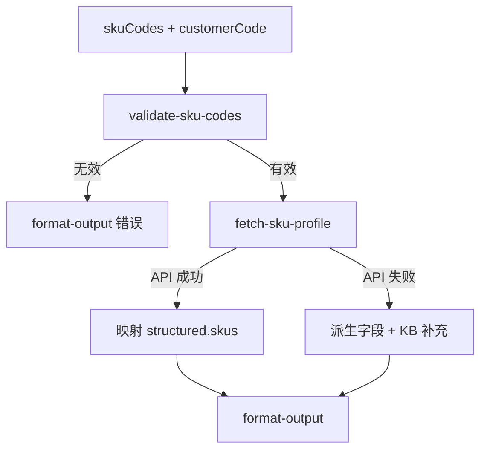

# SKU 专家 — profile 业务参考

> 域：`sku` · Expert ID：`sku/profile` · 优先级：P1（共享事实层）  
> 实现规格：[`experts/sku/profile/design.md`](../../../experts/sku/profile/design.md)

## 业务场景

给定商品编码 **`skuCode`**（可选进口国；注册侧同义 **`productCode`**），返回**商品档案结构化事实**：`code`（M 码）、`supervisorMode`、箱套 `type`、`itemPackaging`、件型、特殊属性、发布态、**头程直发限制及原因**、**禁止入/出库及原因与来源类型**、退回原因等。供上游专家及 `registration-guide`（限直发/解禁浅层）消费。字段名对齐 OpenAPI，不依赖 MMS 知识图谱。

## 典型调用方问法（经 planner 路由）

- 「这个商品带电吗？」（→ 上游专家内调 profile）
- 「件型是大件还是小件？」
- 「是单品化还是商品化管理？有没有箱/套？」
- 「商品是否已发布、能否下入库单？」（发布态事实；操作引导 → `registration-guide`）
- 「为什么限直发 / 不能下 Winit 头程单？」（事实 → profile；解法 → `registration-guide` flows/04）
- 「为什么禁止入库/出库？」（事实含 `prohibitSource`；解禁 → `registration-guide` `guide_unban`）

## 边界分工

| 问 | 不问 |
|----|------|
| `skuCode`/`code`、`supervisorMode`、`type`、`itemPackaging`、件型、特殊属性、发布态 | 教客户如何注册/加急/解禁（→ `registration-guide`） |
| 头程直发限制及原因、禁止入出库原因与来源、退回原因 | 限直发/解禁步骤（→ `registration-guide`） |
| 件型（可由尺重 + 货型标准计算 → `itemType`） | 某国禁限运长文解读（→ `compliance-check` P2） |
| 适用规则摘要（带电需填报等） | 查验单进度（→ `inspection-status` P2） |
| `missingFacts` / `confidence` 标注缺口 | 在库数量（→ `storage`）；出库 `outPackaging*`（旅程域） |

**衔接**：输出 `structured.skus[]`；供 `inbound-exception-check`、`value-add-product-recommendation` 等及 **`registration-guide`（限直发/禁止入出库）** 读取。

LLM Wiki：[flows/04](../../sku/flows/04-direct-shipment-restriction.md)、[flows/05](../../sku/flows/05-prohibit-inbound-sale.md)

---

## 处理流程

---

## 分支决策表

| 条件 | 行为 |
|------|------|
| `skuCodes` 为空 | `need_info`，提示补充商品编码 |
| 上游仅有 `productCode` | 归一为 `skuCode` 再查 |
| `winit.mms.item.list` 命中 | 映射 `skuCode`、`code`、`supervisorMode`、`itemPackaging`、特殊属性、禁限等 |
| API 未命中 | `missingFacts` 含 `sku_not_found`；可尝试订单 merchandise 派生 |
| 尺重齐全但无 `itemType` | 按货型标准 KB 计算件型，`dataSource: kb` |
| 禁止入库/出库标记为真 | 输出标记 + `prohibitSource`；对客解禁由 `registration-guide` |
| 禁限来源字段缺失 | `prohibitSource: unknown`；`confidence` 下调 |

---

## 系统查询路径

| 场景 | API / 路径 |
|------|------------|
| 商品档案 | `winit.mms.item.list`（`skuCode` 过滤） |
| 箱套类型补充 | `winit.item.box.save` 相关 KB / 查询 Gap |
| 订单侧派生（降级） | OMS `getOrderDetail.merchandiseList` |
| 货型计算 | `_kb/product-team/.../cargo-type-standard-internal-winit.md` |
| 特殊属性定义 | `_kb/system-guide/.../海外仓特殊属性商品定义.md` |

---

## structured 输出草案

| 字段 | 说明 |
|------|------|
| skus[].skuCode | 商品编码（canonical；同义 productCode） |
| skus[].code | 商品条码 M 码 |
| skus[].supervisorMode | SI / SKU |
| skus[].type | BOX / SUITE / null |
| skus[].itemPackaging | LOGISTICS / SALES / NUDE_CARGO |
| skus[].publishStatus | published / draft / returned / inactive |
| skus[].prohibitInbound / prohibitOutbound | 是否禁止入/出库 |
| skus[].prohibitSource | rule / manual / unknown |
| skus[].itemType | 货型（KB 计算） |
| skus[].specialFlags | isBattery / isWithLiquid / … |
| skus[].managementMode | supervisorMode / isBatchManager 等 |
| skus[].dataSource / confidence | api \| derived \| kb；high \| medium \| low |
| missingFacts | 未能确认的事实列表 |

---

## KB 溯源表

| 优先级 | 文档 | 用途 | 标注 |
|--------|------|------|------|
| 1 | `_kb/system-team/public-api/OSWH/商品/03-查询商品.md` | `winit.mms.item.list` 字段映射 | `[KB]` |
| 1 | `_kb/system-team/public-api/OSWH/商品/01-时序图.md` | 商品编码 / M 码 / 管理模式术语 | `[KB]` |
| 1 | `_kb/system-guide/.../海外仓特殊属性商品定义.md` | 特殊属性枚举 | `[KB]` |
| 2 | `_kb/product-team/.../cargo-type-standard-internal-winit.md` | 件型计算 | `[KB]` |
| 2 | `_kb/system-team/public-api/OSWH/商品/07-新增编辑商品箱套装信息.md` | `type` BOX/SUITE | `[KB]` |

### 待产品确认 `[推断]`

- 发布态完整枚举与 list 字段映射
- 箱套 `type` 是否可从 list 直出
- `prohibitSource` 是否未来有 API 字段
