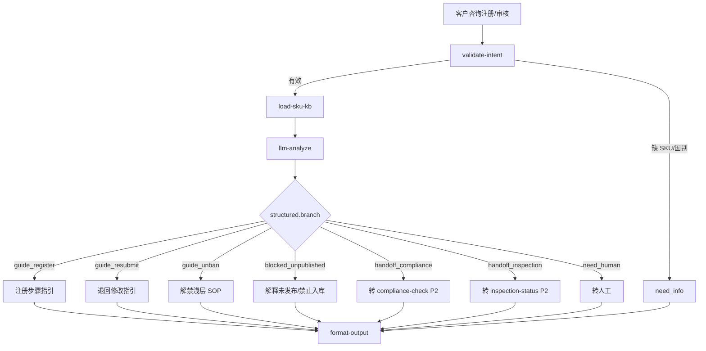

# SKU 专家 — registration-guide 业务参考

> 域：`sku` · Expert ID：`sku/registration-guide` · 优先级：P1（对客引导层）  
> 实现规格：[`experts/sku/registration-guide/design.md`](../../../experts/sku/registration-guide/design.md)

## 业务场景

解答**注册加急（~61%）**、**新品能否承运/入库（~25%）**、注册/审核/退回、限直发解法、属性解除、**禁限解禁浅层**，以及「商品不存在」等报错。承接 `inbound-permission-apply` 的 `sku_registration` 路由。

## 典型客户问法

- 「SKU 能加急吗？审核要多久？」
- 「这个链接能不能发美国仓？」
- 「怎么注册海外仓商品？」
- 「批量导入失败怎么办？」
- 「审核要多久？怎么看审核状态？」
- 「商品被退回了，怎么改？」
- 「下入库单提示商品信息不存在」
- 「为什么这个 SKU 不能入库？怎么解禁？」
- 「验货到哪一步了？」（→ handoff `inspection-status` P2）

## 边界分工

| 问 | 不问 |
|----|------|
| 注册/加急/承运/退回/属性解除/解禁浅层 SOP | SKU 属性事实只读（→ `profile`） |
| 限直发两种解法（引用 profile 事实） | 禁售**库存数量**（→ `storage`） |
| 未发布/禁止入库导致无法下单的解释 | CBM/SKU 账户额度（→ `inbound-capacity-availability`） |
| 批量注册模板与常见报错 | 账户权限/偏好开通（→ `inbound-permission-apply` / `customer`） |
| 合规证书长文判定 | 深判 → `compliance-check`（P2，`handoff_compliance`） |
| 查验进度 | → `inspection-status`（P2，`handoff_inspection`） |
| 出库打包方式 | → 旅程域空缺（`outPackaging*`）；入库 `itemPackaging`/箱套 `type` → `profile` |

**衔接**：`inbound-order-manage` 遇「商品不存在」时 planner 可路由本专家；需属性/禁限事实时 planner 可前置 `sku/profile`。

---

## 客服处理流程

---

## 分支决策表

| branch | 触发条件 | 对客要点 |
|--------|----------|----------|
| `need_info` | 缺 SKU、进口国或意图不清 | 请提供 SKU 编码、目的国、具体报错截图 |
| `guide_register` | 问如何新增/批量注册 | 万邑联商品维护 → 新增/导入；材料清单；审核周期说明 |
| `guide_resubmit` | 审核退回、需修改重提 | 查看退回原因 → 修改字段 → 重新提交；可选查 `queryItemMtEntitys` |
| `guide_unban` | 问如何解禁 / 取消禁止入出库（系统规则类） | 引用 profile 标记与来源；补资料/改属性 SOP |
| `blocked_unpublished` | 未发布/禁止入库无法下入库单 | 解释发布态；引导发布或查 `profile` 事实 |
| `handoff_compliance` | 禁限运/证书/GPSR/申报争议 | 说明需合规专席；P2 路由 `compliance-check` |
| `handoff_inspection` | 查验进度/结论 | P2 路由 `inspection-status` |
| `need_human` | KB 无覆盖、个案争议、`prohibitSource=manual` | 升级商品运营/客服 |

### 与入库 FAQ 交叉 `[KB]`

| 报错/场景 | 本专家处理要点 |
|-----------|----------------|
| 商品信息不存在 | 检查 SKU 是否注册、是否审核通过、进口国是否一致 |
| 商品未发布 | 发布流程指引 |
| 禁止入库 | 解释标记与来源；规则类 → `guide_unban`；人工类 → `need_human`；合规深判 → handoff |
| 批量注册失败 | 模板字段、重复 SKU、尺重单位等常见原因 |

---

## 系统查询路径

| 场景 | API / 万邑联路径 |
|------|------------------|
| 审核状态（可选增强） | `mms.itemmttask.queryItemMtEntitys` |
| 客户自助查看 | 万邑联 → 商品 → 商品维护信息 |
| 注册提交（专家不代写） | `registerProduct` API / 万邑联界面 |
| 解禁写入 | **Gap**；首期不代写 |

---

## 转人工 / 升级条件

- `prohibitSource=manual`、合规争议、敏感品解禁个案
- 查验结论争议（可先 handoff_inspection）
- 多进口国属性冲突、系统 Bug 疑似
- 客户要求代客注册（本期不代写 API）
- 详见 [sku-plan.md §七](../../plan/sku-plan.md) 置信度与升级约定

---

## structured 输出草案

| 字段 | 说明 |
|------|------|
| branch | need_info / guide_* / blocked_unpublished / handoff_compliance / handoff_inspection / need_human |
| topicMatched | 匹配到的 KB 主题 |
| sopSteps | 操作步骤列表 |
| auditStatusHint | 审核状态说明（若已拉 API） |
| prerequisites | 前置条件 |
| expertRouting | 需转其他专家时的提示 |
| missingInfo | 仍缺的信息项 |
| confidence | high / medium / low |

---

## KB 溯源表

| 优先级 | 文档 | 用途 | 标注 |
|--------|------|------|------|
| 1 | `_kb/system-guide/.../如何新增商品注册.md` | 注册主流程 | `[KB]` |
| 1 | `_kb/system-guide/.../注册商品常见问题.md` | 批量/报错 FAQ | `[KB]` |
| 1 | `_kb/system-guide/.../修改商品常见问题.md` | 修改/失效 | `[KB]` |
| 2 | `_kb/service-team/.../新增海外仓入库单的常见问题.md` | 「商品不存在」交叉 | `[KB]` |
| 2 | `docs/sku/flows/02-registration-audit-expedite.md` | 加急、审核 SLA | `[KB]` |
| 2 | `docs/sku/flows/01-new-product-carriability.md` | 新品承运 | `[KB]` |
| 2 | `docs/sku/flows/03-return-resubmit.md` | 退回重提 | `[KB]` |
| 2 | `docs/sku/flows/04-direct-shipment-restriction.md` | 限直发 | `[KB]` |
| 2 | `docs/sku/flows/05-prohibit-inbound-sale.md` | 禁入/禁售/解禁浅层 | `[KB]` |
| 2 | `docs/sku/flows/06-special-attribute-removal.md` | 属性解除 | `[KB]` |
| 2 | `_kb/system-team/public-api/OSWH/商品/04-查询商品审核状态.md` | 审核 API | `[KB]` |

### 待产品确认 `[推断]`

- 审核 Webhook `EVENT_MERCHANDISE_REGISTER_STATUS` 是否纳入客服侧实时查询
- `sku_registration` 从 `inbound-permission-apply` 迁出后的 planner 路由规则文案
- 解禁写 API 与人工解禁工单路径
