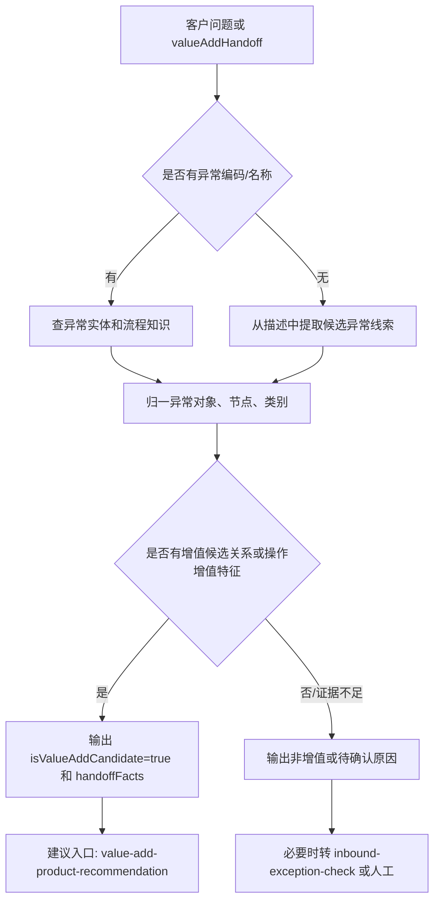

# 增值专家 — value-add-exception-diagnosis 业务参考

> 域：`value-add` · Expert ID：`value-add/value-add-exception-diagnosis` · 优先级：P0  
> 规划文档：[value-add-experts-plan.md](../../plan/value-add-experts-plan.md)  
> API 矩阵：[value-add-api-matrix.md](../../plan/value-add-api-matrix.md)

## 业务场景

识别入库异常是否属于增值推荐链的入口场景：客户或上游专家已经提供异常编码、异常名称、异常对象、入库单号、异常单号或异常描述，本专家负责把这些事实归一为后续 VASC 推荐所需的轻量上下文。

## 典型客户问法

- `B01E1615 是什么异常？需要客户处理吗？`
- `这个包裹条码异常是不是要走增值？`
- `异常对象是包裹还是商品？`
- `这个异常发生在入库还是库内？`
- `inbound-exception-check 已经发现增值类异常，下一步该给哪个 value-add expert？`

## 边界分工

| 问 | 不问 |
|---|---|
| 异常编码、名称、对象、节点、类别归一 | 入库差异责任判定、少货/多货/签收争议核实 |
| 是否建议进入增值推荐链 | 直接推荐最终 VASC 或服务项 |
| 生成推荐链所需 `handoffFacts` | 查询已提交增值单状态 |
| 解释缺少哪些异常事实 | 编造未知异常编码或未知对象层级 |

衔接：

- 上游：`inbound/inbound-exception-check` 输出 `valueAddHandoff`。
- 下游：planner 可把本专家输出交给 `value-add/value-add-product-recommendation`。

## 业务处理流程

## 节点说明

| 节点 | 处理动作 | 证据来源 |
|---|---|---|
| 输入归一 | 提取 `exceptionCode`、`exceptionName`、`eventNo`、`inboundOrderNo`、客户描述 | 用户输入、`valueAddHandoff` |
| 异常识别 | 匹配异常实体、异常节点、异常对象、异常类别 | `../../value-add/inbound-exceptions/` |
| 增值候选判断 | 判断是否存在异常到 VASC 关系或操作增值特征 | `../../value-add/relationship-mappings/inbound-exception-to-vasc-product-mapping.md` |
| 缺口判断 | 标记缺少异常编码、对象、入库阶段、客户意图等 | 总流程、客户意图流程 |
| 输出手交 | 形成 `handoffFacts`，供推荐层消费 | 本专家结构化输出 |

## structured 输出草案

| 字段 | 类型 | 说明 |
|---|---|---|
| `normalizedException` | object | 归一后的异常编码、名称、定义。 |
| `exceptionCategory` | string | 异常类别，如包裹条码、商品条码、订单状态、质量包装。 |
| `exceptionObject` | string | 异常对象原始名称。 |
| `objectLevel` | string | 归一层级：`order` / `package` / `product` / `item` / `pallet` / `unknown`。 |
| `exceptionNode` | string | 异常节点，如 `IN_BOUND`、`IN_WAREHOUSE`。 |
| `requiresCustomerAction` | boolean/string | 是否需要客户动作，可为 `conditional`。 |
| `isValueAddCandidate` | boolean | 是否建议进入增值推荐链。 |
| `missingEvidence` | string[] | 还需要补充的事实。 |
| `handoffFacts` | object | 给 `product-recommendation` 的精简上下文。 |

## 依赖资料

| 资料 | 用途 |
|---|---|
| `../../value-add/inbound-exceptions/` | 异常实体定义、对象、节点。 |
| `../../value-add/inbound-exception-value-added-process/inbound-exception-to-value-added-overall-flow.md` | 总体决策模型。 |
| `../../value-add/relationship-mappings/inbound-exception-to-vasc-product-mapping.md` | 判断异常是否有 VASC 候选关系。 |
| `../../value-add/inbound-exception-value-added-process/customer-action-decision-flow.md` | 当用户已表达处理意图时辅助归一。 |

## 转人工 / 降级条件

- 用户只给模糊描述，无法定位异常编码或对象。
- 映射中不存在候选关系，但用户坚持要求下增值。
- 异常责任、签收争议、少货多货核实未完成，需要先回 `inbound/inbound-exception-check`。
- 异常对象与客户意图明显冲突，例如包裹级异常要求商品级销毁但证据不足。

