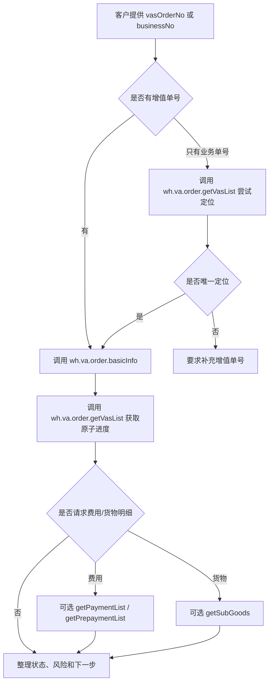

# 增值专家 — value-add-order-status 业务参考

> 域：`value-add` · Expert ID：`value-add/value-add-order-status` · 优先级：P1  
> 规划文档：[value-add-experts-plan.md](../../plan/value-add-experts-plan.md)  
> API 矩阵：[value-add-api-matrix.md](../../plan/value-add-api-matrix.md)

## 业务场景

客户已经提交增值单，想查询增值单主状态、原子执行进度、退回原因、部分完成原因、关联业务单或可选费用信息。本专家是 API 型状态查询 expert，v1 主路径只处理已有增值单后的事实查询。

## 典型客户问法

- `V106075100 现在处理到哪一步了？`
- `这张增值单为什么被退回？`
- `哪个原子已经完成，哪个还在处理中？`
- `这张增值单关联哪个入库单或异常单？`
- `这张增值单实际扣费多少？`

## 边界分工

| 问 | 不问 |
|---|---|
| 已提交增值单主状态 | 未下增值单前报价 |
| 原子执行状态、完成数量、退回/部分完成原因 | 推荐新 VASC |
| 关联业务单、异常编码、VASC 信息 | 指导事前字段配置 |
| 事后实际费用或已有增值单预估费用（增强） | 入库少货、多货、签收争议责任 |

衔接：

- 当用户问“应该选哪个增值”时，转 `value-add/value-add-product-recommendation`。
- 当用户问“这个 VASC 下怎么配置”时，转 `value-add/value-add-service-config`。

## 业务处理流程

## API 主路径

| 场景 | action | 优先级 | 用途 |
|---|---|---|---|
| 增值单基本信息 | `wh.va.order.basicInfo` | P0 | 主状态、业务单、VASC、异常信息、时间、控制信息。 |
| 原子执行列表 | `wh.va.order.getVasList` | P0 | 原子状态、完成数量、退回/部分完成原因。 |
| 实际费用 | `wh.va.order.getPaymentList` | P2 | 事后实际费用，可选增强。 |
| 已有增值单预估费用 | `wh.va.order.getPrepaymentList` | P2 | 已有 `orderNo` 下的预估费用，不是下单前报价。 |
| 子货物明细 | `wh.va.order.getSubGoods` | P2 | 货物、子货物、商品、条码、批次、附件。 |

## 节点说明

| 节点 | 处理动作 | 说明 |
|---|---|---|
| 入参校验 | 要求 `vasOrderNo` 或 `businessNo` 至少一个 | 优先 `vasOrderNo`。 |
| 基本信息查询 | 调 `basicInfo` | 只允许当前客户下的增值单。 |
| 原子进度查询 | 调 `getVasList` | 默认分页拉取主列表。 |
| 风险标记 | 标记退回、部分完成、长时间 pending、需客户确认等 | 可呈现系统预计时间，但不将其承诺为 SLA。 |
| 可选增强 | 费用或货物明细 | 不影响状态主路径。 |

## structured 输出草案

| 字段 | 类型 | 说明 |
|---|---|---|
| `vasOrderNo` | string | 增值单号。 |
| `status` | string | 增值单主状态编码。 |
| `statusDesc` | string | 增值单主状态描述。 |
| `orderDate` | string | 增值单下单时间。 |
| `estimateCompleteTime` | string | 系统预计完成时间。 |
| `estimateCompleteTimeLocal` | string | 页面展示的当地预计完成时间，优先对客说明。 |
| `actualCompleteTime` | string | 主单实际完成时间。 |
| `businessOrder` | object | 关联业务单、异常编码、异常对象等。 |
| `warehouse` | object | 仓库编码、名称及国家信息。 |
| `vasc` | object | VASC 编码、名称、审核/确认信息。 |
| `atomProgress` | array | 原子状态、完成时间、完成数量、退回/部分完成原因。 |
| `riskFlags` | string[] | 风险标记，如退回、部分完成、长时间待处理、需客户确认。 |
| `nextAction` | string | 建议客户等待、补资料、查配置或转人工。 |
| `paymentSummary` | object/null | 事后实际费用摘要，增强分支才返回。 |
| `prepaymentSummary` | object/null | 已有增值单预估费用摘要，增强分支才返回。 |

## 费用边界

| 问题 | 处理 |
|---|---|
| 未下单前估价 | v1 不承接，需确认真正事前报价接口或价卡规则来源。 |
| 已有增值单预估费用 | 可选查 `getPrepaymentList`，必须有 `orderNo`。 |
| 已有增值单实际费用 | 可选查 `getPaymentList`，是事后费用。 |
| 费用计算失败 | 解释接口返回的错误字段，必要时转人工。 |

## 依赖资料

| 来源 | 用途 |
|---|---|
| `../../value-add/source-references/interface-documents/wh-va-order-basic-info-api.md` | 增值单基本信息和主状态。 |
| `../../value-add/source-references/interface-documents/wh-va-order-get-vas-list-api.md` | 原子执行列表、完成数量、退回/部分完成原因。 |
| `../../value-add/source-references/interface-documents/wh-va-order-get-payment-list-api.md` | 可选增强：事后实际费用。 |
| `../../value-add/source-references/interface-documents/wh-va-order-get-prepayment-list-api.md` | 可选增强：已有增值单预估费用。 |
| `../../value-add/source-references/interface-documents/wh-va-order-get-sub-goods-api.md` | 可选增强：货物和子货物明细。 |

## 转人工 / 降级条件

- 只有 `businessNo` 且定位到多张增值单。
- OpenAPI 返回权限失败、增值单不存在或数据为空。
- 增值单长时间 pending、退回原因不清晰或涉及线下仓库确认。
- 用户要求未下单前报价、价卡解释或费用争议判责。
