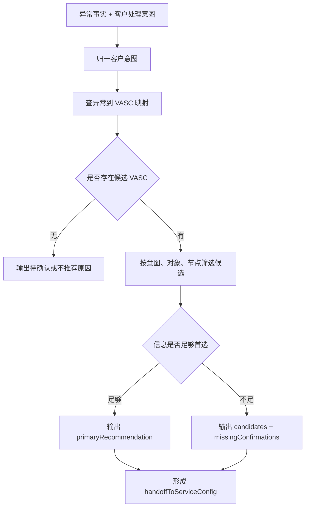

# 增值专家 — value-add-product-recommendation 业务参考

> 域：`value-add` · Expert ID：`value-add/value-add-product-recommendation` · 优先级：P0  
> 规划文档：[value-add-experts-plan.md](../../plan/value-add-experts-plan.md)  
> API 矩阵：[value-add-api-matrix.md](../../plan/value-add-api-matrix.md)

## 业务场景

客户已经有入库异常事实或处理意图，想知道应该选择哪个 VASC 产品。本专家根据异常到 VASC 的关系映射、客户处理意图流程和 VASC 产品知识，输出候选 VASC、首选推荐、限制原因和缺失确认项。

## 典型客户问法

- `包裹条码异常，客户想继续上架，应该选什么增值？`
- `商品条码异常是原单上架还是新单上架？`
- `客户要销毁这批异常商品，应该选哪个 VASC？`
- `这个异常能不能直接上架？`
- `为什么不能直接推荐非标？`

## 边界分工

| 问 | 不问 |
|---|---|
| 异常到 VASC 候选推荐 | 不解释已提交增值单状态 |
| 客户处理意图归一 | 不输出完整字段、附件、模板 |
| 首选 VASC、候选 VASC、限制原因 | 不做入库差异责任判定 |
| 缺失确认项，如原单状态、新单号、对象层级 | 不用接口文档反推 VASC 适用性 |

衔接：

- 上游：`value-add/value-add-exception-diagnosis` 的 `handoffFacts`。
- 下游：`value-add/value-add-service-config` 消费 `handoffToServiceConfig`。

## 业务处理流程

## 客户意图归一

| 客户说法 | 归一意图 | 推荐判断重点 |
|---|---|---|
| `用原单继续上架` | 原单上架 | 原入库单状态、实物与原单是否匹配、条码是否可补。 |
| `重新下一单上架` | 新单上架 | 是否已有新入库单、新包裹条码、新商品标签需求。 |
| `直接上架` | 直接上架 | 是否无需贴标/包装/关联，且映射支持。 |
| `先拍照确认` | 拍照/调查 | 拍照通常不是关闭动作，结果出来后还需再次选择。 |
| `销毁` | 销毁 | 商品级还是包裹级、上架前还是库内。 |
| `自提` | 自提 | 包裹/托盘对象、是否需要 Winit 打托。 |
| `转仓/调拨` | 串仓调拨或非标 | 先排除标准 VASC；确认仓群、目的仓和规则。 |

## 节点说明

| 节点 | 处理动作 | 证据来源 |
|---|---|---|
| 意图归一 | 将用户自然语言映射到上架、拍照、销毁、自提、非标等方向 | `customer-action-decision-flow.md` |
| 候选生成 | 按 `exception_code -> vasc_product_code` 关系生成候选 | `inbound-exception-to-vasc-product-mapping.md` |
| 候选过滤 | 结合 VASC 启用状态、对象、节点、客户意图做说明 | VASC 产品实体页、流程知识 |
| 缺口输出 | 标记缺少原单状态、新单号、异常对象、仓库、条码关系等 | 总流程 |
| 服务配置手交 | 输出 VASC、意图、限制和后续需配置方向 | 本专家结构化输出 |

## structured 输出草案

| 字段 | 类型 | 说明 |
|---|---|---|
| `customerActionNormalized` | string | 归一后的客户处理意图。 |
| `recommendedVascCandidates` | array | 候选 VASC，含 code、name、activeStatus、reason、confidence。 |
| `primaryRecommendation` | object/null | 首选 VASC；证据不足时为空。 |
| `notRecommendedOptions` | array | 明确不推荐的 VASC 和原因。 |
| `missingConfirmations` | string[] | 需要补充确认的信息。 |
| `handoffToServiceConfig` | object | 传给 `service-config` 的 VASC、意图、对象层级、限制说明。 |

## 依赖资料

| 资料 | 用途 |
|---|---|
| `../../value-add/relationship-mappings/inbound-exception-to-vasc-product-mapping.md` | 候选 VASC 的主依据。 |
| `../../value-add/inbound-exception-value-added-process/customer-action-decision-flow.md` | 客户处理意图归一。 |
| `../../value-add/vasc-products/` | VASC 产品解释、启用态和业务描述。 |
| `../../value-add/inbound-exception-value-added-process/inbound-exception-to-value-added-overall-flow.md` | 对象、阶段、关闭口径。 |

## 转人工 / 降级条件

- 异常编码不存在映射，且用户要求确定推荐。
- 客户意图与异常对象不匹配。
- 非标需求缺少操作步骤、图片、SOP、耗材或审批依据。
- VASC 为 inactive 或历史候选，不能直接推荐为可下单方案。

