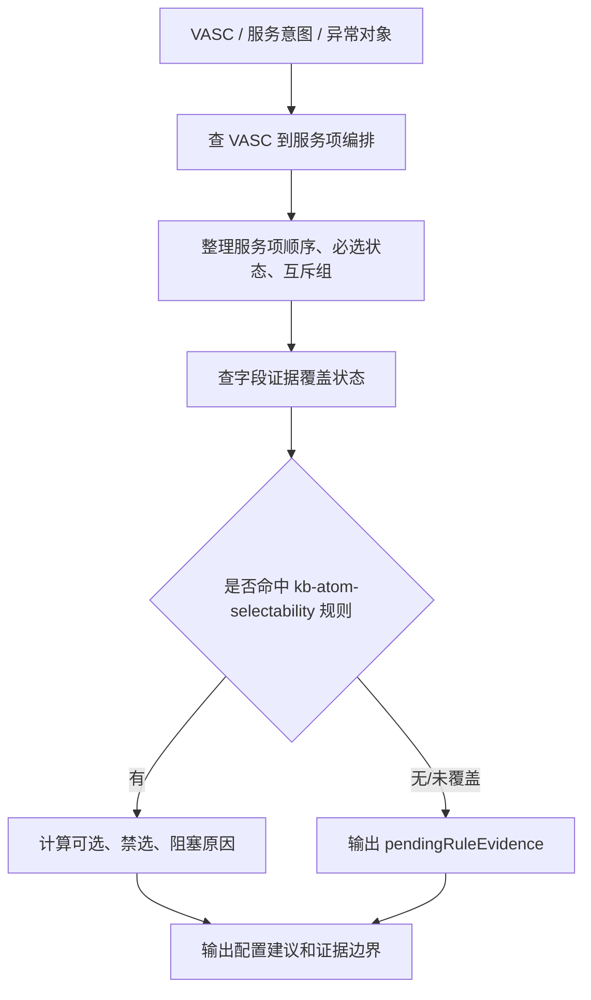

# 增值专家 — value-add-service-config 业务参考

> 域：`value-add` · Expert ID：`value-add/value-add-service-config` · 优先级：P0  
> 规划文档：[value-add-experts-plan.md](../../plan/value-add-experts-plan.md)  
> API 矩阵：[value-add-api-matrix.md](../../plan/value-add-api-matrix.md)

## 业务场景

客户或上游推荐层已经确定 VASC 或候选 VASC，想知道该 VASC 下有哪些服务项/原子、顺序和互斥关系是什么、当前知识库是否能证明字段/附件/模板要求。本专家读取已裁剪的原子可选性规则切片，但对未覆盖或动态配置不明的规则保持待确认。

## 典型客户问法

- `原单上架下面有哪些服务项？`
- `补包裹条码和补商品条码能不能一起选？`
- `这个原子在当前异常场景能不能选？`
- `库内轻加工需要填哪些字段？`
- `当前知识库能证明哪些字段，哪些还缺证据？`

## 边界分工

| 问 | 不问 |
|---|---|
| VASC 下服务项/原子编排、顺序、必选状态 | 不判断异常是否适合某个 VASC |
| 互斥组、可选/禁选规则入口 | 不查询已提交增值单状态 |
| 字段证据覆盖状态 | 不承诺完整字段、附件、模板和枚举 |
| 用户准备资料提示 | 不把已提交订单里的 `vaAtomAttrs` / `vaAtomFiles` 当作事前全量字段、附件、模板配置 |

衔接：

- 上游：`value-add/value-add-product-recommendation` 的 `handoffToServiceConfig`。
- 下游：若用户已经提交增值单并问状态，转 `value-add/value-add-order-status`。

## 业务处理流程

## 节点说明

| 节点 | 处理动作 | 证据来源 |
|---|---|---|
| VASC 定位 | 确认 `vascCode`、`vascName`、服务意图 | 上游 handoff、用户输入 |
| 服务项编排 | 输出 `sequence`、`required_in_vasc`、`mutex_group_cn` | `vasc-product-to-service-item-orchestration-mapping.md` |
| 字段证据 | 标记 `partial_field_evidence` 或 `missing_field_evidence`；普通属性字段可说明为 BaseAttrRel 扩充后的部分证据 | `service-item-config-field-evidence-coverage.md` |
| 原子可选性 | 读取运行时规则切片，判断已覆盖的场景禁选、对象依赖、互斥、置灰/隐藏/前置校验 | `../../../experts/value-add/value-add-service-config/prompts/kb-atom-selectability.md` |
| 输出边界 | 明确能说什么、不能承诺什么、需补哪些证据 | 本专家结构化输出 |

## structured 输出草案

| 字段 | 类型 | 说明 |
|---|---|---|
| `vasc` | object | VASC 编码、名称、启用状态、服务方向。 |
| `serviceItems` | array | 服务项/原子列表，含 code、name、sequence、required、mutexGroup、fieldEvidenceStatus。 |
| `selectedServiceItems` | array | 基于用户意图筛选出的建议服务项。 |
| `selectableServiceItems` | array | 当前规则下可选服务项；规则未覆盖或动态配置不明时可为空。 |
| `blockedServiceItems` | array | 当前规则下不可选服务项。 |
| `mutexGroups` | array | 互斥组和组内选择说明。 |
| `blockingReasons` | array | 不可选原因。 |
| `pendingRuleEvidence` | string[] | 规则证据缺口。 |
| `configEvidenceSummary` | object | 字段证据覆盖摘要。 |
| `customerInputHints` | string[] | 可安全提示客户准备的信息。 |
| `blockedClaims` | string[] | 当前不能承诺的字段、附件、模板、枚举。 |

## 原子可选性规则

结构化规则源命名为 `atom-selectability-rules`，当前 v0.1 已由 `vas-atom-hardcoded-rules.md` 和 `vas-atom-disable-logic.md` 合并派生，来源标记为“产品百事通 + 研发百事通 / 无统一接口可获取完整语义”，覆盖：

| 规则类型 | 说明 |
|---|---|
| 场景禁选 | 某些原子在特定场景、仓库、入库阶段或条件下不能选。 |
| 原子互斥 | 某些原子不能同时选择。 |
| VASC 依赖 | 某些原子只在特定 VASC 下可选。 |
| 对象依赖 | 某些原子依赖包裹、商品、单品、托盘等层级。 |
| 阶段依赖 | 某些原子依赖到仓、异常暂存、上架前、库内等阶段。 |
| 动态配置依赖 | 某些命中列表或白名单来自数据库、后台配置或后端返回配置。 |
| 前后端差异 | 前端隐藏但后端不禁用、后端可处理但前端暂未开放。 |

规则未覆盖或动态配置不明时，本专家必须输出“待确认”，不能编造系统规则；规则为动态配置驱动时，应说明“以当前离线快照和配置状态为准，配置可能变更”。

## 依赖资料

| 资料 | 用途 |
|---|---|
| `../../value-add/relationship-mappings/vasc-product-to-service-item-orchestration-mapping.md` | 服务项编排主依据。 |
| `../../value-add/relationship-mappings/service-item-config-field-evidence-coverage.md` | 字段证据覆盖主依据。 |
| `../../value-add/value-added-service-items/` | 服务项解释。 |
| `../../../experts/value-add/value-add-service-config/prompts/kb-atom-selectability.md` | 运行时原子可选性规则切片。 |
| `../../value-add/source-references/interface-documents/pms-base-attr-rel-service-find-base-attr-rel-page-api.md` | 普通属性字段配置来源参考；已通过字段覆盖表沉淀，不作为专家 v1 运行时 API。 |
| `../../value-add/source-references/interface-documents/wh-va-order-get-vas-list-api.md` | 已提交增值单执行属性/附件参考；不作为事前字段、模板、上传要求全量配置。 |

字段、附件、模板口径：

- 普通属性字段：以字段覆盖表为准，只能输出 partial/missing 证据状态和可安全提示的信息。
- 已提交订单的 `vaAtomAttrs` / `vaAtomFiles`：用于解释既有增值单事实，归 `value-add-order-status`。
- 附件、模板、上传关系：当前仍未形成完整静态来源；没有 `vaAtomFiles`、页面运行时响应或等价配置来源时，必须输出待确认。

## 转人工 / 降级条件

- 用户要求确定字段、附件、模板，但当前只有 partial/missing 证据。
- 用户问两个原子能否共选，但 `atom-selectability-rules` 未覆盖。
- VASC 编码不存在或与异常对象、入库阶段冲突。
- 客户需求是新建/提交增值单操作，而不是配置解释。
