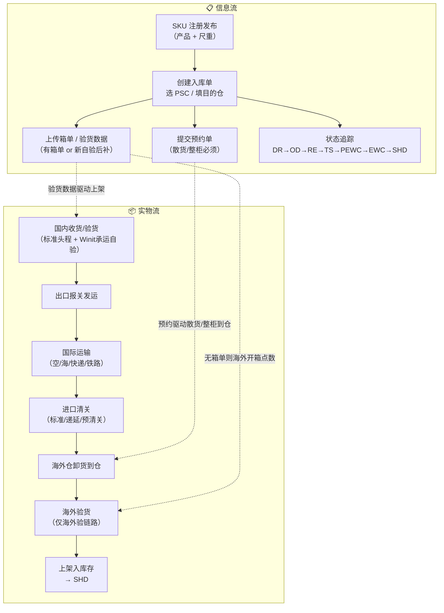

# Winit 入库 Inbound Playbook

> **定位：** 本文件是 Winit 入库链路的「知识枢纽（Hub）」，提供双轨模型、产品分层、状态机与主决策树。
> 具体环节细则见 `flows/` 分册；原始操作 SOP 保留在 `_kb/`。
>
> 标注说明：**`[KB]`** = 有 `_kb` 明确来源；**`[推断]`** = 行业常识或 PSC 命名推导，待产品确认。

---

## 一、术语表

| 术语 | 说明 |
|---|---|
| **入库单** | 万邑联系统中一条入库委托记录，有唯一单号，对应一批货物的全部状态 |
| **PSC** | Product Service Code，产品服务编码，决定收费标准、验货方式与运输链路 |
| **头程** | 从国内发货地到海外仓的运输段；分 Winit 承运（标准头程）与客户自发（直发）两类 |
| **直发** | 客户自行安排物流将货物送至海外仓，Winit 不承运头程段 |
| **标准海外仓入库** | Winit 全程托管：揽货 → 国内仓验货 → 头程 → 海外仓上架 |
| **自验（国内验）** | 客户在货物发出前自行完成验货（PDA / API / Excel），Winit 国内仓不复检 |
| **海外验** | 货物到达 Winit 海外仓后，由海外仓完成验货（开箱点数）再上架 |
| **有箱单 / 无箱单** | 客户是否在入库单创建时提供完整装箱明细；无箱单走「绿色通道」或「海外验预报」 |
| **新自验** | 下单时只填 SKU + 数量，不要求先传完整箱单，到仓后再补充 `[KB]` |
| **预约单** | 散货/整柜送仓前必须在系统提交的到仓预约，含 Slot 时间与数量 |
| **Slots** | 海外仓预约时间窗口；容量有限，由库容信号（capacity-signal）管控 |
| **DR / OD / RE / TS / PEWC / EWC / SHD** | 入库单状态简称，见下文「状态机」章节 |
| **STOP** | 入库单被人工或系统终止 |
| **A+ / A / B / C 包** | 包裹品质分级；A+ 为全新完好，C 为严重异常 `[KB]` |
| **混装柜 / 转运** | 多客户货物共柜，到达中转港后拆分转运至最终目的仓（如 USWC→USTX） |
| **DROP 卸货 / LIVE 卸货** | 整柜送仓方式：DROP = 司机留柜后离开，仓库自行卸货；LIVE = 司机现场等候卸货 |
| **散装卸货费** | 下单选快递但实际散货送仓时产生的额外费用 `[KB]` |
| **未预约违规费** | 散货/整柜未预约直接送仓产生的违规处罚费 `[KB]` |
| **LCL / FCL** | Less than Container Load（拼箱散货） / Full Container Load（整柜） |

---

## 二、双轨模型（信息流 × 实物流）

同一入库单上，信息流操作与实物流动作**相互交织但时序可不同步**。例如：自验单在货物出库后才完成信息录入；海外验单可在货物到达 TS 状态后仍尚无完整箱单。



---

## 三、三层产品 Taxonomy（主分叉）

`[KB]` 来自 [`inbound-product-details.md`](../../_kb/product-team/winit/in-warehouse/inbound-product-details.md)

| 产品线 | 验货发生地 | 头程承运方 | 国内仓节点 | 典型 PSC 前缀 |
|---|---|---|---|---|
| **标准海外仓入库** | Winit **国内仓** | Winit（揽收或自送国内仓） | 必须经过 | `OW01011*` |
| **直发 + 自验（国内验）** | 客户侧，发货前完成 | 客户自选物流，或 Winit 承运（OW01021） | Winit 承运时经过 | `OW01022*`（直发自验）`OW01021*`（Winit承运自验） |
| **直发 + 海外验** | Winit **海外仓** | 客户自选，或 Winit 头程到海外 | 仅 Winit 承运时经过 | `OW01031*`（Winit承运海外验）`OW01032*`（直发海外验）|

### 服务优势对比

| 维度 | 标准头程 | 直发自验 | 直发海外验 |
|---|---|---|---|
| 上架速度（美国，空运） | 1 工作日 | 1 工作日（空卡） | 2 工作日（空卡） |
| 客户操作复杂度 | 最低（全托管） | 中（需自验数据） | 低（无需客户验货） |
| 适用客户 | 中小客户 | 品牌/工厂型 | 高值货/紧急补货 |
| 单价 | 最高（含头程） | 低（客户自发） | 中 |
| 国内仓质检 | 有 | 仅 Winit 承运时有 | 仅 Winit 承运时有 |

---

## 四、产品选择决策树

```
客户有新的货物要入库 Winit 海外仓
│
├── 是否使用 Winit 头程？
│   │
│   ├── YES → 标准头程 (OW01011*)
│   │         → 见 flows/01
│   │
│   └── NO（客户自发）→ 选择验货方式
│       │
│       ├── 客户在发货前自验 → 直发自验
│       │   │
│       │   ├── 走 Winit 承运（OW01021*）→ 见 flows/02 + flows/04
│       │   └── 完全直发（OW01022*）→ 见 flows/02
│       │
│       └── 在 Winit 海外仓验货 → 直发海外验
│           │
│           ├── Winit 承运到海外（OW01031*）→ 见 flows/03
│           └── 完全直发（OW01032*）→ 见 flows/03
│
└── 送仓方式（影响预约要求）
    ├── 快递面单逐件派送 → 免预约 → 见 flows/06
    ├── 散货（LCL/拼箱/货代车） → 必须预约 → 见 flows/06
    └── 整柜（FCL，DROP/LIVE）→ 必须预约 → 见 flows/06
```

---

## 五、入库单状态机

`[KB]` 来自 [`inbound-faq.md`](../../_kb/product-team/winit/in-warehouse/inbound-faq.md)

```
DR → OD → RE → TS → PEWC → EWC → SHD
                          ↘
                          STOP（人工/系统终止）
```

| 状态码 | 含义 | 实物流位置 | 客户常见咨询 | 对应专家 |
|---|---|---|---|---|
| **DR** | 草稿 / 已创建 | — | 怎么下单？权限开了吗？ | `inbound-process-guide` |
| **OD** | 已确认 / 待发货 | 国内待交付 | 我什么时候可以发货？ | `inbound-process-guide` |
| **RE** | 国内仓已收货 | 国内仓收货/验货 | 国内仓收到了吗？什么时候出库？ | `inbound-order-status` |
| **TS** | 已发运 / 在途 | 国际运输中 | 到港了吗？清关进度？预计何时送仓？ | `inbound-order-status` + `inbound-arrival-status` |
| **PEWC** | 预计在仓期 | 海外仓已到仓/验货中 | 什么时候上架？能不能加急？ | `inbound-arrival-status` + `inbound-putaway-expedite` |
| **EWC** | 已完全上架 | 海外仓上架完成 | 上架数量对吗？有没有异常？ | `inbound-putaway-status` + `inbound-exception-check` |
| **SHD** | 已入库存（全部上架） | 库存可用 | — | — |
| **STOP** | 已终止 | — | 为什么终止？能恢复吗？ | `inbound-process-guide` |

### 状态流转说明

- `DR → OD`：客户确认入库单（或 Winit 揽收完成）`[KB]`
- `OD → RE`：国内仓或海外仓完成收货扫描
- `RE → TS`：国内仓完成出库发运（标准头程），或直发客户实际发出（Winit 可能无法自动更新，依赖快递轨迹）`[推断]`
- `TS → PEWC`：海外仓扫描收货（散货取预约实际到仓时间；整柜 LIVE 取实际；整柜 DROP 取预约卸货时间）`[KB]`
- `PEWC → EWC → SHD`：分批上架，SHD 为所有 SKU 全部上架

---

## 六、上架 SLA 速查

`[KB]` 来自 [`咨询入库单上架时间及催上架处理流程.md`](../../_kb/service-team/inbound-services-doc/咨询入库单上架时间及催上架处理流程.md)

### 美国（US）

| 产品线 | 头程 / 运输方式 | 到仓后上架 SLA |
|---|---|:---:|
| 标准海外仓入库 | 空运 / FedEx 快递 | **1 工作日** |
| 标准海外仓入库 | 海运散货（美森/以星） | **2 工作日** |
| 标准海外仓入库 | 海运散货（非美森/以星）/ 海运整柜 | **3 工作日** |
| 标准海外仓入库 | UPS 快递 / 快递单号为空 | **4 工作日** |
| 直发国内验 | 空卡（需 POD 注明航单号） | **1 工作日** |
| 直发国内验 | DHL 快递 | **1 工作日** |
| 直发国内验 | 非 DHL 快递 / 快递单号为空 | **4 工作日** |
| 直发国内验 | 空派 / 海派 / 海运整柜 / 海卡 | **4 工作日** |
| 直发海外验 | 空卡（需 POD 注明航单号） | **2 工作日** |
| 直发海外验 | DHL 快递 | **2 工作日** |
| 直发海外验 | 非 DHL 快递 / 快递单号为空 | **5 工作日** |
| 直发海外验 | 空派 / 海派 / 海运整柜 / 海卡 | **5 工作日** |

> 空卡特别注意：送仓 POD 上必须清晰备注【空卡 + 11 位航空运输单号】，否则仓库默认按海卡 SLA 处理。

### 非美国（UK / DE / AU / CA）

| 产品线 | 头程 / 运输方式 | 到仓后上架 SLA |
|---|---|:---:|
| 标准海外仓入库 | 空运 / 快递 | **1 工作日** |
| 标准海外仓入库 | 海运 / 铁路 | **3 工作日** |
| 直发国内验 | 空卡 | **1 工作日** |
| 直发国内验 | 快递 | **2 工作日** |
| 直发国内验 | 海运整柜 / 海卡 | **3 工作日** |
| 直发国内验 | 空派 / 海派 | **4 工作日** |
| 直发海外验 | 空卡 | **2 工作日** |
| 直发海外验 | 快递 | **3 工作日** |
| 直发海外验 | 海运整柜 / 海卡 | **4 工作日** |
| 直发海外验 | 空派 / 海派 | **5 工作日** |

---

## 七、维度交叉索引

| 维度 | 主要取值 | 影响分册 |
|---|---|---|
| 头程方式 | Winit 头程 / 客户直发 | `flows/01` vs `flows/02-03` |
| 验货方式 | 国内标准验 / 客户自验（PDA/API/Excel）/ 海外验 / 免验 | `flows/01`、`flows/02`、`flows/03`、`flows/04` |
| 运输方式 | 空运 / 海运 LCL / FCL / 快递 / 空卡 / 海卡 / 空派 / 海派 / 铁路 | `flows/05`、`flows/06`、`appendix-psc-dimensions` |
| 清关类型 | 标准一般贸易 / 电商清关 / 递延（UK PVA / DE/BE 递延）/ 预清关 | `flows/05` |
| 目的国 | US / AU / DE / UK / CA / BE / … | 各 flow 国别 SLA 小节 |
| 送仓方式 | 快递面单（免预约）/ 散货（必须预约）/ 整柜 DROP / 整柜 LIVE | `flows/06` |
| 箱单状态 | 有完整箱单 / 无箱单（新自验）/ 预报海外验 | `flows/02`、`flows/03` |
| 抽验触发 | 数量偏差 / 尺重异常 / 条码问题 | `flows/07` |

---

## 八、前置条件与权限

1. **SKU 必须提前注册发布** `[KB]`：入库单创建前，所有 SKU 必须在万邑联完成注册并发布，否则无法下单。
2. **产品权限开通** `[推断]`：部分 PSC 产品（如自验、海外验、整柜等）需提前向 Winit 申请开通权限，涉及客户资质审核。
3. **进口商注册** `[KB]`：递延清关产品（UK PVA、DE/BE 递延）要求客户提前维护有效进口商信息（含 VAT + EORI）。
4. **库容额度**：高峰期海外仓可能对库容实施配额管控；直发客户需关注 capacity-signal 状态，见 [`warehouse/capacity-signal`](../plan/warehouse-plan.md)。

---

## 九、待产品确认清单 `[推断]`

以下内容来源于 PSC 命名或行业推断，尚无 `_kb` 文档明确支撑，需产品团队确认：

- `OW01023*` 在抽验规则中出现，但 PSC 表无对应展开条目，其具体产品定义待确认
- 部分国家（JP / FR / NL / PL 等）SLA 数据缺失，目前仅参考「非美国」口径
- 铁路运输（欧洲）上架 SLA 是否与海运相同，待确认
- 免验货条件中「100% A+ 包裹」的具体判定规则

---

## 延伸阅读

| 文档 | 路径 |
|---|---|
| 入库产品详情（对比矩阵） | [`_kb/product-team/winit/in-warehouse/inbound-product-details.md`](../../_kb/product-team/winit/in-warehouse/inbound-product-details.md) |
| 入库 FAQ | [`_kb/product-team/winit/in-warehouse/inbound-faq.md`](../../_kb/product-team/winit/in-warehouse/inbound-faq.md) |
| 入库规则 | [`_kb/product-team/winit/in-warehouse/inbound-rules.md`](../../_kb/product-team/winit/in-warehouse/inbound-rules.md) |
| PSC 编码全量表 | [`_kb/system-team/inbound-psc-codes.md`](../../_kb/system-team/inbound-psc-codes.md) |
| 上架催架流程 | [`_kb/service-team/inbound-services-doc/咨询入库单上架时间及催上架处理流程.md`](../../_kb/service-team/inbound-services-doc/咨询入库单上架时间及催上架处理流程.md) |
| 入库异常处理 | [`_kb/product-team/winit/in-warehouse/inbound-exception-handling.md`](../../_kb/product-team/winit/in-warehouse/inbound-exception-handling.md) |
