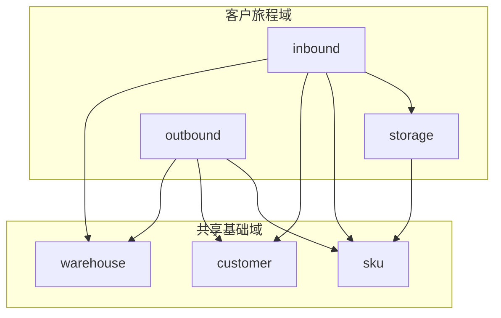

# 专家域划分与命名约定

> 避免 `in-warehouse` 等易混名；与 [project-plan.md](project-plan.md) OKR 场景对齐。

---

## 一、两类划分维度

| 维度 | 含义 | 典型域 ID |
|---|---|---|
| **客户旅程 / 业务流程域** | 按客户提问所涉业务环节拆分，一个 expert 处理一类对客闭环 | `inbound`、`storage`、`outbound`、`last-mile`、`return`、`billing` |
| **共享基础域** | 跨多个旅程复用，输出结构化事实/判断，一般不直接对客 | `warehouse`、`customer`、`sku` |

**库内作业**（收货、上架、在库、拣货、出库等 WMS 作业）贯穿 `inbound → storage → outbound`，**不是**一个 expert 域名；应拆到各旅程域 + 共享基础域。

---

## 二、易混命名说明

| 名称 | 实际含义 | 建议 |
|---|---|---|
| ~~`in-warehouse`~~（已废弃） | 曾被用作「仓级运营状态」域，与「库内全流程」混淆 | 改为 **`warehouse`** |
| `in-warehouse-data.md` | 仅为**入库**客服咨询的 LLM 下钻数据（8,989 条） | 已改为 **`inbound-data.md`** |
| `inbound/inbound-warehouse-info` | 入库场景下的**静态仓库资料** FAQ | 保留在 `inbound` 域，与 `warehouse` 域的动态运营状态区分 |

### `manifest.id` 与飞书 `expert_id` 前缀约定

飞书登记表的 **`expert_id`** 取自 `manifest.json` 的 **`id`**（不含域路径）。为避免与出库/尾程等同名概念混淆，旅程域专家在 `id` 中应带域前缀：

| 域 | 约定 | 示例 |
|---|---|---|
| `outbound` | `outbound-{能力}` | `outbound-order-status` |
| `inbound` | `inbound-{能力}` | `inbound-order-status`、`inbound-arrival-status` |
| `last-mile` | 能力名已足够区分时可不带前缀 | `tracking-inquiry`、`delivery-status` |

**入库域已全部采用 `inbound-` 前缀**（2026-06）。典型易混短名：`order-status`、`arrival-status`、`transit-tracking`、`warehouse-info`、`process-guide` 等。

**enrichedContext 域键**仍为 `` `{manifest.domain}/{manifest.id}` ``，例如 `inbound/inbound-order-status`。

跨域增值专家目录在 `value-add/` 下，`id` 保持 `value-add-` 能力前缀，例如 `value-add/value-add-exception-diagnosis`、`value-add/value-add-order-status`。

---

## 三、域一览

### 客户旅程域

| 域 ID | 中文 | 范围 | Plan 文档 |
|---|---|---|---|
| `inbound` | 入库流程 | 到仓、签收、上架、清关、入库异常、入库权限等对客场景 | [inbound-experts-plan.md](inbound-experts-plan.md) · [Inbound Playbook](../inbound/playbook.md) |
| `storage` | 在库 / 库内 | 在库库存、库内丢失、盘点等（货已在仓内） | [storage-plan.md](storage-plan.md) |
| `outbound` | 出库流程 | 出库单状态、截单、拣货发货等 | （沿用 outbound 专家目录） |
| `last-mile` | 尾程 | 轨迹、查件、索赔、POD 等 | [last-mile-plan.md](last-mile-plan.md) |
| `return` | 退货 | 退货流程 | 待建 |
| `billing` | 费用 | 费用核实、充值、价卡 | 待建 |

### 共享基础域

| 域 ID | 中文 | 范围 | Plan 文档 |
|---|---|---|---|
| `warehouse` | 仓库运营 | **仓级**动态状态：库容温度、Slots、承接能力、运营公告；被 inbound/outbound 等调用 | [warehouse-plan.md](warehouse-plan.md) |
| `customer` | 客户 | 权限、额度、群体属性 | [customer-plan.md](customer-plan.md) |
| `sku` | 商品 | 件型、特殊属性、管理模式 | [sku-plan.md](sku-plan.md) |

---

## 四、依赖关系示意

---

## 五、Plan 表格约定

各域 plan 文档中，凡列出 **Expert** 的 Markdown 表格，**最左列**使用任务清单语法：

- `[ ]`：专家未完整（缺 manifest / workflow / prompt 或未可调用）
- `[x]`：专家已完整交付

与「当前状态」列配合：状态为 `已完成` 时，应将最左列改为 `[x]`。格式与 [last-mile-plan.md](last-mile-plan.md) 一致。

专家业务参考文档目录见 [docs/experts/README.md](../experts/README.md)（按域 `{域}/{专家ID}.md` 归档，与 `experts/` 代码目录对齐）。新建专家的设计流程见 [how-to-design-expert.md](../how-to-design-expert.md)。

---

## 六、新增 expert 时的选型

1. 客户问的是**某一环节的单据/进度/异常** → 放进对应旅程域（`inbound` / `storage` / `outbound` …）。
2. 逻辑被**多个旅程**共用，且含独立判断规则 → 放进 `warehouse` / `customer` / `sku`。
3. 仅 FAQ、无 API、且只服务入库场景 → 可留在 `inbound` 基础信息层（如 `inbound-warehouse-info`）。
