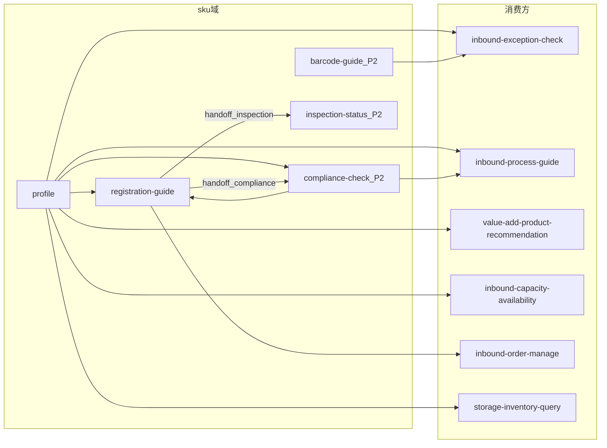

# sku 域场景与能力聚类

> 基于 `_kb` 商品主数据知识库 + **[`docs/sku`](../sku/README.md) LLM Wiki**（飞书商品咨询群 ~7,450 条归类）归纳。  
> 域划分 SSOT：[sku-plan.md](sku-plan.md) · [domain-taxonomy.md](domain-taxonomy.md)
>
> **概念参考（非已落地图谱）**：`_kb/system-team/sku/knowledge/mms/` 实体划分，以及飞书「MMS商品领域知识底座及AI客服专家能力建设」中的对象分层、禁限模型、查验/申报、置信度与升级思路，仅作**设计输入**。本仓库运行时 SSOT 仍是 `docs/sku` + OpenAPI + 本 plan，**不存在可查询的 MMS 知识图谱 / GraphRAG**。

---

## 一、SKU 域应做什么

`sku` 域负责**商品主数据全生命周期**：从注册、审核、发布，到档案属性、合规、条码绑定。输出结构化事实或对客操作引导，供入库/增值/出库等旅程域消费。

| 能力簇 | 典型客户/系统问题 | 主要来源 | 对客/共享 |
|--------|-------------------|----------|-----------|
| **商品编码 / 条码 / 管理模式** | 商品是否存在；M 码；单品化还是商品化；箱/套 | OpenAPI：`skuCode`/`productCode`/`code`/`supervisorMode`/`type` | 共享 → `profile` |
| **审核加急 / SLA** | 注册加急、审核要多久 | `docs/sku/flows/02`；MT 应维护完成时间 | 对客 → `registration-guide` |
| **注册 / 发布 / 审核** | 如何注册、批量失败、退回怎么改 | `_kb/.../如何新增商品注册.md`；`flows/03`；入参 `productCode` | 对客 → `registration-guide` |
| **新品能否承运/入库** | 只有链接/图片，问能否发/能否入 | `docs/sku/flows/01`；历史清单→禁限运→任务单 | 对客浅层 → `registration-guide`；深判 P2 `compliance-check` |
| **档案查询 / 修改 / 失效** | 商品是否存在、为何不能下入库单 | `flows/03`/`05`；`万邑联商品管理操作手册.md` | 对客 + 共享 → `registration-guide` / `profile` |
| **头程直发限制** | 为何限直发、不能下 Winit 头程单 | `docs/sku/flows/04` | 事实 → `profile`；解法 → `registration-guide` |
| **件型 / 尺重 / 特殊属性** | 大件、带电/化工/食品、尺重超限 | `海外仓特殊属性商品定义.md`；`flows/06`；OpenAPI `isBattery` 等 | 共享 → `profile`；解除勾选 → `registration-guide` |
| **管理模式 / 入库包装 / 箱套** | SI vs SKU；BOX/SUITE；`itemPackaging` | `winit.mms.item.list`；`winit.item.box.save` | 共享 → `profile` |
| **禁止入出库（含来源）** | 为何禁入/禁出；系统规则还是人工 | `flows/05`；禁限标记概念 | **事实**（标记+原因+`prohibitSource`）→ `profile`；**解禁浅层** → `registration-guide`（`guide_unban`）；深判 → P2 `compliance-check` |
| **禁限运 / 申报 / 品类 / WEEE** | 某品类某国能否入；申报要素；WEEE 类别 | 禁限运清单；`flows/01`/`07`；`customsDeclarationList` | 浅层 → `registration-guide`；深判 P2 `compliance-check` |
| **证书 / GPSR** | 缺证、禁售、电清关链接 | `flows/07`；证书 KB | 操作引导 P1 `registration-guide`；深判 P2 `compliance-check` |
| **禁售（库存侧）** | 为何不合规禁售、缺 GPSR | `flows/05`；TOM 库存查询 | **原因解释** sku 域；**数量/库位** → `storage` |
| **查验单** | 验货进度、结论、补资料 | MMS 查验单概念（无图谱 API） | P2 → `inspection-status` |
| **条码 / 打标 / 三方编码** | 打印标签、FNSKU；增删查 `skuCodeThird` | 打标 API（`productCode`）；OSWH `08`–`11` | 对客 → P2 `barcode-guide` |
| **箱套 / 投保 / 包材** | 箱产品、套装、投保 | `winit.item.box.save`；多库存单元手册 | P1 作为 `profile.type` 等字段或 `registration-guide` KB |

---

## 二、场景 → 专家映射（商品咨询群主表）

> 来源：[consultation-taxonomy.md](../sku/scenes/consultation-taxonomy.md) · 样本 ~7,450 条

| 原因类型 | 个数 | 占比 | Flow | Expert |
|----------|-----:|-----:|------|--------|
| SKU 注册加急 | 4570 | 61.4% | [02](../sku/flows/02-registration-audit-expedite.md) | `registration-guide` |
| 商品是否可以承运或入库 | 1828 | 24.5% | [01](../sku/flows/01-new-product-carriability.md) | `registration-guide` / P2 `compliance-check` |
| 直发原因咨询 | 247 | 3.3% | [04](../sku/flows/04-direct-shipment-restriction.md) | `profile` + `registration-guide` |
| 注册 SKU 退回原因 | 122 | 1.6% | [03](../sku/flows/03-return-resubmit.md) | `registration-guide` |
| 修改 WEEE 类别 | 113 | 1.5% | [07](../sku/flows/07-compliance-certificates.md) | P2 `compliance-check` |
| 解除带电池 / 液体 / 磁 / 粉末 / 刀片 / DG | 59+ | <2% 各 | [06](../sku/flows/06-special-attribute-removal.md) | `registration-guide` |
| 禁售 / 禁止入库原因 | 52+40 | <1% 各 | [05](../sku/flows/05-prohibit-inbound-sale.md) | `profile`（标记+原因+来源）+ `registration-guide`（`guide_unban` / 补资料） |
| 品牌备案 / 电清关链接 / MSDS | 39+37+24 | <1% 各 | [07](../sku/flows/07-compliance-certificates.md) | P2 `compliance-check` + `registration-guide` |
| 添加 / 删除 / 查看三方编码 | 34+（删除为主） | <0.5% | — | P2 `barcode-guide` |
| 税率咨询 | 9 | <0.1% | — | 暂转人工（非 sku） |
| 修改包装信息（入/出库**打包方式**） | 3 | <0.1% | — | **空缺**：未来 `inbound` / `outbound`（`outPackaging*`）；主数据 `itemPackaging` / 箱套 `type` 仍归 `profile` |

### 其他旅程场景（非咨询群主表）

| 客户场景 | Expert | 优先级 | 备注 |
|----------|--------|--------|------|
| 「怎么注册海外仓商品」「批量注册失败」 | `registration-guide` | P1 | 承接 `inbound-permission-apply` 的 `sku_registration` |
| 「这个商品带电吗」「件型是什么」「是 SI 还是商品化」 | `profile` | P1 | 按 `skuCode` 查询 |
| 「怎么解禁 / 禁止入库怎么取消」 | `registration-guide`（浅）/ P2 `compliance-check` | P1/P2 | 人工来源优先 `need_human` |
| 「验货单什么进度 / 结论是什么」 | `inspection-status` | P2 | 查验单能力簇 |
| 「怎么打印条码」「FNSKU 怎么绑」「怎么删/加三方编码」 | `barcode-guide` | P2 | 包裹条码异常作业 → `value-add` |
| 「某 SKU 在库多少」 | `storage/inventory-query` | — | **非 sku** |
| 「有库存但不能出」 | `storage`（数量）+ `profile`（禁出事实） | — | 跨域组合，不单建专家 |
| 「还剩多少 SKU 额度」 | `inbound/inbound-capacity-availability` | — | MKS 配额 |

### 与入库咨询数据交叉（[inbound-data.md](inbound-data.md)）

| 细分场景 | 量级 | 映射 Expert |
|----------|------|-------------|
| SKU 注册权限 | 19（2.8% 权限类） | `registration-guide`；账户权限 → `inbound-permission-apply` / `customer` |
| 入库规则/条件（含禁限运） | 28+ | `inbound-process-guide` + P2 `compliance-check` |
| 商品不存在（入库 FAQ） | 高频 | `registration-guide` + `profile` |

---

## 三、明确不归 `sku` 域

| 能力 | 归属 | 理由 |
|------|------|------|
| 在库数量 / 流水 / 库龄 / 不合规禁售**数量** | `storage` | 数量与货权；sku 只解释禁售**原因**与补 GPSR 路径 |
| 「有库存但不能出」的**数量侧** | `storage` + `profile` 禁出事实 | 跨域组合；不单建 sku 专家 |
| CBM / SKU **额度**（账户槽位数） | `inbound/inbound-capacity-availability` | MKS 营销配额 |
| 入库单状态、上架催促、到仓时间 | `inbound/*` | 单据旅程 |
| 包裹条码异常、补贴条码上架 | `value-add` | 仓内作业异常 |
| 税率咨询 | 暂转人工 / 待规划 | 非 sku 主数据；咨询群暂无标准话术 |
| 修改包装信息（入/出库**打包方式** / `outPackaging*`） | `inbound` / `outbound`（**待建专家，当前空缺**） | 咨询群记为「修改包装信息」。**主数据**侧 `itemPackaging`、箱套 `type`（BOX/SUITE）、`supervisorMode` 仍归 sku/`profile` |
| 平台 listing 同步 | 平台同步 | 非 MMS 主数据 |
| 尾程 PSC 推荐 | `last-mile/product-*` | 物流产品 |
| MMS 知识图谱检索 / GraphRAG | — | **未落地**；不以图谱为运行时依赖 |
| 虚构字段名 `itemCode` | — | OpenAPI 无此字段；商品编码统一 `skuCode`（查询）/`productCode`（注册打标） |

---

## 四、跨域消费关系

---

## 五、知识库索引（设计期引用）

| 主题 | 路径 | 用途 |
|------|------|------|
| **LLM Wiki 枢纽** | [docs/sku/playbook.md](../sku/playbook.md) | 术语、决策树、专家路由 |
| **场景占比** | [docs/sku/scenes/consultation-taxonomy.md](../sku/scenes/consultation-taxonomy.md) | 咨询量驱动优先级 |
| **流程分册** | [docs/sku/flows/01–07](../sku/flows/) | P1 Prompt 主切片源 |
| **附录** | [docs/sku/appendix/](../sku/appendix/) | 系统路径、WEEE、电清关链接 |
| **原始导出** | [docs/sku/raw/](../sku/raw/README.md) | feishu-docx 归档（勿直喂 LLM） |
| **MMS 实体概念（非图谱）** | `_kb/system-team/sku/knowledge/mms/` | Item/SKU/禁限/查验/申报等设计参考 |
| 商品操作手册 | `_kb/system-guide/data/商品/海外仓商品/万邑联商品管理操作手册.md` | 操作 SSOT 补充 |
| 注册 / 审核 FAQ | `_kb/system-guide/.../如何新增商品注册.md` 等 | 与 flows 交叉验证 |
| 特殊属性 / 禁限运 | `_kb/.../海外仓特殊属性商品定义.md`、`2026...禁限运清单.md` | compliance P2 |
| 货型 / 条码 | `_kb/product-team/winit/common/products/` | profile / barcode P2 |
| OpenAPI 商品 | `_kb/system-team/public-api/OSWH/商品/` | API 矩阵 |
| 入库侧 FAQ | `_kb/service-team/.../新增海外仓入库单的常见问题.md` | 与 inbound 交叉 |

---

## 六、API 就绪度摘要

| 场景 | Action | 状态 |
|------|--------|------|
| 档案查询 | `winit.mms.item.list` | KB 已文档化；主键 `skuCode`，条码 `code`，`supervisorMode`；禁限来源等 `[待确认]` |
| 审核状态 / SLA | `mms.itemmttask.queryItemMtEntitys` | KB 已文档化；入参 `skuCode`；应维护完成时间 `[待确认]` |
| 注册/编辑 | `registerProduct` | KB 已文档化；商品编码入参名 **`productCode`**（与查询 `skuCode` 同义）；专家不代写 |
| 箱套 | `winit.item.box.save` | KB 已文档化；`type`=`BOX`/`SUITE`；`supervisorMode` |
| 历史咨询清单 / 任务单 / 禁限运 API | — | **Gap**；首期 KB+人工 |
| 直发限制原因 / 退回原因 / 禁止入出库原因与来源 | MMS 字段 | **Gap** `[待确认]` |
| 查验单进度 / 结论 | — | **Gap**；P2 `inspection-status`；首期 KB+人工 |
| 申报要素 / 品类结构化查询 | — | **Gap**；深判走 KB |
| 打标 / 第三方条码 | OSWH `05`–`09` 系列 | KB 已文档化 |

详见 [sku-api-matrix.md](sku-api-matrix.md)。
