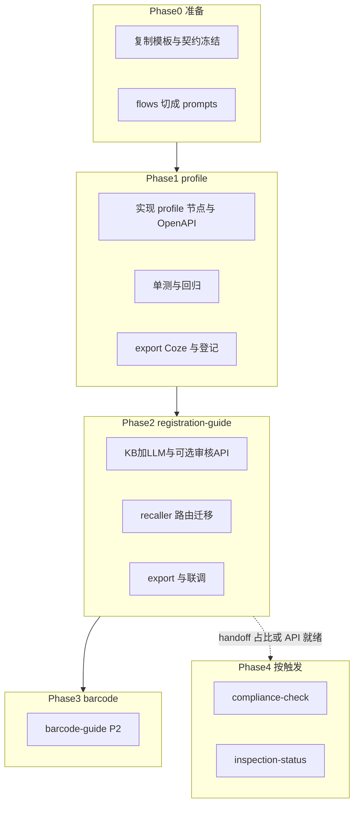

# SKU 域 Experts 实现计划

> 域设计 SSOT：[sku-plan.md](sku-plan.md) · 能力地图：[sku-data.md](sku-data.md) · API：[sku-api-matrix.md](sku-api-matrix.md) · **数据拉取**：[sku-data-fetch-strategy.md](sku-data-fetch-strategy.md)  
> **业务说明（产品/客服向）**：[docs/experts/sku/expert-manual.md](../experts/sku/expert-manual.md)  
> 创建手册：[how-to-create-expert.md](../how-to-create-expert.md) · OpenAPI：[winit-openapi-integration.md](../winit-openapi-integration.md)  
> 版本：2026-07-14

---

## 一、范围与默认决策

| 项 | 决策 |
|----|------|
| **首期交付** | P1：`sku/profile` → `sku/registration-guide`（含 Coze 导出、专家登记表、recaller 路由） |
| **紧随 P2** | `sku/barcode-guide`（OSWH 文档较齐、咨询有量） |
| **按触发立项** | `sku/compliance-check`、`sku/inspection-status`（条件见 [sku-plan.md](sku-plan.md)） |
| **Gap 字段** | 不阻塞上线：缺则 `null` + `missingFacts`，或 `prohibitSource: "unknown"` |
| **写操作** | 首期不代客：`registerProduct`、加急点击、解禁写入、绑/删三方码 |

设计文档已齐；**`sku/profile`、`sku/registration-guide`、`sku/barcode-guide` 均为「待配置」**（manifest / nodes / workflow / 单测 / export 已通；待 Coze 导入、登记表、online 冒烟）。

---

## 进度快照（2026-07-14）

| 阶段 | 状态 |
|------|------|
| Phase 0 | **完成** |
| Phase 1 profile | **待配置**（已落地 page.list + 剪枝）：`scripts/test-sku-profile.ts`；export 已通 |
| Phase 2 registration-guide | **待配置**（已落地 audit_status 切片）：`scripts/test-sku-registration-guide.ts` |
| Phase 3 barcode-guide | **待配置**（已落地 barcode_third / supplement 只读）：`scripts/test-sku-barcode-guide.ts` |
| Phase 4 compliance-check | **待配置**（已落地）：`scripts/test-sku-compliance-check.ts` |
| Phase 4 inspection | 按触发立项 |

## 二、现状与目标

| Expert | 现状 | 目标形态 |
|--------|------|----------|
| `sku/profile` | **待配置**：manifest/nodes/workflow/export/单测已通 | API 事实专家（无/轻 LLM）+ `enrichedContext.sku/profile` |
| `sku/registration-guide` | **待配置**：manifest/nodes/prompts/export/单测已通 | KB+LLM 对客引导；审核 API 首期可跳过 |
| `sku/barcode-guide` | **待配置**：manifest/nodes/prompts/export/单测已通 | KB 指引为主；打标/三方码只读增强可选 |
| `sku/compliance-check` | **待配置**：manifest/nodes/prompts/export/单测已通 | KB+LLM 深判；可选 `facts_compliance` |
| `sku/inspection-status` | 待规划 | 触发后再建；handoff → 人工 |

---

## 三、总览节奏

---

## 四、Phase 0 — 准备（0.5～1 天）

1. 从 [`experts/_template/arithmetic-formula`](../../experts/_template/arithmetic-formula) 复制出：
   - `experts/sku/profile/`
   - `experts/sku/registration-guide/`
2. 冻结契约（以现有 design / plan 为准）：
   - 商品编码：`skuCode` canonical；入参遇 `productCode` 归一为 `skuCode`
   - Gap：`missingFacts` / `prohibitSource: "unknown"`；不编造发布态或禁限原因
3. 将 [`docs/sku/flows/01–07`](../sku/) 与 [`appendix/system-paths.md`](../sku/appendix/system-paths.md) 整理为 registration-guide 的 `prompts/kb-*.md` 切片清单（可先列目录，Phase 2 写正文）
4. 阅读：[how-to-create-expert.md](../how-to-create-expert.md)、[winit-openapi-integration.md](../winit-openapi-integration.md)

---

## 五、Phase 1 — `sku/profile`（约 3～5 天）

**参考实现**：

- OpenAPI 编排：[`inbound-order-status`](../../experts/inbound/inbound-order-status)
- `enrichedContext`：[`value-add-product-recommendation`](../../experts/value-add/value-add-product-recommendation)

### 5.1 产物

| 文件 | 要点 |
|------|------|
| `manifest.json` | `domain: sku`，`id: profile`；`x_recaller_propagate_previous_enriched_context: true` |
| `workflow.json` + `nodes/` | 见下表 |
| `coze.config.yml` | `winitOpenapiPlugins` 接 **`winit.item.page.list`**（遗留 `winit.mms.item.list`）；`packageMainName: sku_profile` |
| `scripts/test-sku-profile.ts` | 节点级 + 映射/降级/剪枝用例 |

**节点顺序**（与 design + [sku-data-fetch-strategy.md](sku-data-fetch-strategy.md) 一致）：

1. `validate-sku-codes` — 非空、去重、上限；`productCode` → `skuCode`
2. `resolve-fetch-plan` — 按 `fetchProfile` 构建 page.list 请求（**批量** `skuCodes`）
3. `fetch-sku-profile` — **`winit.item.page.list`**
4. `prune-and-map-item` — 剪枝 + 嵌套映射（`attributes`/`declarations`/`sizeWeight`）
5. `derive-from-context` — 订单 merchandise 降级
6. `calc-item-type-from-kb` — 尺重 → `itemType`
7. `format-output` — `structured.skus[]` + `enrichedContext["sku/profile"]` + `confidence`

### 5.2 映射优先级（第一版）

| 必通 | 可后补 Gap |
|------|------------|
| `skuCode`, `code`, `supervisorMode`, `itemPackaging`, 注册尺重 | `prohibitOutbound`, `prohibitSource` |
| `attributes` 扁平化特殊属性 | 箱套 `type`（list 无则 `null`） |
| `status` → `publishStatus` | — |
| `declarations` 禁入 + 限直发 `firstLegType` | 限直发原因全文 |
| 剪枝：丢弃 `outPackaging`、原始 `attributes[]` | `estimateAuditDate`（audit 切片） |

### 5.3 验收

- `npm run dev:expert` 按 manifest id 跑通
- `npm run export:coze -- experts/sku/profile --validate`
- `check:coze-node-code`、`check:format-output-contract` 通过
- `sync:expert-register`；下游可引用 `sku/profile` 事实

---

## 六、Phase 2 — `sku/registration-guide`（约 5～7 天）

**参考实现**：

- KB+LLM：[`inbound-process-guide`](../../experts/inbound/inbound-process-guide)
- 可选 API 分支：[`inbound-customs-doc-manage`](../../experts/inbound/inbound-customs-doc-manage)

### 6.1 产物

| 文件 | 要点 |
|------|------|
| `manifest.json` | `id: registration-guide`；description 含 Use when |
| `nodes/` | validate → resolve-audit-fetch → build-audit-page-list → page.list → fetch-audit-status → load-sku-kb → llm → format |
| `prompts/` | `main.md` + `kb-expedite` / `kb-carriability` / `kb-register` / `kb-audit-resubmit` / `kb-direct-shipment` / `kb-attribute-change` / `kb-inbound-blocked` / `kb-unban` |
| `coze.config.yml` | `textNodes` 注入 KB；`winit.item.page.list` audit 切片；`packageMainName: sku_registration_guide` |

**首期不做写**：不加急代点、不代 `registerProduct`、不解禁写。

### 6.2 Branch 上线切分

| 批次 | branch | 说明 |
|------|--------|------|
| M2.1 必上 | `guide_expedite`, `guide_carriability`, `guide_register`, `guide_resubmit`, `need_info`, `need_human` | 覆盖咨询群主流量 |
| M2.2 | `guide_direct_shipment`, `guide_attribute_change`, `blocked_unpublished`, `guide_unban` | 有 profile 快照时更稳 |
| M2.3 | `handoff_compliance`, `handoff_inspection` | P2 未上线时对客落「转人工/专席」 |

### 6.3 Recaller / 路由（与专家同里程碑）

- Planner：`sku_registration` 从 `inbound-permission-apply` **迁出** → `sku/registration-guide`
- Use when / 关键词：加急、承运、注册、退回、限直发、解禁、商品不存在
- 有 `skuCode` 且问事实/限直发/禁入：可先调 `sku/profile` 再 guide
- 更新 inbound 相关说明：不再承接 `sku_registration`

### 6.4 验收

- 加急 / 承运 / 注册 / 退回 四条黄金路径 fixture 通过
- `prohibitSource=manual` → `need_human`；深判 → handoff 话术
- export + 登记 + online smoke
- 更新 [sku-plan.md](sku-plan.md) 状态列：`开发中` → `待配置` → `已完成`

---

## 七、Phase 3 — `sku/barcode-guide`（P2，约 3～4 天）

**为何先于 compliance**：OSWH `05`–`11` 文档较齐；咨询有「删三方码」；不依赖禁限图谱。

- 形态：同 process-guide（KB+LLM）+ **只读** `winit.item.page.list`
- intent：`print` / `third_party_add` / `third_party_delete` / `third_party_query` / `scan_fail`
- 入参商品编码：`skuCode`（打标侧同义 `productCode`）；三方码：`skuCodeThird`
- **已落地**：`barcode_third` / `supplement_third_sku` 切片 → `barcodeSnapshot`；不代客写绑码/删码
- 与 `inbound-exception-check` / value-add 条码异常的 handoff 说明补齐

亦可按 [sku-plan.md](sku-plan.md) P2 触发条件立项后启动（可与 Phase 2 结束后排期）。

---

## 八、Phase 4 — compliance / inspection

| Expert | 状态 | 实现要点 |
|--------|------|----------|
| `compliance-check` | **待配置**（已实现） | KB 深判 + `complianceVerdict`；可选 `facts_compliance`；见 `experts/sku/compliance-check/` |
| `inspection-status` | 待规划 | 查验查询 Gap 未解前仅 KB+人工路径；触发条件见 sku-plan |

---

## 九、工程与质量门禁（贯穿）

每个专家发布前：

1. `npm run check:coze-node-code`
2. `npm run check:format-output-contract`（有 LLM 时另跑 `check:llm-envelope`）
3. `npm run export:coze -- experts/sku/<id> --validate`
4. `npm run sync:expert-register`
5. 节点单测 + 至少 1 条 online fixture（`scripts/expert-online-test`）
6. 回归约束：禁止编造发布态/禁限原因；Gap 必须显式 `missingFacts` / `unknown`

---

## 十、风险与对策

| 风险 | 对策 |
|------|------|
| 直发/退回/禁限原因字段未齐 | profile 先出可映射字段；registration-guide 文案走 flows KB |
| 承运无历史清单/任务单 API | flows/01 浅层 + 人工登记话术；不阻塞 P1 |
| Planner 仍路由到 inbound | Phase 2 改关键词与权限专家边界，联调 checklist |
| 货型 KB 依赖本地 `_kb` | calc 节点内嵌最小规则表，或 export 时 textNode 注入公开切片 |

---

## 十一、建议排期（一人全职约估）

| 阶段 | 工期 | 交付物 |
|------|------|--------|
| Phase 0 | 0.5～1d | 目录脚手架、契约冻结、prompts 清单 |
| Phase 1 profile | 3～5d | 可调用事实专家 + Coze 包 |
| Phase 2 registration-guide | 5～7d | 对客主路径 + recaller 路由 |
| Phase 3 barcode | 3～4d | P2 条码指引 |
| Phase 4 | 触发后 | compliance / inspection |

**P1 合计约 2～3 周**（含联调与登记），可覆盖咨询群主流量（加急+承运+注册引导）并打通跨域事实层。

---

## 十二、变更记录

| 日期 | 变更 |
|------|------|
| 2026-07-13 | 初版：P1 → barcode → 按触发 compliance/inspection |
| 2026-07-13 | Phase 0+1：落地 `sku/profile` 实现与导出；registration-guide 仍待 Phase 2 |
| 2026-07-13 | Phase 2：落地 `sku/registration-guide`（KB+LLM、全 branch prompts、export） |
| 2026-07-13 | Phase 3：落地 `sku/barcode-guide`（KB+LLM、五意图、无写 API、export） |
| 2026-07-14 | 进度口径：三专家代码/导出/单测已通 → 状态改为 **待配置**（对齐 sku-plan） |
| 2026-07-15 | P0–P2：`winit.item.page.list` + `shared/sku-item-page-list` 剪枝；registration audit 切片；barcode 只读摘要 |
| 2026-07-17 | Phase 4：落地 `sku/compliance-check`（KB+LLM、facts_compliance 可选、export） |
