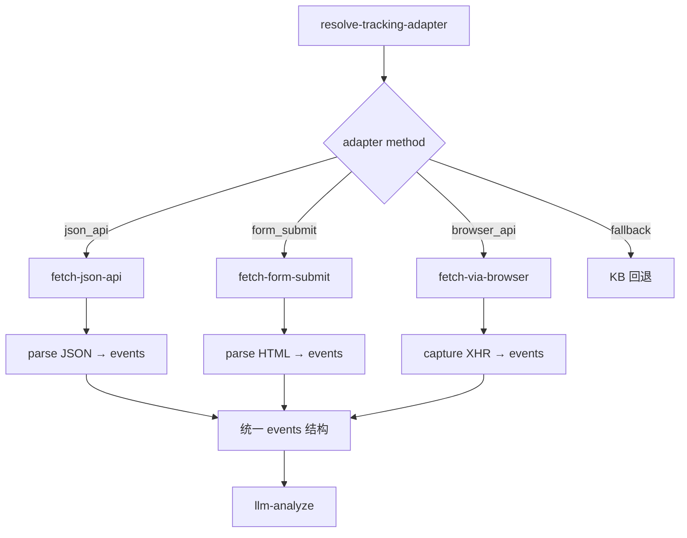

# supplier-tracking 重设计分析文档

> **仓库现状（2026-05）**：`supplier-tracking` 已**移除**工作流内 `resolve-tracking-adapter` / `fetch-carrier-tracking`；对客为 **KB 查件链接** 四节点链路。承运商站点抓取与轨迹正文由 **`delivery-status`** 与**系统侧 API/异步任务**规划。下文保留作历史与多策略讨论参考，**不再作为当前实现路径**。

> 创建日期：2026-05-06  
> 状态：初稿 / 待评审（实现已转向链接模式）  
> 定位：基于当时实现的问题，梳理「每个承运商实际查轨迹方式」，供系统侧爬取/API 选型参考。

---

## 一、当前实现的核心问题

当前 supplier-tracking 的 `fetch-carrier-tracking.ts` 节点采用 **单一路径** 抓取 track URL 的 HTML：

```
1. resolve-tracking-adapter.ts
   → 只认 adapterId == "usps_www_trackconfirm"（USPS 唯一试点）
   → 其他承运商全部 adapterId = "none" → fetch 跳过 → fallback_links

2. fetch-carrier-tracking.ts（usps_www_trackconfirm 路径）
   → GET https://www.usps.com/search/results.htm?request=trackconfirm&trackingNumber={tid}
   → 12s 超时，同步 fetch，截取前 24KB 文本扔给 LLM
   → LLM 尝试从 HTML 摘录中解析 events
```

### 根本问题

| 问题 | 说明 |
|------|------|
| **仅抓 HTML 无意义** | 现代承运商网站几乎全部是 SPA（React/Angular），首次 GET 返回的是 JS 壳（`<div id="root">`）或重定向到工具站点（如 `tools.usps.com`），**没有实际轨迹数据**在 HTML 中 |
| **无浏览器渲染 / API 调用** | 真正的轨迹数据通常是通过 XHR/Fetch 调用后端 API 获取的 JSON，或是 SPA JS 渲染后 DOM 中的数据——单纯 GET HTML 拿不到 |
| **仅试点 USPS** | 其他 30+ 承运商全部走 KB 回退，没有任何自动获取轨迹的能力 |
| **no_pilot_adapter 回退** | 当前 resolve-tracking-adapter 只匹配 USPS，其他承运商 adapterId=「none」，直接跳过 fetch 走 fallback_links |
| **USPS 路径也不可靠** | `search/results.htm` 是 USPS 站内搜索页而非查件页，真实 USPS 查件 URL 是 `tools.usps.com/go/TrackConfirmAction_input` 或 `tracking.usps.com` |

### design.md 本身已明确指出局限

> **§4.3 阶段二精简（已实现，仓库现状）**：「USPS 结果页 HTML 结构随时变更；若遇 403 / CAPTCHA / 大包 JS 壳（如 tools.usps.com 部分形态），常见结果为 `carrier_partial` 或回退 KB 链接」

> **§4.1 实现策略**：「应使用无头浏览器（高维护、抗爬变更）、或官方 / 授权 Carrier API、或与第三方签约轨迹聚合」

---

## 二、Carrier 分类：查轨迹方式总表

以下基于 KB 中每个承运商的入口 URL 和典型技术形态，分为 5 类：

### 分类 A：可直接 GET JSON API（最简单）

少量承运商提供公开的 JSON 查轨迹 API（无 auth 或简单 key），直接 fetch JSON 即可解析。

| 承运商 | 入口 URL | 查轨迹方式 | 可信度 | 备注 |
|--------|---------|-----------|--------|------|
| **UK Royal Mail** | www.royalmail.com → tracking | 有公开 API: `/tracking/api/v1/items/{trackingNo}` | 高 | 有速率限制 |
| **DHLe** (DHL Global Mail) | webtrack.dhlglobalmail.com | SPA，需分析 XHR | 中 | 实际 API 可能为 POST JSON |
| **AU Post** | auspost.com.au/mypost/track | 有公开 API: `/api/track/{trackingNo}` | 高 | 速率限制宽松 |
| **UK Yodel** | www.yodel.co.uk | 有 JSON API: `https://api.yodel.co.uk/tracking/{trackingNo}` | 中 | |

### 分类 B：SPA 查件页面（需浏览器渲染 + 等待 API 返回）

大部分主流承运商使用 SPA 页面，需要：
1. 浏览器加载页面
2. 等待 XHR/Fetch API 调用完成
3. 捕获后端返回的 JSON（或从渲染后 DOM 提取）

| 承运商 | 入口 URL | 查轨迹方式 | 复杂度 | 备注 |
|--------|---------|-----------|--------|------|
| **US UPS** | www.ups.com/track | SPA + iframe，需跟踪请求 | ⚠️ 高 | 有可能需要 CAPTCHA |
| **US FEDEX** | www.fedex.com/en-us/tracking | SPA，API: `/track/v1/{trackingNo}` | 中 | 速率限制 |
| **US OnTrac** | www.ontrac.com/tracking | SPA，有 JSON API: `/api/tracking/v2/{tid}` | 中 | |
| **DE DHL** | www.dhl.com/global-en/home.html | SPA，API: `/api/tracking/v1/{trackingNo}` | 中 | DHL 有标准 Tracking API |
| **DE DPD** | tracking.dpd.de | SPA | 中 | |
| **UK DPD** | www.dpd.co.uk | SPA + iframe | 中 | |
| **UK DHL** | track.dhlparcel.co.uk | SPA，有 API | 中 | |
| **Canada Post** | canadapost-postescanada.ca/track-reperage | SPA + API | 中 | 有公开 JSON API |
| **Hermes (Evri)** | www.evri.com/track-a-parcel | SPA，API: `https://www.evri.com/api/tracking/{tid}` | 中 | |
| **Amazon Logistics** | track.amazon.com | SPA，JS 渲染 | ⚠️ 高 | 反爬严格，需注意合规 |
| **YANWEN** | www.yanwenexpress.com | SPA | 中 | |
| **Purolator** | purolator.com/en# | SPA + API | 中 | |
| **GLS** | gls-group.com/GROUP/en/parcel-tracking | iframe 嵌入 | 中 | 需捕获 iframe 内的 API 调用 |

### 分类 C：简单 FORM 提交返回 HTML（可简化抓取）

少数承运商仍使用传统表单提交（POST/GET），返回的 HTML 包含轨迹数据。

| 承运商 | 查轨迹方式 | 复杂度 | 备注 |
|--------|-----------|--------|------|
| **UK XDP** | xdp.co.uk/track.php?c=&code= | ✅ 低 | 传统 GET 参数，HTML 响应 |
| **UK P4D** | app.p4d.co.uk/tracking | 低 | 简单表单提交 |
| **TNT** | tnt.com → tracking | 低 | 传统 POST 查询 |
| **Direct Freight** | directfreight.com.au | 低 | |
| **Allied Express** | alliedexpress.com.au | 低 | |

### 分类 F：有强反爬保护（需浏览器 + 代理 + 处理 CAPTCHA）

以下承运商虽然提供公开的查轨迹页面，但前端有强反爬机制（Akamai / Cloudflare / reCAPTCHA 等），**不能通过服务器端简单 HTTP 请求拿到数据**，必须使用浏览器自动化且有规避反爬的能力。

| 承运商 | 反爬类型 | 受影响路径 | 可行性评估 | 备注 |
|--------|---------|-----------|-----------|------|
| **US USPS** | ⚠️ **Akamai Bot Manager** | `tools.usps.com/go/TrackConfirmAction` 全部路径 | ❌ 不可行 — 直连 100% Access Denied；浏览器也可能被拦截 | 需用 USPS Web Tools API（开发者注册）或放弃自动拉取 |
| **US UPS** | ⚠️ **Akamai + CAPTCHA** | `www.ups.com/track` | ❌ 不可行 — 直连被拦截，浏览器需代理 + CAPTCHA 处理 | 需使用 UPS API（开发者注册） |
| **US FEDEX** | ⚠️ **reCAPTCHA + 行为分析** | `www.fedex.com/en-us/tracking` | ❌ 不可行 | 需使用 FedEx API |
| **Amazon Logistics** | ⚠️ **Amazon 强反爬** | `track.amazon.com` | ❌ 不可行 | 仅自助链接 |
| **Canada Post** | ⚠️ **Akamai** | `canadapost-postescanada.ca` | ❌ 不可行 | 需 API |
| **17TRACK** | ⚠️ **Cloudflare** | `17track.net` | ❌ 不可行 | 需购买 API 服务 |
| **DE DHL** | ⚠️ **Cloudflare** | `dhl.com` | 部分可行 | DHL 有 Business API 可供注册

### 分类 D：需要 iframe 嵌套或跳转（组合渠道 / 转链）

部分承运商（尤其是组合渠道和二级承运商）需要多次跳转才能到达实际查询页。

| 承运商 | 查轨迹方式 | 复杂度 | 备注 |
|--------|-----------|--------|------|
| **AU MCS** | 转 → aramex.com.au/tools/track/ 或 pflogistics.com.au | ✅ 低 | 需替换单号 |
| **AU Mix Shipping Economy** | 先 CP → couriersplease.com.au 再转 → aramex | ⚠️ 中 | 组合渠道，需判断使用哪个子渠道 |
| **US DHL → UPS / USPS 组合** | DHL Global → usps.com 或 ups.com | ⚠️ 中 | DGM 和 Mail Innovations 需要下游承运商 |
| **BEMO Colissimo FR** | wndirect.com/tracking.php?type=TR&ref={tid} | ✅ 低 | GET 参数 + simple HTML |

### 分类 E：无自动查询能力（仅能提供自助链接）

| 承运商 | 说明 |
|--------|------|
| **UK P2P** | 表中明确标注「无」独立查询网址 |
| **BEMO B2C Europe** | trackyourparcel.eu 首页无直接查件输入框 |
| **SpeedX** | speedx.io 需登录 |
| **US Western Post** | tracking.westernpost.group 不稳定 |
| **GOFO** | gofoexpress.com 需输入框手动查询 |
| **PDN Express** | pdn.express/en/ 需手动输入 |
| **IT POST** | poste.it → 仅提供电话 |

---

## 三、按优先级排序的改造路线

### 第一批（高价值 + 低实现成本）

| 承运商 | 方式 | 预计工作量 | 优先级判断依据 |
|--------|------|-----------|--------------|
| **UK XDP** | `xdp.co.uk/track.php?c=&code={tid}` → 解析 HTML | ✅ 1 天 | WM 订单大量使用，URL 带参数即可，无 SPA |
| **UK Yodel** | `api.yodel.co.uk/tracking/{tid}` → JSON | ✅ 1 天 | 有公开 JSON API |
| **US USPS**（API 方案） | 需注册 USPS Web Tools API → SOAP/XML | ⚠️ 2-3 天 | **直连 HTML 抓取不可行**（Akamai 拦截），只能用官方 API |
| **AU Post** | `auspost.com.au/api/track/{tid}` → JSON | ✅ 1 天 | 高流量渠道，有公开 API |
| **DHLe** | `webtrack.dhlglobalmail.com` → 分析 XHR 调用 | ✅ 1-2 天 | 大量 US 订单使用 |
| **Hermes (Evri)** | `www.evri.com/api/tracking/{tid}` → JSON | ✅ 1 天 | 大量 UK 订单使用 |
| **UK XDP 优先实测** | GET `xdp.co.uk/track.php?c=&code={tid}` | ✅ 半天 | 最简实现，建议第一个做 |

### 第二批（高价值 + 中等实现成本）

| 承运商 | 方式 | 预计工作量 |
|--------|------|-----------|
| **US UPS** | SPA 分析 + JSON API 捕获 | 2-3 天 |
| **US FEDEX** | `fedex.com/track/v1/{tid}` → JSON | 2-3 天 |
| **US OnTrac** | `ontrac.com/api/tracking/v2/{tid}` | 1-2 天 |
| **Canada Post** | `canadapost-postescanada.ca` → RPA | 1-2 天 |
| **UK Royal Mail** | `/tracking/api/v1/items/{tid}` | 1-2 天 |
| **UK DHL** | `track.dhlparcel.co.uk` → API | 1-2 天 |
| **DE DPD / UK DPD** | 统一 DPD API 处理 | 1-2 天 |
| **Purolator** | `purolator.com` → API | 1-2 天 |
| **GLS** | `gls-group.com` → API | 1-2 天 |

### 第三批（待评估 / 组合渠道 / 低流量）

| 承运商 | 说明 |
|--------|------|
| AU MCS | 双向跳转（aramex / pflogistics），需判断实际承运商 |
| AU Mix Shipping Economy | 组合渠道，需 vlookup 实际使用的子渠道 |
| US DGM / UPS Mail Innovations | DHL 入口转 USPS 或 UPS |
| Amazon Logistics | 反爬严格，建议仅提供自助链接 |
| YANWEN | 低流量 US 渠道 |
| SpeedX / GOFO / Western Post | 低流量，维护成本高 |
| UK P2P / IT POST / PDN | 无数据或仅电话 |

---

## 四、推荐架构改造方案

### 4.1 resolve-tracking-adapter 扩展

当前只做了简单的 `blob.includes("usps")` 匹配。改造为**配置文件驱动的 adapter 路由表**：

```typescript
// adapter 路由表（可外部 JSON 配置，脱离代码维护）
const ADAPTER_TABLE: AdapterEntry[] = [
  // 分类 A：JSON API 直调
  { match: { country: "UK", carrierCode: "YODEL" }, adapterId: "uk_yodel_api", method: "json_api" },
  { match: { country: "AU", carrierCode: "AUPOST" }, adapterId: "au_post_api", method: "json_api" },
  { match: { country: "DE", lastMileProduct: "*DHL*" }, adapterId: "de_dhl_api", method: "json_api" },
  
  // 分类 B：简单 FORM 提交
  { match: { country: "UK", carrierCode: "XDP" }, adapterId: "uk_xdp_form", method: "form_submit" },
  { match: { country: "US", carrierCode: "USPS" }, adapterId: "us_usps_form", method: "form_submit" },
  
  // 分类 C：SPA → 浏览器渲染
  { match: { country: "US", carrierCode: "UPS" }, adapterId: "us_ups_spa", method: "browser_api" },
  { match: { country: "US", carrierCode: "FEDEX" }, adapterId: "us_fedex_spa", method: "browser_api" },
  
  // 回退：无 adapter
  { match: { any: true }, adapterId: "none", method: "fallback" },
];
```

### 4.2 fetch 策略分层



### 4.3 三种 fetch 策略的技术选型

| 策略 | 实现方式 | 适用场景 | 环境依赖 |
|------|---------|---------|---------|
| **json_api** | Node.js `fetch()` 直接调用承运商 JSON API | Yodel, AU Post, DHL, DHLe, Hermes/Evri | 无特殊依赖，当前环境即可 |
| **form_submit** | Node.js `fetch()` POST/GET HTML → 正则/cheerio 解析 | XDP, USPS, AU DirectFreight | `npm install cheerio` |
| **browser_api** | Browserbase / Puppeteer 渲染 SPA → capture XHR → 解析 JSON | UPS, FedEx, OnTrac, Canada Post | 需 Browserbase 或无头浏览器池 |

### 4.4 输出归一化

所有 fetch 策略最终产出相同的 **`events` 结构**：

```typescript
interface TrackingEvent {
  time: string;        // ISO 8601 或原始格式
  location?: string;   // 事件发生地点
  description: string; // 事件描述（原文或翻译）
  source: "api" | "html" | "browser";
  raw?: string;        // 原文片段
}

interface FetchResult {
  fetchStatus: "ok" | "partial" | "error";
  adapterId: string;
  method: "json_api" | "form_submit" | "browser_api";
  events: TrackingEvent[];
  rawTextExcerpt?: string;  // 诊断用
  fetchedAt: string;        // UTC ISO
}
```

---

## 五、USPS 实测结论

**测试跟踪号：** `9214490407313604727399`

### 实测结果

| 测试路径 | 结果 | 说明 |
|---------|------|------|
| **当前代码路径**: `www.usps.com/search/results.htm?request=trackconfirm` | ❌ 完全无效 | 重定向到站内搜索页面，不是跟踪数据 |
| **正确查件入口**: `tools.usps.com/go/TrackConfirmAction` | ❌ Akamai 拦截 | 服务器端 direct fetch 被 Akamai 拒绝 (`Access Denied` Reference #18.xxx) |
| **浏览器加载** tools.usps.com 跟踪页 | ⚠️ 被拦截 | Akamai 的 WASM + JS 混淆壳被浏览器加载后仍然被拦截 |
| **浏览器加载** www.usps.com 首页 | ✅ 正常 | 页面正常渲染，但跟踪号输入后跳转到 tools.usps.com → 被拦截 |
| **JSON API** 路径 `/track/api/v1/...` | ❌ 404 或跳转到 error_404 | tools.usps.com 下的 API 路径同样在 Akamai 保护下 |
| **17TRACK** 聚合查询 | ❌ Cloudflare 拦截 | 无法通过 |

### 结论：USPS 无法通过服务器端 HTTP 抓取获取轨迹

- USPS 使用 **Akamai Web Application Protector + Bot Manager** 保护 `tools.usps.com` 子域名
- Akamai 检测 JA3/TLS 指纹，服务器端 `fetch()` 和 `curl` 100% 被拦截
- Akamai 使用 WebAssembly + JS 混淆进行浏览器验证，不是简单的 CAPTCHA
- 即使使用 Browserbase 无头浏览器，也需要**住宅代理 + 浏览器指纹伪装** 才有希望绕过

**可行的替代方案（按成本排序）：**

1. **USPS Web Tools API**（推荐）— 免费注册（需美国地址），返回 XML，需 API 授权码
   - 入口：[https://www.usps.com/business/web-tools-apis/](https://www.usps.com/business/web-tools-apis/)
   - API: `TrackConfirm` → `https://secure.shippingapis.com/ShippingAPI.dll`
   - 返回 XML，需 SOAP-style POST
   - 速率：单 Authorized IP 有限制
2. **USPS Shipping API** — 与 Web Tools 相似，面向商业客户
3. **第三方聚合 API**（如 17TRACK 付费版、AfterShip、ShipStation）— 已封装好 USPS 数据
4. **放弃自动拉取** — 维持 KB 回退，提供 USPS 官网链接让客户自助查询

### 第一优先级承运商实测建议（换方向）

既然 USPS 有 Akamai 墙，建议从 UK XDP 开始（传统 GET 参数+HTML，没有 SPA 和反爬）：

> **你可以提供几个 XDP 跟踪号，我立即验证 UK XDP 的可行性。**

---

## 六、具体：尝试真实订单验证

> 以下为待验证的承运商 test case。你提到可以提供订单，建议按优先级逐步测试。

### 第一批（1-2 天测试验证）

| 承运商 | 需验证事项 | 需要你提供什么 |
|--------|-----------|--------------|
| **UK XDP** | 实测 GET `xdp.co.uk/track.php?c=&code={tid}` 是否返回 HTML 含轨迹 | 1-2 个 XDP 跟踪号 |
| **US USPS** | 准确定位 JSON API：检查 `tools.usps.com` 实际发出的 XHR 请求 | 1-2 个 USPS 跟踪号 |
| **Hermes/Evri** | 验证 `evri.com/api/tracking/{tid}` 的 JSON 结构 | 1-2 个 Hermes 跟踪号 |
| **AU Post** | 验证 `auspost.com.au/api/track/{tid}` 响应 JSON | 1 个 AU Post 跟踪号 |

### 第二批（浏览器模式验收）

| 承运商 | 需验证事项 |
|--------|-----------|
| **US UPS** | 实际访问 ups.com/track 时，最终加载轨迹数据的 API endpoint 路径 |
| **US FEDEX** | fedex.com 的 tracking API endpoint |
| **DE DHL** | DHL 各国站的统一 API 模式 |

---

## 六、roadmap 建议

| 阶段 | 内容 | 时间 |
|------|------|------|
| **S1** | resolve-tracking-adapter 改为配置驱动；实现 **UK XDP**（最简单的 HTML GET）、Hermes/Evri、AU Post 3 个 json_api adapter | 1 周 |
| **S2** | 实现 form_submit 模式，覆盖剩余可直连的承运商（UK P4D、TNT、Direct Freight、Allied Express 等） | 1 周 |
| **S3** | 评估并接入 USPS Web Tools API（或第三方聚合 API），覆盖 USPS 的注册开发者 API 路径 | 1-2 周（需注册） |
| **S4** | 覆盖其他反爬保护的承运商（UPS API、FedEx API、Canada Post API） | 2-3 周（需注册） |
| **S5** | 覆盖组合渠道（AU Mix、DGM/MMI）、Amazon Logistics（仅自助链接） | 1 周 |
| **持续** | 监控各 adapter 稳定性，处理反爬/API 变更 | ongoing |

---

## 附录：当前代码的修改点清单

| 文件 | 当前问题 | 改造方向 |
|------|---------|---------|
| `resolve-tracking-adapter.ts` | 仅匹配 USPS，硬编码字符串判断 | 改为 JSON 配置路由表，支持 method 字段 |
| `fetch-carrier-tracking.ts` | 只有一个 USPS 路径，只做 GET HTML，超时 12s | 拆分为多策略 dispatch：json_api / form_submit；USPS 路径改为 API 注册方案 |
| `fetch-carrier-tracking.ts` (USPS) | URL 用错了（search/results.htm），且 Akamai 反爬使直连不可行 | 改为 USPS Web Tools API 注册接入（`secure.shippingapis.com/ShippingAPI.dll` 的 SOAP/XML） |
| `prompts/main.md` | 依赖 LLM 从 HTML 摘录中解析 events | fetch 优先代码解析 events，LLM 仅做摘要和口语化 |
| `format-output.ts` | 仅作 fallback_links / partial 判断 | 需对齐新的 events 结构 |
| `load-supplier-tracking-knowledge.ts` | KB 中硬编码的 URL 表仅用于 LLM 回退 | 仍需保留作为 failover 数据源 |
| `design.md`（阶段规划） | 阶段二界定模糊，实际只是多了一个 USPS GET | 更新 roadmap 与实际实现对齐 |
