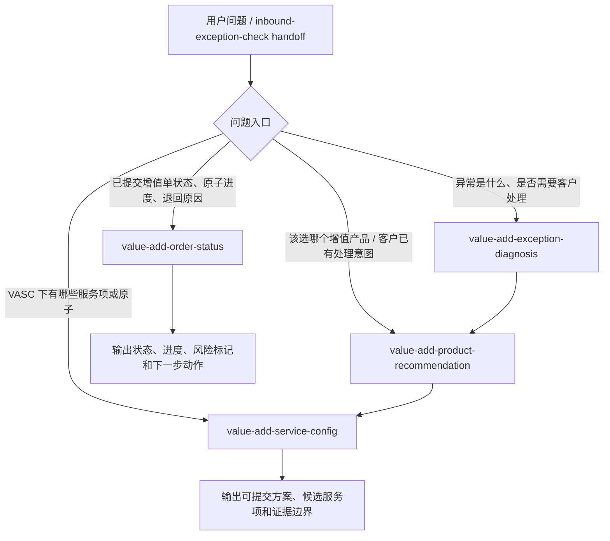

# Value-Add Experts 拆分规划

> 生成日期：2026-06-24
> 文件用途：作为 `value-add` 域 4 个 experts 的规划 SSOT，供后续 API 矩阵、业务参考文档和实现侧 `design.md` 对齐。

---

## 一、结论

围绕“入库异常 -> 增值推荐 -> 增值配置 -> 增值单状态查询”链路，`value-add` 域建设 4 个 experts：

| 状态 | 优先级 | Expert ID | 定位 | 核心职责 |
|---|---|---|---|---|
| 已上线 6.30 | P0 | `value-add/value-add-exception-diagnosis` | 异常诊断层 | 识别入库异常编码、名称、对象、发生节点、是否进入增值推荐链。 |
| 已上线 6.30 | P0 | `value-add/value-add-product-recommendation` | VASC 产品推荐层 | 根据异常事实、客户处理意图和映射关系推荐候选 VASC，并说明缺失确认项。 |
| 已上线 6.30 | P0 | `value-add/value-add-service-config` | 服务项配置层 | 根据 VASC 输出服务项/原子编排、互斥组、字段证据边界，并预留原子可选性规则入口。 |
| 已上线 6.30 | P1 | `value-add/value-add-order-status` | 增值单状态查询层 | 查询已提交增值单的主状态、原子进度、退回原因、部分完成原因和下一步动作。 |

旧 `value-add/value-add-guide` 是占位实现，不作为本轮设计约束；正式规划只围绕上表 4 个 experts 展开。

---

## 二、域边界

### 2.1 value-add 域负责什么

`value-add` 域负责解释、推荐、配置和查询增值服务相关事项：

| 能力段 | 由谁承接 | 说明 |
|---|---|---|
| 入库异常能否进入增值推荐链 | `value-add-exception-diagnosis` | 只做异常事实归一和增值候选判断，不做入库责任判定。 |
| 该异常/诉求可选哪些 VASC | `value-add-product-recommendation` | 以关系映射为适用性来源，结合客户处理意图输出候选。 |
| VASC 下需要哪些服务项/原子 | `value-add-service-config` | 输出编排、必选/可选、互斥和字段证据状态。 |
| 已提交增值单处理到哪一步 | `value-add-order-status` | 只处理已提交增值单后的状态与执行进度。 |

### 2.2 value-add 域不负责什么

| 不承接内容 | 应转向 | 原因 |
|---|---|---|
| 入库少货、多货、破损、签收争议的责任核实 | `inbound/inbound-exception-check` | 这是入库差异核实，不是增值服务选择。 |
| 入库单、预报单、上架状态查询 | `inbound/inbound-order-status` / `inbound/inbound-putaway-status` | 查询对象不是增值单。 |
| 仓库地址、入库流程规则、权限申请 | 对应 inbound 基础或业务专家 | 不属于增值域。 |
| 未下增值单前费用预估 | v1 不承接 | 当前没有确认真正的事前报价接口或价卡规则来源。 |
| 直接创建/提交增值单 | 后续实现期另行评估 | 本轮先完成推荐、配置和状态查询设计。 |

### 2.3 费用边界

费用能力不作为当前 4 个 experts 的核心能力：

- `value-add-order-status` v1 聚焦已提交增值单后的状态、原子进度、退回/部分完成原因。
- `wh.va.order.getPaymentList` 是事后实际费用，可作为低优先级增强，不作为 v1 核心。
- `wh.va.order.getPrepaymentList` 虽叫预估费用，但当前接口入参依赖 `orderNo`，不等同“未下增值单前报价”。
- 未下单前费用预估暂不纳入 v1，除非后续确认真正的事前报价接口或价卡规则来源。

---

## 三、知识库依据

当前规划基于专项 value-add 知识源抽取后的 repo 内运行时切片。运行时只消费 `experts/value-add/{expert-id}/prompts/` 下的裁剪知识，不依赖运行时 RAG 或外部目录。

### 3.0 repo 知识库分层约束

| 层级 | repo 路径 | 用途 | 约束 |
|---|---|---|---|
| 领域知识库 | `../value-add/` | 保存 value-add 流程、实体、映射、接口摘要和来源证据副本 | 仅作规划和维护参考；运行时 prompt 不直接读取全量目录 |
| 专家参考 | `../experts/value-add/*.md` | 给业务和实现评审看的专家边界、场景、话术原则 | 不作为运行时全量输入；与 design 冲突时以 design + manifest 为准 |
| 运行时 Prompt KB | `../../experts/value-add/{expert-id}/prompts/kb-*.md` | 实现期注入 LLM 的裁剪知识 | 只放该 expert 必需的最小知识，不塞入全量 source references |
| 来源证据 | `../value-add/source-references/` | 接口文档、离线规则、快照、覆盖率报告等溯源材料 | 只作为审查和维护来源；接口文档不能反推业务适用性 |

外部 value-add 知识目录只作为只读抽取来源；repo 内最终文档和实现不得保留外部绝对路径。

| 来源 | 用途 | 规划口径 |
|---|---|---|
| `../value-add/inbound-exception-value-added-process/inbound-exception-to-value-added-overall-flow.md` | 总流程、对象、节点和客户处理意图框架 | 作为链路拆分依据。 |
| `../value-add/inbound-exception-value-added-process/customer-action-decision-flow.md` | 客户意图到 VASC 方向 | 支撑推荐层的意图归一。 |
| `../value-add/relationship-mappings/inbound-exception-to-vasc-product-mapping.md` | 异常到 VASC 映射 | 作为 VASC 适用性候选来源。 |
| `../value-add/relationship-mappings/vasc-product-to-service-item-orchestration-mapping.md` | VASC 到服务项/原子编排 | 作为服务配置层的编排来源。 |
| `../value-add/relationship-mappings/service-item-config-field-evidence-coverage.md` | 字段证据覆盖状态 | 普通属性字段已扩充到 42 / 52；仍用于声明附件、模板、上传关系等证据不足。 |
| `../value-add/source-references/offline-documents/atom-selectability-rules.md` | 原子可选性结构化规则 | 由产品百事通 / 研发百事通离线源合并派生；无统一实时接口可获取完整语义，v0.1 已生成。 |
| `../value-add/source-references/interface-documents/wh-va-order-*.md` | 增值单查询接口 | 用于状态查询和 API 矩阵，不用于推断业务适用性。 |

本轮已把必要知识裁剪到对应专家的 `prompts/` 目录；上表路径只表示维护来源，不表示运行时依赖。

### 3.0.1 运行时 KB 拆分

| Expert ID | 运行时 KB | 只包含 |
|---|---|---|
| `value-add/value-add-exception-diagnosis` | `../../experts/value-add/value-add-exception-diagnosis/prompts/kb-exception-entity.md`<br>`../../experts/value-add/value-add-exception-diagnosis/prompts/kb-value-add-entry.md`<br>`../../experts/value-add/value-add-exception-diagnosis/prompts/kb-exception-mapping-summary.md` | 35 个异常实体、增值入口规则、异常到 VASC 关系数量摘要；只用于判断是否进入推荐链，不推荐 VASC |
| `value-add/value-add-product-recommendation` | `../../experts/value-add/value-add-product-recommendation/prompts/kb-flow-context.md`<br>`../../experts/value-add/value-add-product-recommendation/prompts/kb-intent-guide.md`<br>`../../experts/value-add/value-add-product-recommendation/prompts/kb-mapping-table.md`<br>`../../experts/value-add/value-add-product-recommendation/prompts/kb-vasc-constraints.md` | 异常到 VASC 映射、客户意图归一、候选 VASC 限制；候选必须来自映射或上游事实 |
| `value-add/value-add-service-config` | `../../experts/value-add/value-add-service-config/prompts/kb-vasc-context.md`<br>`../../experts/value-add/value-add-service-config/prompts/kb-service-orchestration.md`<br>`../../experts/value-add/value-add-service-config/prompts/kb-field-evidence.md`<br>`../../experts/value-add/value-add-service-config/prompts/kb-atom-selectability.md` | 18 个 VASC 编码上下文、64 条服务项编排、52 个服务项字段证据状态、confirmed inbound 原子可选性规则 |
| `value-add/value-add-order-status` | `../../experts/value-add/value-add-order-status/prompts/kb-api-boundary.md`<br>`../../experts/value-add/value-add-order-status/prompts/kb-status-semantics.md`<br>`../../experts/value-add/value-add-order-status/prompts/kb-fee-goods-boundary.md` | `basicInfo` / `getVasList` 字段边界、`statusDesc` 优先的状态语义、可选费用和货物接口边界 |

### 3.1 当前覆盖事实

| 数据层 | 覆盖 | 对设计的影响 |
|---|---:|---|
| 入库异常编码 | 35 个唯一异常编码 | 支撑 `exception-diagnosis` 做异常归一和候选识别。 |
| 异常到 VASC 关系 | 168 条去重关系，覆盖 18 个 VASC | 支撑 `product-recommendation` 输出候选 VASC。 |
| VASC 到服务项编排 | 64 条编排行，52 个唯一服务项 | 支撑 `service-config` 输出顺序、互斥组和证据状态。 |
| 字段证据 | 普通属性字段 42 / 52 partial，10 / 52 missing | 不允许编造完整字段、附件、模板和上传要求；缺失项不能解释为“无需字段”。 |

设计口径：关系映射是“能不能选、是否适用、什么条件下适用”的权威入口；接口文档只用于字段、状态、查询链路，不直接作为业务适用性结论。

---

## 四、业务链路分层



四个 experts 必须都支持独立调用。链式调用只是推荐路径，不代表 expert 可以互相直接调用；专家之间通过 planner、handoff facts 或 `enrichedContext` 衔接。

---

## 五、与 inbound-exception-check 的衔接

`inbound/inbound-exception-check` 仍负责入库异常核实、差异报告、责任边界和是否需人工介入；它不直接推荐 VASC 或服务项。

### 5.1 已完成的衔接规则

- 增值类异常不再指向旧 `value-add/value-add-guide`。
- 增值类异常默认 handoff 到 `value-add/value-add-exception-diagnosis`。
- prompt 和业务参考文档中的“提增值工单”已调整为“进入 value-add 推荐链判断可选处理路径”。
- `inbound-exception-check` 输出中已补充 `valueAddHandoff`，供下游 value-add 链消费。

### 5.2 `valueAddHandoff` 草案

| 字段 | 必填 | 说明 |
|---|---|---|
| `exceptionCode` | 条件 | 异常编码，如 `B01E1615`。 |
| `exceptionName` | 条件 | 异常名称。 |
| `exceptionCategory` | 否 | 异常类别，如订单状态、包裹条码、商品条码、质量包装等。 |
| `exceptionObject` | 否 | 异常对象原始描述，如订单、包裹、商品、单品、托盘。 |
| `objectLevel` | 否 | 归一化对象层级，如 `order`、`package`、`product`、`item`、`pallet`。 |
| `inboundOrderNo` | 否 | 关联入库单号。 |
| `eventNo` | 否 | 异常单号。 |
| `customerActionHint` | 否 | 从用户问题或异常处理场景提取的客户意图线索。 |
| `evidenceSummary` | 否 | 数量、条码、状态、图片、上游报告等精简摘要。 |
| `recommendedEntryExpert` | 是 | 固定为 `value-add/value-add-exception-diagnosis`。 |

---

## 六、场景覆盖映射

| 用户场景 | 推荐入口 | 说明 |
|---|---|---|
| `B01E1615 是什么异常，需要怎么处理？` | `value-add/value-add-exception-diagnosis` | 先识别异常对象、节点、是否进入增值推荐链。 |
| `包裹条码异常，客户想继续上架，应该选什么增值？` | `value-add/value-add-product-recommendation` | 需要异常事实 + 客户意图，输出候选 VASC。 |
| `原单上架下面有哪些服务项，补包裹条码和补商品条码能不能一起选？` | `value-add/value-add-service-config` | 查 VASC 到服务项编排、互斥组和字段证据。 |
| `这个原子在当前场景能不能选？` | `value-add/value-add-service-config` | 读取已裁剪的 `kb-atom-selectability.md`；未覆盖或动态配置不明时输出待确认。 |
| `V106075100 处理到哪一步了？` | `value-add/value-add-order-status` | 查询已提交增值单状态和原子进度。 |
| `增值单为什么被退回/只完成一部分？` | `value-add/value-add-order-status` | 查询退回原因、部分完成原因和下一步动作。 |
| `还没下增值单，帮我估算费用` | v1 不承接 | 当前未确认真正事前报价能力。 |
| `这张增值单实际扣费多少？` | `value-add/value-add-order-status` 可选增强 | 事后费用可低优先级接入，不是 v1 核心。 |

---

## 七、Expert 边界卡片

### 7.1 `value-add/value-add-exception-diagnosis`

**问**：
- 异常编码或异常名称是什么含义。
- 异常发生在入库、库内还是出库关联节点。
- 异常对象是订单、包裹、商品、单品还是托盘。
- 该异常是否建议进入 value-add 推荐链。

**不问**：
- 不做入库责任核实、少货判责、签收争议结论；转 `inbound/inbound-exception-check`。
- 不推荐最终 VASC；转 `value-add/value-add-product-recommendation`。
- 不输出服务项配置；转 `value-add/value-add-service-config`。
- 不查已提交增值单状态；转 `value-add/value-add-order-status`。

**衔接**：
- 消费 `inbound/inbound-exception-check` 的 `valueAddHandoff`。
- 输出 `handoffFacts` 给推荐层，包含异常编码、异常对象、对象层级、客户意图线索和证据摘要。

**输入**：
- `exceptionCode`、`exceptionName`、`exceptionDescription`、`inboundOrderNo`、`eventNo`、`customerDescription`、`evidenceSummary`、`enrichedContext`。

**输出**：
- `normalizedException`、`exceptionCategory`、`exceptionObject`、`objectLevel`、`exceptionNode`、`requiresCustomerAction`、`isValueAddCandidate`、`handoffFacts`、`missingEvidence`。

**依赖**：
- `../value-add/inbound-exceptions/`
- `../value-add/inbound-exception-value-added-process/inbound-exception-to-value-added-overall-flow.md`
- `../value-add/relationship-mappings/inbound-exception-to-vasc-product-mapping.md`

**降级**：
- 无法识别异常编码时，按用户描述输出候选异常类型和需补充信息，不编造编码。

### 7.2 `value-add/value-add-product-recommendation`

**问**：
- 某个入库异常可选哪些 VASC。
- 客户想原单上架、新单上架、销毁、自提、拍照、调拨时应选哪类增值产品。
- 为什么当前不能直接推荐某个 VASC，还缺什么信息。

**不问**：
- 不解释异常责任；转 `inbound/inbound-exception-check` 或 `value-add-exception-diagnosis`。
- 不输出完整字段、附件、模板；转 `value-add-service-config`。
- 不查询已提交增值单；转 `value-add-order-status`。

**衔接**：
- 消费 `value-add-exception-diagnosis` 或 `inbound-exception-check` 的异常事实。
- 输出 `handoffToServiceConfig`，包含首选 VASC、候选 VASC、客户意图归一和限制说明。

**输入**：
- `exceptionCode`、`exceptionName`、`customerActionHint`、`objectLevel`、`exceptionNode`、`inboundOrderNo`、`handoffFacts`、`enrichedContext`。

**输出**：
- `customerActionNormalized`、`recommendedVascCandidates`、`primaryRecommendation`、`notRecommendedOptions`、`missingConfirmations`、`handoffToServiceConfig`。

**依赖**：
- `../value-add/relationship-mappings/inbound-exception-to-vasc-product-mapping.md`
- `../value-add/inbound-exception-value-added-process/customer-action-decision-flow.md`
- `../value-add/vasc-products/`

**降级**：
- 异常到 VASC 映射缺失时，只输出待确认方向和需业务确认项，不用接口文档反推适用性。

### 7.3 `value-add/value-add-service-config`

**问**：
- 某个 VASC 下有哪些服务项/原子。
- 服务项顺序、必选/可选、互斥组是什么。
- 当前知识库能否证明字段、附件、模板要求。
- 某些原子在当前场景是否不可选或与其他原子互斥。

**不问**：
- 不决定异常是否适用某个 VASC；转 `value-add-product-recommendation`。
- 不承诺完整字段级下单校验。
- 不查询已提交增值单状态；转 `value-add-order-status`。

**衔接**：
- 消费推荐层的 `handoffToServiceConfig`。
- 输出可供用户准备资料的提示和规则证据缺口。

**输入**：
- `vascCode`、`vascName`、`serviceIntent`、`exceptionCode`、`objectLevel`、`customerKnownFields`、`scenarioConditions`、`selectedServiceItems`、`enrichedContext`。

**输出**：
- `vasc`、`serviceItems`、`selectedServiceItems`、`selectableServiceItems`、`blockedServiceItems`、`mutexGroups`、`blockingReasons`、`pendingRuleEvidence`、`configEvidenceSummary`、`customerInputHints`、`blockedClaims`。

**依赖**：
- `../value-add/relationship-mappings/vasc-product-to-service-item-orchestration-mapping.md`
- `../value-add/relationship-mappings/service-item-config-field-evidence-coverage.md`
- `../value-add/value-added-service-items/`
- 原子可选性规则源：`prompts/kb-atom-selectability.md`，由 `atom-selectability-rules` v0.1 裁剪为运行时知识。

**降级**：
- 字段证据不足时明确输出 `partial_field_evidence` 或 `missing_field_evidence`，不编造字段、附件、模板和枚举。
- 原子可选性规则未覆盖或动态配置不明时，输出 `pendingRuleEvidence`，不直接给确定性禁止或允许结论。

### 7.4 `value-add/value-add-order-status`

**问**：
- 已提交增值单现在是什么状态。
- 增值单处理到哪个原子、完成了多少、是否退回或部分完成。
- 增值单关联哪个业务单、入库单或异常单。
- 事后实际费用查询可作为增强项。

**不问**：
- 不推荐新 VASC；转 `value-add-product-recommendation`。
- 不指导未提交前字段配置；转 `value-add-service-config`。
- 不承接未下单前费用估算。

**衔接**：
- 可消费用户提供的 `vasOrderNo` 或上游给出的 `businessNo`。
- 当用户其实在问“该怎么下增值”时，转回推荐/配置链。

**输入**：
- `vasOrderNo`、`businessNo`、`orderEntry`、`includeAtoms`、`includePayment`、`includePrepayment`、`includeGoods`、`enrichedContext`。

**输出**：
- `vasOrderNo`、`status`、`statusDesc`、`businessOrder`、`vasc`、`atomProgress`、`riskFlags`、`nextAction`、`paymentSummary`、`prepaymentSummary`。

**依赖**：
- `../value-add/source-references/interface-documents/wh-va-order-basic-info-api.md`
- `../value-add/source-references/interface-documents/wh-va-order-get-vas-list-api.md`
- 可选增强：`wh-va-order-get-payment-list-api.md`、`wh-va-order-get-prepayment-list-api.md`、`wh-va-order-get-sub-goods-api.md`

**降级**：
- 只给业务单号且无法唯一定位增值单时，要求用户补充增值单号。
- 接口无费用或费用查询失败时，不影响状态主路径输出。

---

## 八、原子可选性规则预留

`value-add-service-config` 必须预留“原子可选性规则”能力。当前已收到系统写死逻辑离线文档 `vas-atom-hardcoded-rules.md`（产品百事通）和 `vas-atom-disable-logic.md`（研发百事通），两者可作为 `atom-selectability-rules` 的原始规则源，但需要先结构化合并后再供 expert 稳定消费。

建议规则源命名：

`atom-selectability-rules`

当前来源标记：

| 项 | 结论 |
|---|---|
| 原始文件 | `vas-atom-hardcoded-rules.md`、`vas-atom-disable-logic.md` |
| 归档建议 | `../value-add/source-references/offline-documents/` 下保留原始离线快照；结构化规则表已生成 `atom-selectability-rules.md`。 |
| 数据来源 | 产品百事通、研发百事通。 |
| 获取方式 | 离线文档；无统一接口可获取完整原子禁用语义。 |
| 维护口径 | 产品侧变更说明为主、定期快照为辅；研发侧按代码变更点增量维护。 |

已确认口径：

- `vas-atom-hardcoded-rules.md` 可作为产品侧参考基线，但不是唯一权威来源；部分规则受数据库配置、业务白名单或后端返回配置影响。
- `vas-atom-disable-logic.md` 是当前代码直接读取验证后的研发侧权威离线快照，可补足具体 DisableHandler、前后端分层和提交强校验。
- 结构化时需区分五类效果：后端 `isShow=false`、前端 hidden、后端 `isDisable=Y`、前端 disabled、提交强校验报错。
- 结构化时需区分变更方式：纯硬编码需发版；`NO_NEED_DEAL_FILE_VAS_CODE_CONFIG`、`VA_CODES_SUPPORT_SUPPLEMENT_PKG_LABEL` 等系统配置可数据库修改；业务白名单和 `controlledServiceList` 需按动态配置标记。
- 入库“更换商品包装”正确编码是 `OW01V1561`；`OSF6V1561` 为产品版旧文档笔误。库内“更换商品包装”为 `OSF6V1566`。
- `OW01V1558` 采用研发版完整条件：无商品、任意商品条码为空、异常来源 + 原单上架 + 商品不在原入库单中。
- 产品版未列但研发版确认存在的 `OW01V1593`、`OW01V1794`、`OW01V1736`、`OSF6V1591`、`OSF6V1681` 均应纳入规则表。
- 前后端不一致要单独标记，例如 `OSF6V1804` 为前端隐藏、后端不禁用；`OSF6V1576` 也存在类似残留逻辑。

规则覆盖范围：

| 规则类型 | 示例口径 |
|---|---|
| 场景禁选 | 某些原子在特定场景、条件、仓库、产品或阶段下不能选。 |
| 原子互斥 | 某些原子与其他原子不能同时选择。 |
| VASC 依赖 | 某些原子只在特定 VASC 下可选。 |
| 异常对象依赖 | 某些原子依赖包裹、商品、单品、托盘等对象层级。 |
| 入库阶段依赖 | 某些原子依赖下单前、到仓、异常暂存、上架前、库内等阶段。 |
| 动态配置依赖 | 某些规则结构写在代码中，但命中列表或白名单由数据库 / 后端返回配置决定。 |
| 前后端差异 | 前端隐藏但后端不禁用、后端可处理但暂未对外开放等。 |

`service-config` 输出预留字段：

| 字段 | 说明 |
|---|---|
| `selectableServiceItems` | 当前条件下可选的服务项/原子。 |
| `blockedServiceItems` | 当前条件下不可选的服务项/原子。 |
| `mutexGroups` | 互斥组和组内选择说明。 |
| `blockingReasons` | 不可选原因。 |
| `pendingRuleEvidence` | 知识库暂未补齐、需要后续确认的规则证据。 |

---

## 九、路由速查

```text
客户问题
|
+-- 入库异常是什么 / 是否要客户处理 / 是否进入增值链
|   -> value-add/value-add-exception-diagnosis
|
+-- 已知异常 + 客户问该选哪个增值产品
|   -> value-add/value-add-product-recommendation
|
+-- 已知 VASC / 服务方向 + 问服务项、原子、互斥、配置证据
|   -> value-add/value-add-service-config
|
+-- 已提交增值单 + 问状态、原子进度、退回/部分完成原因
|   -> value-add/value-add-order-status
|
+-- 入库差异责任、少货、多货、破损、签收争议
|   -> inbound/inbound-exception-check
|
+-- 未下单前估价
    -> v1 不承接，待确认事前报价接口或价卡规则来源
```

---

## 十、专家状态追踪

| 状态 | 优先级 | Expert ID | 当前产物 | API/KB 就绪度 | 主要依赖 / 备注 |
|---|---|---|---|---|---|
| **已上线 6.30** | P0 | `value-add/value-add-exception-diagnosis` | manifest v1.0 + workflow + nodes + Coze YAML | KB 80%，API 非主路径 | 35 异常实体 + 168 关系摘要；消费 `inbound-exception-check` 的 `valueAddHandoff`。 |
| **已上线 6.30** | P0 | `value-add/value-add-product-recommendation` | 同上 | KB 80%，API 非主路径 | 异常→VASC 映射 + 客户意图；inactive VASC 不可直接推荐。 |
| **已上线 6.30** | P0 | `value-add/value-add-service-config` | 同上；含 `apply-atom-selectability-rules` | KB 75%；18 VASC、64 编排、52 字段证据 | 原子规则表 v0.1 已接入；附件/模板/上传关系仍 partial。 |
| **已上线 6.30** | P1 | `value-add/value-add-order-status` | 同上；OpenAPI 插件已配置 | API 70% | P0：`basicInfo` + `getVasList`；P2 费用/货物可选增强。 |
| 已上线 6.30 | P0 | `inbound/inbound-exception-check` 衔接 | 正式源文件 + Coze 部署 | 70% | 增值类异常 handoff 到 `value-add-exception-diagnosis`，补 `valueAddHandoff`。 |

---

## 十一、批次产物进度

| Batch | 正式产物 | 当前状态 |
|---|---|---|
| Batch 1 | `docs/plan/value-add-experts-plan.md` | 已完成：明确 4 experts 拆分、费用边界、inbound 衔接。 |
| Batch 2 | `docs/plan/value-add-api-matrix.md` | 已完成：明确 4 个 experts 的 API/KB 依赖、费用接口边界和 Gap。 |
| Batch 3 | `docs/experts/value-add/*.md` | 已完成：生成 4 份业务参考文档，供业务和实现评审。 |
| Batch 4 | `experts/value-add/*/design.md` | 已完成：生成 4 份实现侧 `design.md` 草稿。 |
| Batch 5 | `docs/plan/value-add-implementation-review-checklist.md` | 已完成：生成实现前评审清单。 |
| Batch 6 | `experts/value-add/*/workflow` + Coze 导出 | **已完成并上线 6.30**：4 专家 manifest v1.0 + workflow + nodes + Coze YAML + 联调通过。 |

---

## 十二、当前待确认项

1. ~~`value-add-product-recommendation` 是否需要在设计层读取入库单状态，还是只消费 `inbound-exception-check` / `inbound-order-status` 的 handoff facts。~~ 已完成评估，见 §12.1：v1 不直接读取入库单状态，优先消费上游 handoff facts / `enrichedContext`。
2. ~~`atom-selectability-rules` 的结构化表如何由 `vas-atom-hardcoded-rules.md` / `vas-atom-disable-logic.md` 等离线文件整理落地。~~ 已完成 v0.1，见 §12.2 与 `../value-add/source-references/offline-documents/atom-selectability-rules.md`。
3. ~~字段、附件、模板证据是否会从 `vaAtomAttrs`、`vaAtomFiles` 或页面运行时响应补齐。~~ 已完成评估，见 §12.3：普通属性字段可走 BaseAttrRel/字段覆盖表；附件、模板和上传关系仍需 `vaAtomFiles`、页面运行时响应或等价来源补证。

### 12.1 入库单状态读取评估

结论：`value-add-product-recommendation` v1 不建议在自身设计层主动读取入库单状态；应优先消费 `inbound-exception-check` / `value-add-exception-diagnosis` / `inbound-order-status` 已产生的 handoff facts 或 `enrichedContext`。当缺少原入库单状态但客户意图依赖该状态时，推荐层输出候选 VASC 和 `missingConfirmations`，不要为了推荐首选而自行调用 `getOrderDetail`。

判断依据：

- 推荐层主职责是“异常事实 + 客户处理意图 + 异常到 VASC 映射”生成候选，不承担入库单状态查询；当前设计中 `inboundOrderNo` 只作上下文，`orderStatusHint` 定义为“上游已知入库单状态”。
- `inbound-exception-check` 的 `valueAddHandoff` 可以满足推荐链的核心事实：异常编码、异常名称、异常类别、异常对象、对象层级、入库单号、异常单号、客户意图线索和证据摘要；其中 `evidenceSummary.status` 来自异常单记录状态，不等同于 OMS 入库单主状态。
- `inbound-order-status` 的设计目标是输出 `orderNo`、`status`、`winitProductCode`、`trajectorySummary` 等事实，足够作为推荐层的 `orderStatusHint`。但当前实现中的 `format-output.ts` 尚未把这些字段写入 `enrichedContext`，如要稳定链式消费，需要先补齐该 handoff。
- 对“原单上架 / 继续上架 / 上架前处理 / 销毁或自提区分上架前还是库内”等场景，入库单状态是推荐置信度和缺失确认项的一部分；它不是所有 VASC 候选生成的硬前置。

落地口径：

- 有上游状态：推荐层消费 `orderStatusHint` 或 `enrichedContext.inbound/inbound-order-status.status`，可提升首选推荐置信度。
- 无上游状态：推荐层仍可基于异常映射给候选，但首选推荐应保守，补充 `missingConfirmations`：原入库单当前状态、实物是否仍可按原单处理、条码是否可补、新单号或新标签需求等。
- 如果用户问题本身是在问“入库单现在什么状态 / 是否已上架 / PEWC、EWC、SHD 是什么”，应先路由 `inbound/inbound-order-status` 或 `inbound/inbound-putaway-status`；推荐层不隐式代查。
- 如果业务评审后要求“必须有实时入库单状态才能给首选 VASC”，建议由 planner 在调用推荐层前显式插入 `inbound-order-status`，而不是让 `value-add-product-recommendation` 内部新增 API 依赖。

### 12.2 atom-selectability-rules 落地评估

结论：第 2 个待确认项已解决，结构化表 v0.1 已产出。当前文件已明确原始来源、目标规则名、结构字段、维护来源、冲突修正和动态配置边界。

落地口径：

- 原始离线快照保留在 `../value-add/source-references/offline-documents/`：
  - `vas-atom-hardcoded-rules.md`：产品百事通参考基线，侧重用户界面效果和宽范围覆盖。
  - `vas-atom-disable-logic.md`：研发百事通代码快照，侧重前后端执行逻辑、DisableHandler、提交强校验。
- 结构化派生规则名为 `atom-selectability-rules`，维护源文件为 `../value-add/source-references/offline-documents/atom-selectability-rules.md`；运行时由 `value-add-service-config/prompts/kb-atom-selectability.md` 消费已裁剪 confirmed inbound 规则。
- 结构化字段以 `value-add-service-config/design.md` 的“atom-selectability-rules 派生字段建议”为准，至少包含 `ruleId`、`atomCode`、`ruleType`、`effectType`、`condition`、`result/message`、`sourceDoc/sourceOwner`、`changeMode`、`frontendEffect/backendEffect/inconsistencyFlag`、`confidence`。
- 产品版作为主文档结构，研发版作为执行细节补充；冲突时以双方确认口径处理，不直接覆盖原始快照。
- 动态配置、业务白名单、后端返回配置必须标记为可能漂移，不写成纯硬编码。
- 已确认勘误：入库“更换商品包装”为 `OW01V1561`，不是 `OSF6V1561`；原始产品快照保留笔误，结构化表写正确编码并标注勘误来源。

后续实现接入任务（不阻塞本待确认项关闭）：

1. 在 `value-add-service-config` 实现期读取 `prompts/kb-atom-selectability.md`，把 `apply-atom-selectability-rules` 从“待确认”改为按运行时规则切片计算。
2. 后续产品/研发变更到来时，按 `ruleId` 增量更新结构化表。
3. 动态配置项继续保留 `changeMode` 和 `partial` 置信度，避免把可变配置写死。

### 12.3 字段、附件、模板证据补齐评估

结论：第 3 个待确认项已完成评估，但不是“字段配置已全量补齐”。`value-add-service-config` v1 不应把 `wh.va.order.getVasList` / `wh.va.order.basicInfo` 返回的 `vaAtomAttrs`、`vaAtomFiles` 当作下单前配置主来源；它们主要是已提交增值单上的执行属性和附件事实，适合转给 `value-add-order-status` 解释“这张增值单填了什么/上传了什么”。下单前配置侧应继续以 `service-item-config-field-evidence-coverage.md` 为证据状态入口；普通属性字段可引用已由 `pms.BaseAttrRelService_findBaseAttrRelPage` 扩充的字段覆盖结果，附件、模板和上传关系仍需要 `vaAtomFiles`、页面运行时响应或等价配置来源后再定版。

判断依据：

- `wh.va.order.getVasList` 的接口描述是“分页查询指定增值订单的增值原子列表”，入参围绕 `orderNo`、`businessNo`、`orderEntry`；返回的 `vaAtomAttrs`、`vaAtomFiles` 挂在具体增值单原子上，天然是订单事实，不是全局配置查询。
- `service-item-config-field-evidence-coverage.md` 已把字段证据拆为 `partial_field_evidence` / `missing_field_evidence`，并明确 `not_full_config_mapping`：当前表只表达覆盖状态，不能生成完整字段、附件、模板配置。
- KB 最新取证记录显示，`pms.BaseAttrRelService_findBaseAttrRelPage` 可按 `instanceCode=<eventCode>` 重建普通属性字段快照；normalized 编排引用的 52 个服务项中，BaseAttrRel 已覆盖 42 个普通属性字段，剩余 10 个仍不能解释为“无需字段”。
- 附件字段、模板字段和上传关系仍未形成完整静态来源；后续若要生成确定版 `service-item-to-config-field-mapping.md`，必须继续补 `vaAtomFiles`、页面运行时响应或更底层配置接口。

落地口径：

- `service-config.field-evidence`：只输出字段证据状态、可安全提示的客户准备资料和 `blockedClaims`，不输出完整字段校验清单。
- `service-config.submitted-attrs`：用户问已提交增值单里某原子填了什么、传了什么时，转 `value-add-order-status` 查 `getVasList`，不要在配置专家里复用为事前规则。
- 普通属性字段：可把 `BaseAttrRel` / `vas-event-attrs-slim` / 字段覆盖表作为事前证据来源，但仍需标注是否 `partial_field_evidence`。
- 附件、模板、上传关系：继续标为证据缺口；只有拿到 `vaAtomFiles`、页面运行时响应或等价配置来源后，才允许写确定结论。
